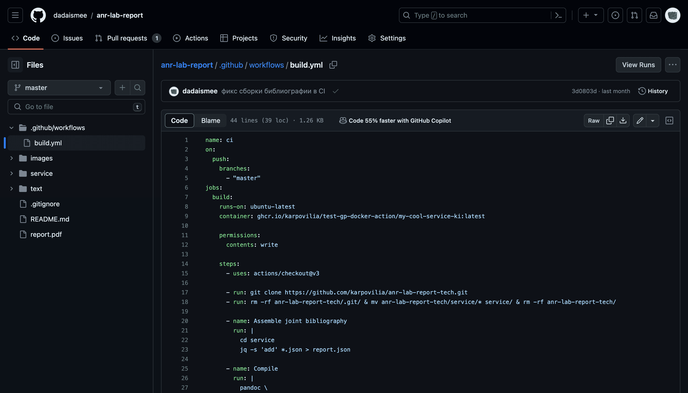
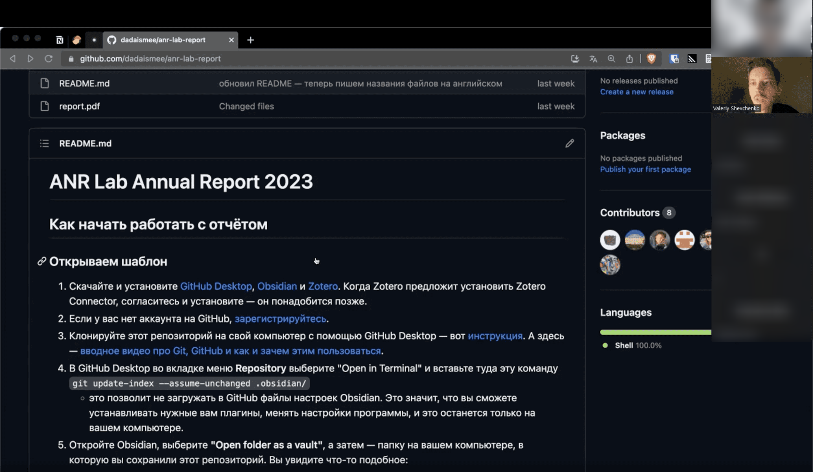

**Привет!**

Меня зовут Валерий Шевченко, я философ науки и архитектор систем. Исследую и создаю интерфейсы для работы с идеями и текстами.

#### Чем помогаю бизнесу

Проектирую системы, автоматически превращающие сырые данные в понятные вашим пользователям документы (отчёты, буклеты, карточки для соцсетей) — без зависимости от платформ, ручной верстки и с измеримой пользой для бизнеса. [Подробнее](/offer)

#### Проекты

<ul>
<li>
<a id='btn-course' onClick="toggle('course', 'btn-course')">Курс «Система письма»</a> (130 выпускников)

 
**[konspekt.io](https://konspekt.io/)**: практический курс (видео + воркшопы) для аспирантов, который помогает выстроить процесс работы с текстами: от заметок и сбора источников до готовой статьи или поста.

**Отзывы выпускников:**

- *«Результат очень облегчает жизнь человеку, пишущему диссертацию»*. **Ольга Чумичёва** — PhD-студентка в Университете Манчестера (UK)

- *«Курс помог переосмыслить подход к письму и чтению — смогла написать десятистраничный текст для конференции за месяц»*. **Евгения Митрохина** — PhD-студентка в Университете Висконсин-Мэдисон (США)

- *«Курс прекрасно погружает как в техническую часть, так и в содержательную — как сделать заметки партнёром по коммуникации»*. **Мария Волкова** — PhD-студентка в Университете Эксетера (UK)

 

</li>

<li>
<a id="btn-report" onClick="toggle('report', 'btn-report')">Годовой отчёт</a> Лаборатории сетевого анализа НИУ ВШЭ

 
Разработка системы для командного написания и автоматической сборки/вёрстки отчёта по требованиям ГОСТ:

- Подбор стека для команды: Obsidian, Zotero, Pandoc
- Дизайн процесса автоматической сборки разделов по их нумерации
- Разработка CI/CD пайплайна в GitHub Actions
- Проведение семинара для обучения команды

 

</li>
<li>
<a id="btn-timeline" onClick="toggle('timeline', 'btn-timeline')">Интерактивный LLM-таймлайн</a> исторических переписок

 
LLM-приложение на Electron, превращающее отсканированные письма на русском языке из 1920-х в интерактивный таймлайн событий — кто кому когда что написал и что произошло. LLM вычленяет действующих лиц и темы, по которым можно фильтровать события.

</li>
</ul>

<!-- - Интерфейс для написания диссертации <button id="zk-button"  onClick="toggle('phd', 'zk-button')">Подробнее</button> --> 

#### Эссе

→ <a href="/no-second-brain" target="_self">Вам не нужен «второй мозг»</a> — ~15 минут<br//>
→ <a href="/symmetry" target="_self">Симметрия чтения и письма</a> — ~20 минут<br//>
→ <a href="https://dadaismee.github.io/k.longread.writing-well-main/" target="_self">Введение в систему письма</a> — ~20 минут<br//>

 

**[Связаться](mailto:valerii.s.shevchenko@gmail.com)**

<!-- 
 -->
<!-- ## Научные публикации: -->

<!-- - A Framework for More-than-human Placemaking with Data Storytelling ([2024](https://doi.org/10.14627/537752023)) -->
<!-- - Coordination as naturalistic social ontology: constraints and explanation ([2023](https://doi.org/10.1177/00483931221150486)) -->
<!-- - Вывод к наилучшему объяснению как методология социальной онтологии ([2023](https://doi.org/10.22394/2074-0492-2023-4-122-140)) -->
<!-- 
 -->

<!--• **Cognitive Basis of Focal Points: Evolution and Correlated Equilibr/ium Emergence** (**2021\)***. Logical and philosophical studies, 19(2), 131-135.*  -->
<!---->
<!--• **After Method, Only Hyper-Chaos: The Limitations of John Law's Sociological Method Theory (2021)**.  *Sociology of power, 33(4), 169-183*  -->
<!---->
<!--• **Quasi-formal interaction in the situation of the educational process** (**2021).** *Siberian Historical Research(1), 184-199;*  -->
<!---->
<!--• **What's wrong with assemblage theory?** **(2020)** *Logos, 30(5 (138)), 131-164*.  -->
<!---->
<!--• **Conflict of Otherness Models in John Law's Actor-Network Theory** **(2019).** *Sociology of power(2), 44-67.*-->

<!-- - Сделал <a href='https://konspekt.io' target='_blank'> курс по системе письма</a> для PhD-студентов и аспирантов -->
<!-- - [Пишу кандидатскую диссертацию](https://t.me/chot_ne_idet) о том, как связь мышления и среды эволюционно привела к возникновению социальных правил --> 
<!-- - Изучал социологию в МГУ и «Шанинке», философию науки — в «Высшей Школе Экономики», дизайн взаимодействия — в [MOME](https://mome.hu/en/programmes/interaction-design-ma-in-english), медиаискусство — в [«Школе Родченко»](https://mdfschool.ru) -->

