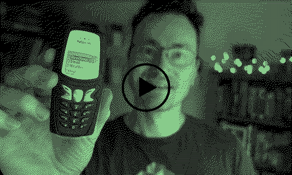
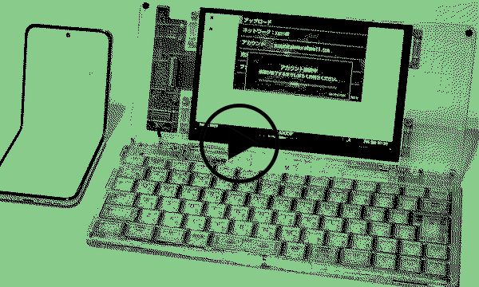
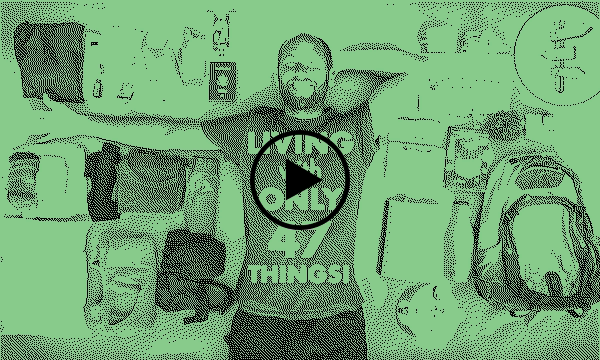
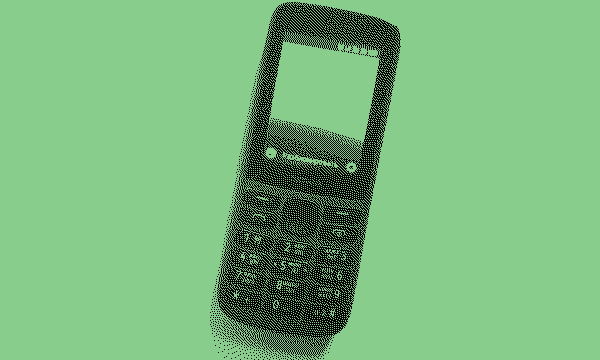

Вы наверняка слышали про *«цифровой минимализм»*. Если нет, то это движение за «освобождение внимания» от цифровых технологий: [книги Кэла Ньюпорта](https://www.amazon.com/stores/Cal-Newport/author/B001IGNR0U?ref=ap_rdr&shoppingPortalEnabled=true&ccs_id=ac489d71-db51-44ab-bfff-8e5ea7276366){target="blank"}, отказ от соцсетей и телефоны-«звонилки».

За последние 5 лет я посмотрел несколько сотен видео и прочитал пару-тройку книг на эту тему. И вот что понял.

**Цифровой минимализм — это технофетишизм под маской заботы о ментальном здоровье**. Объясню почему.

## Решение несуществующих проблем

Популярная идея в среде цифровых минималистов — сменить смартфон на «звонилку». Однако после перехода на неё многие пытаются получить от неё удобства смартфона: мессенджеры, карты, музыку и банковские сервисы. Так делал и я. И уже здесь чувствуется неладное:  вместо принятия ограничений мы пытаемся обойти их инженерным путём.

**Пример**. В видео ниже энтузиаст рассказывает, как «прикрутил» AI к своей Nokia 1999-го года. AI читает его WhatsApp на компьютере, определяет «срочность» и отправляет СМС на «звонилку»:

Круто? Ещё как! Нужно ли это? Вопрос открытый. И вот почему.

**Смысл «звонилки» — в оторванности от мира**. Вам могут позвонить или написать СМС только люди, у которых есть ваш номер телефона. И это одновременно и ограничение, и возможность. И оптимизировать это значит не понять, ради чего это делается. 

## Корень проблем «цифрового минимализма»

Дискурс «цифрового минимализма» переплёлся с идеями [Unix-философии](https://ru.wikipedia.org/wiki/%D0%A4%D0%B8%D0%BB%D0%BE%D1%81%D0%BE%D1%84%D0%B8%D1%8F_Unix){target="blank"}, основная из которых заключается в том, что *«инструмент должен решать одну задачу и делать это хорошо»*. Это особенно заметно у блогеров с опытом в программировании и компьютерной науке (что логично).

Например, в видео ниже энтузиаст рассказывает, какую технику он использует, чтобы продуктивно учиться на бакалавра компьютерной науки. 

Меня поразила отдельная цифровая печатная машинка. Концептуально это потрясающее устройство, — оно буквально позволяет тебе делать лишь одно действие — печатать текст. Однако действительно ли оно *необходимо*?

## Жизнь с пятнадцатью вещами

Контраст в эту историю добавляет минимализм «аналоговый». Он — про свободу от вещей. Его современные основоположники — [Мари Кондо](https://ru.wikipedia.org/wiki/%D0%9A%D0%BE%D0%BD%D0%B4%D0%BE,_%D0%9C%D0%B0%D1%80%D0%B8){target="blank"} и [Фумио Сасаки](https://alpinabook.ru/authors/sasaki-fumio/){target="blank"}, написавшие книги про «расхламление», а среди предшественников я бы назвал древнего грека Диогена Синопского, жившего в бочке. 

В «аналоговом» минимализме есть радикальные по современным меркам идеи. Например, [вот этот парень](https://thepeacefulguy.medium.com/minimalism-the-man-who-lived-with-only-15-items-ea5930985634){target="blank"} имеет всего 15 вещей, а экоактивист ниже — 47:

Подобные идеи рифмуются с философским анархизмом [Генри Торо](https://ru.wikipedia.org/wiki/%D0%A2%D0%BE%D1%80%D0%BE,_%D0%93%D0%B5%D0%BD%D1%80%D0%B8){target="blank"} — идеями осознанной простоты, автономии и самодостаточности. Однако они, как ни странно, идут вразрез с «цифровым минимализмом» и его Unix-философией.

## Удобство, скрывающее ненужную сложность

Цифровой минимализм больше похож на технофетишизм, замаскированный под заботу о ментальном здоровье: много техники, которая якобы делает своё дело хорошо и избавляет вас от экранов. Этот минимализм не задаётся вопросом «а действительно ли это необходимо?»

Минимализм, лично для меня — это осознанный выбор в пользу максимальной простоты без оглядки на технологии, без поклонения ей.

**Пример**. На моей Nokia 215, которая красуется в начале письма, нет камеры, и она умеет лишь звонить, писать СМС и проигрывать mp3-файлы. Некоторые мои знакомые используют iPod Classic вместо стримингов, что круто. Однако зачем нужен отдельный iPod, — пусть он и делает свою «одну вещь» хорошо — если можно слушать музыку на звонилке?

<!--  -->

## Итог

У жизни со звонилкой есть очевидные ограничения. Могу ли я зайти в спортзал по QR-коду? Нет. Могу ли я перевести деньги с одного банковского счёта на другой? Нет. Посмотреть карту? Тоже нет. 

Однако в этих ограничениях кроется философское значение минимализма и звонилки, в частности — оценить, насколько жизнь усложнена без необходимости. Нужны ли несколько банковских счетов. Нужны ли карты? Нет, если вам комфортно спрашивать прохожих или смотреть маршрут заранее. 

**Технологии стали насколько удобными, что умело скрывают усложнённость жизни**. 

Вместо того, чтобы «прикручивать ИИ» к старой Nokia, возможно, **стоит перестать оптимизировать то, что вообще не должно существовать**, и **принять выбранные вами ограничения**. Свобода — это ведь осознанная необходимость, верно?
