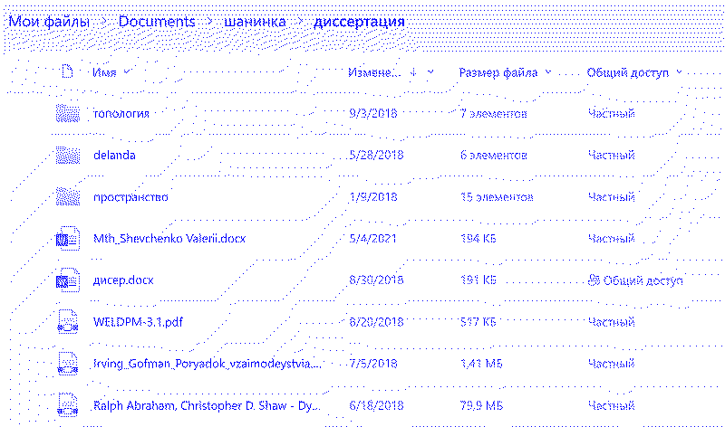
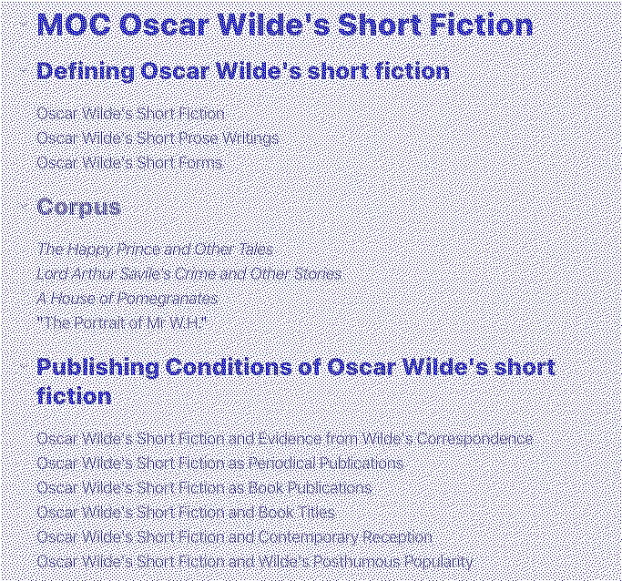
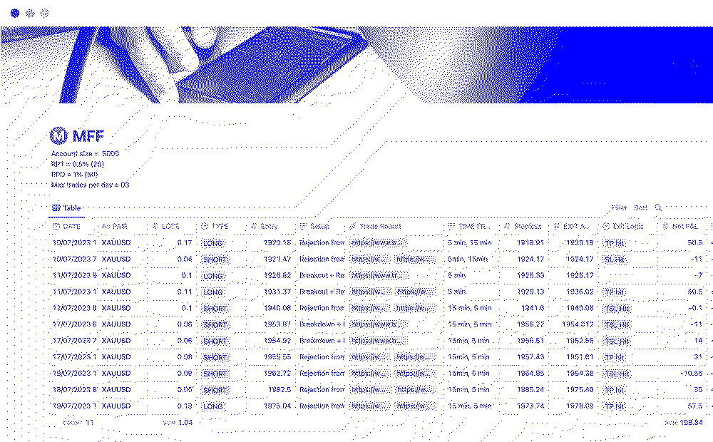
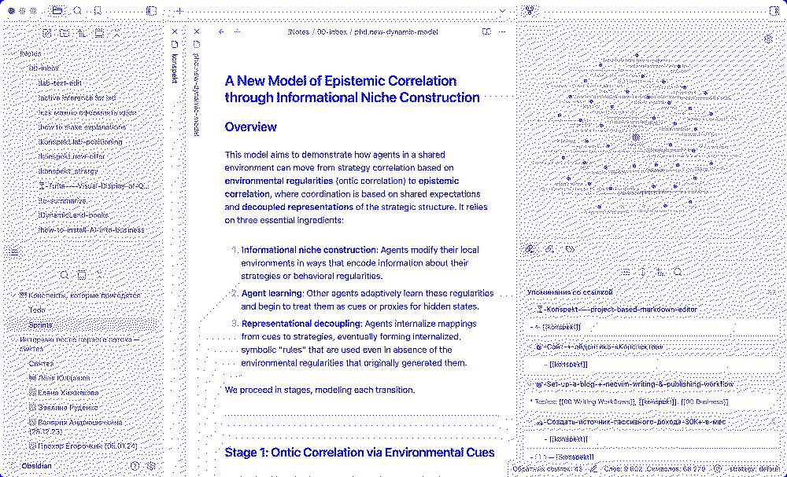
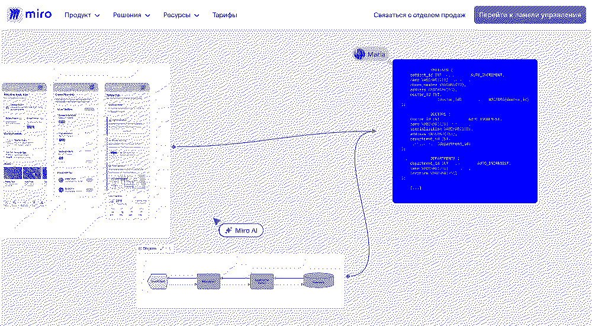
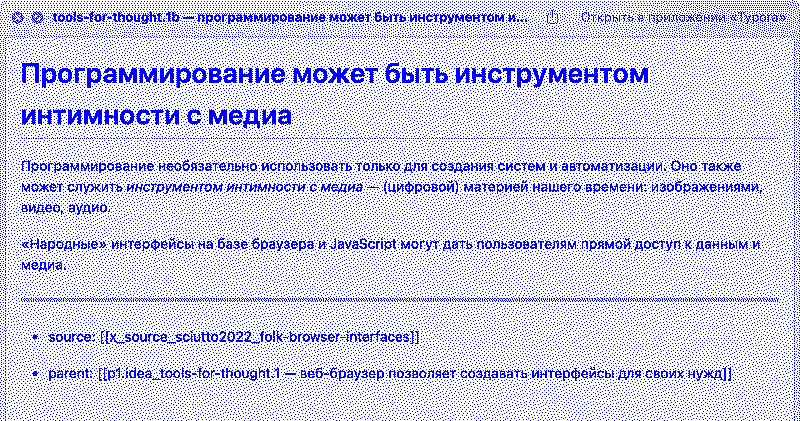

**Для кого текст**: исследователи, которые пробовали готовые системы работы с идеями, — Zettelkasten, «второй мозг», Obsidian, Notion, etc. — и столкнулись с сопротивлением материала и собственного мышления.

## Введение
Вы читаете, анализируете, пишете, но ощущаете, что усилия не накапливаются в интеллектуальный капитал? Как будто работа просто испаряется, не оставляя после себя ничего, кроме разрозненных файлов.

Когда работа переходит на следующий уровень, старые методы не справляются и отдаляют настоящий прогресс. А попытки «оптимизировать» свою работу чужими системами создают лишь новое измерение хаоса. Но выход есть — оттолкнуться от себя и построить систему, естественно продолжающую *ваше* мышление. Об этом — моя история.

## Работа, которая испаряется

В феврале 2021 года, после трёх месяцев аспирантуры, я понял, что не справляюсь. Объём работы по сравнению с магистратурой вырос, а методы остались прежними — папка `«диссертация»` с PDF-файлами источников и пара документов Word.

Я чувствовал, что исследовательская работа не накапливается, и мои усилия ни к чему не приводят.

В магистратуре такие «разовые» усилия хотя бы обернулись файлом «диссертация.docx», пусть и бесполезным уже через месяц. Теперь же — они просто испарялись.

## Три года в ловушке продуктивности
Я начал искать выход и нашёл «управление знаниями» — методы систематизации интеллектуального труда. Перебрав десяток приложений, я остановился на Obsidian и попал в целое сообщество со своими ритуалами: «дневниками дня», «картами контента» и прочей «продуктивностью».

<figure>
  

  <h3 style="margin: 0px;" id="today-date"></h3>
  **Что нужно сделать для продуктивности?** 
  <input type="checkbox" name="task1" id="task1" checked="checked"/>
  <label for="task1">Почитать текст про второй мозг</label> 
  <input type="checkbox" name="task2" id="task2"/>
  <label for="task2">Рассказать всем о прочитанном</label> 
  <input type="checkbox" name="task3" id="task3"/>
  <label for="task3">…</label> 

  **За что я благодарю сегодня?** 
  - Воздухом за окном всё ещё можно дышать! 
  - …
  

  
  <figcaption>Напишите свой дневник дня</figcaption>
</figure>
<figure>
  
  <figcaption style="width: 100%">Карта содержания — это файл со ссылками на другие заметки по определённой теме. Здесь, например, про Оскара Уайлда</figcaption>
</figure>

Следующие три года я жил в Obsidian. Параллельно с диссертацией смотрел десятки часов видео, читал книги вроде [«Как делать полезные заметки»](https://www.mann-ivanov-ferber.ru/catalog/product/kak-delat-poleznye-zametki/) и листал форумы с бесконечными обсуждениями плагинов и хаков.

За это время я поднаторел в работе с Obsidian, настроил работу над диссертацией и даже сделал [курс](https://konspekt.io) для других аспирантов.

За полтора года отучилось 120 студентов. Для многих система стала спасением: помогла навести порядок в исследованиях и наконец-то начать писать. Но всё же подходила она не всем: кому-то казалась слишком сложной, кому-то — «механической». Взгляните сами:

](assets/explanation.mp4)

Работа со студентами стала для меня зеркалом. Помогая другим, я начал замечать, что Obsidian не помогал мне *думать новые мысли*, а подменял их ритуалами вроде типов заметок и дневника дня. Это создавало *иллюзию интеллектуальной работы* вместо чувства агентности и *кристаллизации своего мышления*. И тут я понял что-то важное.

## «Второй мозг» не нужен
Моя система была построена на чужой модели. Я прилежно её скопировал, не пропустив через себя. Она состояла из абстракций, которые не только не помогали, но **откровенно мешали мне думать**.

Каждое действие — создание заметки, извлечение идеи из источника, их связывание — требовало соблюдения *чужих правил* и отнимало силы на процесс, а не на мышление.

Популяризаторы «умных» методов работы со знанием — Зонке Аренс, Тиаго Форте [@forte2022], Скотт Шепер [@scheper2022] и другие — брали за основу метод цеттелькастен (Zettelkasten), как его описал Никлас Луман [@luhmann1981]. 

Читая, Луман записывал понравившиеся идеи на карточки и связывал их номерами. Так он не забывал прочитанное и видел связи между идеями. 

<!--<button id="zk-button" class="inline-button" onClick="toggleZK('zk', 'zk-button')">Попробовать</button>-->

<!--Номера на карточках служили адресами и помогали находить нужную идею и связанную с ней цепочку.-->

<!--<figure id="zk" style="display: none"> -->
<!--<object data="assets/zettelkasten.html" type="text/html" class="border" style="width:100%; height:60vh;"></object>-->
<!--</figure>-->

Важно, что для Лумана цеттелькастен был *естественным продолжением его мышления* — ответом на плохую память и интерес к кибернетике. Он настроил систему *для себя*.

Тиаго Форте, автор термина «второй мозг», сделал систему для организации информации из-за травмы, которая мешала ему жить. Его [подход](https://fedorovpishet.ru/basb/) — организовать всю информацию по степени её полезности для действия. 

<!--<button id="basb-button" class="inline-button" onClick="toggleZK('basb', 'basb-button')">Попробовать</button>-->

<!--<figure id="basb" style="display: none;">-->
<!--<iframe src="assets/second-brain.html" type="text/html" class="border" style="width: 100%; height: 300px"></iframe>-->
<!--<figcaption>Вместо хранения всех мыслей в куче, вы раскладываете их по коробкам в зависимости от того, когда они вам будут нужны</figcaption>-->
<!--</figure>-->
<!---->

**«Второй мозг» и цеттелькастен — не универсальные рецепты**. Это примеры того, как конкретные люди *адаптировали среду под свои нужды*. А мы слепо следуем за ними, бросаем Obsidian через неделю и удивляемся, почему не получается. 

*«Наверное, со мной что-то не так?»* — можно подумать в такой моменты. Нет, всё в порядке, просто у каждого — свой стиль мышления и свои инструменты, усиливающие его.

## Не второй мозг, а продолжение первого
Мы часто сводим «продуктивность» к готовым шаблонам — базам данных, связанным заметкам, бесконечным холстам. Но каждый шаблон — *лишь возможный способ представить информацию*.

Исследователь Мэгги Эплтон заметила, что **инструменты для мышления не нейтральны**: за их интерфейсами скрываются *ритуалы определённого сообщества* — академиков, программистов или дизайнеров [@appleton2023]. Такие ритуалы я перенял с Obsidian.

Базы данных, связанные заметки и бесконечные холсты — это не только *внешний вид* информации, но и её субстрат: философское представление о том, *как можно думать об информации*. Используя «цеттелькастен», мы видим знание как сеть. А используя бесконечные холсты, видим творчество как свободное ассоциирование. *Однако возможны и другие взгляды на знание и творчество*.

Инструменты несут в себе особенности своих создателей. И эта проблема — даже не в удобстве, а в фундаментальном несоответствии между вашим мышлением и *заимствованной средой*. 

Современные философы науки считают, что эволюционное преимущество людей — в способности менять среду под задачи мышления[@godfrey-smith1996; @sterelny2003][^epistemic]. Луман и Форте сделали *свою* среду более понятной *для себя*. А мы, используя их системы, примеряем чужую среду и удивляемся, почему в ней неудобно.

[^epistemic]: Ким Стерельны пишет об эпистемическом инжиниринге — процессе целенаправленного изменения среды для повышения её «информационной прозрачности» [@sterelny2003]. Это форма конструирования ниши [@odling-smee2003], при которой люди активно формируют материальное, социальное и технологическое окружение для облегчения получения и передачи знаний.

**Моя ошибка была в том, что я отталкивался от инструмента, а не от себя** — своего контекста, материала и среды[^papanek].

[^papanek]: Дизайнер Виктор Папанек говорил о *телезисе* — глубоком соответствии инструмента, материала и среды [@papanek1971]. Живя в окружении деревьев и имея топор, логично начать обтёсывать деревья, чтобы строить дома. Форма естественно вырастает из среды, а не «придумывается». 

## От абстракций к материальности
Я отказался от абстрактных конструкций Obsidian и цеттелькастен и вернулся к файлам и папкам:

- текстовые файлы как единицы мысли
- ссылки между файлами как связи
- папки как контексты.

В файлах живут идеи — прочитанные и мои собственные. Именно они помогают думать и дают ощущение, что время на их «добычу»» потрачено не зря[^obs-critique].

[^obs-critique]: Конечно, это можно сделать и в Obsidian, но *сложнее*. Чтобы создать и заполнить файл, нужно больше кликов, а интерфейс не объясняет, зачем нужны ссылки и что *конкретно* они дают. Кажется, что чтобы этим эффективно пользоваться, нужно быть Луманом.

В Obsidian мне не хватало визуально понятного разделения источников и моих идей. Поэтому я начал искать способ собрать этот контекст вместе.

Я сделал визуализацию в Cosma, где настроил типы файлов: источники, мысли (мои и вычитанные) и проекты-проблемы, *ради которых я вообще что-то исследую*. Так выглядят моя среда для «думания»:

<figure>
<iframe id="myIframe"
        src="assets/cosmoscope.html"
        class="border"
        style="width: 100%; height: 60vh "
        allowfullscreen>
</iframe>

<figcaption style="text-align: left;">Слева — типы заметок, в центре — сеть источников, идей и проектов/проблем, справа — содержание файлов</figcaption>
<button id="fsBtn" class="blueButton">На весь экран</button>

</figure>

Ещё одна проблема систем для мышления вроде цеттелькастен и «второго мозга» — желание добавить туда всё подряд. Это прямой путь к беспорядку. Поэтому теперь при сохранении нового источника браузер спрашивает меня, что я хочу узнать и где это можно применить.

Переизобрёл ли я Zotero? Возможно. Но теперь в работе нет лишних действий и, самое главное — абстракций, которые нужно держать в голове, чтобы система помогала, а не мешала.

Я всё ещё дорабатываю свою систему и не думаю, что это когда-то закончится. Потому что **между работой и средой есть обратная связь**: чем глубже понимаешь материал, тем точнее настраиваешь среду. А чем лучше среда, тем больше «ага»-моментов.

## Что с этим делать?

1. **Узнайте свой материал**

- Какую проблему и для чего вы хотите решить?
- Какие материалы для этого нужны?
- В каком виде они дают вам понять больше?

> Например, мне важно видеть в одном месте источники (веб-страницы и PDF), идеи из них и проекты/проблемы, связанные с ними.

2. **Работайте простыми инструментами**

- Как вашу или подобную проблему решали 50-100 лет назад? 

> Возьмите лист и карандаш или простой файл и попробуйте делать свою работу. Это поможет осознать ограничения — они подскажут, как выстроить среду для *состояние потока*.

## От инструментов — к пониманию
Четыре года я шёл от папки «диссертация» к своей системе. Помог 120 исследователям навести порядок и понял: настоящее понимание случается, когда система не просто *организует* заметки, а *меняет их восприятие*.

Теперь я помогаю создать среду, которая станет естественным продолжением вашего мышления. В ней сложные проблемы обретут более ясную и простую форму, а «ага»-моменты будут возникать чаще. Мы оттолкнёмся от того, как вы работаете с информацией и как для вас выглядит «знание».

В ноябре 2025 года приглашаю трёх исследователей к совместной работе. Мы не будем настраивать софт — мы найдём «узкие места» в вашем способе работы, спроектируем процессы и подберём (или создадим) инструменты.

### Результаты нашей работы:
Вы получите рабочую среду, выстроенную вокруг вашего мышления:

- **Подходящее вам представление вашей предметной области** — то, что делает работу с идеями интуитивной
- **Протокол системы** — принципы организации, чек-листы и пошаговые алгоритмы
- **Черновик вашего проекта**, созданный в новой среде
- **Методологию развития** системы вместе с вашими задачами

Мы будем работать не с настройкой софта, а с поиском способа работать со знаниями, который уменьшает трение и усиливает понимание. Сразу применим этот способ в вашем нынешнем или новом проекте.

Если готовые решения ограничивают ваше мышление, а не расширяют его, и вы хотите это изменить, заполните анкету для отбора. Дальше мы с вами созвонимся, чтобы понять, сможем ли быть полезны друг другу.

<!--- **Исследователи**, которые чувствуют, что их интеллектуальный капитал не накапливается-->
<!--- **Методологи и профессионалы**, для которых ясность мышления — основной рабочий инструмент.-->

<a href="https://konspekt.io" target="_blank">
  <button class="blueButton border">Заполнить анкету</button>
</a>

## Источники
