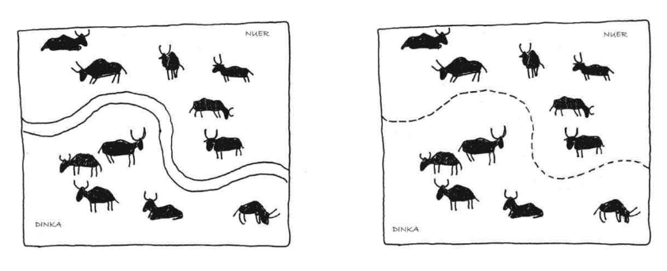

::: {.epigraph}
Социальная наука будущего может быть настолько же онтологически удивительной, как физика 20-го века

Дон Росс
:::

<!--Future social science may be as ontologically surprising as twentieth-century physics was-->

<!--Don Ross-->

::: {.epigraph}
Тот, кто понимает бабуина, сделает в метафизике больше, чем Локк

Чарльз Дарвин
:::
<!--He who understands baboon would do more towards metaphysics than Locke-->

<!--Charles Darwin-->

<!--# Введение-->
<!---->
# Актуальность исследования

Цель диссертации: натуралистическое объяснение возникновения принудительной силы эпистемических конструкций (правил) в онтологии институтов.

***

Социальные институты — деньги, собственность, брак и другие —  обладают принудительной силой из-за наших представлений о них. Коллективное представление «эта бумага — деньги» не описывает мир, но активно его формирует, наделяя бумагу причинной силой и способностью к ценностному обмену, а математическая модель оценки опционов, распространяясь среди трейдеров, становится для них руководством к действию, и реальные цены опционов начинают соответствовать предсказаниями модели [@mackenzie2006].

<!--A viable ontology is both a product and a project of any science. It is a foil for future research and an ultimate goal of knowing "what there is". Conjectures about the nature of objects of study influence the ways of approaching them: if the social world, for example, is comprised of individuals, you will probably study individuals, their properties and relationships between them. Philosophy and history of science have seen cases when mistaken ontology led to scientific mistakes[^1]. In social science, the issue of ontology is even more complicated due to its multi-paradigm nature and lack of shared foundations: diverse objects of study, methods and explanatory strategies[^2].-->

<!--Having a set of core concepts and a unifying principle like mechanics in physics and evolution by natural selection in biology would propel social science to higher explanatory and predictive power. Although some scholars argue that multi-paradigm nature of social science is a "feature" and not a "bug" as social reality is intrinsically complex and highly contextual [@little2016], it still impedes cumulative growth of knowledge [@genov2019]. As Porpora notes, in terms of Kuhn [-@kuhn2009], sociology is not a mature science, but a pre-science [@porpora2015]. And, as Kuhn suggested, an appropriate activity in such a state is continuing the search for a discipline-wide consensus.-->

<!--Along with sociologists, philosophers of social science have been offering definitions of the scope and objects of sociology and broader social science, devising analytical truths about the social domain. Some of them claim that *analytic* social ontology based on conceptual analysis is prior to social scientific methodology [@searle1995; @epstein2016; @lauer2019]. Others criticize this approach as detached from actual science and not "naturalistic" [@elder-vass2007; @sarkia2023; @kincaid2024; @ross2023; @little2020]. Their focus is meta-ontological rather than ontological as they wonder what it means to ask questions about ontology of social science and what are the ways to arrive at an ontology instead of proposing or criticizing particular ontological pictures.-->

Подобные «онтологические эффекты» — способность эпистемических конструкций людей оказывать причинное и принуждающее воздействие на их поведение — одна из центральных и наиболее сложных проблем социальной онтологии. Внутри философии социальной науки это проблема отношения конструктивизма и реализма — вопроса о том, существуют ли социальные сущности объективно и отдельно от сознаний людей или же полностью зависят от последних [@hacking1999; @guala2016a]. А проблема конструктивизма/реализма — частный случай проблемы соотношения реализма и антиреализма в философии науки — вопроса о том, существуют ли ненаблюдаемые сущности вроде квантовых полей, генов и атомов объективно, или же служат удобными фикциями [@okasha2002].

Джон Сёрл [@searle1995] одним из первых сформулировал проблему онтологического статуса социальных фактов и институтов: как можно быть эпистемологически объективным касательно онтологически субъективных вещей? Сёрл показал, что социальные (или, как он их называет, институциональные) факты создаются *конститутивными правилами* вида «X считается Y в контексте C». Эти правила зависят от коллективного признания (collective acceptance) и имеют принудительную силу[^durkheim]. Коллективное признание зависит от коллективной интенциональности (we-intentionality) — постулируемой Сёрлом когнитивной способности индивидов иметь сонаправленность мысли.

[^durkheim]: Однако эта принудительная сила не является надындивидуальной, как у Дюркгейма [@durkheim2014], определившего социальные факты как способы действия, мышления и чувствования, обладающие принудительной силой. Для Сёрла нет надындивидуальной социальной реальности за пределами коллективного признания.

Принудительная сила и каузальность конститутивных правил исходят из их «деонтических сил» — создаваемых конститутивными правилами прав, обязанностей, полномочий, разрешений, требований и запретов. Например, факт «Этот человек — судья» наделяет его деонтической силой: правом выносить приговор, обязанностью соблюдать процедуру, полномочиями требовать показания. Эти полномочия имеют причинную силу, потому что *мотивируют поведение*. Люди признают эти полномочия и действуют в соответствии с ними, а также требуют их признания от других. Сёрл подчеркивает, что деонтические силы создают мотивы для действия, которые не зависят от личных желаний. Люди платят налоги не потому, что сами хотят, а потому, что есть обязанность их платить, вытекающая из *статуса* гражданина/налогоплательщика. Каузальная сила конститутивного правила — это способность *статусной функции* (Y), присвоенной объекту (X) коллективным признанием людей, мотивировать их поведение через систему деонтических сил.

Однако теория Сёрла часто подевргалась критике: из-за недостаточности деонтических сил для объяснения следования правилам [@guala2015],  отсутствия механизма возникновения конститутивных правил и каузальности деонтических сил [#insertSource], переоценки роли рационального коллективного признания и «сверхинтеллектуализма» [@gilbert1992] и других. Помимо критики внутри философии и социальной онтологии, теория Сёрла подвергалась критике в философии социальной науки — особенно за постулирование примата социальной онтологии над методологией изучения социальной реальности [@lauer2019; @little2020; @kincaid2021; @ross2023]. Философ Дон Росс различил аналитическую и научную (натуралистическую) социальную онтологию и показал, что только последняя может 

Будучи зависящей от понятия коллективных представлений и коллективной интенциональности, теория Сёрла не объясняет их строение и возникновение. Подобную натурализацию его проекта продолжают философы, близкие к эволюционной теории [@tomasello2014; @gallotti2012; @gallotti2013] и теории «совместного действия» (joint action) в когнитивной науке [@paternotte2020; @vesper2017; @sebanz2021; @torok2019]. Одна из основных проблем в этом поле — вопрос производности совместной интенциональности от индивидуальной (I-mode vs. we-mode).

<!--- Конститутивные правила — источник каузальности (это правда так?). Его не волнует как возникли конститутивные правила.-->
<!--- https://chat.deepseek.com/a/chat/s/20e16098-e2c1-44df-8d21-bb53ef5b85ae-->
<!--- Теория серля не описывает строение коллективных предствалений — если это все представления. -->
<!--- вставить содержательную критику, но метод.критику можно оставить-->

Несмотря на большое влияние в социальной онтологии и за её пределами, теория Сёрла — не единственная, что объясняет принудительную силу институтов. Теория игр и её применение к изучению социальных конвенций — настолько же влиятельный подход к объяснению. 

<!--- вставить описание из гуалы 2007 и 2015-->
<!--- есть второй подход — про конвенции. посмотреть Гуалу как он называет равновесные концепции. Такой же абзац-->
<!--- у льюиса есть схема, которая описывает конвенцию-->

<!--- Нужно ответить на критику Серлом Гуалы + подчеркнуть роль равновесия-->
<!--- институты — это система сигналов относительно правил которая формирует убеждения в равновесиях. Мало инструментов теории игр — нужны эпистемические конструкции.-->

<!--Гинтис не написал то же самое?-->
<!--Это конвенция о конвенции. Не просто охота на оленя, а общее знание, что равновесие с оленем — единственно правильное.-->

<!--- добавить про дельта параметры — это санкции. Институты это не просто правила в равновесии, это система убеждений относительно этих правил. -->
<!--- гуалу надо дополнить — это правила с механизмами исполнения, находящиеся в рановесиями. Механизмы исполнения правил зашиты в структуру игры. -->
<!--- дельта такова, что стратегии находятся в равновесии — это механизм про который говорит вандершрааф. Необязательно выносить механизм стабилизации за пределы равновесной концепции.-->

<!--- есть неопределенность относительно дельта-параметров. Нет представления, как будет выглядеть санкция. Равновесие будет там, где есть разделяемое убеждение что дельта параметр именно такой. -->

Франческо Гуала [@guala2016a], синтезурует Льюиса и Серля в теорию правил-в-равновесии (rules-in-equilibria, ПвР). Она описывает социальные институты как равновесные состояния,  коррелируемые[^corr] регулятивными правилами вида «если X, делай Y». Например, правило «зелёный свет — иди, красный — стой» коррелирует выбор стратегий между пешеходами и автомобилистами, у каждого из которых есть две условных стратегии — «если красный — стой» и «если зелёный — двигайся». В теории Гуалы, конститутивные правила эпифеноменальны по отношению к регулятивным: между ними нет онтологической разницы, и последние можно описать как первые с помощью простой трансформацией: к паттернам поведения, описываемым регулятивными правилами, добавляется институциональный термин, например, «дорожное движение» [@hindriks2005; @guala2015]. 

Так теория ПвР связывает онтологию Сёрла с научными подходами из теории игр без метафизических конструктов вроде конститутивных правил и коллективной интенциональности.

<!--- почему для гуалы важно атаковать различение конститутив и регулятив правил-->
<!--- что гуала берет от серля? почему правила в ПвР это правила серля-->

[^corr]: Коррелированное равновесие — концепция решения из теории игр, обобщающая равновесие Нэша, когда все игроки получают личный сигнал от третьей стороны, и в их интересах следовать этому сигналу [@aumann1987]. Ярким примером является светофор. Гуала и другие учёные утверждают, что социальные нормы и правила являются такими корреляционными механизмами, подобными светофорам.

Однако теории Гуалы объясняет только стабильность социальных фактов, а не их возникновение. Мотивируя ПвР, Гуала исходит из недостаточности обоих подходов по отдельности — социальных фактов как правил [@searle1995] и социальных фактов как равновесий в стратегических играх [@aoki2007; @north1990]: первые могут не обладать каузальной силой, а вторые не схватывают специфически человеческих форм координации, поскольку применимы и к животным.

Логичным становится вопрос — если координация людей и животных описывается схожими формальными моделями, откуда и почему возникают *правила*, стабилизирующие эти равновесия у людей?

<!--Ключевой пробел в исследовательской программе Сёрла-Гуала заключается в отсутствии объяснения эволюционного механизма перехода от несоциальных координационных паттернов к социальным фактам с их уникальной онтологией — каузальной и нормативной силой, проистекающей из «коллективного принятия». Это логическое продолжение натуралистической программы Гуалы.-->

Ключ к решению этой проблемы лежит в анализе эволюции *устройств корреляции* — того, с помощью чего агенты в стратегическом взаимодействии координируют свои действия. Чтобы прояснить, рассмотрим два примера.

Два самца бабочки разрешают конфликт за территорию, координируя поведение на простом физическом сигнале — «кто первым занял место» [@davies1978]. Их стратегия *условна* (conditional) и зависит от наблюдаемых признаков среды — наличия или отсутствия оппонента на территории. У каждой бабочки есть две стратегии поведения: 

- если я хозяин — борюсь насмерть
- если я захватчик, проявлю агрессию, но если не сработает, отступлю.

Теперь взглянем на людей. Два человеческих племени, разделённые высохшим руслом реки, продолжают соблюдать границу, которая стала абстрактной [@guala2015]. 

Их стратегия также условна, но зависит уже не от физического маркера — высохшего русла реки, а от разделяемого *правила* — «Если земля находится к югу (или к северу — для другого племени) от русла реки, пасти скот». Хотя эта стратегия связана с высохшим руслом, в ней это русло важно не само по себе, а как *средство кодирования информации*. Высохшее русло поддерживает (scaffolds) более глубокую эпистемическую структуру, основанную на общем знании (или общей причине полагать) [@lewis1969] о том, что это высохшее русло *означает*. Агенты координируют действия на разделяемом убеждении, а не на физическом маркере. Это устройство корреляции, *абстрагированное* от физического маркера с помощью *когнитивной репрезентации* разделяемого правила.

Люди, в отличие от бабочек, могут выбирать, на чем координировать свои действия [@guala2015]. Это делает *природу* этих равновесных состояний разной, однако Гуала не объясняет причину этой разницы.

С точки зрения *теории игр* эти ситуации идентичны. Для их описания подходит одна и та же матрица выигрышей. 

<!-- doc-представление -->
<!-- Таблица: Матрица выигрышей для игры на координацию действий животных и людей -->
<!---->
<!-- | | $Бой$ | $Отступление$ | $Условный$ | -->
<!-- |-------------|------------|-------------|---------------------| -->
<!-- | $$Бой$$ | $(0,0)$ | $(2,1)$ | $(1,0,5)$ | -->
<!-- | $$Отступление$$ | $(1,2)$ | $(1,1)$ | $(1,1,5)$ | -->
<!-- | $$Условное$$ | $(0,5,1)$ | $(1,5,1)$ | $(1,5,1,5)$ | -->

<!-- web-representation -->

$$
\begin{array}{|c|c|c|c|}
\hline
& Бой & Отступление & Условный \\
\hline
Бой & 0,0 & 2,1 & 1,0.5 \\
\hline
Отступление & 1,2 & 1,1 & 1,1.5 \\
\hline
Условный & 0.5,1 & 1.5,1 & \textcolor{red}{1.5,1.5} \\
\hline
\end{array}
$$
<figcaption class="caption">Когда оба агента выбирают условную стратегию, каждый получает равный выигрыш. Этот профиль *эволюционно стабилен*: он оптимален при повторении этой ситуации много раз.</figcaption>

Онтологически между ними принципиальная разница: в первом случае координация следует за физической асимметрией среды (кто первым занял место), во втором — за эпистемической структурой разделяемого правила (чья территория, и как высохшее русло дает это понять).

Идентичные матрицы не схватывают разницу в моделях Гуалы и не отвечают на вопрос — если у животных уже есть стабильные равновесия, как и зачем возникают *правила*? А главное — в чём эволюционное преимущество правил как коррелирующих устройств, если они не влияют на равновесие?

Как пишет Брайан Скирмс, позитивная корреляция стратегий с самими собой — как в обоих примерах с условной стратегией выше — способствуют развитию кооперации и эффективности: «эволюционная динамика реализует дарвиновскую версию категорического императива Канта: поступай так, чтобы если другие ведут себя так же, приспособленность к среде была максимальной» [@skyrms2014, 62].

Однако это по-прежнему не объясняет возникновение институциональных фактов из физических: почему в обоих случая есть равновесия, но их онтология разная? Как *эволюционно* могли возникнуть *правила*-в-равновесии, если равновесия уже существуют в координации животных? 

В данной работе мы утверждаем, что эта разница преодолевается через анализ того, что теоретико-игровые модели принимают как данность и не учитывают в своих моделях — *устройств корреляции*. Это то, с помощью чего агенты координируют свои стратегии поведения — кто первым занял место в примере бабочек и территориальное правило в примере про племена.

Инструменты теории игр агностичны к природе устройства корреляции — они просто предполагают, что они есть [@vanderschraaf1995]. Однако если рассмотреть формулы теории игр не инструментально, — агностично к их референтам в мире —  а онтологически — как имеющие референты в мире, мы увидим разрыв именно в *природе* устройств корреляции.

В данной работе мы утверждаем, что этот разрыв можно преодолеть с помощью *экологического механизма когнитивной эволюции*. 

Если равновесные состояния отражают реальные состояния мира — состояния популяций животных и людей и их физических сред, то устройства корреляции — это реальные объекты. Проблема теперь заключается в том, как устройства корреляции стали абстрактными, перейдя от физических свойств среды вроде «размера оппонента» или «очередности» к эпистемическим конструкциям — разделяемым правилам с нормативной и каузальной силой. Оба типа устройств корреляции реальны и обладают каузальной силой. Однако один из них — физический, а второй — эпистемический. И эволюционный переход между ними возможен благодаря экологической динамике.

<!--Основной вклад диссертации заключается в демонстрации того, как экологическая динамика взаимодействий создает эволюционное давление, которое приводит к возникновению эпистемических условных стратегий из реактивных, тем самым объясняя генезис социальных фактов из несоциальных.**-->

<!---->
<!--Гуала говорит, что правил и равновесий недостаточно по отдельности, поэтому их нужно соединить. Однако его теория не объясняет нормативность и принудительную силу правил. У Серла правила имеют деонтологию, Хиндрикс пытается сохранить эту интуицию и вводит нормативное убеждение как источник принудительной силы социальной практики. Об этом также пишет Вандершрааф — что у Гуалы нет механизмов самокорректировки равновесий. -->
<!--Я говорю — с этим можно разобраться, если вернуться к аргументу Гуалы о недостаточности равновесий для объяснения стабильности институтов и «вывести» правильную онтологию с помощью натуралистической эпистемологии. -->
<!--И у животных, и у людей есть конвенция — как в игре ястреб-голубь-буржуа у Гуалы. Однако у животных она функциональна и ненормативна (норма как разделяемое убеждение не мотивирует выбор стратегии), а у людей — произвольна и нормативна (может быть любой и мотивируется разделяемым убеждением). -->
<!--Норма, мотивирующая выбор стратегии, это конвенция второго порядка — где верхняя конвенция посылает корректирующий сигнал при поломке нижней конвенции. Читер-детекшн во многих биологических видах это подтвеждает. У людей это может быть конвенция «стой на красный, иди на зеленый», а есть конвенция «штраф, если пошел на красный». Но проблема в том, что тогда неясно, как возник штраф.-->
<!--Равновесие в институте обеспечивается иерархией контроля — конвенцией, регулирующей исполнение базовой конвенции (а Гуала говорит о базовых конвенциях). -->
<!--  - как это выразить на языке Хармса?-->
<!--И мы можем соединить два уровня конвенций в игре — базовая игра + дельта-параметры.-->

Переход от простых сигналов среды вроде «уже занятого места» к репрезентируемым правилам представляет собой коэволюционный процесс, в котором материальные артефакты *кодируют* информацию и выступают когнитивными опорами (scaffolds), а возникающие правила приобретают каузальную силу через свою адаптивную *функцию* в среде — координировать действия для достижения целей выживания [@harms2004; @millikan1984]. Социальное конструирование и правила в ПвР возникают как постепенное усложнение корреляционных механизмов под давлением дарвиновского отбора, а их реальность оказывается производной от их стабильной каузальной роли в системе «агент-среда».

Как мы будем утверждать вслед за Кимом Стерельны [@sterelny2003] и Питером Годфри-Смитом [@planer-godfrey2021; @godfrey-smith1996], растущая информационная сложность среды эволюционно создавала давление отбора на агентов, вынуждая их развивать когнитивные способности для представления более абстрактных характеристик среды, поскольку это влияло на их способность к успешному решению проблем координации, от которого во многом зависело выживание.  С помощью таких абстрактных репрезентаций и давления, создаваемого ими, появлялись новые способы координации, которые и привели к появлению объективности и обязательности социальных фактов. 

Данная работа занимает сторону *научной социальной онтологии* [@ross2023], которая исходит не из априорных концептов, а из логики вывода к наилучшему объяснению (IBE) [@guala2016]. Онтология служит не предпосылкой, как в аналитическом подходе, а результатом исследования, выводясь из теорий, которые наилучшим образом объясняют наблюдаемые феномены.

Мы предлагаем *механистический* взгляд на возникновение каузальности социальных фактов из простых стратегических взаимодействий животных с их средой:

1. Агенты без способности к репрезентации взаимодействуют друг с другом в популяциях и координируют поведение на физических маркерах вроде «размер оппонента»
2. Со временем взаимодействие агентов оставляют следы в окружающей среде
3. Следы создают новую информационную структуру среды, которая делает существующие способы координации неэффективными
4. Возникает эволюционное давление на когнитивное усложнение агентов для распознавания новых сигналов как устройств корреляции
4. Благодаря рекурсивной динамике, агенты постепенно развивают способность ко всё более абстрактному представлению следов среды, что в итоге позволяет им координировать поведение на основе разделяемых представлений.

Мы покажем, как этот экологический механизм завершает картину, предложенную Сёрлом и Гуалой: Сёрл описал онтологию социальных фактов, Гуала — их натуралистическую структуру, а настоящая работа объясняет их естественное возникновение из несоциальных взаимодействий.

{width="60%"}

*Теоретически* результаты могут быть интересны исследователям в области философии науки, социальной онтологии, когнитивной науки и теории эволюции. Результаты исследования также могут быть использованы в качестве материалов для курсов по философии социальных наук и социальной онтологии.

<!--*На практике* полученные знания могут быть использованы для проектирования социальных институтов путём учета их эмерджентной когнитивной динамики — «импорт» институтов возможен только при наличии соответствующей когнитивно-материальной инфраструктуры. -->

# 🚧 Объект и предмет исследования

*Объект диссертационного исследования* — онтология социальных институтов.

*Предмет исследования* — разделяемые агентами репрезентации как источник принудительной (нормативной) силы социальных институтов.

<!--эволюционное возникновение стратегий поведения, опосредованных *убеждениями*, из более примитивных стратегий, основанных на реакциях на физические маркеры среды, в рамках теории правил-в-равновесии Франческо Гуалы и модели эволюционного возникновения социальных конвенций Брайана Скермса на примере игры «Ястреб-Голубь-Буржуа», матрицу которой мы приводили выше.-->

<!--*Объектом данного исследования* является теория Гуалы «правил равновесия», которая предлагает единую социальную онтологию, синтезирующую две влиятельные традиции в философии социальных институтов: подход «институты как правила» и подход «институты как равновесия» [@guala2015]. Эта теория концептуализирует социальные институты как наборы регулятивных правил, представляющих собой условные стратегии вида «если X, то Y», которые координируют поведение, создавая целостное взаимодействие в стратегических взаимодействиях. В отличие от более ранних моделей, которые рассматривали институты либо как простые соглашения, либо как конститутивные правила, концепция Гуалы подчёркивает каузальную роль целостного взаимодействия, поддерживаемого условными стратегиями агентов как «убеждениями». Этот подход особенно ценен, поскольку он предоставляет строгое и философски тонкое описание того, как социальный порядок может возникать и сохраняться, не предполагая идеализированную рациональность или коллективную интенциональность, как это делают многие современные социальные онтологии [@jankovic2018].-->

<!--Основываясь на собственной попытке Гуалы натуралистически обосновать свою теорию, эта диссертация серьёзно рассматривает вопрос о *натуралистических основах* его концепции. Более конкретно, в ней исследуется, как социальные институты, описанные теорией правил равновесия, могли развиться из животных конвенций в эволюционном и экологическом контексте. Хотя теория Гуалы в основном концептуальна и несколько формальна, она оставляет открытым эмпирический и механистический вопрос о том, как такие институты возникают в реальных популяциях агентов с ограниченными когнитивными способностями. Настоящее исследование направлено на восполнение этого пробела путём изучения эволюционной траектории от более простых форм коррелированной координации, наблюдаемых и моделируемых у животных, к сложным нормативным институтам, характерным для человеческих обществ. Это предполагает изучение того, могут ли КЭ, поддерживающие институты, быть основаны на процессах отбора, экологических ограничениях и когнитивной эволюции, и каким образом.-->

<!--*Предметом исследования* является*эволюционное возникновение эпистемических условных стратегий, опосредованных убеждениями*, из более примитивных, реактивных, неэпистемических условных стратегий в рамках теории правил равновесия Гуалы. В частности, их возникновение в рамках теоретико-игровой игры «Ястреб-Голубь-Буржуа», о которой я упоминал в начале. Реактивные условные стратегии – это стратегии, которые напрямую зависят от внешних сигналов, не задействуя внутренние представления или убеждения о намерениях или будущих действиях других людей. Например, бабочка обуславливает своё поведение непосредственным наличием сигнала или стимула, например, «есть ли кто-нибудь ещё в этом месте?». Это прямое восприятие сигнала, а не когнитивная репрезентативная обработка. Напротив, условные стратегии, опосредованные эпистемическими убеждениями, предполагают формирование агентами внутренних моделей или убеждений о поведении других, что позволяет им принимать более гибкие, опережающие и контекстно-зависимые ответы. Племена, пасущие скот, формируют свои стратегии в соответствии с общими убеждениями об имуществе друг друга, абстрагированными от непосредственно наблюдаемых границ.-->

<!--Этот переход от реактивных к эпистемическим стратегиям знаменует собой важный эволюционный шаг к тому, что можно назвать *протонормативностью*, которая представляет собой стадию, на которой условные стратегии агентов являются не просто реакциями на стимулы, а опосредованы деонтическими или протодеонтическими убеждениями о том, что следует делать в данном контексте. Эта протонормативность ещё не охватывает полностью развитые нормативные системы с явными механизмами санкционирования отклонений или обеспечения соблюдения, но представляет собой основополагающие когнитивные и поведенческие способности, которые делают такие системы возможными. Сосредоточившись на этом возникновении, диссертация способствует пониманию того, как когнитивная архитектура, лежащая в основе нормативного поведения, могла постепенно эволюционировать из более простых форм социальной координации.-->

# Степень разработанности проблемы

Наш проект носит междисциплинарный характер: он сочетает социальную онтологию, эволюционную теорию игр и философию биологии. Он направлен на то, чтобы внести вклад в натурализацию социальной нормативности, то есть объяснение нормативных феноменов как возникающих в результате естественных процессов без метафизических или интерпретационных представлений. Это согласуется с научно-реалистической перспективой, которая рассматривает социальные виды как реальные сущности, обладающие причинно-следственной связью, поддающиеся эмпирическому исследованию и индуктивному выводу [@boyd1999; @guala2016].

Диссертация отталкивается от классической теории Джона Сёрла и её переосмысления в теории правил-в-равновесии Франческо Гуалы, которая предлагает единую основу для понимания социальных институтов как «коррелированных равновесий» (КР), поддерживаемых условными стратегиями агентов [@guala2015]. Однако теория Гуалы, несмотря на свою концептуальную силу, во-первых, редуцирует конститутивные правила и социальную казуальность до понятия «социального института», а во-вторых не говорит, как равновесия и лежащие в их основе условные стратегии развиваются из простых форм координации, наблюдаемых у животных, в более сложные. Для устранения этого пробела необходимо объединить идеи эволюционной теории игр и философии биологии, касающиеся когнитивной эволюции, чтобы проследить эволюционное возникновение эпистемической агентности, опосредованной убеждениями.

<!--Главным вкладом этой диссертации является натуралистическое и эволюционное описание того, как люди приходят к представлению и соблюдению институциональных правил как предписаний, тем самым заполняя ключевой пробел в теории институтов Гуалы [@guala2016]. Его объяснение объединяет традиции «институтов как правил» [@searle1995] и «институтов как равновесий» [@north1990; @aoki2007], утверждая, что институты лучше всего понимать как правила, находящиеся в равновесии: они одновременно являются когнитивными устройствами (правилами), которые люди используют для представления и управления социальной жизнью, и устойчивыми моделями поведения (равновесиями), сохраняющимися благодаря взаимным ожиданиям и стимулам. Хотя этот подход элегантно соединяет философские и игровые перспективы, теория Гуалы оставляет малоизученными когнитивные и эволюционные механизмы, посредством которых агенты приходят к *интернализации равновесий как правил*, и то, как предписывающая сила правил возникает из простых поведенческих закономерностей.-->

Настоящая диссертация развивает проект Гуалы, явно моделируя эволюционный путь от координации на основе простых физических сигналов к возникновению несвязанных, подобных убеждениям представлений правил, в соответствии с которыми действуют агенты. Опираясь на теорию игр [@skyrms1994; @skyrms2010] и философию биологии [@sterelny2003; @sterelny2012Book; @godfrey-smith2002; @sterelny2021; @planer-godfrey2021; @seitz2020] в диссертации показано, как агенты эволюционируют, чтобы выводить скрытую структуру своей среды, вырабатывать *расцепленные (decoupled) репрезентации* и, в конечном итоге, координировать действия на основе общих нормативных правил. Этот подход подтверждает утверждение Гуалы о том, что правила являются когнитивными представлениями о равновесии, но, демонстрирует, *как такие представления могут развиваться из ненормативных источников*, а не предполагаться или навязываться внешними корреляционными механизмами.

Кроме того диссертация отвечает на критику теории Гуалы о том, что она чрезмерно экстерналистская [@roversi2021] или недостаточно учитывает материальную и психологическую реальность институтов [@rabinowicz2018]. 

Начиная с основополагающих моделей координации Дэвида Льюиса [@lewis1969], Брайана Скирмса [@skyrms1994; @skyrms2010] и других, и расширяя исследование теоретико-игровой социальной онтологии Гуалы, анализ приводит к проведению принципиального различия между *онтической корреляцией стратегий* — когда физические маркеры среды становятся источником сигнала, и *эпистемической корреляцией* — когнитивными процессами, основанными на представлениях, которые позволяют агентам интерпретировать социальные сигналы и реагировать на них. Формально это одно и то же, поскольку агенты по-прежнему используют стабильные и оптимальные условные стратегии, но «скрыто» то, что представляет собой природа механизма корреляции, сигнализирующего каждому игроку о предпочтительной стратегии.

Наш проект решает три задачи:

1. В области натуралистической социальной онтологии мы показываем возможное решение проблемы конститутивных правил, описанной Джоном Сёрлом — как можно быть эпистемологически объективным по поводу онтологически субъективных вещей вроде социальных фактов [@searle1995]. Эту же проблему решает Франческо Гуала в своей теории правил-в-равновесии (rules-in-equilibria, RiE) [@guala2016a]. Однако, как мы покажем, он смешивает представления об агентности из классической и эволюционной теории игр. Наше решение показывает, что конститутивные правила вида «X считается Y в контексте C» — это не просто лингвистически трансформированные регулятивные правила вида «Если видишь X, делай Y» [@hindriks2005], а результат *кодирования* информации из окружающей среды (как протоптанная тропинка, которую мы упоминали выше). Мы показываем возможный эволюционный механизм преобразования регулярностей поведения в нормативно-нагруженные правила, обладающие принудительной силой.

2. В социальной онтологии мы предлагаем механистический подход, которые укрепляет социальные институты как *естественные виды* [^natural-kinds]. Существующие исследования, моделирующие эволюцию социальных институтов [@skyrms2003; @skyrms2014; @bowles2003; @guala2016a], не включают *когнитивный реализм* — адекватные реальности механизмы когнитивной эволюции как предпосылки возникновения социальной каузальности и социальных институтов — масштабируемых нормативно-ориентированных практик [@aoki2007; @aoki2011; @hindriks2015a]. Мы подробно обсуждаем и моделируем *когнитивную* эволюцию социальных институтов и показываем, как возможны онтологические эффекты от взаимодействия когнитивных способностей агентов с их средой.

3. В философии социальных наук мы предлагаем *онтологические ограничения социологической теории*,способствующие аналитическим базовым концепциям, независимым от эпистемологической оптики.

[^natural-kinds]: Это «гомеостатические кластеры свойств» [@boyd1991], которые поддерживают индуктивное обобщение и научный вывод.

Главный исследовательский вопрос текущей диссертации — *как когнитивная архитектура, лежащая в основе нормативного поведения, требующая сложных репрезентативных способностей, могла развиться из более простых репрезентативных систем и форм социальной координации*?

<!--Понятие *социальной конвенции* играет важную роль в данной диссертации и понимается в соответствии с традицией Дэвида Юма и Дэвида Льюиса как модель поведения, возникающая внутри популяции в результате многократного взаимодействия, способствующая координации и снижающая неопределённость. *Нормативность* относится к предписывающей силе, которую такие конвенции могут приобретать со временем, часто сопровождаясь ожиданиями, санкциями или моральным оправданием. Различие между ними не всегда очевидно, и одна из целей данной диссертации — прояснить механизмы, посредством которых конвенции становятся нормативными.-->

# 🚧 Цели и задачи исследования

Главная *цель* данной диссертации — дать *натуралистическое объяснение возникновения принудительной силы социальных фактов*. Эта цель обусловлена признанием того, что существующие теории либо предполагают развитые когнитивные способности вроде коллективной интенциональности [@searle1995; @bratman2022; @gallotti2012], либо трактуют нормы как социальные конструкты *ex nihilo*.

<!--В отличие от теорий, где наказание или принуждение рассматриваются как центральные элементы нормативности, данная диссертация фокусируется на *возникновении когнитивных и поведенческих субстратов*, делающих такие системы возможными. Тем самым она закладывает основу для будущих исследований того, как прото-нормативность может развиться в полноценную нормативность с механизмами социального принуждения, понимаемыми в натуралистическом смысле.-->

Более конкретно, исследование направлено на:

- Тщательное изучение взаимосвязи между социальными конвенциями и нормативностью для более чёткого определения различий в теории Гуалы.

- Проанализировать теорию Гуалы с эпистемологической точки зрения, чтобы выявить противоречия, скрывающие вопрос о различных когнитивных архитектурах внутри его теории.

- Описать различные когнитивные архитектуры, предполагаемые теорией Гуалы, и прояснить возможные эволюционные пути их соединения.

<!--- Продемонстрировать с помощью агентного моделирования, как эпистемическая корреляция может возникать из экологических взаимодействий и селективного давления, благоприятствующего более сложным репрезентативным возможностям.-->

- Прояснить концептуальную связь между механизмами реактивной координации и эпистемическими стратегиями, опосредованными убеждениями.

- Поместить эти результаты в рамки теории правил равновесия Гуалы, тем самым обеспечив натуралистическую основу для описываемых ею институтов.

- Связать результаты с дискуссиями о метафизике социальных видов и философии социальных наук.

# Теоретическая основа исследования

Данная диссертация опирается на междисциплинарную теоретическую базу, охватывающую социальную онтологию, философию науки, эволюционную биологию и когнитивную науку. Ключевые компоненты включают в себя:

- *Теория правил равновесия Гуалы:* Концепция Гуалы предлагает философски обоснованное описание социальных институтов как целостного мира (CE), поддерживаемого условными стратегиями агентов [@guala2015]. Интегрируя нормативные и каузальные аспекты институтов, эта теория стремится создать лаконичную натуралистическую онтологию социального порядка, которая избегает принятия метафизически нагруженных конститутивных правил или коллективной интенциональности за примитивы. Настоящее исследование опирается на эту базу, исследуя эволюционное происхождение условных стратегий, поддерживающих это равновесие.

- *Эволюционная теория игр:* Формальное моделирование стратегических взаимодействий и их эволюции во времени является центральным элементом данного исследования. Основополагающие работы @lewis1969, @maynardsmith1982, @skyrms2010 и @gintis2009 продемонстрировали, как сотрудничество и

Координация может возникать в ходе эволюционных процессов. Данная диссертация развивает эти идеи, уделяя особое внимание эволюции эпистемических, опосредованных убеждениями стратегий от реактивных, используя когнитивную энтропию в качестве аналитического инструмента.

- *Философия биологии*: Понимание эволюции внутренних представлений и систем убеждений критически важно для различения реактивных и эпистемических стратегий. Стерелни [-@sterelny2003; -@sterelny2012Book; -@sterelny2021] подчеркнул роль *несвязанного представления* в когнитивной эволюции человека. Телеосемантическая теория Милликена [@millikan1984] предлагает натуралистическое описание ментального представления, основанного на биологической функции, что служит основой для теории Стерелни. Другим важным источником является *Тезис о сложности окружающей среды* Годфри-Смита [@godfrey-smith1996; @godfrey-smith2001], где утверждается, что сама функция познания заключается в навигации в информационно насыщенной среде и создании адаптивного покоя, повышающего собственную приспособленность. Эти перспективы формируют концептуализацию эпистемических обусловленных стратегий как опосредованных убеждениями в данной диссертации.

- *Социальная онтология и философия социальных наук:* Метафизические и нормативные последствия рассмотрения социальных конвенций как естественных понятий отражены в работах Бойда [-@boyd1999], Сёрла [-@searle1995] и современных дискуссиях о натурализации нормативности. Обобщённая теория Гуалы служит отправной точкой для определения текущего исследования в контексте текущих философских дискуссий, выступая в качестве «центрального узла» и синтезируя основные результаты, полученные в рамках различных разделов философии науки.

Ранняя основополагающая работа Льюиса [-@lewis1969] представила теоретико-игровую формализацию социальных соглашений как стабильных взаимовыгодных поведенческих моделей, подчеркивая, как координационное равновесие возникает в результате повторяющихся взаимодействий. Скирмс расширил эту концепцию, включив эволюционную динамику, продемонстрировав, как популяции агентов могут вырабатывать стабильные соглашения посредством процессов отбора, приводящих к выгодным соглашениям о социальных контрактах [@skyrms2003; @skyrms2014; @skyrms2014a @skyrms2010]. Эти модели успешно объясняют возникновение координации, но часто подвергаются критике за исключение нормативности конвенций из области их объяснения и опору на когнитивно неправдоподобных агентов с идеализированными предположениями о рациональности [@sterelny2012a; @gilbert1992; @hedoin2021]. 

Теория Гуалы «правил в равновесии» [@guala2015] представляет собой значительный прогресс, интегрируя нормативные и каузальные аспекты социальных конвенций с классической социальной онтологией Сёрла [@searle1995]. Как уже упоминалось, предлагая мощную интергартивную модель социальной онтологии, теория Гуалы не объясняет эволюционные и когнитивные механизмы возникновения условных стратегий. Этот пробел побудил последующие исследования, изучающие натуралистические основы социальных институтов [@hedoin2021]. Мы подробно проанализируем теорию Гуалы в главе 2, обращая внимание на проблемы смешения моделей агентства, подразумеваемых в его аргументах, и смешения понятий репрезентации, которые он использует для разграничения социальной координации животных и человека.

Параллельные разработки в когнитивной науке и философии биологии подчеркнули важность эпистемических способностей, таких как нескоординированное представление. Эти подходы подчёркивают, что протонормативность включает в себя не только поведенческую координацию, но и внутренние состояния – убеждения и намерения, – опосредующие социальное взаимодействие [@sterelny2021]. Тем не менее, эволюционный переход от реактивного, движимого стимулами поведения к эпистемическим, опосредованным убеждениями стратегиям остаётся недостаточно изученным. Мы рассмотрим теории когнитивной эволюции [@sterelny2003; @sterelny2012Book; @godfrey-smith1996; @millikan1987] и построения когнитивных ниш [@odling-smee2003; @bardone2007; @planer-godfrey2021] в главе 3, где рассмотрим их в связи с первой попыткой Гуала использовать аргументы Стерелни в пользу разобщённого представления для обоснования различий в координации у животных и человека [@hindriks2015]. 

<!--Мы разрабатываем собственную вычислительную модель когнитивной эволюции корреляции стратегий, опосредованных эпистемическими убеждениями, с формированием ниши.-->

# Методология исследования

Методология, использованная в данном исследовании, является междисциплинарной и сочетает:

1. *Сравнительный теоретический анализ:* существующие модели возникновения социальных норм, включая сигнальные игры Льюиса, эволюционные модели Скирмса и работы @ullmann-margalit1977, @young1998, @epstein1996, @bicchieri2005, @gintis2009a и теорию правил равновесия Гуалы [@guala2016], систематически сравниваются и критикуются. Этот сравнительный подход выявляет сильные стороны, ограничения и пробелы, которые стремится устранить настоящее исследование.

2. *Теоретико-игровое моделирование*: опираясь на основополагающие работы по эволюционной теории игр [@maynardsmith1982; @skyrms1994], в диссертации описывается формальная модель «Ястреб-Голубь-Буржуа», через призму которой анализируется проблема корреляции стратегий. Она позволяет обнаружить различение онтической и эпистемической корреляции и служит основанием для дальнейшего моделирования в будущих исследованиях.

<!--популяции агентов, использующих условные стратегии и «растущую» эпистемическую обусловленность в качестве адаптивного ответа на возрастающую информационную плотность окружающей среды. Эта модель исследует, как реактивные стратегии могут эволюционировать в стратегии, опосредованные убеждениями, под воздействием экологических факторов. Коррелированное равновесие, эволюционно устойчивые стратегии и игра «Ястреб-Голубь-Буржуа» служат аналитическими инструментами для понимания стабильности и причинно-следственной эффективности эмерджентных стратегий.-->

<!-- 4. *Агентное моделирование:* в дополнение к нашей аналитической модели, агентное моделирование используется для описания сложной динамики эволюции стратегий в популяции неэпистемических агентов, которые реагируют только на сигналы окружающей среды и «учатся на опыте» посредством своего рода *обучения с подкреплением*. Эти модели позволяют исследовать такие факторы, как информационная прозрачность среды, механизмы обучения и когнитивные ограничения, обеспечивая эмпирическое обоснование теоретических утверждений. -->

# ⏳ Новизна исследования

<!--Основная новизна  данной диссертации заключается в представлении *причинно-следственных механизмов эволюции корреляции*, которые лежат в основе структуры игры: агенты, их стратегии и выигрыши остаются неизменными на протяжении всей эволюции. Меняется *природа механизма корреляции*, на основе которого агенты координируют свои действия и следуют условным стратегиям.-->
<!---->
<!--Формально и животные, и люди используют некий «сигнал» или асимметрию окружающей среды, будь то «размер противника» для первых или светофор для вторых. Но в данной работе главное значение имеет базовая *эпистемология этих сигналов* в обоих случаях.-->

<!--Данная диссертация предлагает ряд новых вкладов в решение проблемы возникновения социальной каузальности и соотношения реализма и конструктивизма в социальной онтологии:-->
<!---->
<!--- *Динамический реализм*: вводится понятие динамического реализма — позиции в социальной онтологии, преодолевающей различение реализма и конструктивизма и объясняющей и возникновение, и стабильность социальных фактов — границ, денег и т.д. Основное положение — социальные факты возможны благодаря эволюционной когнитивно-материальной динамике, основанной на взаимодействии репрезентаций агента и его среды. Эта динамика объясняет их возникновение через эволюцию устройств корреляции (на чём координируют поведение агенты) и стабильность — через рассмотрение социальных фактов как изначально равновесных состояний.-->
<!---->
<!--- *Онтическая/эпистемическая корреляция:* введение инструмента объяснения эволюционного перехода от реактивных к опосредованным убеждениями стратегий является оригинальным. Это различие проясняет когнитивные и экологические механизмы, такие как конструирование ниши, лежащие в основе появления развитых когнитивных архитектур.-->
<!---->
<!--- *Механистический переход от онтической к эпистемической корреляции*: эпистемические условные стратегии могли естественным образом эволюционировать из более простых реактивных форм поведения с помощью механизма когнитивного конструирования ниши. Стратегия отбирается на основе нужды (функции), связана с манипулированием или реакцией на объект в среде, который создает когнитивную опору. Всё это вкупе с существующим когнитивным навыком создаёт давление отбора для следующей нужды (функции).-->
<!---->
<!--- *Переопределение социальных институтов в теории Франческо Гуалы*: теперь они не сводятся к правилам-в-равновесии, а представляют собой наборы равновесных состояний, возможные благодаря когнитивно-материальной инфраструктуре — объектам среды, которые кодируют информацию и служат когнитивными опорами для поддержания равновесия в стратегическом взаимодействии.-->
<!---->
<!--- *Поддержка институтов как естественных видов*: диссертация подтверждает тезис о том, что социальные институты являются независимыми от разума естественными видами, которые включают в себя эпистемический элемент, влияющий на их форму и функцию. Предлагая механистическую модель возникновения эпистемических корреляционных устройств из онтических, мы показываем, как институты могут быть основаны на естественных эволюционных процессах и в то же время иметь интерактивный компонент, зависящий от разума.-->
<!---->
<!--Подробные обзоры литературы в соответствующих главах подтверждают, что ни одна предшествующая работа не объединяла эти концептуальные, формальные и эмпирические элементы в едином исследовании эволюционного возникновения эпистемических условных стратегий, опосредованных убеждениями, в рамках натуралистической социальной онтологии.-->

# 🚧 Положения, выносимые на защиту

<!--Центральная *гипотеза* диссертации:-->
<!---->
> *Эпистемические условные стратегии, опосредованные убеждениями и зависящие от внутренних убеждений агентов о поведении других, могут эволюционировать из реактивных, неэпистемических условных стратегий, основанных на асимметрии окружающей среды, посредством механизма обратной связи между средой и когнитивными способностями агентов.Этот эволюционный переход обеспечивает натуралистическую основу для принудительной силы социальных фактов.*
<!---->
<!--Эта гипотеза включает в себя несколько взаимосвязанных утверждений:-->
<!---->
<!--1. *Реактивные условные стратегии*, которые реагируют непосредственно на сигналы окружающей среды, не задействуя внутренние представления, представляют собой эволюционные предшественники более сложных стратегий, опосредованных убеждениями. Такие реактивные стратегии широко распространены среди животных и составляют основу социальной координации.-->
<!---->
<!--2. Благодаря *повторяющимся взаимодействиям и селективному давлению*, способствующим успешной координации и сотрудничеству, агенты развивают *внутренние эпистемические состояния*, такие как убеждения или представления, которые опосредуют их условный выбор стратегии. Эти эпистемические состояния позволяют агентам предсказывать поведение других и гибко реагировать на него, а не просто реагировать на фиксированные сигналы.-->
<!---->
<!--3. Возникновение этих эпистемических стратегий порождает *протонормативные установки* относительно того, какие действия уместны или необходимы в данном социальном контексте. Эти протонормативные убеждения являются когнитивными предшественниками полноценных нормативных систем.-->
<!---->
<!--4. Весь процесс можно *смоделировать с помощью агентно-ориентированной симуляции*, что демонстрирует возможность возникновения механизмов эпистемической корреляции без использования более сложных когнитивных конструктов, таких как *коллективная интенциональность* или явные механизмы санкционирования.-->
<!---->
<!--5. Этот переход не просто концептуальный, но может быть *исследован вычислительно* с помощью агентного моделирования, которое фиксирует динамику когнитивной эволюции корреляционных устройств, представленных в виде экологических сигналов различных уровней абстракции.-->
<!---->
<!--Следующие тезисы суммируют основные положения данной диссертации и предлагаются для защиты:-->
<!---->
<!--1. Социальные институты, концептуализируемые теорией Гуалы «правил равновесия», могут быть основаны на эволюционных процессах, поддерживаемых когнитивным конструированием ниш, которые создают нормативно-коррелированное равновесие, поддерживаемое условными стратегиями эпистемических агентов.-->
<!--2. Различие онтической и эпистемической корреляции необходимо для объяснения эволюционного перехода от онтических к эпистемическим условным стратегиям в унифицированной социальной онтологии Гуалы.-->
<!--3. Агенты, способные к интеграции информации посредством функциональной абстракции, эволюционно более устойчивы, чем другие агенты.-->
<!--4. Социальные конвенции и протонормативные убеждения квалифицируются как естественные виды в рамках научной реалистической социальной онтологии.-->
<!--5. Натурализация социальной онтологии возможна без коллективной интенциональности или явных санкционирующих механизмов, а только благодаря экологической динамике: коэволюции когнитивных способностей к интеграции информации и изменению окружающей среды, вызванному агентами.-->
<!---->

# ⏳ Основное содержание работы

## Глава 1. Проблема принудительной силы институтов в социальной онтологии
В первой главе диссертации описывается проблема, — откуда исходит принудительная сила социальных институтов, а также рассматриваются её ключевые решения — традиция социальной онтологии Джона Сёрла и его последователей [@searle1995; @searle2010; @tuomela2013; @gilbert1992; @bratman2022], традиция теоретико-игрового анализа социальных конвенций Дэвида Льюиса [@lewis1969; @vanderschraaf1995; @gintis2009a], институциональной экономики [ @acemogly2005; @aoki2011; @aoki2007; @north1990], а также синтез этих традиций в унифицированной социальной онтологии правил-в-равновесии Франческо Гуалы [@guala2015; @guala2016a] и его критику [@searle2015; @rabinowicz2018; @hedoin2021; @Vanderschraaf_2017].

Результат первой главы — формулировка проблемы диссертации: способна ли синтетическая онтология Франческо Гуалы объяснить принудительную силу социальных институтов? И если нет, то как может быть устроена такая непротиворечивая синтетическая социальная онтология?

### 1.1 Институты как правила: деонтическая сила из коллективной интенциональности 
В параграфе 1.1 описывается теория конститутивных правил Джона Сёрла [@searle1995; @searle2010] и традиция, следующая из его идей.

#### 1.1.1 Теория конститутивных правил Джон Сёрла
В 1.1.1 описывается теория Сёрла, её основные компоненты и её объяснение принудительной силы институтов: различение конститутивных и регулятивных правил, понятия деонтической силы, коллективной интенциональности, фоновыж ожиданий.

После описания основных подходов я выделяю ключевые различения для анализа проблемы — конститутивные и регулятивные правила, деонтические силы конститутивных правил [@searle1995], теоретико-игровые равновесия и их разновидности, функциональные/произвольные и нормативные/ненормативные конвенции [@oconnor2019] и провожу границу между понятиями института, социальной нормы и конвенции. После этого я рассматриваю лакуны теорий.

#### 1.1.2 Традиция Сёрла: «Стандартная модель» социальной онтологии
Описывается «Стандартная модель» социальной онтологии: её компоненты и представители, а также отношение этих теорий к проблеме источника принудительной силы социальных институтов. Рефлексивность, перформативность…

#### 1.1.3 Критика теории Сёрла
***
Слабая сторона теории Сёрла — недостаточное объяснение стабильности институциональных фактов: откуда возникает и почему соблюдается принудительная сила конститутивных правил. Для Сёрла ответ — в «фоновых» неосознаваемых когнитивных процессах.

### 1.2 Институты как равновесия в теории игр: устойчивость из рациональности агентов
***
Описывается теоретико-игровая традиция институтов как равновесий

### 1.3 Синтез и его амбивалентность: теория «правил-в-равновесии» Франческо Гуалы
Описывается теория правил-в-равновесии (ПвР) Франческо Гуалы, её критика со стороны коллег, а также критика автора, направленная на лакуны в аргументации и, следовательно, нелегитимные теоретические выводы ПвР.

#### 1.3.1 Теория правил-в-равновесии
***
Эту критику развивает Гуала и утверждает, что для объяснения стабильности нужно понятие равновесия из теории игр. Гуала рассматривает большой пласт литературы об институтах как равновесиях и «когнитивных медиа», экономящих мышление. Он предлагает унифицированную социальную онтологию, объединяющую натуралистический проект и интуиции Сёрла с теоретико-игровыми подходами к конвенциям. 

#### 1.3.2 Критика теории правил-в-равновесии
Однако теория Гуалы недостаточно проработана — её критикуют с разных сторон: за отсутствие механизма самокорректировки равновесий [@Vanderschraaf_2017], за излиший экстернализм, за неправильный выбор концепции равновесия, за излишнюю инструментализацию и выхолащивание нормативности [@hindriks2019].

#### 1.3.3 Глубокая проблема: соотношение правил и равновесий
Корень проблемы, по моему мнению, глубже — в отношении между правилами и равновесиями в теории Гуалы. Аргументируя унификацию институтов как правил и равнвовесий, Гуала исходит из недостаточности каждого элемента по отдельности: правила могут не иметь принудительной силы и не соблюдаться, а равновесия описывают слишком большой класс феноменов — например, решение территориальных споров у животных [@hindriks2015a]. 

Решение Гуалы — приравнять регулятивные правила вроде «стой на красный, иди на зеленый» к условным стратегиям агентов в играх. Точнее, он говорит, что это два взгляда на одну и ту же сущность: с точки зрения действующего агента это правила, а с точки зрения наблюдателя — условные стратегии, ведущие к коррелированному равновесию [@guala2015]. Правила, по утверждению Гуалы, «неотъемлемы для *достижения* равновесий, формирующих институты» [@hindriks2015a, 463], то есть логически им предшествуют. Однако в другом месте Гуала говорит, что правила — это «репрезентации стратегий <…>, которым *должно* (ought) следовать в игре» [@hindriks2015a, 467]. При этом долженствование (принудительный характер институтов) следует из инструментальной рациональности коррелированного равновесия — игрокам не выгодно отклоняться от стратегии, предложенной устройством корреляции. Сам Гуала признаёт, что это «слабая нормативность» инструментальной рациональности, а не деонтические силы в полной мере, как это есть у Сёрла [@guala2015].

Иначе говоря, теория Гуалы создаёт круг в определении: правила помогают агентам достичь равновесий и одновременно репрезентируют уже существующие стратегии, которым необходимо следовать в игре, а нормативность возникает из равновесия. Неясно, что онтологически первично — правила или равновесия, и откуда и почему возникает нормативность. Всё это затрудняет определение онтологии социального института.

Во второй главе я подробно рассматриваю отношение между правилом и равновесием в теории Гуалы.

<!--Там же гуала говорит, что репрезентация (а не правила, как я думал) отличает КР животных и людей — The reason why this third condition of representation is needed is that the notion of correlated equilibrium is far too permissive and would let in too many behavioural patterns that we would not intuitively consider institutions (466)-->
<!--rules represent equilibria (or parts of equilibria) and help the players to exploit a particular correlation device (468)-->

<!--## Глава 2. Тупик правил-в-равновесии: подмена объясняемого и неполнота информации-->
## Глава 2. Анализ теории правил-в-равновесии: круг в определении, подмена объясняемого и допущение о полноте информации

### 2.1. Круг в определении: институт как скрытая предпосылка института
Описывается ключевая проблема теории Гуалы: институт как правило-в-равновесии требует существования готовой конвенции, решающей конфликт.

#### 2.1.1 Методологическая критика: сравнение несравнимых игр 
- Гуала сравнивает разные игры: 
  - эволюционную игру с рациональной, беря за основу Ястреб-Голубь-Буржуа Мейнарда Смита. Они имеют разные допущения:
    - об агентах: фенотипы и индивиды
    - об источнике корреляции стратегий: экзогенная (внешняя) и эндогенная (зависит от истории)
    - о концепции устойчивости: ЭСС у Мейнарда Смита (а не КР) и КР у Гуалы
- Вывод: нелегитимное сравнение как основа аргументации не способствует валидности выводов ПвР

#### 2.1.2 Логическая критика: подмена условной стратегии готовой абстрактной конвенцией
- Гуала сравнивает игру с конфликтом с игрой на координацию, не изменяя матрицы и незаметно устраняя конфликт:
  - Пример с животными (ЯГБ): Чистая игра с конфликтом. Условная стратегия «Буржуа» — это решение, которое предстоит найти в рамках игры. Никаких внешне данных правил нет.
  - Пример с людьми («выпас скота»): Гуала описывает это так: «Племена пасли скот по разные стороны реки. Река высохла. Теперь они продолжают пасти скот по воображаемой линии».
  - Ключевой момент: Фраза «продолжают пасти» содержит готовую конвенцию. Но откуда она взялась? В момент, когда река высохла, перед племенами встала точно такая же игра с конфликтом, как у животных (ЯГБ за новый ресурс). Гуала пропускает этот момент и начинает анализ с того, что конвенция уже существует.
  - Что должно быть объясняемым (explanandum)? Возникновение и устойчивость принудительной социальной структуры (например, границы, права собственности).
  - Что Гуала использует как объясняющее (explanans)? Уже существующую, работающую социальную структуру (конвенцию о разделе по реке), которую он встраивает в начальные условия своей модели.
- Итог: Он строит теорию, где институт (как готовая конвенция) является предпосылкой для объяснения института (как устойчивого равновесия). Это логический круг (petitio principii). Он объясняет институт через самого себя. Это фатально, потому что весь пафос Гуалы — показать, как правила и равновесия совместно порождают институты. Но в его ключевом примере правило («паси на своей стороне») не порождается игрой — оно дано ей изначально как часть истории.
- Вывод 1: Гуала не моделирует возникновение института. Он моделирует воспроизводство уже существующего института в слегка изменившихся условиях (река исчезла, но «правило» осталось). Его модель объясняет не «почему есть граница», а «почему сохраняется инерция уже существующей конвенции о границе, если физический маркер исчез». Это другая, более простая проблема.
- Вывод 2: Если рассмортреть пример Гуалы с выпасом скота как настоящую ЯГБ (без предустановленной конвенции в виде реки как границы), то там будет и равновесие, и правило — но не в онтологическом смысле уже существующей конвенции, а как условная стратегия. Это ставит под вопрос необходимость правил для определения института. **Возможно, правила не необходимы**.

### 2.2. Неустойчивость коррелированного равновесия: правило без санкции в условиях неполной информации
- Центральный тезис Гуалы — что КР адекватно описывает устойчивость института. Однако это не так, поскольку работает только в случае допущения о полной информации в игре. Чтобы это показать, представляем игры в развернутой форме: 
  - видим, что при неполной информации возможен блеф
  - следовательно, следование правилу (то есть условной стратегии к КР) — не является оптимальным ответом. Вместо этого можно сблефовать
  - чтобы условная стратегия стала КР, нужен модификатор платежа для стратегии блефа: Гуала его либо уже предполагает встроенным в игру (делая институт черным ящиком), либо игнорирует
- Вывод: концепция коррелированного равновесия неадекватна для описания устойчивости института — для нее принципиальна **защита от блефа при неполной информации**
- КР — статичное, его недостаточно для описания устойчивости института. Нужна концепция равновесия, которая может объяснить, как определённая поведенческая стратегия становится общепринятой, т.е. как она может возникнуть и закрепиться через динамический процесс (обучение, имитация, эволюционный отбор). 

ОСТАНОВИЛСЯ ЗДЕСЬ

*   **2.3. Двойная неудача синтеза: круг в определении и логическая неустойчивость.**
    *   **Синтез 1:** Даже если отбросить формальную неустойчивость, модель Гуалы порочна из-за логического круга (институт как предпосылка).
    *   **Синтез 2:** А с учётом формальной неустойчивости КР без D, оказывается, что та самая предпосылка (готовая конвенция) **не могла бы существовать** в реалистичных условиях.
    *   **Общий вывод:** Теория «правил-в-равновесии» не выполняет своей основной задачи — объяснить принудительную силу институтов. Она либо тавтологична, либо описывает невозможный объект.

*   **2.4. Вывод главы: необходимость динамической онтологии, исходящей из до-институционального состояния.** (Как ранее).

---

Во второй главе я рассматриваю необходимость и достаточность правил и равновесий в теории Гуалы. Гуала и Хиндрикс вводят элементы адекватной теории социальных институтов: корреляция стратегий, координация и репрезентация, говоря, что все три необходимы для описания стабильности человеческих социальных институтов как нормативно-регулируемых поведенческих паттернов [@guala2015]. В этой главе я показываю, что для онтологии социальных институтов корреляция стратегий необходима, но недостаточна, а правила — онтологически не необходимы и служат «интерфейсом» к стратегии.

Аргументируя недостаточность равновесий для объяснения стабильности социальных институтов, Гуала утверждает, что коррелированное равновесие (КР) может описывать ситуации и людей, и животных. Поэтому оно не «схватывает» специфику человеческих институтов, имеющих нормативность и деонтические силы. Гуала использует схожие игровые матрицы, чтобы показать игру Ястреб-Голубь-Буржуа (ЯГБ) для ситуации территориального спора животных и людей:

$$
\begin{array}{|c|c|c|c|}
\hline
& Ястреб & Голубь & Буржуа \\
\hline
Ястреб & 0,0 & 2,1 & 1,0.5 \\
\hline
Голубь & 1,2 & 1,1 & 1,1.5 \\
\hline
Буржуа & 0.5,1 & 1.5,1 & \textcolor{red}{1.5,1.5} \\
\hline
\end{array}
$$
<figcaption class="caption">Случай территориального спора животных: когда оба игрока выбирают условную стратегию (играть Ястреба, если владеешь территорией, и Голубя, если вторгаешься на чужую), каждый получает максимально возможный равный выигрыш.</figcaption>

$$
\begin{array}{|c|c|c|c|}
\hline
& \text{Пасти} & \text{Не пасти} & \text{Пасти, если юг/север} \\
\hline
\text{Пасти} & 0,0 & 2,1 & 1,0.5 \\
\hline
\text{Не пасти} & 1,2 & 1,1 & 1,1.5 \\
\hline
\text{Пасти, если юг/север} & 0.5,1 & 1.5,1 & \textcolor{red}{1.5,1.5} \\
\hline
\end{array}
$$
<figcaption class="caption">Территориальный спор людей с выпасом скота.</figcaption>

<!--|   | Ястреб     | Голубь     | Буржуа     |-->
<!--|---|-------|-------|-------|-->
<!--| Ястреб | 0,0     | 2,1     | 1,0.5   |-->
<!--| Голубь | 1,2     | 1,1     | 1,1.5   |-->
<!--| Буржуа | 0.5,1  | 1.5,1   | 1.5,1.5   |-->
<!---->
<!---->
<!--|   | Пасти     | Не пасти     | Пасти, если юг/север     |-->
<!--|---|-------|-------|-------|-->
<!--| Пасти | 0,0     | 2,1     | 1,0.5   |-->
<!--| Не пасти | 1,2     | 1,1     | 1,1.5   |-->
<!--| Пасти, если юг/север | 0.5,1  | 1.5,1   | 1.5,1.5   |-->

И хотя интуиция верна, это сравнение не легитимно, поскольку это разные игры, схожие лишь поверхностно.

1. *Игра животных — с конфликтом, игра племён — на координацию (конфликт уже решён)*. Описывая пример с бабочками, оспаривающими территорию, Гуала говорит, что игроки вступают в конфликт. Буржуа-стратегия, согласно Мейнарду-Смиту, на которого опирается Гуала, минимизирует встречи «Ястреб-Ястреб», играя «Голубя» при встрече с «Ястребом». Условность Буржуа-стратегии направлена на избегание конфликта. В то же время стратегии в игре с племенами предполагают, что *конфликт уже решён* и территория не оспаривается: игра *предполагает существование конвенции* о разделении территории, и игрокам остаётся лишь следовать уже существующему правилу — «пасти скот, если к югу от реки». Это ключевая логическая лакуна, ставящая под сомнение всю теоретическую конструкцию Гуалы.

2. *Подмена объясняемого объясняющим.* Гуала, описывая пример с племенами, говорит, что сначала их разделяла река, и они могли пасти свои стада только на территории до реки. Когда река высохла, линия песка стала границей. Гуала, ссылаясь на Льюиса [@lewis1969],  объясняет это очевидностью (salience) истории игры: так всегда делали, поэтому будем делать и сейчас. Однако это сильное допущение.

  Проблема в том, что пока есть река, игры «Ястреб-Голубь» и ситуации стратегического выбора нет — оба племени физически разделены рекой, и у них нет рациональных альтернатив своим территориям: переходить реку со стадами слишком рискованно. *Игра появляется только тогда, когда река высыхает*: физического ограничения больше нет, и можно заявить права на новую территорию. В этот момент ещё нет и не может быть конвенции «пастись, если нахожусь к югу» — есть только ресурс (территория) и матрица «Ястреба-Голубя». Стратегия Буржуа лишь может появиться, но не гарантирована «историей игры», как считает Гуала, потому что игры как таковой не было. Более того, Буржуа-стратегия в данной игре не обязательно будет связана с положением племени относительно реки — устройство корреляции может быть любым.

3. *Институт как конвенция «второго уровня»*. Гуала имплицирует, что для существования института нужна уже существующая конвенция, решающая конфликт — например, «одно племя пасёт скот слева от высохшей реки, второе — справа». Институт Гуалы, следовательно — это действительно коррелированное равновесие в правилах, но в правилах *уже существующей конвенции*, решающей конфликт. Если Буржуа-стратегия в игре животных — конвенция, то «пастись, если к югу от реки» — конвенция «второго уровня», поскольку предполагает наличие готового правила. Подобная картина отражает не суть института, а *результат идеальной работы института*, когда все конфликты уже решены.

4. *Подмена конститутивных правил регулятивными*. Если институт — конвенция «второго уровня», то правила для базовой конвенции, решающей конфликт откуда-то должны взяться. Базовая конвенция, решающая территориальный спор с помощью произвольного устройства корреляции, создаёт пространство игры «второго уровня», где появляется равновесие в правилах, которое Гуала и называет институтом. Однако Гуала не объясняет, откуда берутся эти правила. Вместо этого он говорит, что правила — это и есть устройства корреляции, что корректно только для случая, когда конфликт уже решён и есть базовая конвенция. Это создаёт напряжение: Гуала, пытаясь схлопнуть различение конститутивных и регулитвных правил, говорит о *двух разных конвенциях*: конститутивные правила разрешают конфликт в базовой игре ЯГБ, а регулятивные — регулируют поведение в игре «второго уровня», где конфликта уже нет и есть координация. Схлопывая их, Гуала подменяет базовую конвенцию конвенцией «второго уровня», что нелегитимно. Эта *подмена и создаёт проблему амбивалентности правил* — *ex ante*/*ex post* — за которую его критикуют [@hindriks2019; @hedoin2021]: условия возможности института и правила действия для агентов. В первом случае без правил не может быть равновесий — например, в случае с публичным объявлением границы старейшинами соседствующих племён [@guala2015, 192], а во втором — правил не может быть без равновесий, потому что первые «репрезентируют стратегии, которым нужно следовать в игре» [@hindriks2015a, 466][^hindriks].

[^hindriks]: В этом заключается основное отличие теории Гуалы от теории Фрэнка Хиндрикса, названной им «правила-и-равновесия» [@hindriks2019]. Хиндрикс, вслед за Серлом, различает два типа правил: первые создают пространство игры наподобие конститутивных, а вторые регулируют игру.

Строго говоря, сама матрица игры Гуалы с выпасом скота неверна: по форме это игра с конфликтом, а по сути — на координацию. Чистые стратегии в этой игре бессмысленны. Если есть условная стратегия, предполагающая конвенцию, которая решает конфликт («пасти, если к югу от реки»), то стратегии Ястреба и Голубя здесь поведенчески невозможны. Нет ресурса, который предстоит делить — он уже поделён с помощью конвенции.

Иначе говоря, Гуала переносит случай, где институты не нужны (ЯГБ животных) на случай, где они являются предметом объяснения.

Аргумент о недостаточности коррелированного равновесия для описания институтов Гуала строит на утверждении о том, что разница между институтом у людей и «конвенцией» животных (вроде разрешения территориального спора) — в объёме сигналов для действия (scope of actionable signals) или устройств корреляции. Животные могут использовать только «генетически встроенные» устройства корреляции — очередность занятия территории, размер оппонента и т.д. Однако люди способны выбирать устройства корреляции произвольно, что для Гуалы равноценно способности одновременно следовать нескольким правилам. Опираясь на идеи Кима Стерельны [@sterelny2003], Гуала утверждает, что способность к «расцепленной» когнитивной репрезентации (decoupled representation), которая отделяет полученный сигнал от мгновенного поведенческого ответа, позволяет людям выбирать и создавать новые правила, которым они будут следовать.

Здесь Гуала делает изящный ход: 

1. постулирует разницу устройств корреляции, при этом 
2. приравнивая устройство корреляции к правилу «если…, то…» и 
3. сохраняя его экзогенность игре. 

Это обеспечивает формальное сходство игр ЯГБ и выпаса скота, однако логически нестабильно: 

- когнитивная репрезентация как способность расцеплять и анализировать полученный сигнал и поведенческий ответ *не имплицирует* следование правилу «если…, то…», а лишь создаёт возможность более подвижной интерпретации сигнала [@sterelny2003]. Репрезентация не гарантирует устройства корреляции в виде регулятивных правил — это допущение;
- правило как устройство корреляции требует общего знания (об этом Гуала говорит сам) — если игроки не разделяют правило, то конструкция института рушится: Ястребы, игнорирующие правило легко получают выгоду;
- правило как существующая конвенция (и решение другой игры) не может быть экзогенным игре: это не факт природы, а подвижная конструкция, зависящая от истории игры.

<!--Постулируя разницу устройств корреляции и при этом объявляя, Гуала по-прежнему описывает их как внешние по отношению к игре и в случае животных, и в случае людей, однако, как мы показали выше, это неверно. Само правило, коррелирующее стратегии игроков, уже является произвольной конвенцией, эндогенной игре *в силу её истории*.-->

<!--Это означает, аргумент Гуалы о недостаточности равновесий не вполне состоятелен, поскольку сравнивает две кардинально разных игры, похожих лишь поверхностно. Чтобы показать это полнее, проверим второй критерий, нужный для легитимного сравнения примеров Гуалы — что условная стратегия «пасти скот, если находишься к югу от реки» эволюционно стабильна.-->

Чтобы сравнивать игры и делать вывод о недостаточности равновесий для института, Гуале стоит показать их эквивалентность — общее основание для сравнения. Как мы показали, игры изначально разные: в игре с племенами неверная логическая структура — профиль стратегий, представляющий, по мнению Гуалы, социальный институт («пасти, если к югу/северу от реки») основан на решении другой игры, более похожей на ЯГБ.

Стоит рассмотреть игру с племенами как игру с конфликтом, а не на координацию. Для этого её нужно сделать более похожей на классическую ЯГБ. В этой игре также есть два племени, однако после высыхания реки они решают оспорить территорию — появляется ситуация стратегического взаимодействия. В этой игре встречаются два пастуха, один из которых первым занял территорию, а второй — вторым. У каждого пастуха есть три стратегии — две чистых и одна условная: драться, отступить и драться, если пришёл первым, и отступить, если вторым. Эта игра описывается обычными стратегиями Ястреб-Голубь-Буржуа, поскольку в ней есть ресурс (территория) и правило не дано изначально, как у Гуалы:

$$
\begin{array}{|c|c|c|c|}
\hline
& Ястреб & Голубь & Буржуа \\
\hline
Ястреб & 0,0 & 2,1 & 1,0.5 \\
\hline
Голубь & 1,2 & 1,1 & 1,1.5 \\
\hline
Буржуа & 0.5,1 & 1.5,1 & \textcolor{red}{1.5,1.5} \\
\hline
\end{array}
$$
<figcaption class="caption">Более реалистичный территориальный спор пастухов (ЯГБ)</figcaption>

И хотя матрица не изменилась, изменился смысл: в этой игре есть только базовая конвенция, которая будет КР — «драться, если занял территорию первым и отступать, если вторым». Это тоже правило вида «если…, то…», но оно не отсылает к уже существующей конвенции, а само ей становится. По форме это не отличается от института Гуалы — есть и правило, и коррелированное равновесие. Однако это не правила в онтологическом смысле, какими их хочет видеть Гуала — они не являются заранее существующими устройствами корреляции и не обладают нормативной и принудительной силой[^rules].

[^rules]: В онтологическом смысле правила у Гуалы существуют только потому, что, как мы выяснили, являются результатом изначальной игры. То есть онтологически у Гуалы всё же два вида правил — конститутивные создают пространство игры «второго уровня», описывающей институт, и регулятивные — правила в игре «второго уровня». Трюк заключается в том, что их формулировка в обоих случаях одинакова — «если…, то…». Это даёт Гуале возможно редуцировать все правила к регулятивным.

Достаточно ли такой конструкции для института? С точки зрения Гуалы, нет, потому что здесь нет *абстрактного* правила как коррелирующего устройства. Вместо этого, правило «пасти, если пришел первым» привязано к контексту конкретной игры и к чистой стратегии. Это возвращает нас к теории институтов как равновесий, делая правила избыточными.

Получается, что в текущем виде *институт в смысле Гуалы не может быть правилом-в-равновесии*, поскольку в таком случае он — конвенция об использовании другой конвенции. При этом изначальная конвенция — такая же «магия», как конститутивное правило Сёрля: возникает неясно откуда (у Сёрля хотя бы есть источник — коллективная интенциональность) и как-то обретает силу мотивировать действие в новой игре. Это подрывает унифицирующий пафос теории правил-в-равновесии и снова возвращает к различению института-как-правила и института-как-равновесия.

Гуала чувствует рекурсивность и динамичность института, вводя готовую конвенцию как решение игры с институтом и говоря о повторяющейся игре, однако схлопывает эти конструкцию в статичную картину её равновесия. 

В теории Гуалы принудительная сила социального института возникает *ex nihilo* — она уже встроена в структуру игры. При этом, как мы показали, институт может быть простым «одноэтажным» КР в игре ЯГБ, делая абстрактные правила не необходимыми. Однако в таком случае мы лишаемся конститутивности и собственно новых сущностей вроде «границы», «брака» и других институтов.

Чтобы выяснить, откуда берётся принудительная сила института и как правила соотносятся с равновесиями, нужно вернуться к стандартной ЯГБ и детально рассмотреть структуру игры и её допущения.

<!--!!! как перейти от КР к ЭСС-->
<!--Таким образом, концепция коррелированного равновесия (КР), даже если бы она была логически непротиворечивой в модели Гуалы, оказывается статичной. Она описывает состояние системы после того, как координация достигнута и общее знание установлено. КР — хороший инструмент для описания функционирования зрелого института, но он принципиально не способен смоделировать его возникновение из состояния, где этого общего знания и координации ещё нет. Нам нужна концепция равновесия, которая может объяснить, как определённая поведенческая стратегия становится общепринятой, т.е. как она может возникнуть и закрепиться в популяции через динамический процесс (обучение, имитация, эволюционный отбор).-->
<!--Такой концепцией является эволюционно стабильная стратегия (ЭСС). В отличие от КР, которое является равновесием в статической игре с фиксированными ожиданиями, ЭСС — это равновесие в динамическом процессе. Стратегия является ESS, если, будучи принятой популяцией, она не может быть вытеснена вторжением малой доли мутантов, играющих по-другому. Это не просто равновесие «здесь и сейчас» — это равновесие, устойчивое к помехам и изменениям. Именно это свойство — устойчивость к вторжению «нарушителей» (мутантов) — делает ESS релевантной для моделирования институтов, которые должны противостоять стратегиям обмана и блефа-->
<!--Ключевая проблема, выявленная критикой Гуалы, — неполнота информации и угроза блефа. КР молчаливо предполагает, что сигналы достоверны. ESS же позволяет явно смоделировать вторжение стратегий-«мутантов», которые эксплуатируют неполноту информации (например, блефуют). Поэтому переход к анализу ESS — это не смена темы, а следующий логический шаг: мы берём отправную точку Гуалы (координационная игра), но вместо того чтобы постулировать готовое решение (КР), мы спрашиваем: «При каких условиях условная стратегия в этой игре может быть эволюционно устойчивой против вторжения блефующих мутантов?». Этот вопрос прямо ведёт к необходимости нового параметра — санкции (D).-->
<!--Следовательно, для построения онтологии, способной объяснить генезис институциональной реальности, необходимо сменить аналитический аппарат. Мы переходим от статической концепции коррелированного равновесия (описывающей результат) к динамической концепции эволюционно стабильной стратегии (моделирующей процесс становления). Это позволяет нам начать анализ с до-институционального состояния — хаотичной игры с конфликтом и неполной информацией — и показать, какие минимальные условия (D, а затем I) необходимы для возникновения в ней устойчивого социального порядка.-->

## Эволюционная стабильность и неполнота информации в ЯГБ
У животных сигналы в ЯГБ общие, потому что вероятных «приватных» сигналов всего два — роль «владелец» или «захватчик». К тому же, они взаимоисключающие, и устройство корреляции не посылает каждому агенту истинно приватный сигнал, недоступный другим, как в КР Аумана [@aumann1987; @vanderschraaf1995].

Иначе говоря, помимо разной природы корреляции примеры Гуалы имеют и разную *информационную структуру*. Развёрнутая форма игр позволяет увидеть это более явно:

<!--The receiver observes only the message, not the sender’s type. Hence nodes following identical messages belong to the same information set. This allows a bluffing intruder to mimic the owner’s signal, implying that the bourgeois strategy is not evolutionarily stable.-->

 <!--→ each strategy in this profile also takes the form of a rule that dictates each player what to do in the given circumstances, 185-->
 <!--→ correlated strategies = external rules-->
 <!--→ a norm can be seen as a convention augmented with deontic force imposing extra constraints on the behaviour of some (but not necessarily all) players. (194)-->

В случае животных сигнал отражает тип игрока индексично — буквально «означает» тип «чужак» или «владелец», в то время как в примере с людьми получатель не может однозначно понять тип отправителя сигнала (захватчик или владелец), и возникает неопределённость[^complication].

[^complication]: Более того, в примере с людьми возможна эпистемическая (байесовская) интерпретация вероятности как степени уверенности, а не объективной вероятности назначения типа Природой. Однако поскольку мы хотим проверить наличие ЭСС-свойства у условной стратегии в примере с людьми, мы, вслед за Гуалой, положим идентичность условий и объективный источник вероятности.

В случае животных мы можем говорить, что игра имеет *полную информацию*, — тип известен каждому игроку, сигналы фиксированы - а в случае людей — неполную, так сигнал может быть фальшивым (cheap talk), а тип — скрыт.

Возникает проблема блефа: игрок с типом «чужак» может имитировать сигнал «владельца», что сделает лучшим ответом для другого игрока стратегию «Голубя» и позволит «чужаку» эксплуатировать второго игрока («Буржуа» или чистого «Голубя»). В примере Гуалы это была бы стратегия «пасти скот везде и притворяться "своим"», которая не была бы КР, но была бы ЭСС, поскольку эффективно эксплуатирует и «честных Буржуа», руководствующихся своим положением относительно реки, и «Голубей», которые не пасут свой скот нигде.

Это означает, что *корреляция стратегий не гарантирует устойчивость и стабильность института*, которую пытается объяснить Гуала, поскольку работает только в случае полной информации в игре, где она является эволюционно стабильной.

Как я формально покажу в следующей главе, подобная ситуация требует механизма стабилизации на уровне платежей в матрице игры. Однако решение Гуалы предполагает *идеальное соответствие* посылаемого сигнала типу игрока даже в случае людей и исключает неопределенность. Из-за этого, помимо нелигитимного переноса экзогенности корреляции, постулирование регулятивного правила как коррелятора стратегий у людей в отличие от животных выглядит не вполне корректным, поскольку не связано с разницей объема информации в сравниваемых Гуалой играх.

<!--Игроки Гуалы *должны* руководствоваться правилом при выборе стратегии. А поскольку они репрезентируют равновесие с помощью этого регулятивного правила, решение Гуалы предполагает, что подобный механизм стабилизации *уже* встроен в структуру игры — вероятно, регулятивное правило уже является нормативным и мотивирует действие. -->

Иначе говоря, решение Гуалы *предполагает*, а не объясняет мотивацию следовать регулятивному правилу, с помощью которого агенты репрезентируют равновесие. А также он постулирует разницу в объёме получаемых сигналов, но не эксплицирует её формально.

Чтобы разрешить эти противоречия и прийти к определению социального института, нужно решить проблему блефа: показать условия эволюционной стабильности в игре Ястреб-Голубь-Буржуа с неполной информацией. Подобные условия эволюционной стабильности дадут ответ на минимальную онтологическую архитектуру социального института, и прояснят отношение между равновесием и регулятивным правилом.

**Итог главы**: 

1. Выявлен амбивалентный статус правил по отношению к равновесиям — *ex ante* и *ex post*: правила одновременно и условия возможности равновесий и их репрезентация, что зеркалирует различение конститутивных и регулятивных правил, которое Гуала пытается схлопнуть
2. Показано нелигитимное сравнение игр, которое делает Гуала, чтобы аргументировать недостаточность равновесий для объяснения социального института. Игры имеют разные эпистемические и онтологические допущения: 
  - стратегии как фенотипы и как действия
  - нелегитимный перенос экзогенности корреляции
  - Буржуа-стратегия имеет — ЭСС в примере с животными, а с людьми — нет
3. Выявлено скрытое допущение о полноте информации в игре, без которого корреляции стратегий недостаточно для поддержания института
4. Показано, что чтобы аргумент Гуалы работал, все свойства игры Мейнарда-Смита должны переноситься на человеческие случаи: корреляция стратегий, её экзогенность, а также эволюционная стабильность. Однако игра Гуалы имеет эндогенную корреляцию и не имеет ЭСС.
5. Чтобы разрешить указанные проблемы, нужно решить проблему блефа в примере с людьми — восстановить эволюционную стабильность условной стратегии в игре с неполной информацией. Это подскажет статус правил относительно равновесий.

<!--- либо мы допускаем вслед тисом, Скирмсом и Гуалой, что конвенции животных и институты людей одинаково коррелированы и могут быть КР, и что они отличаются объёмом и качеством сигналов (наличием приватных сигналов). В таком случае нам нужно объяснить, (1) как стратегия Буржуа эволюционно возникает *как стратегия*, доступная для выбора агентами, а не как результат популяционной динамики и (2) почему это равновесие в Буржуа-стратегиях у людей регулируется именно регулятивным правилом вида «стой на красный, иди на зелёный».-->
<!---->
<!--Иначе говоря, нужно объяснить, как эволюционно меняется характер устройства корреляции — от простого физического маркера вроде очередности занятия территории или размера оппонента до сложного разделяемого эпистемического конструкта вроде социальной нормы. Подобное объяснение легитимирует правило-в-равновесии как необходимое решение и объяснит корреляцию в теории Гуалы.-->
<!---->
<!--2. Анализ понятия рерпезентации в теории Гуалы создаёт проблемы курицы и яйца: если регулятивные правила вида «стой на красный, иди на зелёный» — это репрезентации объективных равновесий игры агентом, то правило не может коррелировать стратегии, потому что (1) оно логически предшествует его репрезентации агентом и (2) приватно, а не является публичным сигналом, необходимым для работы коррелированного равновесия. Чтобы регулятивное правило коррелировало стратегии игроков, оно должно быть общим знанием. -->

<!--Проблема звучит так — что первично для института как источник принудительной силы: равновесие или правило? Интуитивный ответ (вслед за Гинтисом [@gintis2010]) — равновесие, поддерживаемое общим знанием о нормативных санкциях. Решение Гинтиса, кстати, подвержено такой же проблеме *petitio principii*, поскольку постулирует изначально нормативно-ориентированных агентов [@gintis2009a].-->

## Глава 3. Динамика стабилизации: от условной стратегии к дельта-стабилизированной сети игр 
<!--Эволюционная стабильность условной стратегии в игре с неполной информацией: формальная модель-->

<!--- Институты как сети санкций: Каузально-информационная модель социальной онтологии-->
<!--(Institutions as Sanction Networks: A Causal-Informational Model of Social Ontology)-->
<!--- От равновесия к сети: Дельта-стабилизированные взаимодействия как основа социальных институтов-->
<!--(From Equilibrium to Network: Delta-Stabilized Interactions as the Foundation of Social Institutions)-->
<!---->
<!--Названия глав:-->
<!---->
<!--Глава 1. Проблема принудительной силы: между деонтикой и равновесием (The Problem of Binding Force: Between Deontology and Equilibrium)-->
<!---->
<!--Глава 2. Тупик правил-в-равновесии: неполнота информации и подмена объясняемого (The Impasse of Rules-in-Equilibrium: Incomplete Information and the Explicans-Explicandum Swap)-->
<!---->
<!--Глава 3. Формальные условия устойчивости: дельта, масштаб и взаимная информация (Formal Conditions of Stability: Delta, Scale, and Mutual Information)-->
<!---->
<!--3.1. Игра «Ястреб-Голубь» с неполной информацией и проблема блефа-->
<!---->
<!--3.2. Дельта-параметр как необходимое условие локальной эволюционной устойчивости-->
<!---->
<!--3.3. Масштабирование: от одной игры к популяции. Параметр r и пороговая вероятность санкции-->
<!---->
<!--3.4. Взаимная информация (I) как мера институциональности-->
<!---->
<!--Глава 4. Онтология института: дельта-стабилизированная сеть взаимодействий (The Ontology of Institutions: A Delta-Stabilized Network of Interactions)-->
<!---->
<!--4.1. Что такое институт? Отказ от правил и равновесий-->
<!---->
<!--4.2. Институт vs. прото-институт: глобальная дельта и высокая I-->
<!---->
<!--4.3. Роль артефактов: правила, символы, бюрократия как стабилизаторы сети-->
<!---->
<!--4.4. Конститутивное и регулятивное: эпифеномены сетевой связности-->
<!---->
<!--Глава 5. Следствия: реализм, фаллибилизм и новая программа исследований (Consequences: Realism, Fallibilism, and a New Research Program)-->

Чтобы проверить, может ли условная стратегия быть устойчивой в человеческих условиях, нам необходимо явно смоделировать игру с неполной информацией.

<!--Предлагаемая логическая цепочка для переработки:-->
<!---->
<!--Цель: Показать, что тезис Гуалы о необходимости правил поверх КР для объяснения институтов несостоятелен.-->
<!---->
<!--Критика 1 (Методологическая): Гуала некорректно обобщает с животных на людей, смешивая разные онтологии стратегий (фенотипы vs. действия) и подразумевая разную полноту информации.-->
<!---->
<!--Критика 2 (Логическая): Его концепция правила амбивалентна (ex ante/ex post), что делает теорию нестабильной.-->
<!---->
<!--Критика 3 (Субстантивная, основная): В ключевом человеческом примере (выпас скота) он молчаливо предполагает, что сигнал правила (положение) достоверен и соблюдается. Если снять это идеализированное допущение и ввести возможность обмана (неполную информацию), то его условная стратегия перестаёт быть эволюционно стабильной.-->
<!---->
<!--Конструктивный шаг: Формально показать, при каком условии (добавлении санкции δ в платёжную матрицу) условная стратегия в игре с неполной информацией восстанавливает свой статус ЭСС.-->
<!---->
<!--Главный вывод: Стабильность института обеспечивается не правилом-как-репрезентацией, а объективной структурой санкций (δ). Правило является вторичным когнитивным/дискурсивным феноменом, а не первичной онтологической причиной. Это ставит под сомнение необходимость правил и когнитивной репрезентации в той фундаментальной роли, которую им отводит Гуала.-->
<!---->
В этой главе я строю формальную модель игры ЯГБ с неполной информацией и показываю условия эволюционной стабильности условной (коррелированной) стратегии. Это позволит разрешить проблему статуса правил в теории Гуалы — *ex ante*/*ex post* — и внести ясность в проблему источника принудительной силы в социальной онтологии.

Стратегия Буржуа в ЯГБ эволюционно стабильна, если типы наблюдаемы обоими игроками. Чтобы это показать, введём понятия *истории игры* и *информационного множества*.

История $h \in H$ — конечная последовательность ходов (или узлов дерева) игры в развёрнутой форме $h = (a_1, a_2,\dots, a_k)$. Информационное множество $I_R$ — это набор *неразличимых для получателя* историй игры. Если $|I_R| > 1$, то получатель не знает, в каком узле игры он находится, что усложняет принятие решения. В ЯГБ в примере Гуалы с животными:
$$
\begin{gathered}
h_1 = \{\theta_1, m_1\} \\
h_2 = \{\theta_2, m_2\} \\
I_R = \{h\}
\end{gathered}
$$
Поскольку $I_R = 1$ (истории эквивалентны, так как идентичны по форме), получатель сигнала точно знает, в каком узле игры находится.

А в примере Гуалы с племенами:
$$I_R(m_1) = \{h, (\theta_2, m_1)\}$$

Тип отправителя неразличим для получателя сигнала — он видит один и тот же сигнал «я владелец» и когда отправитель действительно «владелец», и когда он «чужак», что обозначено на схеме пунктирной линией. Это создаёт неопределённость и лазейку для эксплуатации получателя.

Поскольку получатель не знает наверняка, в каком узле игры находится, его информационное множество позволяет ввести параметр *вероятности блефа отправителя* $e$[^entropy] — каков шанс, что сигнал отправителя не соответствует его типу. 

Вероятность блефа влияет на платежи в игре: профиль $B, B$, когда оба игрока выбирают условную стратегию Буржуа, перестаёт быть ЭСС из-за новой стратегии $BL$ — «блефующего чужака» (bluffing intruder), выдающего себя за владельца.

[^entropy]: Вероятность блефа в данной формальной модели — это необходимое упрощение. В дискурсе философии науки и философии биологии, в частности, в рамках которого развивается идея сигнальных игр применительно к биологической эволюции, одна из основополагающих идей — возрастающая информационная сложность окружающей среды (environmental complexity) [@godfrey-smith1996; @sterelny2003], которую выражают через *энтропию*. Конкретно в нашем случае это вероятность блефа обусловлена *условной энтропией* сигнала по отношению к типу игрока — количеством информации, недостающим для точного определения получателем типа отправителя по его сигналу: $|I_R(s_1)| > 1 \implies H(\theta | s_1) > 0$. Чтобы получить вероятность блефа, мы нормализуем эту условную энтропию: $\frac{H(\theta | s_1)}{H(\theta)}$.

<!--# ✅ **Правильная логика проверена и подтверждена**-->
<!---->
<!--**Сигналы и действия:**-->
<!--1. **Буржуа (B)** — честная стратегия:-->
<!--   - Сигналит свой истинный тип.-->
<!--   - На сигнал «владелец» → **Голубь**.-->
<!--   - На сигнал «захватчик» → **Ястреб**.-->
<!---->
<!--2. **Мутант-блефер (M)** — обманывающая стратегия:-->
<!--   - Всегда сигналит «владелец».-->
<!--   - На сигнал «владелец» → **Голубь**.-->
<!--   - На сигнал «захватчик» → **Ястреб**.-->
<!---->
<!--**Встреча M vs B:**-->
<!---->
<!--| M тип      | B тип      | Сигналы          | Действия         | Исход          | Платёж M |-->
<!--|------------|------------|------------------|------------------|----------------|----------|-->
<!--| Владелец   | Владелец   | (V-сигн, V-сигн) | Голубь, Голубь   | Голубь vs Голубь | \( V/2 \) |-->
<!--| Владелец   | Захватчик  | (V-сигн, I-сигн) | Ястреб, Голубь   | Ястреб vs Голубь | \( V \)   |-->
<!--| Захватчик  | Владелец   | (V-сигн, V-сигн) | Голубь, Голубь   | Голубь vs Голубь | \( V/2 \) |-->
<!--| Захватчик  | Захватчик  | (V-сигн, I-сигн) | Ястреб, Голубь   | Ястреб vs Голубь | \( V \)   |-->
<!---->
<!--**Средний платёж M:**-->
<!--\[-->
<!--\pi(M,B) = \frac14 \cdot \frac{V}{2} + \frac14 \cdot V + \frac14 \cdot \frac{V}{2} + \frac14 \cdot V = \frac{3V}{4}-->
<!--\]-->
<!---->
<!------->
<!---->
<!--# 🔍 **Почему это разрушает Буржуа как ЭСС?**-->
<!---->
<!--В популяции, состоящей из **честных Буржуа (B)**, их средний платёж друг против друга:-->
<!--\[-->
<!--\pi(B,B) = \frac{V}{2}-->
<!--\]-->
<!--(Стандартный результат для ЯГБ с полной информацией и условной стратегией «владелец → Голубь, захватчик → Ястреб»).-->
<!---->
<!--**Сравнение:**-->
<!--\[-->
<!--\pi(M,B) = \frac{3V}{4} > \frac{V}{2} = \pi(B,B)-->
<!--\]-->
<!---->
<!--👉 **Мутант-блефер получает больший выигрыш, чем резидентные Буржуа.**  -->
<!--Следовательно, редкий мутант будет **распространяться в популяции**. Стратегия Буржуа **не является эволюционно устойчивой (ЭСС)** в условиях, где возможен блеф.-->
<!---->
<!------->
<!---->
<!--# 🎯 **Что нужно, чтобы восстановить Буржуа как ЭСС?**-->
<!---->
<!--Чтобы честная сигнализация стала устойчивой, необходимо **ввести дополнительные издержки для блефа**:-->
<!---->
<!--1. **Штраф δ за ложный сигнал** — метаболические затраты, риск быть опознанным и наказанным.-->
<!--2. **Вероятность обнаружения блефа (e)** — если с вероятностью \( 1-e \) соперник распознаёт блеф и отвечает Ястребом.-->
<!---->
<!--**Условие устойчивости:**-->
<!--\[-->
<!--\pi(M,B) < \pi(B,B)-->
<!--\]-->
<!--Подставив модифицированные платежи, можно получить пороговое значение δ или e, при котором честная стратегия становится выгоднее блефа.-->
<!---->
<!------->
<!---->
<!--# 📊 **Наглядная иллюстрация (таблица 2×2)**-->
<!---->
<!--Вот компактное представление, показывающее, **почему M выигрывает**:-->
<!---->
<!--|                    | B — Владелец (сигнал «вл.») | B — Захватчик (сигнал «зах.») |-->
<!--|--------------------|----------------------------|-------------------------------|-->
<!--| **M — Владелец**   | M: \( V/2 \) (оба Голуби)  | M: \( V \) (Ястреб vs Голубь) |-->
<!--| **M — Захватчик**  | M: \( V/2 \) (оба Голуби)  | M: \( V \) (Ястреб vs Голубь) |-->
<!---->
<!--**Итог:** В 50% случаев (когда B — Захватчик) M получает полный ресурс \( V \), в остальных 50% — делит его (\( V/2 \)). Среднее: \( 0.5 \cdot V + 0.5 \cdot V/2 = 3V/4 \).-->
<!---->
<!------->
<!---->
<!--# 🧠 **Ключевой вывод**-->
<!--В **игре с неполной информацией, где возможна ложная сигнализация, слепая вера сигналам («Честный Буржуа») эволюционно неустойчива.** Устойчивость требует либо:-->
<!--- **Штрафов за обман** (δ),  -->
<!--- **Механизмов проверки** (вероятность e наказания блефера),  -->
<!--- **Перехода к стохастической стратегии** (иногда играть Ястреб, даже видя сигнал «владелец»).-->
<!---->
<!------->
<!---->
<!--Если нужно, я могу **вывести точное условие** для параметров δ или e, при котором Буржуа снова становится ЭСС. Интересно продолжить?-->

Чтобы показать, что стратегия $B$ (Буржуа с неполной информацией) не является ЭСС, достаточно показать, что существует мутант, у которого платёж против Буржуа выше, чем у Буржуа против себя:

$$\exists\ M : \quad \pi(M,B) > \pi(B,B)$$

Буржуа не различает тип соперника, поэтому платёж стандартный:
$$
\pi(B,B) = \frac{V}{2}
$$
* Владелец получает (V) с вероятностью (1/2)
* Захватчик получает 0 с вероятностью (1/2)

Берём условного «блефера», который использует неполную информацию о сигнале:

- Всегда захватчик
- Реагирует на сигнал:
  - Если сигнал ложный (с вероятностью $e$), играет Голубя
  - Если сигнал правдивый (с вероятностью $1-e$), играет Ястреба
- Против захватчика всегда играет Ястреба

Буржуа — «владелец» или «захватчик» с равной вероятностью ¹⁄₂. Если буржуа — владелец и:

* Сигнал правдивый (вероятность $1-e$): Блефер играет Ястреба → бой → получает $\frac{V-C}{2}$
* Сигнал ложный (вероятность $e$): Блефер играет Голубя → уступает → получает 0.
$$
\frac12 \cdot \Big[ (1-e) \cdot \frac{V-C}{2} + e \cdot 0 \Big] = \frac12 \cdot (1-e) \frac{V-C}{2}
$$
Если буржуа — захватчик, Блефер играет Ястреба и выигрывает $V$:
$$
\frac12 \cdot V
$$
Получаем итоговый платёж мутанта-блефера:
$$
\pi(M,B) = \frac12 V + \frac12 (1-e) \frac{V-C}{2} = \frac{V}{2} + (1-e) \frac{V-C}{4}
$$
Теперь сравним платёж Блефера с Буржуа:
$$
\begin{gathered}
\pi(B,B) = \frac{V}{2}, \quad
\pi(M,B) = \frac{V}{2} + (1-e) \frac{V-C}{4}
\end{gathered}
$$

Если $V > C$ и $e > 0$, то $\pi(M,B) > \pi(B,B)$

* Существует мутант, который **эксплуатирует неполную информацию**
* Он **никогда не проигрывает захватчику**
* Иногда рискует против владельца, но ожидаемый платёж **строго больше**, чем у буржуа

---

Стратегия «блефующего чужака» направлена в первую очередь на эксплуатацию Буржуа как ЭСС. Мы не будем рассматривать ситуации ЭСС в смешанных стратегиях, поскольку заинтересованы только в условных стратегиях. Блефер всегда посылает сигнал «владельца», а Буржуа не различает типы, поэтому платежи Буржуа взвешены вероятностью ложного сигнала $e \in [0,1]$. 

- получив сигнал «захватчик», играет Ястреба,
- получив сигнал «владелец»:
  - с вероятностью $e$ играет Ястреба, имитируя сигнал «владельца»
  - с вероятностью $1-e$ 

<!--правильная матрица ЭСС из [@maynardsmith1982, 96]-->
<!--\begin{tabular}{cccc}-->
<!--\hline \hline & & & \\-->
<!--& $H$ & $D$ & $B$ \\-->
<!--$H$ & $\frac{1}{2}(V-C)$ & $V$ & $\frac{3}{4} V-\frac{1}{4} C$ \\-->
<!--$D$ & 0 & $\frac{1}{2} V$ & $\frac{1}{4} V$ \\-->
<!--$B$ & $\frac{1}{4}(V-C)$ & $\frac{3}{4} V$ & $\frac{1}{2} V$ \\-->
<!--\hline \hline-->
<!--\end{tabular}-->

<!--Вероятность 𝑒 e — это шанс, что сигнал соответствует реальному типу, но игрок видит только сигнал и не различает правду. В формуле мы просто усредняем по обоим возможным состояниям сигнала (правдивый/ложный) → получаем ожидаемый выигрыш блефера.  -->

---

Стратегия буржуа с неполной информацией не является эволюционно устойчивой, поскольку существует мутантная стратегия, всегда играющая агрессивно в роли захватчика и реагирующая на сигнал владельца, для которой

\frac{1}{2}[e\frac{V-C}{2}] + (1-e)V + (1-e)\frac{V-C}{2} e\frac{V-C}{2}

$$\pi(BL, B) > \pi(B, B) \quad \text{при} \quad e > 0$$

---

Это означает, что коррелированная стратегия, источником которой служит сигнал о своём типе (как у Гуалы), перестаёт быть эволюционно стабильной: *корреляции стратегий недостаточно для стабильных социальных контрактов* — вероятность блефа модифицирует платежи и нарушает равновесие.

Восстановление стабильности требует поддерживающего механизма. Для Гуалы подобный механизм — репрезентация агентом равновесия с помощью регулятивного правила: она мотивирует агента выбрать коррелированную стратегию. Однако, как мы покажем далее, это неверно, поскольку когнитивная репрезентация лишь кодирует информацию о санкциях, а не служит источником каузальности в поддержании равновесия. В репликаторной динамике ЯГБ с энтропией сигнала получаем:

Выигрыш честного Буржуа — как обычно, но взвешен вероятностью честного сигнала. При этом выигрыш блефующего чужака строго больше — стоимость ресурса. 

Восстановление эволюционной стабильности коррелированной стратегии возможно благодаря введению параметра, который бы апроксимировал платежи стратегий Буржуа и блефующего чужака:

$$\pi(M, B) - \delta < \pi(B, B)$$

Подобный дельта-параметр можно вывести, определив платежи стратегий Буржуа и блефующего чужака.

Добавим к выплатам блефующего чужака штраф $\delta$, применяемый к факту поведения как владелец, а не к конфликту:
$$
\pi_{M}^\delta=V-\delta
$$

Тогда условие восстановления ESS:
$$
\pi_B \geq \pi_{M}^\delta
$$

Подставляем:

$$(1-e) \frac{V-C}{2} \geq V-\delta$$

Откуда получаем:

$$\delta \geq V-(1-e) \frac{V-C}{2}$$

Это означает, что *эволюционно стабильное равновесие в условных стратегиях не может существовать в среде с ненулевой вероятностью блефа без модификатора платежей*. Введение $\delta$ делает стратегию Буржуа устойчивой на уровне платежа, что «переводит» статистику популяции в стратегию, доступную агенту для выбора. 

Онтологически это означает, что санкция $\delta$, а не равновесие само по себе — необходимый элемент социального института, отличиющий простую конвенцию от института.

Получаем минимальный модификатор платежа, необходимый для поддержания «очевидности» коррелированной (условной и симметричной) стратегии Буржуа для агента:

$$\delta_{\min }(e)=V-(1-e) \frac{V-C}{2}$$

<!--Условная стратегия Буржуа снова будет эволюционно стабильной, поскольку симметрична, несмотря на свою условность.-->

Таким образом, $\delta$-параметр — это структурная необходимость для восстановления эволюционной стабильности равновесия в условных стратегиях в ситуации неопределенности — возможности несоответствия сигнала типу игрока-отправителя. Этот параметр восстанавливает стабильность за счёт введения стоимости, *независимой от реализации конфликта*.

$$\delta = f(e)$$

Чем больше неопределенность относительно сигнала о типе игрока, тем сильнее санкция за эксплуатацию этой неопределенности отправителем сигнала. 

Онтологически это означает, что корреляция стратегий стабилизируется не репрезентацией рагентами равновесия с помощью регулятивных правил, как считает Гуала [@guala2016a], и не общим знанием о социальной норме как коррелирующем устройстве, как считает Гинтис [@gintis2009a], а с помощью объективной санкции за факт эксплуатации неопределенности.

Для реализации санкции не требуется эпистемическая конструкция вроде «правила» или «верований» (beliefs), что ставит под сомнение идею правил-в-равновесии Гуалы.

Хотя Гуала, вслед за Кроуфорд и Остром [@crawford1995], говорит о полезности дельта-параметра для отражения нормативности, никто из них не выводит его из *информационного окружения игры*. Они не рассматривают эволюционную стабильность института, и делают важное допущение: различение «внутренних» и «внешних» санкционирующих механизов, которое вводят Кроуфорд и Остром, предполагает, что включение дельта-параметров в платежи возможно *только в случае «внешних» санкций*, где цена нарушения — общее знание. Это означает, что, по мнению Гуалы, дельта-параметры не имеет смысла включать в матрицу платежей, поскольку трудно эмпирически определить степень интернализации норм, отражающих дельта-параметр.

Напротив, я показываю, что *санкция существует объективно* без необходимости общего знания о ней. Более того, каузальность, деонтическая сила и мотивация действия агента исходят из дельта-параметра, а не равновесия или его репрезентации в виде правила, как это есть у Гуалы. *Равновесие — это результат каузальности санкции $\dealta$*, а репрезентация и разделяемая вера не требуются для поддержания равновесия с дельта-параметром[^local].

В такой ситуации институт — это не «деонтическая сущность» Сёрла, закрепленная лишь конститутивным правилом, и не коррелированное равновесие, поддерживаемое регулятивным правилом Гуалы. *Институт — это динамический паттерн, чья онтологическая «реальность» измеряется устойчивостью к энтропии сигналов в информационном окружении игры*.

Это ставит под сомнение необходимость правил для онтологического определения института: если достаточно санкции, то правила, независимо от своего вида — это прагматический интерфейс агента, кодирующиий информацию о казуальной структуре стратегического взаимодействия. В такой ситуации само Различение правил на конститутивные и регулятивные перестает быть онтологически фундаментальным, как и сами правила: оба типа правил кодируют информацию о дельта-параметре, пусть и имплицитно. Например, «билеты банка России считаются деньгами на территории РФ» можно расширить имплицитной санкцией «...чья подделка карается законом». А регулятивное правило «билеты банка России можно использовать для оплаты товаров» предполагает «...иначе можно выпасть из экономической кооперации».

Если правила не имеют онтологического веса, становится неясной роль когнитивной репрезентации и регулятивного правила в поддержании института в теории Гуалы, поскольку у него агенты используют правила для репрезентации равновесия. 

А если правила не необходимы, то это ставит под сомнение необходимость когнитивной репрезентации для теории Гуалы.

**Итог главы:** 

1. Дельта-параметр как объективная санкция выводится из эволюционной нестабильности коррелированной стратегии при положительной энтропии сигналов в игре Ястреб-Голубь-Буржуа
2. Это означает, что ни равновесие, ни правило сами по себе не обладают каузальностью и не являются онтологически фундаментальными для определения социального института: равновесие — онтологический эффект существования санкции $\delta$, поскольку последняя делает отклонение невыгодным даже для мутантных стратегий
3. Каузальностью обладает санкция $\delta$, восстанавливающая эволюционную стабильность коррелированного равновесия $(B, B)$

Этот вывод проблематизирует статус правил и когнитивной репрезентации в теории Гуалы и ставит вопрос: если санкция необходима для существования института, то достаточна ли она? Ответу на этот вопрос посвящена следующая глава.

[^local]: Однако, как мы покажем в следующей главе, это верно только для локального равновесия в одной игре. Для семейства игр, между которыми есть канал коммуникации, репрезентация необходима как компенсация энтропии сигнала о последствиях санкции $\delta$.

<!--Скирмс называет ситуации, когда есть коррелированное равновесие, но оно не строго направляет игроков к выбору стратегий — «грубое коррелированное равновесие» (coarse correlated equilibrium) или квази-конвенция [@skyrms2023]. Также Скирмс подтверждает, что для стабильности конвенции она должна быть строго коррелированным равновесием. Дельта-параметр — это механизм, который превращает CCE в CE.-->

<!--- [[02-ideas/permanent notes/11.1a_Normative-rules-can-transform-cooperation-problem-into-coordination-problem-by-increasing-delta-parameter]]-->
<!--- [[02-ideas/permanent notes/11.2a-Institutions-are-there-for-they-incentivise-which-is-due-to-gene-culture-coevolution-and-not-only-natural-selection]]-->

## Глава 4. Репрезентация санкции как канал передачи санкции
<!--Если дельта-параметра достаточно для локального равновесия, при наличии множества игр глобальное равновесие рушится из-за проблемы «доставки» каузальности в конкретную игру. Для стабилизации каузального влияния дельта-параметра среди множества игр нужен информационный канал, и это канал — репрезентация дельта-параметра агентом.-->

<!--Достаточно посмотреть на протонормативное поведение приматов: бойкот за чрезмерную агрессию и предательство альянсов [@deaal1982], отсутствие обобщённого понимания норм и наличие лишь тактических санкций [@tomasello2016], отсутствие организованной схемы подавления альфа-самцов в отличие от обществ охотников-собирателей [@boehm1999]. К объяснению разницы протонормативности животных и институтов людей мы вернёмся в следующей главе.-->

Как мы показали в прошлой главе, репрезентация равновесия агентом с помощью регулятивного правила не необходима для поддержания стабильности института. Вместо этого *санкция* восстанавливает эволюционную стабильность коррелированного равновесия с помощью модификации платежей.

В этой главе я показываю, что институт с модификатором платежа $\delta$ стабилен только *локально*, в одной игре, но рушится при наличии множества игр. Это позволит формально отделить институт от протоинститута и определить роль когнитивной репрезентации в поддержании стабильности института.

Локальная ESS означает устойчивость стратегии в одной игре $𝐺_i$. Глобальная устойчивость — в популяции, где много экземпляров игры $G_N$ происходят в разных местах и моментах. Это не распределение игр, а пространственная множественность или временная повторяемость:

$$\mathcal{G} = \{G_1, G_2,…,G_N\}$$

Важно, что хотя $\delta$ — объективный параметр института, его применение в каждой конкретной игре *не гарантировано*. Санкция может не реализоваться, что аннулирует дисконтирование платежа нарушителя, и он получит платёж $V$ вместо $V - \delta$.

<!--Здесь, для поддержания глобального равновесия нужен механизм, который позволил бы агентам поступать так, *как если бы санкция была применена мгновенно*. И если санкция $\delta$ — это механизм компенсации блефа в одной игре, то «доставка санкции» — механизм компенсации шума между играми при *масштабирования* каузальной силы санкции $\delta$ на семейство игр.-->

Бинарная случайная величина $E ∈ \{0, 1\}$ определяет, применена ли санкция в конкретной игре: $1$ означает, что санкция $\delta$ применена, а $0$ — не применена. Платежи в локальной игре содержат скрытый параметр $r \coloneq P(E = 1)$ — объективную вероятность применения санкции. Она означает *надёжность механизма принуждения* (enforcement), а при рассмотрении популяции игр — частоту реализации санкции в популяции игр. Поскольку в одной локальной игре применение санкции гарантировано (по результатам прошлой главы), то $r = 1$, поэтому этот параметр скрыт. Однако для популяции игр эффективная санкция будет:

$$\delta_{eff} = 1 \times \delta$$

В популяции игр $r$ — эмпирическая частота реализации санкции: 

$$r = \frac{1}{N} \sum^N_{i=1}E_i$$

Например, есть 5 игр, в трёх из которых санкция была применена: $E = \{0, 1, 1, 0, 1\}$. Тогда $r$ по ним будет $\frac{3}{5} = 0.6$, а эффективная санкция $\delta_{eff} = 0.6\delta$. Иначе говоря, *чем больше игр в популяции, тем меньше вероятность доставки санкции во все игры популяции*.

При $r \leq 0.5$ Буржуа-стратегия перестаёт быть ЭСС в популяции игр, несмотря на то, что значение $\delta$ остаётся неизменным. Это объясняется неопределённостью применения санкции $\delta$ между играми:

$$H(E) = -r \text{log} r - (1 - r) \text{log} (1 - r)$$

Эта неопределённость измеряет *шум в канале доставки санкции* между играми. Это не субъективная репрезентация агента, а эмерджентное свойство множества игр.

Логика здесь схожа с логикой в прошлой главе, только там энтропия увеличивалась соразмерно мощности информационного множества игр, а здесь — соразмерно мощности множества игр в популяции.

Для глобальной стабильности $(B, B)$ средняя эффективная санкция должна быть выше минимально допустимой:

$$\delta_{eff} = r\delta \geq \delta_{min}$$

Иначе говоря, минимальная частота реализации санкции в популяции игр должна быть:

$$r_{min} = \frac{1}{N} \sum^N_{i=1}E_i = \frac{\delta_{min}}{\delta}$$

Это требует механизма *повышения связности* между играми — статистической зависимости фактов реализации санкции. Это можно выразить как снижение дисперсии $D(r)$, энтропии доставки санкции $H(r)$ или повышение взаимной информации между двумя случайными играми $I(E_i, E_j) > 0$. Подобный механизм выравнивает среднее значение санкции $\delta_{eff}$ в популяции игр.

Дисперсия здесь отражает, насколько неравномерно реализуются санкции в популяции игр. Она максимальна при $r = 0.5$ и минимальна при $r = 0, \quad r = 1$. *Чем ближе дисперсия к $0.5$, тем менее надёжна санкция глобально*.

Иначе говоря, для восстановления глобального равновесия, необходимо, чтобы реализация санкции а одной игре была *информативной* относительно других.

Онтологически это означает две вещи: 

1. Институт — это не санкция в одной игре, а *санкционная структура и канал её доставки между играми* с идентичной $\delta$-структурой. Ключевое расхождение с Гуалой — в положении множества связанных игр, в то время как для Гуалы институт — это одна игра;
2. Интуиция конвенции или социального института как корреляции стратегий в одной игре [@vanderschraaf1995; @guala2016a; @gintis2009a] верна, но неточна: *институт — это статистическая связь игр с коррелированным равновесием и санкционирующим механизмом*. Если угодно, это «корреляция второго уровня».

Статистическая связь между реализациями санкций в играх популяции — это структура информационного канала между играми, а не модификация платежа или отдельная сущность. Онтологически она может быть множественно реализована (multiply realized) — когнитивно (как репрезентация в виде «правил» Гуалы, которые служат интерфейсом к каузальной структуре института и снижают энтропию применения), экологически, технически и т.д.

Это имеет ряд следствий: 
 
1. Равновесие первично, но недостаточно — нужен санкционный механизм, а также инфраструктура его доставки между играми
2. Протоинститут отличается от института локальностью — в нём есть только дельта-структура и нет канала между играми. Институт же требует дельта-структуры, множества игр, канала между ними и мезанизма повышения статистической взаимосвязи между ними.

<!--Для любого X, претендующего на статус института:-->
<!---->
<!--есть ли δ?-->
<!---->
<!--решает ли он проблему неопределённости?-->
<!---->
<!--масштабируется ли устойчивость?-->

<!--While informational entropy within games undermines evolutionary stability by corrupting signaling, enforcement entropy across games undermines stability by corrupting the realization of sanctions. Institutional representations emerge as mechanisms that reduce enforcement entropy, thereby restoring global stability without altering the underlying sanction itself.-->

<!--ДОПИСАТЬ ПРО КЕЙСЫ ДЕ ВААЛЯ, ТОМАСЕЛЛО И бЕМА — почему равновесия эмпирически недостаточно для института-->
<!--https://www.perplexity.ai/search/ostrakizm-u-obezian-za-infanti-IcAIjZx8TXubqitppZD_9A-->

<!--СКАЗАТЬ ПРО ЛОКАЛЬНУЮ СТАбИЛЬНОСТЬ И ГЛОбАЛЬНУю НЕСТАбИЛЬНОСТЬ — почему равновесия формально недостаточно (из-за краха глобального равновесия)-->

<!--The distinction between objective and effective sanctions does not introduce psychological beliefs into the model. The institutional parameter δ remains fixed across all game instances. What varies is the frequency with which this sanction is actually applied across interactions. Evolutionary dynamics respond to realized payoffs, which are necessarily averaged over stochastic enforcement. Representation mechanisms reduce uncertainty in sanction application across games, thereby restoring the average causal impact of δ without modifying the institutional structure itself.-->

## Глава 5. Институты как каузально-информационные структуры
<!---->
<!--В данной работе институты — это реальные *каузально-информационные структуры*, а не как совокупности правил, норм или коллективных репрезентаций. Институт существует тогда и только тогда, когда в классе стратегических взаимодействий стабилизируется равновесие, которое без санкционного механизма было бы неустойчивым. При этом правила, независимо от своего типа, и репрезентации — лишь возможные способы реализации механизмов доставки каузальности между играми, а не онтологическое основание института.-->
<!---->
<!--Онтологическим ядром института является **δ-структура** — устойчивая санкционная добавка к системе стимулов, делающая отклонение от равновесия систематически невыгодным. Эта структура не является ментальным объектом и не зависит конститутивно от верований агентов; она реализуется как объективное изменение ожидаемых платежей.-->
<!---->
<!--Ключевое свойство института — **глобальная устойчивость**: способность поддерживать равновесие не только в отдельных локальных играх, но и в масштабируемом множестве взаимодействий. Именно это отличает институты от протоинститутов (локальных санкционных практик, таких как остракизм у приматов).-->
<!---->
<!---->
<!--### Видовые свойства институтов-->
<!---->
<!--Институт в нашей онтологии — естественный вид в строгом смысле Милля-Бойда как гомеостатический кластер свойств. Он обладает следующими необходимыми свойствами:-->
<!---->
<!--1. *Санкционная структура (δ)*: институт всегда включает механизм, изменяющий стимулы таким образом, что нарушение равновесия становится невыгодным;-->
<!--2. *Решение информационной проблемы*: институт возникает как ответ на фундаментальную проблему неопределённости сигналов и стратегического блефа в локальном взаимодействии агентов;-->
<!--3. *Масштабируемость санкции*: институт стабилизирует равновесие не только локально, а в классе игр, несмотря на рост неопределённости применения санкций между играми;-->
<!--4. *Независимость от конкретных реализаций*: конкретные правила, символы, нормы или когнитивные репрезентации — возможные реализации института, но не его онтологическое основание.-->
<!---->
<!--Институты — *естественные виды*, потому что выделяются по устойчивой каузальной и функциональной роли. -->

<!--# 3. Реализм и фаллибилизм-->
<!---->
<!--Предлагаемая теория занимает позицию **каузально-структурного реализма**.-->
<!---->
<!--* Реальны не институциональные объекты в узком смысле (правила, роли, статусы),-->
<!--* а устойчивые **каузальные структуры**, стабилизирующие равновесия.-->
<!---->
<!--При этом теория совместима с **фаллибилизмом**:-->
<!---->
<!--* институты могут деградировать,-->
<!--* δ-структуры могут перестать работать,-->
<!--* равновесия могут рушиться при изменении информационных условий.-->
<!---->
<!--Это отличает позицию от сильного социального конструктивизма и от нормативного реализма: институты реальны, но не гарантированы.-->
<!---->
<!------->
<!---->
<!--# 4. Causal vs constitutive dependence-->
<!---->
<!--В отличие от Сёрля, теория отвергает конститутивную зависимость институтов от коллективных интенций или правил.-->
<!---->
<!--В отличие от Гуалы, она также отвергает тезис о том, что когнитивные репрезентации агентов являются центральным элементом институциональной онтологии.-->
<!---->
<!--Репрезентации:-->
<!---->
<!--* могут **каузально способствовать** реализации института (например, снижая неопределённость применения санкций),-->
<!--* но **не конституируют** ни форму, ни содержание института.-->
<!---->
<!--Таким образом, репрезентации трактуются как **реализационные механизмы**, а не как онтологические основания.-->
<!---->
<!------->
<!---->
<!--# 5. Позиция в ландшафте философии науки-->
<!---->
<!--Предлагаемая теория близка к следующим направлениям:-->
<!---->
<!--* **Интервенционистской теории каузальности** (Woodward):-->
<!--  институты объясняются через инвариантные каузальные зависимости, выявляемые интервенциями.-->
<!---->
<!--* **Структурному реализму и теории реальных паттернов** (Ladyman, Ross):-->
<!--  институты — это реальные, но не объектные структуры, устойчивые на определённом уровне описания.-->
<!---->
<!--* **Умеренному функционализму**:-->
<!--  форма института объясняется через его функцию — стабилизацию координации при информационной неопределённости, — но без телеологического редукционизма.-->
<!---->
<!------->
<!---->
<!--# 6. Новизна и последствия для социологии-->
<!---->
<!--Теория вносит три ключевых вклада:-->
<!---->
<!--1. **Ограничение объекта социологии**-->
<!--   Не всякая социальная практика является институтом; институты — это только те структуры, которые решают фундаментальную информационную проблему координации.-->
<!---->
<!--2. **Новый ответ на проблему микро–макро**-->
<!--   Институты связывают индивидуальные стратегические взаимодействия с макроустойчивостью через каузально-информационные ограничения, а не через нормы или ценности.-->
<!---->
<!--3. **Натурализация социальной онтологии**-->
<!--   Социальные факты перестают быть sui generis и становятся предметом каузального и информационного анализа, совместимого с эволюционной и когнитивной наукой.-->
<!---->
<!------->
<!---->
<!---->
<!--Если хочешь, следующим шагом могу:-->
<!---->
<!--* превратить это в **официальный introduction к главе 5**,-->
<!--* или сделать **сравнительную таблицу: Сёрль / Гуала / твоя теория** для защиты.-->
<!---->
<!--δ — это каузальный параметр, реализующий функцию стабилизации равновесия при информационном шуме. Это не конкретный штраф, не конкретная норма и не конкретное верование.-->
<!---->
<!--Значение $\delta$ зависит от конкретной игры, потому что $V, C$, структура сигналов — локальные параметры среды, а $\delta_{min}(e)$ — контекстно-зависимое минимальное значение. Из формы $\delta$-структуры не следует её фиксированная параметризация.-->
<!---->
<!--$\delta$ не зависит от верований каузально, поскольку последние выступают конкретной реализацией или медиатором $\delta$.-->
<!---->
<!--Наша позиция совместима с реализмом и фаллибилизмом: агенты могут ошибаться в интерпретации института (как и у Гуалы)-->
<!---->
<!--Корректный онтологический вывод: Институт — это информационный механизм, который:-->
<!---->
<!--Повышает предсказуемость (H(E) ↓): Делает среду более однородной для кооператоров (резидентов).-->
<!---->
<!--Создает риск для девиантов: Вводит отрицательную корреляцию между выигрышем девианта в одном контексте и его выигрышами в других контекстах (санкции, потеря репутации).-->
<!---->
<!--Результат: Глобальная стратегия "честность" становится единственной лучшим ответом на саму себя в среднем по всем контекстам, даже если в некоторых изолированных контекстах это не так. Это и есть определение ESS на уровне ансамбля взаимодействий.-->
<!---->
### 5.1. Методологическая установка: inference to the best explanation

Отправная точка предлагаемой теории — метод *inference to the best explanation* (IBE). Цель — объяснение устойчивых эмпирических фактов: существования масштабируемых форм социальной координации, устойчивых к шуму сигналов, стратегической неопределённости и оппортунистическому поведению.

Ключевой эмпирический факт состоит в том, что в сложных социальных системах устойчивые формы координации сохраняются даже при высокой неопределённости сигналов, неполной информации и отсутствии централизованного контроля. Объяснение этого факта требует допущения определённых структур, которые не наблюдаемы напрямую, но необходимы для каузального объяснения устойчивости поведения. Именно такие структуры и предлагается идентифицировать как институты.

### 5.2. Информационная проблема масштабирования

В предыдущих главах мы показали, что в играх с неопределёнными сигналами эволюционно устойчивое равновесие разрушается по мере роста условной энтропии сигнала относительно состояния мира. Для восстановления устойчивости необходимо введение санкционного параметра δ, который модифицирует структуру платежей таким образом, что отклонение от равновесной стратегии становится невыгодным.

Этот результат носит локальный характер: δ стабилизирует равновесие **в одной игре**. Такие механизмы можно назвать протоинституциональными. Однако наличие санкции в отдельном взаимодействии ещё не тождественно существованию института. Институт предполагает воспроизводимость устойчивости на множестве взаимодействий, распределённых во времени, пространстве и составе участников.

Переход к множеству игр выявляет новый тип уязвимости. Даже если δ фиксировано и достаточно велико, его фактическое воздействие зависит от того, насколько часто санкция реализуется. В популяции игр это выражается параметром r — долей игр, в которых санкция действительно применяется. Глобальная устойчивость требует, чтобы средняя эффективная санкция (δ, усреднённая по r) превышала минимальный порог, необходимый для поддержания равновесия.

При увеличении числа игр возникает системная информационная проблема: информация о применимости санкции в одной игре не автоматически переносится в другие. Факты применения санкции становятся эпистемически разобщёнными. Это приводит к росту энтропии распределения реализаций санкции между играми и, как следствие, к снижению r.

Важно подчеркнуть, что речь идёт не о субъективных ожиданиях агентов, а о статистическом свойстве системы: о неопределённости того, будет ли санкция реализована в конкретной игре, условно на принадлежность игры к институциональному классу. Именно этот рост энтропии делает невозможным сохранение глобального эволюционно устойчивого равновесия при простом масштабировании протоинститута.

Отсюда следует, что институт — в строгом смысле — должен включать механизм, решающий **информационную проблему доставки санкционного эффекта между играми**.

### 5.3. Институт как каузально-информационная структура

Онтологически институт — это устойчивая *каузально-информационная структура*, выполняющая функцию стабилизации равновесий в условиях неопределённости и масштаба. Реальны здесь не правила, роли или символы сами по себе, а структура, обеспечивающая:

1. наличие санкционного параметра δ, стабилизирующего локальные взаимодействия;
2. снижение энтропии применения санкции между играми, поддерживающее достаточный уровень r.

Эта структура допускает множественную реализацию — через когнитивные, экологические, технические или организационные механизмы. Онтологически первична не конкретная реализация, а абстрактная каузально-информационная роль.

### 5.4. Когнитивные репрезентации и их онтологический статус

В отличие от теории Сёрла, придающей когнитивным репрезентациям конститутивный статус для существования института, и теории Гуалы, делающей институт каузально зависимым от его репрезентаций агентами, в нашей теории репрезентации трактуются как *реализационная*, а не онтологически фундаментальная. Она может выполнять функцию снижения энтропии применения санкции между играми, но не определяет содержание института.

Институт не зависит от репрезентаций конститутивно и не редуцируется к ним каузально. Репрезентации — лишь один из возможных способов реализации каузально-информационной структуры. Это позволяет избежать психологизации институциональной онтологии и сохранить её натуралистический характер.

### 5.5. Реализм, фаллибилизм и структурный характер институтов

Предлагаемая позиция — реалистическая: институты существуют объективно как устойчивые каузальные паттерны, играющие незаменимую объяснительную роль. В этом отношении теория близка к:

* интервенционистскому пониманию каузальности у Джима Вудворда [@woodward2005];
* концепции «реальных паттернов» в структурном реализме Джона Лэдимана и Дона Росса [@ladyman2007];
* и умеренному функционализму каузальной роли Роберта Камминса [@cummins1975].

Одновременно позиция является фаллибилистской. Агенты могут ошибаться относительно реального значения дельты, институты могут разрушаться при изменении информационных условий, даже если сохраняются символы, правила или репрезентации. Это отличает нашу теорию от нормативного или конвенционалистского реализма и подчёркивает её эмпирическую ориентированность.

Институты в этом смысле — *естественные виды* не по наличию фиксированных сущностей, а по наличию устойчивых каузально-информационных структур, выявленных через процедуру IBE.

### 5.6. Последствия для социальной онтологии и социологии

Теория имеет несколько важных последствий для социологии:

1. *Смещение фокуса* с правил и норм на информационные условия устойчивости координации.
2. Возможность анализа институционального краха как следствия роста энтропии, а не нормативной девиации.
3. Унификация анализа человеческих и нечеловеческих социальных систем: различие между ними носит не принципиальный, а реализационный характер.
4. Переосмысление роли культуры и символов как механизмов снижения шума, а не конститутивных элементов институтов.

<!--Регулятивные правила не являются первичными элементами институтов. Первичной является санкционная структура, изменяющая выплаты стратегического взаимодействия при положительной информационной неопределённости. Равновесие возникает как динамический эффект этой структуры, тогда как правило выступает вторичным интерфейсом, посредством которого информация о санкциях становится доступной агентам. В этом смысле институт представляет собой не единичную игру или норму, а класс стратегических ситуаций, стабилизируемых общей масштабируемой δ-структурой.-->
<!---->
<!--δ=⟨trigger, target, magnitude⟩-->
<!---->
<!--Где:-->
<!--- trigger — какое нарушение активирует санкцию-->
<!--- target — к кому применяется санкция-->
<!--- magnitude — ожидаемая величина потерь-->
<!---->
<!--Примеры одной δ-структуры:-->
<!--- право собственности:-->
<!--  - trigger: вторжение без права-->
<!--  - target: нарушитель-->
<!--  - magnitude: штраф / насилие / исключение-->
<!---->
<!--Разные игры, но одна логика санкции.-->
<!--$$-->
<!--\mathcal{I}=\left\{G_1, G_2, \cdots \mid \forall G_i: u_i=u_i^0-\delta \cdot 1[\text { violation }]\right\}-->
<!--$$-->
<!--$u_i^0$ — Базовая полезность в игре без института («голая» Hawk-Dove, Stag Hunt и т.п.)-->
<!---->
<!--$$-->
<!--\mathbf{1}[\text { violation }]= \begin{cases}1 & \text { если действие нарушает правило } \\ 0 & \text { иначе }\end{cases}-->
<!--$$-->
<!--Регулятивное правило кодирует информацию о наличии, типе и условиях применения санкции δ.-->
<!---->
<!--Институт — это устойчивый класс стратегических взаимодействий, в которых ожидаемая полезность действий модифицируется общей санкционной структурой δ, компенсирующей информационную неопределённость и делающей коррелированные стратегии эволюционно и рационально устойчивыми.-->
<!---->
<!--Дихотомия регулятивных и конститутивных правил является различием на уровне репрезентации, а не на уровне каузальной структуры института.-->
<!---->
<!--То есть:-->
<!--- оба типа правил кодируют информацию о санкции;-->
<!--- различие между ними — семиотическое и лингвистическое, а не онтологическое;-->
<!--- ни те, ни другие не являются источником причинной силы.-->
<!---->
<!--правила: -->
<!--- не создают обязательства-->
<!--- не создают институциональные факты-->
<!--- не поддерживают равновесие каузально-->
<!--- уменьшают информационную неопределённость-->
<!--- делают δ общедоступной-->
<!--- связывают сигнал → санкцию → действие-->
<!---->
<!--То есть правила — эпистемические операторы, а не каузальные.-->
<!---->
<!--Ты не отрицаешь различие между регулятивными и конститутивными правилами,-->
<!--ты показываешь, что оно не является онтологически фундаментальным.-->
<!---->
<!--В твоей теории:-->
<!---->
<!--регулятивные правила-->
<!--→ кодируют δ напрямую-->
<!--(«если сделаешь X → санкция»)-->
<!---->
<!--конститутивные правила-->
<!--→ кодируют δ опосредованно-->
<!--(«X считается Y», потому что иначе будут последствия)-->
<!---->
<!--То есть:-->
<!--- различие остаётся на уровне языка-->
<!--- но исчезает на уровне причинности-->
<!---->
<!--В отличие от теорий, рассматривающих правила как источники институциональной причинности, данная работа показывает, что и регулятивные, и конститутивные правила выполняют одну и ту же эпистемическую функцию — кодирование информации о санкционной структуре, делающей определённые стратегические паттерны устойчивыми при информационной неопределённости. Таким образом, традиционная дихотомия правил оказывается семиотической, а не онтологической.-->
<!---->
<!--Институты отличаются от примитивных санкционных практик не наличием деонтической силы как таковой, а способом её кодирования: человеческие институты репрезентируют δ-структуры, позволяя агентам стабилизировать координацию вне непосредственного опыта санкций.-->
<!---->
<!--В отличие от Сёрля, выводящего деонтическую силу из коллективного принятия конститутивных правил, и от Гуалы, трактующего институты как равновесия, поддерживаемые регулятивными правилами, предлагаемая модель рассматривает институты как классы игр, стабилизируемые δ-структурами, возникающими из информационных ограничений. Протоинституциональные формы, наблюдаемые у животных, демонстрируют устойчивость без репрезентации δ, тогда как человеческие институты характеризуются декуплированными репрезентациями санкций, расширяющими область применимых сигналов. В этом смысле институты образуют естественный вид на уровне δ-структур и интерактивный вид на уровне их символического кодирования.-->
<!---->
<!--δ — локально каузальна, но не глобально проецируема.-->
<!---->
<!--Репрезентация δ возникает не для координации, а для трансляции каузальности.-->
<!--Её функция:-->
<!--- не сказать агенту, что делать;-->
<!--- а сделать так, чтобы последствия δ учитывались там, где санкция не может быть применена напрямую.-->
<!---->

# 🚧 Заключение: методология социальной онтологии
<!--- работа показывает, как IBE может быть методом достижения социальной онтологии -->
<!--- работа создает онтологические критерии института → ограничивает объекты и объяснение в социологии-->

<!--В диссертации проводится скромное, но тщательное исследование натуралистического возникновения когнитивной архитектуры, способной к протонормативности, и её роли в обосновании социальных институтов в рамках единой социальной онтологии Гуалы. Разрабатывая концептуальное различие между онтическими и эпистемическими корреляциями и используя формальные эволюционные теоретико-игровые модели в сочетании с агентным моделированием, исследование предлагает механистическое описание того, как эпистемически опосредованные убеждениями условные стратегии развиваются из реактивного поведения.-->
<!---->
<!--В конечном счёте, эта работа стремится внести вклад в более целостное и натуралистическое понимание социального порядка, преодолевая разрыв между координацией животных и нормативностью человека, а также способствуя диалогу через дисциплинарные границы.-->

# Источники

<!--Я благодарю:-->
<!---->
<!--- **моего научного руководителя Виталия Долгорукова** за то, что он призвал меня быть более строгим и уделять внимание формальным аспектам работы;-->
<!--- **моего первого научного руководителя Елену Князеву** за поддержку и вдохновение в исследовании этой изначально сложной темы в первые годы моей работы в аспирантуре;-->
<!--- **Франческо Гуалу** за содержательные обсуждения и комментарии по отдельным разделам текущей работы;-->
<!--- **Брайана Скирмса** за важные разъяснения относительно взаимосвязи между эволюционно стабильными стратегиями и коррелированными равновесиями в его работе (которые вызвали у меня много путаницы);-->
<!--- **Дона Росса** за обсуждение взаимосвязи между социальной координацией и когнитивными функциями;-->
<!--- **Кристофа Хайнца** за глубокие вопросы и неподдельный интерес к моей работе;-->
<!--- **Стивена Тёрнера** за внимательные и подробные комментарии к моим ранним черновикам и обсуждения координации, когнитивных функций и философии социальных наук; - **коллеги на конференциях**, которые задавали вопросы и участвовали в обсуждениях после них.-->
<!---->
<!--Я также безмерно благодарен семье за поддержку и заботу во время моей учёбы в аспирантуре. Спасибо!-->

<!--То, чем агенты обуславливают свои стратегии, в теории игр называется *устройством корреляции* (correlation device). В диссертации мы исследуем когнитивную коэволюцию устройств корреляции и среды как драйвер возникновения социальной каузальности в социальной онтологии. Как агенты на протяжении эволюции учились координировать свои действия, используя *все более сложные* устройства корреляции — от простых сигналов окружающей среды вроде «кто первый занял место» или «какого размера противник», до разделяемых нормативных убеждений в виде правил: «На север к реке — собственность другого племени, поэтому я не пасу там скот».-->

<!--Как мы видели выше, с формальной точки зрения проблема почти не видна: независимо от сложности корреляционного механизма, будь то «размер противника» или «разделяемые представления о собственности друг друга», выигрыши в игре в нормальной форме остаются неизменными. Однако меняется *информационная структура среды*, в которой проходит игра. Эта структура влияет на характер корреляционных механизмов, используемых в игре, делая их либо более простыми и «плоскими», либо более сложными и «глубокими».-->
<!---->
<!--Существующие теории делают акцент на возникновении норм *ex nihilo* — как результате усиления случайных сигналов между агентами, приводящем к образованию конвенции (негласного договора) и общего знания [@skyrms2014]. Это иллюстрирует переход из «естественного состояния» Гоббса в нормативное, где агенты руководствуются правилами [@hobbes2016].-->

<!--Однако этого недостаточно для вывода адекватной социальной онтологии. Во-первых, подобные модели не учитывают когнитивную архитектуру агентов: насколько реалистично они «умные» и что могут делать [@shevchenko2026]. Во-вторых, эти модели не объясняют конкретный физически или экологически воплощённый механизм стабилизации [@kaidesoja2019].-->

<!--В данном диссертационном исследовании мы рассмотрим, как возможна натуралистическая социальная онтология, основанная на эволюционном, механистическом и воплощённом возникновении социальных норм. Это позволит решить проблему «мистического» характера социальных норм и крепче свяжет социальную онтологию с биологией и когнитивной наукой.-->

<!--Проблема не только в сложности феномена, но и в состоянии исследований, пытающихся его объяснить. Философ Марк Тёрнер сравнивает социальную науку с биологией до Дарвина [@turner2001]: при обилии эмпирических данных и частных теорий ей не хватает *объединяющего принципа*, который показал бы, как именно из простых взаимодействий возникают устойчивые социальные сущности.-->

<!--Классическая дихотомия социальной онтологии предлагает два ответа. С одной стороны, *аналитические подходы*, представленные *конструктивистской программой* Джона Сёрла [@searle1995] и развитые Брайаном Эпштейном [@epstein2015], описывают логическую структуру социальных фактов через формулы вида «X считается Y в контексте C». Однако они не объясняют, как подобные «соглашения» приобретают каузальную силу в материальном мире. *Нормативный конструктивизм* Салли Хаслангер [@haslanger2016] говорит об исправлении социальных категорий для достижения справедливости, что делает онтологию зависимой от политических целей и отдаляет её от реализма.-->
<!---->
<!--С другой стороны, *реалистическая* программа, наиболее ярко и полно представленная теорией правил-в-равновесии Франческо Гуалы [@guala2016a], показывает, как устойчивые паттерны поведения могут возникать и поддерживаться через простые правила координации действий. Однако такой реализм редуцирует нормативность и онтологический статус социальных фактов к поведенческой регулярности — регулятивному правилу «Если X, делай Y», устраняя специфику *социального* как онтологически отличающегося от всего остального. Философ науки Дон Росс характеризует этот раскол как противостояние *аналитической* и *научной* социальной онтологии, где первая исходит из метода концептуального анализа, а вторая — из эмпирических исследований и логики вывода к наилучшему объяснению (inference to the best explanation, IBE) [@ross2023].-->
<!---->
<!--Оба подхода, при всей их объяснительной силе, описывают готовые статичные конструкции — либо объективный социальный мир, либо его перманентное воспроизводство. Аналитическая социальная онтология описывает «магию» социального, но не может её натурализовать, а натуралистическая социальная онтология устраняет «магию», но теряет специфику самого социального. За скобками остаётся ключевой вопрос: какой *механизм* делает возможным сам переход от физического факта к социальному? -->
<!---->
<!--Ключ к проблеме, как мы полагаем, лежит не в выборе между реализмом и конструктивизмом, а в преодолении этой дихотомии через анализ того, *с помощью чего* агенты координируют свои действия. Чтобы прояснить, рассмотрим два случая.-->
<!---->

<!--Помимо этого, мы вводим стоимость поддержания санкций $k(\delta)$ — мета-параметр игры, который не влияет на платежи, но влияет на стабильность равновесия: -->
<!---->
<!--$$-->
<!--k(\delta) = c \dot \delta^\alpha-->
<!--$$-->
<!---->
<!--$c$ — коэффициент масштаба издержек, который отражает стоимость единицы санкции при данном уровне ресурсов, $\alpha$ — степень выпуклости издержек принуждения. Она может быть линейной для локальных санкций и прямого насилия, сверхлинейной при институциональной сложности (суды, апеляяции) и экспоненциальной (юридическая гиперсложность). Усиление принуждения влечёт диспропорциональный рост издержек на поддержание принуждения. Подобные интуиции есть в литературе по эволюции кооперации []. Важно, что для каждого института-->

<!--“The cost function k(δ) captures the technology of enforcement rather than the strategic structure of the underlying game. The convexity parameter 𝛼 reflects institutional complexity and is therefore treated as exogenous to any particular interaction.”-->

<!--Boyd, Gintis, Bowles, Richerson (2010)-->
<!--Coordinated punishment and the evolution of cooperation-->
<!--→ стоимость наказания выпуклая по интенсивности-->
<!--https://www.umass.edu/preferen/gintis/BoydGintisBowlesScience2010.pdf-->
<!---->
<!--Bowles & Gintis (2011) A Cooperative Species-->
<!--→ издержки поддержания санкций растут сверхлинейно-->
<!---->
<!--(б) Институциональная экономика-->
<!---->
<!--North (1990) Institutions, Institutional Change-->
<!--(не формально, но идея: усиление принуждения → диспропорциональный рост издержек)-->
<!---->
<!--Acemoglu & Robinson (2012)-->
<!--→ более сильные институты требуют непропорционально больших ресурсов-->
<!---->
<!--(в) Теория контрактов / enforcement-->
<!---->
<!--Greif (2006) Institutions and the Path to the Modern Economy-->
<!--→ enforcement cost растёт быстрее, чем размер санкции-->
<!---->
<!--(г) Формально-->
<!---->
<!--Levin (2003), Baker–Gibbons–Murphy (2002)-->
<!--→ convex enforcement costs — стандартное допущение-->
<!---->

<!--The breakdown of Bourgeois is not caused by mistaken beliefs but by the emergence of non-singleton information sets, which make profitable pooling deviations evolutionarily admissible.-->

<!--Подобная индукция, производимая Гуалой, не вполне легитимна, поскольку не рассматривает другие игры, более похожие на социальные институты (например, «Охоту на оленя») и отталкивается от предельного, а не общего случая для своего вывода. Это ставит под угрозу аргументацию Гуалы о необходимости введения регулятивных правил как устройств корреляции стратегии для достижения равновесия, поскольку для этого Гуале нужно объяснить, почему игры с социальными контрактами вроде «Охоты на оленя», о которых пишет Мейнард-Смит как о специфически человевеческих, не подходят для описания институтов.-->

<!--In an article entitled ‘What Is an Institution?’, Searle claims: ‘an institution is any system of constitutive rules of the form X counts as Y in C’ (2005: 10; see also 1969: 51)-->

<!--Достаточно функциональной интерпретируемости δ: игроки видят последствия δ в одной игре и корректируют стратегии в другой.-->

<!--[^corr&ESS]: Герберт Гинтис и Брайан Скирмс утверждают что ЭСС и КР могут совпадать, если рассматривать Природу как источник коррелирующих сигналов и если рассматривать КР пробабилистически [@gintis2009; @skyrms2014; @skyrms2024]. В отличие от Гуалы, эти авторы не делают вывод о недостаточности равновесной концепции для описания социальных институтов. Как раз наоборот — для них равновесия достаточно.-->

<!--Мы берём за основу тезис Питера Годфри-Смита о возрастающей информационной сложности окружающей среды (environmental complexity), где драйвером когнитивной эволюции служит давление отбора на более совершенный поведенческий контроль [@godfrey-smith1996]. Внутри- и межорганизменная координация коэволюционируют, позволяя агентам отображать больше состояний мира и использовать их для координации [@planer-godfrey2021]. Чем больше состояний мира способен отражать агент, тем меньше надёжных корреляторов и больше неопределённость. Это позволит объяснить источник неопределенности далее.-->

<!--## Нелегитимный перенос экзогенности корреляции у Гуалы-->
<!--Хотя Гуала, вторя экономисту Дугласу Норту [@north1990], утверждает, что коррелированные стратегии — это внешние правила (external rules) [@guala2015, 185], источник корреляции в них — не экзогенный, как в примере с животными. Стратегия «пасти скот, если находишься к югу от реки» уже предполагает распределение стратегий, *основанное на произвольном правиле*, а не объясняет его. Это правило могло бы быть другим и уже включает в себя произвольно выбранное устройство корреляции — положение относительно реки. А это сильно напоминают классическую конвенцию Льюиса и Вандершраафа [@lewis1969; @vanderschraaf1995].-->
<!---->
<!--Технически, Гуала рассматривает повторяющуюся игру и говорит, что изначально устройством корреляции и фокальной точкой была река [@guala2015, 181]. Однако, как он утверждает вслед за Льюисом [@lewis1969], история игры постепенно сама становится фокальной точкой, что для Гуалы эквивалентно становлению правилом вида «если…, то…». Иначе говоря, если на этапе формирования института корреляция и может быть экзогенной (или природной), то на этапе работы института корреляция становится эндогенной, поскольку зависит от существующего произвольного правила, полученного из истории игры. Гуала не разводит эти этапы эксплицитно.-->
<!---->
<!---->
<!--В примере в людскими племенами само правило «пасти скот, если к югу от реки» предполагает существование соглашения и *уже* является конвенцией в смысле Льюиса или Вандершраафа — это поведенческий паттерн, который мог бы быть другим. А это ключевое отличие от «животных конвенций» с экзогенным источником корреляции: животные могут коррелировать стратегии на ограниченном числе устройств корреляции (очередность занятия территории, размер и т.д.), назначенных Природой.-->

<!--В этом смысле, институт у Гуалы — это конвенция Вандершраафа (КР), основанная на другой конвенции (другом КР): равновесие коррелируется условными стратегиями, возможными благодаря существованию «изначального» *произвольного* устройства корреляции. Стратегия «пасти скот, если к югу от реки» возможна благодаря изначальной стратегии-->

<!--В этом смысле Гуала не только подразумевает, что институт — это конвенция (что является тривиальным выводом и упускает нормативность института), но подменяет объясняющее (*explanans*) на объясняемое (*explanandum*). Беря Буржуа-равновесие как прототип института, он обобщает модель, в которой институты не нужны, на случаи, где они являются предметом объяснения. Гуала одновременно говорит, что Буржуа — это прототип, и что равновесия недостаточно, что логически нестабильно: если Буржуа — прототип, то равновесия как раз достаточно, потому что корреляция экзогенна, а если равновесия недостаточно, то Буржуа не может быть прототипом. Из подобного предельного случая ошибочно делать вывод о недостаточности равновесий для описания социальных институтов людей вообще.-->

<!--Стоит отметить, что Мейнард-Смит отдельно указывает, что есть класс игр с социальными контрактами (social contract games), в которые могут играть *только люди*. В них игроки предпочитают общее благо, которое может идти вразрез с личными интересами [@maynardsmith1982]. Этого аргументация Гуалы не схватывает.-->

<!--***-->
<!--Чтобы показать это, я обращаюсь к Мейнарду Смиту [@maynardsmith1982], на которого ссылается Гуала. Мейнард Смит использует вводит стратегию Буржуа, чтобы обосновать концепцию *эволюционной стабильности* (ЭСС) — когда профиль стратегий настолько стабилен, что не допускает новых стратегий-«мутантов». Допущения эволюционной и классической игры отличаются: стратегия Буржуа в эволюционной игре — не выбор агента, а результат популяционной динамики, а агенты — доли популяции и отдельные индивиды соответственно.-->

<!--По форме случай ЯГБ у Мейнарда-Смита, на который опирается Гуала для аргументации недостаточности равновесий, похож на КР Ауманна [@aumann1987], которое использует Гуала: есть источник публичного сигнала — асимметрия среды (роль «владелец» или «захватчик»), которая «видна» обоим агентам. Если один владеет территорией, то второй — нет. Согласно Ауманну — автору концепции КР, для КР агенты должны знать общее распределение вероятностей устройства корреляции. Это требование выполняется в этом примере[^source-of-prob].-->

<!--[^source-of-prob]: Однако источник вероятности может быть разным в зависимости от интерпретации: субъективная степень уверенности в определённом исходе (degree of belief), предполагающая байесовскую рациональность [@aumann1987] или же объективная случайная величина, которую в литературе называют Природой [@gintis2009a; @skyrms2014].-->

<!--В примере территориального спора животных Гуалы агенты-животные «знают» распределение вероятностей, потому что *приватный и общий сигнал взаимоисключающи* — каждый агент либо «чужак», либо «владелец», и зная свой тип, агент легко понимает тип второго игрока.-->

<!--Условная стратегия в примере с животными сочетает в себе свойства КР и ЭСС — рекомендует действие в зависимости от контекста и устойчива к мутантным эксплуатирующим стратегиям. При этом источник вероятности в КР здесь — объективный: Природа назначает каждому игроку тип «владелец» или «захватчик» с вероятностью ¹⁄₂, и оба игрока знают общее распределение вероятностей. Корреляция стратегий здесь *экзогенна*, то есть не встроена в структуру платежей: в каждом новом территориальном споре Природа заново назначает игрокам типы. Буржуа-стратегия в игре животных — единственная ЭСС в ней, что делает её максимально устойчивой [@maynardsmith1982].-->

<!--Чтобы утверждать недостаточность равновесий и необходимость правил для определения института, Гуале нужно показать эквивалентность даваемых им примеров: свойства игры с животными должны повторяться в примере в человеческими племенами. Однако это уже не так, поскольку Гуала сравнивает игру на конфликт, где устройство корреляции внешнее, с игрой на координацию, где устройство корреляции — существующая конвенция, при этом постулируя экзогенность этой конвенции игре.-->

<!--Чтобы теория Гуалы работала, ему нужно *объяснить* стабильность института вместо её постулирования. Технически это означает: -->
<!---->
<!--1. Как происходит Ястреба-Голубя-->
<!--2. Нужны ли оба уровня конвенций для работы института — базовая конвенция, решающая конфликт, и конвенция о применении правил?-->

<!--*Буржуа-стратегия должна иметь экзогенный источник корреляции и быть и ЭСС, и КР*.-->
<!--**2.4. Как это связано с формальной критикой (КР без D неустойчиво)?**-->
<!--Это две стороны одной медали:-->
<!--1.  **Концептуальная критика (этот пункт):** Даже если бы КР было устойчиво, модель Гуалы всё равно была бы порочной, потому что она берёт готовый институт как входные данные.-->
<!--2.  **Формальная критика (пункт 2.2 в старом плане):** Но КР *не* устойчиво без D. А раз у Гуалы в модели нет D (он её не вводит), то та «готовая конвенция», с которой он начинает, **даже теоретически не могла бы возникнуть и устояться** в условиях неполной информации. Его модель **дважды несостоятельна** — и логически, и формально.-->
