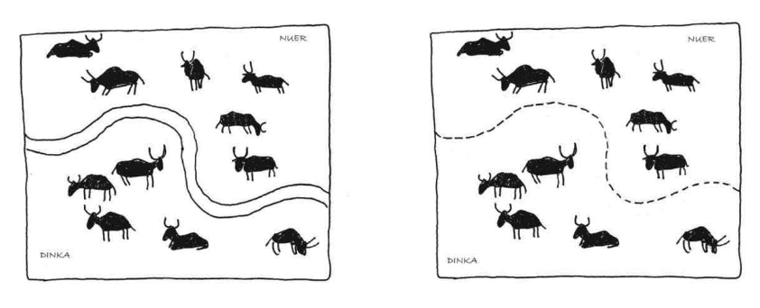

::: {.epigraph}
Социальная наука будущего может быть настолько же онтологически удивительной, как физика 20-го века

Дон Росс
:::

<!--Future social science may be as ontologically surprising as twentieth-century physics was-->

<!--Don Ross-->

<!--::: {.epigraph}-->
<!--Тот, кто понимает бабуина, сделает в метафизике больше, чем Локк-->
<!---->
<!--Чарльз Дарвин-->
<!--:::-->
<!--He who understands baboon would do more towards metaphysics than Locke-->

<!--Charles Darwin-->

<!--# Введение-->
<!---->
# Актуальность исследования

Цель диссертации: натуралистическое объяснение возникновения принудительной силы эпистемических конструкций (правил) в онтологии институтов.

***

Социальные институты — деньги, собственность, брак и другие —  обладают принудительной силой из-за наших представлений о них. Коллективное представление «эта бумага — деньги» не описывает мир, но активно его формирует, наделяя бумагу причинной силой и способностью к ценностному обмену, а математическая модель оценки опционов, распространяясь среди трейдеров, становится для них руководством к действию, и реальные цены опционов начинают соответствовать предсказаниями модели [@mackenzie2006].

<!--A viable ontology is both a product and a project of any science. It is a foil for future research and an ultimate goal of knowing "what there is". Conjectures about the nature of objects of study influence the ways of approaching them: if the social world, for example, is comprised of individuals, you will probably study individuals, their properties and relationships between them. Philosophy and history of science have seen cases when mistaken ontology led to scientific mistakes[^1]. In social science, the issue of ontology is even more complicated due to its multi-paradigm nature and lack of shared foundations: diverse objects of study, methods and explanatory strategies[^2].-->

<!--Having a set of core concepts and a unifying principle like mechanics in physics and evolution by natural selection in biology would propel social science to higher explanatory and predictive power. Although some scholars argue that multi-paradigm nature of social science is a "feature" and not a "bug" as social reality is intrinsically complex and highly contextual [@little2016], it still impedes cumulative growth of knowledge [@genov2019]. As Porpora notes, in terms of Kuhn [-@kuhn2009], sociology is not a mature science, but a pre-science [@porpora2015]. And, as Kuhn suggested, an appropriate activity in such a state is continuing the search for a discipline-wide consensus.-->

<!--Along with sociologists, philosophers of social science have been offering definitions of the scope and objects of sociology and broader social science, devising analytical truths about the social domain. Some of them claim that *analytic* social ontology based on conceptual analysis is prior to social scientific methodology [@searle1995; @epstein2016; @lauer2019]. Others criticize this approach as detached from actual science and not "naturalistic" [@elder-vass2007; @sarkia2023; @kincaid2024; @ross2023; @little2020]. Their focus is meta-ontological rather than ontological as they wonder what it means to ask questions about ontology of social science and what are the ways to arrive at an ontology instead of proposing or criticizing particular ontological pictures.-->

Подобные «онтологические эффекты» — способность эпистемических конструкций людей оказывать причинное и принуждающее воздействие на их поведение — одна из центральных и наиболее сложных проблем социальной онтологии. Внутри философии социальной науки это проблема отношения конструктивизма и реализма — вопроса о том, существуют ли социальные сущности объективно и отдельно от сознаний людей или же полностью зависят от последних [@hacking1999; @guala2016a]. А проблема конструктивизма/реализма — частный случай проблемы соотношения реализма и антиреализма в философии науки — вопроса о том, существуют ли ненаблюдаемые сущности вроде квантовых полей, генов и атомов объективно, или же служат удобными фикциями [@okasha2002].

Джон Сёрл [@searle1995] одним из первых сформулировал проблему онтологического статуса социальных фактов и институтов: как можно быть эпистемологически объективным касательно онтологически субъективных вещей? Сёрл показал, что социальные (или, как он их называет, институциональные) факты создаются *конститутивными правилами* вида «X считается Y в контексте C». Эти правила зависят от коллективного признания (collective acceptance) и имеют принудительную силу[^durkheim]. Коллективное признание зависит от коллективной интенциональности (we-intentionality) — постулируемой Сёрлом когнитивной способности индивидов иметь сонаправленность мысли.

[^durkheim]: Однако эта принудительная сила не является надындивидуальной, как у Дюркгейма [@durkheim2014], определившего социальные факты как способы действия, мышления и чувствования, обладающие принудительной силой. Для Сёрла нет надындивидуальной социальной реальности за пределами коллективного признания.

Принудительная сила и каузальность конститутивных правил исходят из их «деонтических сил» — создаваемых конститутивными правилами прав, обязанностей, полномочий, разрешений, требований и запретов. Например, факт «Этот человек — судья» наделяет его деонтической силой: правом выносить приговор, обязанностью соблюдать процедуру, полномочиями требовать показания. Эти полномочия имеют причинную силу, потому что *мотивируют поведение*. Люди признают эти полномочия и действуют в соответствии с ними, а также требуют их признания от других. Сёрл подчеркивает, что деонтические силы создают мотивы для действия, которые не зависят от личных желаний. Люди платят налоги не потому, что сами хотят, а потому, что есть обязанность их платить, вытекающая из *статуса* гражданина/налогоплательщика. Каузальная сила конститутивного правила — это способность *статусной функции* (Y), присвоенной объекту (X) коллективным признанием людей, мотивировать их поведение через систему деонтических сил.

Однако теория Сёрла часто подевргалась критике: из-за недостаточности деонтических сил для объяснения следования правилам [@guala2015],  отсутствия механизма возникновения конститутивных правил и каузальности деонтических сил [#insertSource], переоценки роли рационального коллективного признания и «сверхинтеллектуализма» [@gilbert1992] и других. Помимо критики внутри философии и социальной онтологии, теория Сёрла подвергалась критике в философии социальной науки — особенно за постулирование примата социальной онтологии над методологией изучения социальной реальности [@lauer2019; @little2020; @kincaid2021; @ross2023]. Философ Дон Росс различил аналитическую и научную (натуралистическую) социальную онтологию и показал, что только последняя может 

Будучи зависящей от понятия коллективных представлений и коллективной интенциональности, теория Сёрла не объясняет их строение и возникновение. Подобную натурализацию его проекта продолжают философы, близкие к эволюционной теории [@tomasello2014; @gallotti2012; @gallotti2013] и теории «совместного действия» (joint action) в когнитивной науке [@paternotte2020; @vesper2017; @sebanz2021; @torok2019]. Одна из основных проблем в этом поле — вопрос производности совместной интенциональности от индивидуальной (I-mode vs. we-mode).

<!--- Конститутивные правила — источник каузальности (это правда так?). Его не волнует как возникли конститутивные правила.-->
<!--- https://chat.deepseek.com/a/chat/s/20e16098-e2c1-44df-8d21-bb53ef5b85ae-->
<!--- Теория серля не описывает строение коллективных предствалений — если это все представления. -->
<!--- вставить содержательную критику, но метод.критику можно оставить-->

Несмотря на большое влияние в социальной онтологии и за её пределами, теория Сёрла — не единственная, что объясняет принудительную силу институтов. Теория игр и её применение к изучению социальных конвенций — настолько же влиятельный подход к объяснению. 

<!--- вставить описание из гуалы 2007 и 2015-->
<!--- есть второй подход — про конвенции. посмотреть Гуалу как он называет равновесные концепции. Такой же абзац-->
<!--- у льюиса есть схема, которая описывает конвенцию-->

<!--- Нужно ответить на критику Серлом Гуалы + подчеркнуть роль равновесия-->
<!--- институты — это система сигналов относительно правил которая формирует убеждения в равновесиях. Мало инструментов теории игр — нужны эпистемические конструкции.-->

<!--Гинтис не написал то же самое?-->
<!--Это конвенция о конвенции. Не просто охота на оленя, а общее знание, что равновесие с оленем — единственно правильное.-->

<!--- добавить про дельта параметры — это санкции. Институты это не просто правила в равновесии, это система убеждений относительно этих правил. -->
<!--- гуалу надо дополнить — это правила с механизмами исполнения, находящиеся в рановесиями. Механизмы исполнения правил зашиты в структуру игры. -->
<!--- дельта такова, что стратегии находятся в равновесии — это механизм про который говорит вандершрааф. Необязательно выносить механизм стабилизации за пределы равновесной концепции.-->

<!--- есть неопределенность относительно дельта-параметров. Нет представления, как будет выглядеть санкция. Равновесие будет там, где есть разделяемое убеждение что дельта параметр именно такой. -->

Франческо Гуала [@guala2016a], синтезурует Льюиса и Серля в теорию правил-в-равновесии (rules-in-equilibria, ПвР). Она описывает социальные институты как равновесные состояния,  коррелируемые[^corr] регулятивными правилами вида «если X, делай Y». Например, правило «зелёный свет — иди, красный — стой» коррелирует выбор стратегий между пешеходами и автомобилистами, у каждого из которых есть две условных стратегии — «если красный — стой» и «если зелёный — двигайся». В теории Гуалы, конститутивные правила эпифеноменальны по отношению к регулятивным: между ними нет онтологической разницы, и последние можно описать как первые с помощью простой трансформацией: к паттернам поведения, описываемым регулятивными правилами, добавляется институциональный термин, например, «дорожное движение» [@hindriks2005; @guala2015]. 

Так теория ПвР связывает онтологию Сёрла с научными подходами из теории игр без метафизических конструктов вроде конститутивных правил и коллективной интенциональности.

<!--- почему для гуалы важно атаковать различение конститутив и регулятив правил-->
<!--- что гуала берет от серля? почему правила в ПвР это правила серля-->

[^corr]: Коррелированное равновесие — концепция решения из теории игр, обобщающая равновесие Нэша, когда все игроки получают личный сигнал от третьей стороны, и в их интересах следовать этому сигналу [@aumann1987]. Ярким примером является светофор. Гуала и другие учёные утверждают, что социальные нормы и правила являются такими корреляционными механизмами, подобными светофорам.

Однако теории Гуалы объясняет только стабильность социальных фактов, а не их возникновение. Мотивируя ПвР, Гуала исходит из недостаточности обоих подходов по отдельности — социальных фактов как правил [@searle1995] и социальных фактов как равновесий в стратегических играх [@aoki2007; @north1990]: первые могут не обладать каузальной силой, а вторые не схватывают специфически человеческих форм координации, поскольку применимы и к животным.

Логичным становится вопрос — если координация людей и животных описывается схожими формальными моделями, откуда и почему возникают *правила*, стабилизирующие эти равновесия у людей?

<!--Ключевой пробел в исследовательской программе Сёрла-Гуала заключается в отсутствии объяснения эволюционного механизма перехода от несоциальных координационных паттернов к социальным фактам с их уникальной онтологией — каузальной и нормативной силой, проистекающей из «коллективного принятия». Это логическое продолжение натуралистической программы Гуалы.-->

Ключ к решению этой проблемы лежит в анализе эволюции *устройств корреляции* — того, с помощью чего агенты в стратегическом взаимодействии координируют свои действия. Чтобы прояснить, рассмотрим два примера.

Два самца бабочки разрешают конфликт за территорию, координируя поведение на простом физическом сигнале — «кто первым занял место» [@davies1978]. Их стратегия *условна* (conditional) и зависит от наблюдаемых признаков среды — наличия или отсутствия оппонента на территории. У каждой бабочки есть две стратегии поведения: 

- если я хозяин — борюсь насмерть
- если я захватчик, проявлю агрессию, но если не сработает, отступлю.

Теперь взглянем на людей. Два человеческих племени, разделённые высохшим руслом реки, продолжают соблюдать границу, которая стала абстрактной [@guala2015]. 

Их стратегия также условна, но зависит уже не от физического маркера — высохшего русла реки, а от разделяемого *правила* — «Если земля находится к югу (или к северу — для другого племени) от русла реки, пасти скот». Хотя эта стратегия связана с высохшим руслом, в ней это русло важно не само по себе, а как *средство кодирования информации*. Высохшее русло поддерживает (scaffolds) более глубокую эпистемическую структуру, основанную на общем знании (или общей причине полагать) [@lewis1969] о том, что это высохшее русло *означает*. Агенты координируют действия на разделяемом убеждении, а не на физическом маркере. Это устройство корреляции, *абстрагированное* от физического маркера с помощью *когнитивной репрезентации* разделяемого правила.

Люди, в отличие от бабочек, могут выбирать, на чем координировать свои действия [@guala2015]. Это делает *природу* этих равновесных состояний разной, однако Гуала не объясняет причину этой разницы.

С точки зрения *теории игр* эти ситуации идентичны. Для их описания подходит одна и та же матрица выигрышей. 

<!-- doc-представление -->
<!-- Таблица: Матрица выигрышей для игры на координацию действий животных и людей -->
<!---->
<!-- | | $Бой$ | $Отступление$ | $Условный$ | -->
<!-- |-------------|------------|-------------|---------------------| -->
<!-- | $$Бой$$ | $(0,0)$ | $(2,1)$ | $(1,0,5)$ | -->
<!-- | $$Отступление$$ | $(1,2)$ | $(1,1)$ | $(1,1,5)$ | -->
<!-- | $$Условное$$ | $(0,5,1)$ | $(1,5,1)$ | $(1,5,1,5)$ | -->

<!-- web-representation -->

$$
\begin{array}{|c|c|c|c|}
\hline
& Бой & Отступление & Условный \\
\hline
Бой & 0,0 & 2,1 & 1,0.5 \\
\hline
Отступление & 1,2 & 1,1 & 1,1.5 \\
\hline
Условный & 0.5,1 & 1.5,1 & \textcolor{red}{1.5,1.5} \\
\hline
\end{array}
$$
<figcaption class="caption">Когда оба агента выбирают условную стратегию, каждый получает равный выигрыш. Этот профиль *эволюционно стабилен*: он оптимален при повторении этой ситуации много раз.</figcaption>

Онтологически между ними принципиальная разница: в первом случае координация следует за физической асимметрией среды (кто первым занял место), во втором — за эпистемической структурой разделяемого правила (чья территория, и как высохшее русло дает это понять).

Идентичные матрицы не схватывают разницу в моделях Гуалы и не отвечают на вопрос — если у животных уже есть стабильные равновесия, как и зачем возникают *правила*? А главное — в чём эволюционное преимущество правил как коррелирующих устройств, если они не влияют на равновесие?

Как пишет Брайан Скирмс, позитивная корреляция стратегий с самими собой — как в обоих примерах с условной стратегией выше — способствуют развитию кооперации и эффективности: «эволюционная динамика реализует дарвиновскую версию категорического императива Канта: поступай так, чтобы если другие ведут себя так же, приспособленность к среде была максимальной» [@skyrms2014, 62].

Однако это по-прежнему не объясняет возникновение институциональных фактов из физических: почему в обоих случая есть равновесия, но их онтология разная? Как *эволюционно* могли возникнуть *правила*-в-равновесии, если равновесия уже существуют в координации животных? 

В данной работе мы утверждаем, что эта разница преодолевается через анализ того, что теоретико-игровые модели принимают как данность и не учитывают в своих моделях — *устройств корреляции*. Это то, с помощью чего агенты координируют свои стратегии поведения — кто первым занял место в примере бабочек и территориальное правило в примере про племена.

Инструменты теории игр агностичны к природе устройства корреляции — они просто предполагают, что они есть [@vanderschraaf1995]. Однако если рассмотреть формулы теории игр не инструментально, — агностично к их референтам в мире —  а онтологически — как имеющие референты в мире, мы увидим разрыв именно в *природе* устройств корреляции.

В данной работе мы утверждаем, что этот разрыв можно преодолеть с помощью *экологического механизма когнитивной эволюции*. 

Если равновесные состояния отражают реальные состояния мира — состояния популяций животных и людей и их физических сред, то устройства корреляции — это реальные объекты. Проблема теперь заключается в том, как устройства корреляции стали абстрактными, перейдя от физических свойств среды вроде «размера оппонента» или «очередности» к эпистемическим конструкциям — разделяемым правилам с нормативной и каузальной силой. Оба типа устройств корреляции реальны и обладают каузальной силой. Однако один из них — физический, а второй — эпистемический. И эволюционный переход между ними возможен благодаря экологической динамике.

<!--Основной вклад диссертации заключается в демонстрации того, как экологическая динамика взаимодействий создает эволюционное давление, которое приводит к возникновению эпистемических условных стратегий из реактивных, тем самым объясняя генезис социальных фактов из несоциальных.**-->

<!---->
<!--Гуала говорит, что правил и равновесий недостаточно по отдельности, поэтому их нужно соединить. Однако его теория не объясняет нормативность и принудительную силу правил. У Серла правила имеют деонтологию, Хиндрикс пытается сохранить эту интуицию и вводит нормативное убеждение как источник принудительной силы социальной практики. Об этом также пишет Вандершрааф — что у Гуалы нет механизмов самокорректировки равновесий. -->
<!--Я говорю — с этим можно разобраться, если вернуться к аргументу Гуалы о недостаточности равновесий для объяснения стабильности институтов и «вывести» правильную онтологию с помощью натуралистической эпистемологии. -->
<!--И у животных, и у людей есть конвенция — как в игре ястреб-голубь-буржуа у Гуалы. Однако у животных она функциональна и ненормативна (норма как разделяемое убеждение не мотивирует выбор стратегии), а у людей — произвольна и нормативна (может быть любой и мотивируется разделяемым убеждением). -->
<!--Норма, мотивирующая выбор стратегии, это конвенция второго порядка — где верхняя конвенция посылает корректирующий сигнал при поломке нижней конвенции. Читер-детекшн во многих биологических видах это подтвеждает. У людей это может быть конвенция «стой на красный, иди на зеленый», а есть конвенция «штраф, если пошел на красный». Но проблема в том, что тогда неясно, как возник штраф.-->
<!--Равновесие в институте обеспечивается иерархией контроля — конвенцией, регулирующей исполнение базовой конвенции (а Гуала говорит о базовых конвенциях). -->
<!--  - как это выразить на языке Хармса?-->
<!--И мы можем соединить два уровня конвенций в игре — базовая игра + дельта-параметры.-->

Переход от простых сигналов среды вроде «уже занятого места» к репрезентируемым правилам представляет собой коэволюционный процесс, в котором материальные артефакты *кодируют* информацию и выступают когнитивными опорами (scaffolds), а возникающие правила приобретают каузальную силу через свою адаптивную *функцию* в среде — координировать действия для достижения целей выживания [@harms2004; @millikan1984]. Социальное конструирование и правила в ПвР возникают как постепенное усложнение корреляционных механизмов под давлением дарвиновского отбора, а их реальность оказывается производной от их стабильной каузальной роли в системе «агент-среда».

Как мы будем утверждать вслед за Кимом Стерельны [@sterelny2003] и Питером Годфри-Смитом [@planer-godfrey2021; @godfrey-smith1996], растущая информационная сложность среды эволюционно создавала давление отбора на агентов, вынуждая их развивать когнитивные способности для представления более абстрактных характеристик среды, поскольку это влияло на их способность к успешному решению проблем координации, от которого во многом зависело выживание.  С помощью таких абстрактных репрезентаций и давления, создаваемого ими, появлялись новые способы координации, которые и привели к появлению объективности и обязательности социальных фактов. 

Данная работа занимает сторону *научной социальной онтологии* [@ross2023], которая исходит не из априорных концептов, а из логики вывода к наилучшему объяснению (IBE) [@guala2016]. Онтология служит не предпосылкой, как в аналитическом подходе, а результатом исследования, выводясь из теорий, которые наилучшим образом объясняют наблюдаемые феномены.

Мы предлагаем *механистический* взгляд на возникновение каузальности социальных фактов из простых стратегических взаимодействий животных с их средой:

1. Агенты без способности к репрезентации взаимодействуют друг с другом в популяциях и координируют поведение на физических маркерах вроде «размер оппонента»
2. Со временем взаимодействие агентов оставляют следы в окружающей среде
3. Следы создают новую информационную структуру среды, которая делает существующие способы координации неэффективными
4. Возникает эволюционное давление на когнитивное усложнение агентов для распознавания новых сигналов как устройств корреляции
4. Благодаря рекурсивной динамике, агенты постепенно развивают способность ко всё более абстрактному представлению следов среды, что в итоге позволяет им координировать поведение на основе разделяемых представлений.

Мы покажем, как этот экологический механизм завершает картину, предложенную Сёрлом и Гуалой: Сёрл описал онтологию социальных фактов, Гуала — их натуралистическую структуру, а настоящая работа объясняет их естественное возникновение из несоциальных взаимодействий.

{width="60%"}

*Теоретически* результаты могут быть интересны исследователям в области философии науки, социальной онтологии, когнитивной науки и теории эволюции. Результаты исследования также могут быть использованы в качестве материалов для курсов по философии социальных наук и социальной онтологии.

<!--*На практике* полученные знания могут быть использованы для проектирования социальных институтов путём учета их эмерджентной когнитивной динамики — «импорт» институтов возможен только при наличии соответствующей когнитивно-материальной инфраструктуры. -->

# 🚧 Объект и предмет исследования

*Объект диссертационного исследования* — онтология социальных институтов.

*Предмет исследования* — разделяемые агентами репрезентации как источник принудительной (нормативной) силы социальных институтов.

<!--эволюционное возникновение стратегий поведения, опосредованных *убеждениями*, из более примитивных стратегий, основанных на реакциях на физические маркеры среды, в рамках теории правил-в-равновесии Франческо Гуалы и модели эволюционного возникновения социальных конвенций Брайана Скермса на примере игры «Ястреб-Голубь-Буржуа», матрицу которой мы приводили выше.-->

<!--*Объектом данного исследования* является теория Гуалы «правил равновесия», которая предлагает единую социальную онтологию, синтезирующую две влиятельные традиции в философии социальных институтов: подход «институты как правила» и подход «институты как равновесия» [@guala2015]. Эта теория концептуализирует социальные институты как наборы регулятивных правил, представляющих собой условные стратегии вида «если X, то Y», которые координируют поведение, создавая целостное взаимодействие в стратегических взаимодействиях. В отличие от более ранних моделей, которые рассматривали институты либо как простые соглашения, либо как конститутивные правила, концепция Гуалы подчёркивает каузальную роль целостного взаимодействия, поддерживаемого условными стратегиями агентов как «убеждениями». Этот подход особенно ценен, поскольку он предоставляет строгое и философски тонкое описание того, как социальный порядок может возникать и сохраняться, не предполагая идеализированную рациональность или коллективную интенциональность, как это делают многие современные социальные онтологии [@jankovic2018].-->

<!--Основываясь на собственной попытке Гуалы натуралистически обосновать свою теорию, эта диссертация серьёзно рассматривает вопрос о *натуралистических основах* его концепции. Более конкретно, в ней исследуется, как социальные институты, описанные теорией правил равновесия, могли развиться из животных конвенций в эволюционном и экологическом контексте. Хотя теория Гуалы в основном концептуальна и несколько формальна, она оставляет открытым эмпирический и механистический вопрос о том, как такие институты возникают в реальных популяциях агентов с ограниченными когнитивными способностями. Настоящее исследование направлено на восполнение этого пробела путём изучения эволюционной траектории от более простых форм коррелированной координации, наблюдаемых и моделируемых у животных, к сложным нормативным институтам, характерным для человеческих обществ. Это предполагает изучение того, могут ли КЭ, поддерживающие институты, быть основаны на процессах отбора, экологических ограничениях и когнитивной эволюции, и каким образом.-->

<!--*Предметом исследования* является*эволюционное возникновение эпистемических условных стратегий, опосредованных убеждениями*, из более примитивных, реактивных, неэпистемических условных стратегий в рамках теории правил равновесия Гуалы. В частности, их возникновение в рамках теоретико-игровой игры «Ястреб-Голубь-Буржуа», о которой я упоминал в начале. Реактивные условные стратегии – это стратегии, которые напрямую зависят от внешних сигналов, не задействуя внутренние представления или убеждения о намерениях или будущих действиях других людей. Например, бабочка обуславливает своё поведение непосредственным наличием сигнала или стимула, например, «есть ли кто-нибудь ещё в этом месте?». Это прямое восприятие сигнала, а не когнитивная репрезентативная обработка. Напротив, условные стратегии, опосредованные эпистемическими убеждениями, предполагают формирование агентами внутренних моделей или убеждений о поведении других, что позволяет им принимать более гибкие, опережающие и контекстно-зависимые ответы. Племена, пасущие скот, формируют свои стратегии в соответствии с общими убеждениями об имуществе друг друга, абстрагированными от непосредственно наблюдаемых границ.-->

<!--Этот переход от реактивных к эпистемическим стратегиям знаменует собой важный эволюционный шаг к тому, что можно назвать *протонормативностью*, которая представляет собой стадию, на которой условные стратегии агентов являются не просто реакциями на стимулы, а опосредованы деонтическими или протодеонтическими убеждениями о том, что следует делать в данном контексте. Эта протонормативность ещё не охватывает полностью развитые нормативные системы с явными механизмами санкционирования отклонений или обеспечения соблюдения, но представляет собой основополагающие когнитивные и поведенческие способности, которые делают такие системы возможными. Сосредоточившись на этом возникновении, диссертация способствует пониманию того, как когнитивная архитектура, лежащая в основе нормативного поведения, могла постепенно эволюционировать из более простых форм социальной координации.-->

# Степень разработанности проблемы

Наш проект носит междисциплинарный характер: он сочетает социальную онтологию, эволюционную теорию игр и философию биологии. Он направлен на то, чтобы внести вклад в натурализацию социальной нормативности, то есть объяснение нормативных феноменов как возникающих в результате естественных процессов без метафизических или интерпретационных представлений. Это согласуется с научно-реалистической перспективой, которая рассматривает социальные виды как реальные сущности, обладающие причинно-следственной связью, поддающиеся эмпирическому исследованию и индуктивному выводу [@boyd1999; @guala2016].

Диссертация отталкивается от классической теории Джона Сёрла и её переосмысления в теории правил-в-равновесии Франческо Гуалы, которая предлагает единую основу для понимания социальных институтов как «коррелированных равновесий» (КР), поддерживаемых условными стратегиями агентов [@guala2015]. Однако теория Гуалы, несмотря на свою концептуальную силу, во-первых, редуцирует конститутивные правила и социальную казуальность до понятия «социального института», а во-вторых не говорит, как равновесия и лежащие в их основе условные стратегии развиваются из простых форм координации, наблюдаемых у животных, в более сложные. Для устранения этого пробела необходимо объединить идеи эволюционной теории игр и философии биологии, касающиеся когнитивной эволюции, чтобы проследить эволюционное возникновение эпистемической агентности, опосредованной убеждениями.

<!--Главным вкладом этой диссертации является натуралистическое и эволюционное описание того, как люди приходят к представлению и соблюдению институциональных правил как предписаний, тем самым заполняя ключевой пробел в теории институтов Гуалы [@guala2016]. Его объяснение объединяет традиции «институтов как правил» [@searle1995] и «институтов как равновесий» [@north1990; @aoki2007], утверждая, что институты лучше всего понимать как правила, находящиеся в равновесии: они одновременно являются когнитивными устройствами (правилами), которые люди используют для представления и управления социальной жизнью, и устойчивыми моделями поведения (равновесиями), сохраняющимися благодаря взаимным ожиданиям и стимулам. Хотя этот подход элегантно соединяет философские и игровые перспективы, теория Гуалы оставляет малоизученными когнитивные и эволюционные механизмы, посредством которых агенты приходят к *интернализации равновесий как правил*, и то, как предписывающая сила правил возникает из простых поведенческих закономерностей.-->

Настоящая диссертация развивает проект Гуалы, явно моделируя эволюционный путь от координации на основе простых физических сигналов к возникновению несвязанных, подобных убеждениям представлений правил, в соответствии с которыми действуют агенты. Опираясь на теорию игр [@skyrms1994; @skyrms2010] и философию биологии [@sterelny2003; @sterelny2012Book; @godfrey-smith2002; @sterelny2021; @planer-godfrey2021; @seitz2020] в диссертации показано, как агенты эволюционируют, чтобы выводить скрытую структуру своей среды, вырабатывать *расцепленные (decoupled) репрезентации* и, в конечном итоге, координировать действия на основе общих нормативных правил. Этот подход подтверждает утверждение Гуалы о том, что правила являются когнитивными представлениями о равновесии, но, демонстрирует, *как такие представления могут развиваться из ненормативных источников*, а не предполагаться или навязываться внешними корреляционными механизмами.

Кроме того диссертация отвечает на критику теории Гуалы о том, что она чрезмерно экстерналистская [@roversi2021] или недостаточно учитывает материальную и психологическую реальность институтов [@rabinowicz2018]. 

Начиная с основополагающих моделей координации Дэвида Льюиса [@lewis1969], Брайана Скирмса [@skyrms1994; @skyrms2010] и других, и расширяя исследование теоретико-игровой социальной онтологии Гуалы, анализ приводит к проведению принципиального различия между *онтической корреляцией стратегий* — когда физические маркеры среды становятся источником сигнала, и *эпистемической корреляцией* — когнитивными процессами, основанными на представлениях, которые позволяют агентам интерпретировать социальные сигналы и реагировать на них. Формально это одно и то же, поскольку агенты по-прежнему используют стабильные и оптимальные условные стратегии, но «скрыто» то, что представляет собой природа механизма корреляции, сигнализирующего каждому игроку о предпочтительной стратегии.

Наш проект решает три задачи:

1. В области натуралистической социальной онтологии мы показываем возможное решение проблемы конститутивных правил, описанной Джоном Сёрлом — как можно быть эпистемологически объективным по поводу онтологически субъективных вещей вроде социальных фактов [@searle1995]. Эту же проблему решает Франческо Гуала в своей теории правил-в-равновесии (rules-in-equilibria, RiE) [@guala2016a]. Однако, как мы покажем, он смешивает представления об агентности из классической и эволюционной теории игр. Наше решение показывает, что конститутивные правила вида «X считается Y в контексте C» — это не просто лингвистически трансформированные регулятивные правила вида «Если видишь X, делай Y» [@hindriks2005], а результат *кодирования* информации из окружающей среды (как протоптанная тропинка, которую мы упоминали выше). Мы показываем возможный эволюционный механизм преобразования регулярностей поведения в нормативно-нагруженные правила, обладающие принудительной силой.

2. В социальной онтологии мы предлагаем механистический подход, которые укрепляет социальные институты как *естественные виды* [^natural-kinds]. Существующие исследования, моделирующие эволюцию социальных институтов [@skyrms2003; @skyrms2014; @bowles2003; @guala2016a], не включают *когнитивный реализм* — адекватные реальности механизмы когнитивной эволюции как предпосылки возникновения социальной каузальности и социальных институтов — масштабируемых нормативно-ориентированных практик [@aoki2007; @aoki2011; @hindriks2015a]. Мы подробно обсуждаем и моделируем *когнитивную* эволюцию социальных институтов и показываем, как возможны онтологические эффекты от взаимодействия когнитивных способностей агентов с их средой.

3. В философии социальных наук мы предлагаем *онтологические ограничения социологической теории*,способствующие аналитическим базовым концепциям, независимым от эпистемологической оптики.

[^natural-kinds]: Это «гомеостатические кластеры свойств» [@boyd1991], которые поддерживают индуктивное обобщение и научный вывод.

Главный исследовательский вопрос текущей диссертации — *как когнитивная архитектура, лежащая в основе нормативного поведения, требующая сложных репрезентативных способностей, могла развиться из более простых репрезентативных систем и форм социальной координации*?

<!--Понятие *социальной конвенции* играет важную роль в данной диссертации и понимается в соответствии с традицией Дэвида Юма и Дэвида Льюиса как модель поведения, возникающая внутри популяции в результате многократного взаимодействия, способствующая координации и снижающая неопределённость. *Нормативность* относится к предписывающей силе, которую такие конвенции могут приобретать со временем, часто сопровождаясь ожиданиями, санкциями или моральным оправданием. Различие между ними не всегда очевидно, и одна из целей данной диссертации — прояснить механизмы, посредством которых конвенции становятся нормативными.-->

# 🚧 Цели и задачи исследования

Главная *цель* данной диссертации — дать *натуралистическое объяснение возникновения принудительной силы социальных фактов*. Эта цель обусловлена признанием того, что существующие теории либо предполагают развитые когнитивные способности вроде коллективной интенциональности [@searle1995; @bratman2022; @gallotti2012], либо трактуют нормы как социальные конструкты *ex nihilo*.

<!--В отличие от теорий, где наказание или принуждение рассматриваются как центральные элементы нормативности, данная диссертация фокусируется на *возникновении когнитивных и поведенческих субстратов*, делающих такие системы возможными. Тем самым она закладывает основу для будущих исследований того, как прото-нормативность может развиться в полноценную нормативность с механизмами социального принуждения, понимаемыми в натуралистическом смысле.-->

Более конкретно, исследование направлено на:

- Тщательное изучение взаимосвязи между социальными конвенциями и нормативностью для более чёткого определения различий в теории Гуалы.

- Проанализировать теорию Гуалы с эпистемологической точки зрения, чтобы выявить противоречия, скрывающие вопрос о различных когнитивных архитектурах внутри его теории.

- Описать различные когнитивные архитектуры, предполагаемые теорией Гуалы, и прояснить возможные эволюционные пути их соединения.

<!--- Продемонстрировать с помощью агентного моделирования, как эпистемическая корреляция может возникать из экологических взаимодействий и селективного давления, благоприятствующего более сложным репрезентативным возможностям.-->

- Прояснить концептуальную связь между механизмами реактивной координации и эпистемическими стратегиями, опосредованными убеждениями.

- Поместить эти результаты в рамки теории правил равновесия Гуалы, тем самым обеспечив натуралистическую основу для описываемых ею институтов.

- Связать результаты с дискуссиями о метафизике социальных видов и философии социальных наук.

# Теоретическая основа исследования

Данная диссертация опирается на междисциплинарную теоретическую базу, охватывающую социальную онтологию, философию науки, эволюционную биологию и когнитивную науку. Ключевые компоненты включают в себя:

- *Теория правил равновесия Гуалы:* Концепция Гуалы предлагает философски обоснованное описание социальных институтов как целостного мира (CE), поддерживаемого условными стратегиями агентов [@guala2015]. Интегрируя нормативные и каузальные аспекты институтов, эта теория стремится создать лаконичную натуралистическую онтологию социального порядка, которая избегает принятия метафизически нагруженных конститутивных правил или коллективной интенциональности за примитивы. Настоящее исследование опирается на эту базу, исследуя эволюционное происхождение условных стратегий, поддерживающих это равновесие.

- *Эволюционная теория игр:* Формальное моделирование стратегических взаимодействий и их эволюции во времени является центральным элементом данного исследования. Основополагающие работы @lewis1969, @maynardsmith1982, @skyrms2010 и @gintis2009 продемонстрировали, как сотрудничество и

Координация может возникать в ходе эволюционных процессов. Данная диссертация развивает эти идеи, уделяя особое внимание эволюции эпистемических, опосредованных убеждениями стратегий от реактивных, используя когнитивную энтропию в качестве аналитического инструмента.

- *Философия биологии*: Понимание эволюции внутренних представлений и систем убеждений критически важно для различения реактивных и эпистемических стратегий. Стерелни [-@sterelny2003; -@sterelny2012Book; -@sterelny2021] подчеркнул роль *несвязанного представления* в когнитивной эволюции человека. Телеосемантическая теория Милликена [@millikan1984] предлагает натуралистическое описание ментального представления, основанного на биологической функции, что служит основой для теории Стерелни. Другим важным источником является *Тезис о сложности окружающей среды* Годфри-Смита [@godfrey-smith1996; @godfrey-smith2001], где утверждается, что сама функция познания заключается в навигации в информационно насыщенной среде и создании адаптивного покоя, повышающего собственную приспособленность. Эти перспективы формируют концептуализацию эпистемических обусловленных стратегий как опосредованных убеждениями в данной диссертации.

- *Социальная онтология и философия социальных наук:* Метафизические и нормативные последствия рассмотрения социальных конвенций как естественных понятий отражены в работах Бойда [-@boyd1999], Сёрла [-@searle1995] и современных дискуссиях о натурализации нормативности. Обобщённая теория Гуалы служит отправной точкой для определения текущего исследования в контексте текущих философских дискуссий, выступая в качестве «центрального узла» и синтезируя основные результаты, полученные в рамках различных разделов философии науки.

Ранняя основополагающая работа Льюиса [-@lewis1969] представила теоретико-игровую формализацию социальных соглашений как стабильных взаимовыгодных поведенческих моделей, подчеркивая, как координационное равновесие возникает в результате повторяющихся взаимодействий. Скирмс расширил эту концепцию, включив эволюционную динамику, продемонстрировав, как популяции агентов могут вырабатывать стабильные соглашения посредством процессов отбора, приводящих к выгодным соглашениям о социальных контрактах [@skyrms2003; @skyrms2014; @skyrms2014a @skyrms2010]. Эти модели успешно объясняют возникновение координации, но часто подвергаются критике за исключение нормативности конвенций из области их объяснения и опору на когнитивно неправдоподобных агентов с идеализированными предположениями о рациональности [@sterelny2012a; @gilbert1992; @hedoin2021]. 

Теория Гуалы «правил в равновесии» [@guala2015] представляет собой значительный прогресс, интегрируя нормативные и каузальные аспекты социальных конвенций с классической социальной онтологией Сёрла [@searle1995]. Как уже упоминалось, предлагая мощную интергартивную модель социальной онтологии, теория Гуалы не объясняет эволюционные и когнитивные механизмы возникновения условных стратегий. Этот пробел побудил последующие исследования, изучающие натуралистические основы социальных институтов [@hedoin2021]. Мы подробно проанализируем теорию Гуалы в главе 2, обращая внимание на проблемы смешения моделей агентства, подразумеваемых в его аргументах, и смешения понятий репрезентации, которые он использует для разграничения социальной координации животных и человека.

Параллельные разработки в когнитивной науке и философии биологии подчеркнули важность эпистемических способностей, таких как нескоординированное представление. Эти подходы подчёркивают, что протонормативность включает в себя не только поведенческую координацию, но и внутренние состояния – убеждения и намерения, – опосредующие социальное взаимодействие [@sterelny2021]. Тем не менее, эволюционный переход от реактивного, движимого стимулами поведения к эпистемическим, опосредованным убеждениями стратегиям остаётся недостаточно изученным. Мы рассмотрим теории когнитивной эволюции [@sterelny2003; @sterelny2012Book; @godfrey-smith1996; @millikan1987] и построения когнитивных ниш [@odling-smee2003; @bardone2007; @planer-godfrey2021] в главе 3, где рассмотрим их в связи с первой попыткой Гуала использовать аргументы Стерелни в пользу разобщённого представления для обоснования различий в координации у животных и человека [@hindriks2015]. 

<!--Мы разрабатываем собственную вычислительную модель когнитивной эволюции корреляции стратегий, опосредованных эпистемическими убеждениями, с формированием ниши.-->

# Методология исследования

Методология, использованная в данном исследовании, является междисциплинарной и сочетает:

1. *Сравнительный теоретический анализ:* существующие модели возникновения социальных норм, включая сигнальные игры Льюиса, эволюционные модели Скирмса и работы @ullmann-margalit1977, @young1998, @epstein1996, @bicchieri2005, @gintis2009a и теорию правил равновесия Гуалы [@guala2016], систематически сравниваются и критикуются. Этот сравнительный подход выявляет сильные стороны, ограничения и пробелы, которые стремится устранить настоящее исследование.

2. *Теоретико-игровое моделирование*: опираясь на основополагающие работы по эволюционной теории игр [@maynardsmith1982; @skyrms1994], в диссертации описывается формальная модель «Ястреб-Голубь-Буржуа», через призму которой анализируется проблема корреляции стратегий. Она позволяет обнаружить различение онтической и эпистемической корреляции и служит основанием для дальнейшего моделирования в будущих исследованиях.

<!--популяции агентов, использующих условные стратегии и «растущую» эпистемическую обусловленность в качестве адаптивного ответа на возрастающую информационную плотность окружающей среды. Эта модель исследует, как реактивные стратегии могут эволюционировать в стратегии, опосредованные убеждениями, под воздействием экологических факторов. Коррелированное равновесие, эволюционно устойчивые стратегии и игра «Ястреб-Голубь-Буржуа» служат аналитическими инструментами для понимания стабильности и причинно-следственной эффективности эмерджентных стратегий.-->

<!-- 4. *Агентное моделирование:* в дополнение к нашей аналитической модели, агентное моделирование используется для описания сложной динамики эволюции стратегий в популяции неэпистемических агентов, которые реагируют только на сигналы окружающей среды и «учатся на опыте» посредством своего рода *обучения с подкреплением*. Эти модели позволяют исследовать такие факторы, как информационная прозрачность среды, механизмы обучения и когнитивные ограничения, обеспечивая эмпирическое обоснование теоретических утверждений. -->

# ⏳ Новизна исследования

<!--Основная новизна  данной диссертации заключается в представлении *причинно-следственных механизмов эволюции корреляции*, которые лежат в основе структуры игры: агенты, их стратегии и выигрыши остаются неизменными на протяжении всей эволюции. Меняется *природа механизма корреляции*, на основе которого агенты координируют свои действия и следуют условным стратегиям.-->
<!---->
<!--Формально и животные, и люди используют некий «сигнал» или асимметрию окружающей среды, будь то «размер противника» для первых или светофор для вторых. Но в данной работе главное значение имеет базовая *эпистемология этих сигналов* в обоих случаях.-->

<!--Данная диссертация предлагает ряд новых вкладов в решение проблемы возникновения социальной каузальности и соотношения реализма и конструктивизма в социальной онтологии:-->
<!---->
<!--- *Динамический реализм*: вводится понятие динамического реализма — позиции в социальной онтологии, преодолевающей различение реализма и конструктивизма и объясняющей и возникновение, и стабильность социальных фактов — границ, денег и т.д. Основное положение — социальные факты возможны благодаря эволюционной когнитивно-материальной динамике, основанной на взаимодействии репрезентаций агента и его среды. Эта динамика объясняет их возникновение через эволюцию устройств корреляции (на чём координируют поведение агенты) и стабильность — через рассмотрение социальных фактов как изначально равновесных состояний.-->
<!---->
<!--- *Онтическая/эпистемическая корреляция:* введение инструмента объяснения эволюционного перехода от реактивных к опосредованным убеждениями стратегий является оригинальным. Это различие проясняет когнитивные и экологические механизмы, такие как конструирование ниши, лежащие в основе появления развитых когнитивных архитектур.-->
<!---->
<!--- *Механистический переход от онтической к эпистемической корреляции*: эпистемические условные стратегии могли естественным образом эволюционировать из более простых реактивных форм поведения с помощью механизма когнитивного конструирования ниши. Стратегия отбирается на основе нужды (функции), связана с манипулированием или реакцией на объект в среде, который создает когнитивную опору. Всё это вкупе с существующим когнитивным навыком создаёт давление отбора для следующей нужды (функции).-->
<!---->
<!--- *Переопределение социальных институтов в теории Франческо Гуалы*: теперь они не сводятся к правилам-в-равновесии, а представляют собой наборы равновесных состояний, возможные благодаря когнитивно-материальной инфраструктуре — объектам среды, которые кодируют информацию и служат когнитивными опорами для поддержания равновесия в стратегическом взаимодействии.-->
<!---->
<!--- *Поддержка институтов как естественных видов*: диссертация подтверждает тезис о том, что социальные институты являются независимыми от разума естественными видами, которые включают в себя эпистемический элемент, влияющий на их форму и функцию. Предлагая механистическую модель возникновения эпистемических корреляционных устройств из онтических, мы показываем, как институты могут быть основаны на естественных эволюционных процессах и в то же время иметь интерактивный компонент, зависящий от разума.-->
<!---->
<!--Подробные обзоры литературы в соответствующих главах подтверждают, что ни одна предшествующая работа не объединяла эти концептуальные, формальные и эмпирические элементы в едином исследовании эволюционного возникновения эпистемических условных стратегий, опосредованных убеждениями, в рамках натуралистической социальной онтологии.-->

# 🚧 Положения, выносимые на защиту

<!--Центральная *гипотеза* диссертации:-->
<!---->
> *Эпистемические условные стратегии, опосредованные убеждениями и зависящие от внутренних убеждений агентов о поведении других, могут эволюционировать из реактивных, неэпистемических условных стратегий, основанных на асимметрии окружающей среды, посредством механизма обратной связи между средой и когнитивными способностями агентов.Этот эволюционный переход обеспечивает натуралистическую основу для принудительной силы социальных фактов.*
<!---->
<!--Эта гипотеза включает в себя несколько взаимосвязанных утверждений:-->
<!---->
<!--1. *Реактивные условные стратегии*, которые реагируют непосредственно на сигналы окружающей среды, не задействуя внутренние представления, представляют собой эволюционные предшественники более сложных стратегий, опосредованных убеждениями. Такие реактивные стратегии широко распространены среди животных и составляют основу социальной координации.-->
<!---->
<!--2. Благодаря *повторяющимся взаимодействиям и селективному давлению*, способствующим успешной координации и сотрудничеству, агенты развивают *внутренние эпистемические состояния*, такие как убеждения или представления, которые опосредуют их условный выбор стратегии. Эти эпистемические состояния позволяют агентам предсказывать поведение других и гибко реагировать на него, а не просто реагировать на фиксированные сигналы.-->
<!---->
<!--3. Возникновение этих эпистемических стратегий порождает *протонормативные установки* относительно того, какие действия уместны или необходимы в данном социальном контексте. Эти протонормативные убеждения являются когнитивными предшественниками полноценных нормативных систем.-->
<!---->
<!--4. Весь процесс можно *смоделировать с помощью агентно-ориентированной симуляции*, что демонстрирует возможность возникновения механизмов эпистемической корреляции без использования более сложных когнитивных конструктов, таких как *коллективная интенциональность* или явные механизмы санкционирования.-->
<!---->
<!--5. Этот переход не просто концептуальный, но может быть *исследован вычислительно* с помощью агентного моделирования, которое фиксирует динамику когнитивной эволюции корреляционных устройств, представленных в виде экологических сигналов различных уровней абстракции.-->
<!---->
<!--Следующие тезисы суммируют основные положения данной диссертации и предлагаются для защиты:-->
<!---->
<!--1. Социальные институты, концептуализируемые теорией Гуалы «правил равновесия», могут быть основаны на эволюционных процессах, поддерживаемых когнитивным конструированием ниш, которые создают нормативно-коррелированное равновесие, поддерживаемое условными стратегиями эпистемических агентов.-->
<!--2. Различие онтической и эпистемической корреляции необходимо для объяснения эволюционного перехода от онтических к эпистемическим условным стратегиям в унифицированной социальной онтологии Гуалы.-->
<!--3. Агенты, способные к интеграции информации посредством функциональной абстракции, эволюционно более устойчивы, чем другие агенты.-->
<!--4. Социальные конвенции и протонормативные убеждения квалифицируются как естественные виды в рамках научной реалистической социальной онтологии.-->
<!--5. Натурализация социальной онтологии возможна без коллективной интенциональности или явных санкционирующих механизмов, а только благодаря экологической динамике: коэволюции когнитивных способностей к интеграции информации и изменению окружающей среды, вызванному агентами.-->
<!---->

# ⏳ Основное содержание работы

## Глава 1. Проблема принудительной силы институтов в социальной онтологии
В первой главе диссертации описывается проблема, — откуда исходит принудительная сила социальных институтов, а также рассматриваются её ключевые решения — традиция социальной онтологии Джона Сёрла и его последователей [@searle1995; @searle2010; @tuomela2013; @gilbert1992; @bratman2022], традиция теоретико-игрового анализа социальных конвенций Дэвида Льюиса [@lewis1969; @vanderschraaf1995; @gintis2009a], институциональной экономики [ @acemogly2005; @aoki2011; @aoki2007; @north1990], а также синтез этих традиций в унифицированной социальной онтологии правил-в-равновесии Франческо Гуалы [@guala2015; @guala2016a] и его критику [@searle2015; @rabinowicz2018; @hedoin2021; @Vanderschraaf_2017].

Результат первой главы — формулировка проблемы диссертации: способна ли синтетическая онтология Франческо Гуалы объяснить принудительную силу социальных институтов? И если нет, то как может быть устроена такая непротиворечивая синтетическая социальная онтология?

<<<<<<< Updated upstream
=======
***

Проблема принудительной силы социальных институтов — как возможен социальный порядок — одна из основных и наиболее сложных проблем в социальной онтологии, философии социальных наук и теоретической социологии.

The rule-based account conceives of social institutions as rules guiding and constraining behavior in social interaction or "humanly devised constraints" of social interactions [@north1990]. In sociology, the tradition of treating institutions as rules dates back to such classical figures as @weber1924 and @parsons2015, and it continues to thrive today. The equlibrium-based account sees institutions as behavioral regularities and, most importantly, solutions to coordination problems just like those studied in the previous chapter. The constitutive rules account sees institutions as systems assigning statuses and functions to physical entities like we saw earler in @searle1995.

***

>>>>>>> Stashed changes
### 1.1 Институты как правила: деонтическая сила из коллективной интенциональности 
<!--В параграфе 1.1 описывается теория конститутивных правил Джона Сёрла [@searle1995; @searle2010] и традиция, следующая из его идей.-->

#### 1.1.1 Теория конститутивных правил Джон Сёрла
В 1.1.1 описывается теория Сёрла, её основные компоненты и её объяснение принудительной силы институтов: различение конститутивных и регулятивных правил, понятия деонтической силы, коллективной интенциональности, фоновыж ожиданий.

<<<<<<< Updated upstream
<!--После описания основных подходов я выделяю ключевые различения для анализа проблемы — конститутивные и регулятивные правила, деонтические силы конститутивных правил [@searle1995], теоретико-игровые равновесия и их разновидности, функциональные/произвольные и нормативные/ненормативные конвенции [@oconnor2019] и провожу границу между понятиями института, социальной нормы и конвенции. После этого я рассматриваю лакуны теорий.-->
=======

Searle’s social ontology distinguishes two kinds of rules: *regulative* rules, which govern actions that can occur independently, and *constitutive* rules, which create new kinds of social reality [@searle1995; @searle2010]. In Searle’s formulation, constitutive rules take the schematic form:
$$
X \text{ counts as } Y \text{ in context } C
$$
where $X$ is a pre‐institutional entity or action, $Y$ is a *status function*, a social role or function assigned to $X$, and $C$ is the relevant context or domain [@searle1995]. For example, “putting the ball in the net ($X$) counts as scoring a goal ($Y$) in a game of football ($C$)” [@searle1995]. Such rules do not merely regulate pre‐existing behavior; they *create* new social facts. In Searle’s own words, “institutional facts only exist within systems of constitutive rules” [@searle1995].

- **Constitutive vs. Regulative.** A constitutive rule makes a novel institutional action possible, whereas a regulative rule simply prescribes behavior within an already existing framework [@searle1995]. Chess provides a classic example: the constitutive rules of chess *create* the possibility of the game, whereas a regulative rule would say, for instance, “if you touch a piece you must move it” [@searle1995].
- **Status Functions and Deontic Powers.** Under a rule $X$ counts as $Y$ in $C$, $Y$ is a *status function* attached to $X$, and carrying this status typically confers normative powers (rights, obligations, etc.) on the bearer. Thus if a community collectively accepts that certain actions or objects bear status $Y$, those actions have deontic powers. Searle often emphasizes that constitutive rules imply deontic powers: e.g. a wedding ring ($X$) gives someone the status of “married person” ($Y$), along with associated rights and duties. In Searle’s framework, linguistic declarations often play a role: he introduces the idea of a *Status Function Declaration*, a speech act that imposes or announces status functions as binding [@searle2010].

Searle identifies *institutions* with systems of constitutive rules. He writes that “an institution is any system of constitutive rules of the form $X$ counts as $Y$ in $C$” [@searle1995]. Thus, for Searle, political offices, legal entities, money, marriages, etc., exist because underlying constitutive rules assign new status functions to physical or social substrates. These rules are held in place by *collective acceptance* of the community. In Searle’s view, the syntax “$X$ counts as $Y$ in $C$” – often called the *counts-as* locution – succinctly captures the logic of institutional facts.

Searle’s theory posits that social reality is built upon constitutive rules that are *creatively* implemented: they not only *regulate* behavior but *generate* the very phenomena like institutions and roles they describe [@searle1995; @searle2010].

>>>>>>> Stashed changes

#### 1.1.2 ✅ Традиция Сёрла: «Стандартная модель» социальной онтологии
Описывается «Стандартная модель» социальной онтологии: её компоненты и представители, а также отношение этих теорий к проблеме источника принудительной силы социальных институтов. Рефлексивность, перформативность…

#### 1.1.3 Критика теории Сёрла
Слабая сторона теории Сёрла — недостаточное объяснение стабильности институциональных фактов: откуда возникает и почему соблюдается принудительная сила конститутивных правил. Для Сёрла ответ — в «фоновых» неосознаваемых когнитивных процессах.

<<<<<<< Updated upstream
=======

Hindriks [-@hindriks2005] has challenged several aspects of Searle’s constitutive-rule framework. His deconstruction focuses on the notions of *status functions* and the role of language. Broadly, Hindriks argued that Searle’s theoretical apparatus is misleading, and that a more streamlined account can be given by focusing on collective acceptance and normative powers.

- **Status Functions as Deontic Powers.** Hindriks finds the term *status function* confusing and somewhat redundant. He suggests dropping the “function” and simply treating statuses as normative powers. In his words, “we can do without the term function while retaining the term status,” instead explicating statuses directly as the bundle of deontic powers they grant [@hindriks2009]. By equating statuses with deontic powers (rights, obligations), Hindriks makes the normative dimension of institutions explicit, rather than hiding it under the metaphor of a “function” [@hindriks2009]. Indeed, Searle himself has acknowledged that “all status functions are deontic powers,” which supports Hindriks’s move toward a more direct terminology [@hindriks2009].

- **Redundancy of Status Function Declarations.** Searle’s idea of a *Status Function Declaration* – a speech act that supposedly creates or recognizes a status – is, for Hindriks, unnecessary. He argues that the two key claims Searle attributes to such declarations (that collective acceptance is necessary and sufficient for the status) are already implicit in the standard “counts-as” formulation. Once we accept that *institutional statuses require collective acceptance, and that collective acceptance alone brings them into being* (the “Collective Acceptance Principle”), the special notion of a Status Function Declaration adds nothing new [@hindriks2015]. Introducing declarations suggests without argument that only explicit speech acts can create institutions; Hindriks finds this unjustified and unhelpful. He concludes that Searle’s extra machinery (the Status Function Declaration with its “double direction of fit”) should be abandoned since it “does not add anything of value” [@hindriks2015].

- **Linguistic vs. Normative Distinction.** Hindriks also questions Searle’s emphasis on language as the source of all institutional power. In his earlier work, Hindriks has argued that the regulative/constitutive distinction is mainly a grammatical one: regulative rules are phrased with explicit imperatives or deontic terms, while constitutive rules are phrased with the “counts-as” locution, but both embed the same normative content [@hindriks2009]. Normative obligations figure explicitly in regulative rules (“Do X” / “If Y do X”), whereas constitutive rules imply those obligations without stating them overtly. Thus, the locus of normativity is not really different between the two; only the linguistic presentation is. Hindriks calls for a view of institutions that centers on *collective commitment* and acceptance of standards, rather than on linguistic declarations per se [@hindriks2009].

In sum, Hindriks dismantles Searle’s superstructure of status functions and declarations, proposing instead that we should “explicate statuses in terms of normative powers” and rely on a simpler collective-acceptance principle [@hindriks2009; @hindriks2015]. On this view, institutions are upheld by groups collectively endorsing certain rules, and the resulting normative powers of those rules are what really matters. His critique paves the way for unifying Searle’s approach with more analytical models, by translating constitutive claims into the language of regulative rules and equilibria.

>>>>>>> Stashed changes

### 1.2 Институты как равновесия в теории игр: устойчивость из рациональности агентов
Описывается теоретико-игровая традиция институтов как равновесий и базовые понятия теории игр, используемые в данном исследовании. 

#### 1.2.1 ✅ Понятия теории игр

Game theory is a mathematical framework used to analyze situations of strategic interaction between rational decision-makers. Originally developed by John von Neumann and Oskar Morgenstern in their seminal work *Theory of Games and Economic Behavior* [@morgenstern1944], game theory has since evolved to encompass a wide range of applications in economics, biology, political science, and sociology [@gintis2009; @osborne2004]. It provides the tools to study how individuals or groups make choices when their outcomes depend not only on their own decisions but also on the decisions of others. The fundamental building blocks of game theory are games, players, strategies, payoffs, and equilibria [@zamir2013].

A strategic game in game theory is defined as a formal model $G = (N, S, P)$ where:

- $N$ is a set of players
- $S = (S_1, S_2, \dots, S_n)$ is strategy sets of each player, where $S_i$ is the set of strategies available to player $i$
- $P = (P_1, P_2, \dots, P_n)$ specifies the payoff functions, where $P_i: S_1 \times S_2 \times \dots S_n \rightarrow \mathbb{R}$ gives the utility for player $i$ given the chosen strategy profile [@myerson1991].

A strategy $s_i \in S_i$ is a complete plan of action a player will follow in any situation they might face within the game. Payoffs represent the rewards or utilities that players receive based on the combination of strategies chosen by all involved.

One of the central concepts in game theory is equilibrium, where no player has an incentive to unilaterally change their strategy given the strategies of others. The most well-known equilibrium concept is the Nash equilibrium (NE), introduced by John Nash in the early 1950s [@nash1950]. A strategy profile $(s_1^*, s_2^*, \dots, s_n^*)$ forms a Nash equilibrium if for every player $i$, the following condition holds:

$$
P_i(s_i^*, s_{-i}^*) \geq P_i(s_i, s_{-i}^*) \quad \forall s_i \in S_i.
$$

Here,

- $P_i$ is a payoff function for player $i$
- $s_i^*$ is a strategy chosen by player $i$ at equilibrium
- $s_{-i}^*$ is a combination of strategies chosen by all other players except player $i$

The inequality states that player $i$ cannot increase their payoff by unilaterally changing their strategy from $s_i^*$ to any other available strategy $s_i$.

Shortly after Nash’s work, Robert Aumann introduced the concept of *correlated equilibrium* (CE) in 1974 [@aumann1974]. This generalization of Nash equilibrium allows players to coordinate their strategies through signals from a trusted mediator. Unlike Nash equilibrium, where players act independently, CE enables communication or correlation of strategies, capturing coordination through shared information. In a CE, a random signal suggests a strategy to each player, and players follow the recommendation if it is in their best interest to do so. Formally, a correlated equilibrium satisfies:

$$
\sum_{s'_{-i}} q(s_i, s'_{-i}) \cdot [P_i(s_i, s'_{-i}) - P_i(s'_i, s'_{-i})] \geq 0 \quad \forall s_i, s'_i.
$$

Here,

- $q(s_i, s'_{-i})$ represents the probability that the mediator recommends strategy $s_i$ to player $i$ and $s'_{-i}$ to the other players
- $P_i(s_i, s'_{-i})$ is the payoff to player $i$ when they play $s_i$ and the others play $s'_{-i}$

The inequality ensures that the expected payoff from following the recommendation is at least as great as from deviating.

As Roger Myerson has reportedly observed, 

> "If there is intelligent life on other planets, in a majority of them, they would have discovered correlated equilibrium before Nash equilibrium" [@solan1999]. 

CE can be a more natural concept than Nash equilibrium, as its mathematical simplicity and reliance on cooperation make it easier to discover. Myerson argued that humanity's prioritization of Nash equilibrium may have been an accident of history rather than a reflection of its fundamental importance. In societies or civilizations where cooperative behavior is emphasized or external mediators are prevalent, CE could emerge as a more intuitive starting point for understanding strategic interactions.

In the realm of evolutionary biology, John Maynard Smith introduced the concept of *evolutionarily stable strategy* (ESS) in 1973 [@maynard1973]. An ESS is a strategy $s^*$ that is robust against invasion by mutant strategies and satisfies the following condition:

$$
P(s^*, s^*) > P(s', s^*) \quad or \quad [P(s^*, s^*) = P(s', s^*) \quad and \quad P(s^*, s') > P(s', s')].
$$

Here,

- $P(s^*, s^*)$ is the payoff when both the incumbent and the invader use strategy $s^*$.
- $P(s', s^*)$ is the payoff when the invader uses strategy $s'$ while the incumbent sticks to $s^*$.

Beyond Nash, CE and ESS, game theory has explored other equilibrium concepts, including subgame perfect equilibrium, trembling hand perfect equilibrium, and proper equilibrium, among others. These refinements address limitations of the NE, particularly in dynamic and extensive-form games. We will only focus on CE and ESS in the current thesis. 

<!--Notable equilibrium refinements include:-->
<!---->
<!--- *Subgame Perfect Equilibrium*: introduced by Selten [-@selten1965], it ensures rational behavior at every stage of a dynamic game by requiring equilibrium strategies in every subgame. It refines NE by eliminating non-credible threats and is particularly relevant in sequential games.-->
<!---->
<!--- *Trembling Hand Perfect Equilibrium*: proposed also by Selten [@selten1975], it accounts for the possibility of small, unintended mistakes (or trembles) by requiring that strategies remain optimal even if there is a slight probability of error. This refinement helps to eliminate equilibria that are not robust to slight deviations.-->
<!---->
<!--- *Proper Equilibrium*: introduced by Myerson [-@myerson1978], this concept strengthens trembling hand equilibrium by further penalizing less likely mistakes. It ensures that less probable errors are assigned proportionally smaller probabilities, reinforcing stability.-->
<!---->
<!--- *Sequential Equilibrium*: developed by Kreps and Wilson [@kreps1982], this refinement addresses the problem of imperfect information by combining strategies with beliefs about what has happened earlier in the game. It is particularly useful in signaling games and dynamic strategic interactions.-->
<!---->
<!--- *Perfect Bayesian Equilibrium*: extending the Bayesian framework, it requires that players update their beliefs consistently using Bayes’ rule and choose optimal strategies given their beliefs. It is widely applied in games with incomplete information [@fudenberg1991].-->
<!---->
<!--These equilibrium refinements aim to ensure stability and plausibility in strategic settings by accounting for dynamic aspects, imperfect information, and potential errors.-->

Coordination and cooperation problems are fundamental challenges in social philosophy since Hobbes [-@hobbes2016], and game theory has been an indispensable tool for tackling these problems due to its clarity and rigor.

- *Coordination problems* arise when individuals or groups need to choose between multiple possible equilibria, creating ambiguity about which solution will be selected. These problems are central to strategic interaction because they reflect situations where all parties would benefit from making compatible choices but may struggle to agree on a single option. 

- *Cooperation problems*, on the other hand, highlight the conflict between individual rationality and collective benefit, where mutual cooperation yields a better outcome for all, but self-interest may lead to suboptimal results. Such challenges often require mechanisms to facilitate coordination or encourage cooperation, including social conventions or equilibrium selection techniques. Consequently, equilibrium concepts are fundamentally linked to coordination and cooperation problems because they model how rational agents arrive at stable solutions given others' strategies.

Examples of coordination and cooperation problems include classic games like the Battle of the Sexes and the Prisoner's Dilemma. In the former, a husband and a wife coordinate on choosing a leisure activity where everyone is satisfied with the choice, and in the latter, two prisoners independently either defect or cooperate with each other by uncovering their partner in crime to an officer. The payoff matrices of these games are shown below[^payoff-matrix].

[^payoff-matrix]: A payoff matrix is a mathematical representation that shows the possible outcomes for each combination of strategies chosen by the players. Achieving coordination often requires stabilizing communication to arrive at mutual agreement, especially when different individuals or groups have conflicting preferences. This need for a reliable mechanism to resolve coordination issues is crucial in many social contexts.

<!--Doc representations-->
<!--$$-->
<!--\begin{figure}-->
<!--\centering-->
<!--\begin{tabular}{|c|c|c|}-->
<!--\hline-->
<!--& Football & Ballet\\-->
<!--\hline-->
<!--Football & 2,1 & 0,0 \\-->
<!--\hline-->
<!--Ballet & 0,0 & 1,2 \\-->
<!--\hline-->
<!--\end{tabular}-->
<!--\caption{Battle of sexes}-->
<!--\end{figure}-->
<!--$$-->

<!--Web-representations-->

$$
\begin{array}{|c|c|c|}
\hline
& Football & Ballet\\
\hline
Football & 2,1 & 0,0 \\
\hline
Ballet & 0,0 & 1,2 \\
\hline
\end{array}
\quad
\begin{array}{|c|c|c|}
\hline
& Cooperate & Defect \\
\hline
Cooperate & -1,-1 & -3,0 \\
\hline
Defect & 0,-3 & -2,-2 \\
\hline
\end{array}
$$

"Battle of the sexes" (left) and "Prisoner's dilemma" payoff matrices

These matrices model real-world problems such as social dilemmas and negotiations. For instance, the Battle of the Sexes often represents situations where partners must choose between competing preferences, while the Prisoner's Dilemma models the challenge of mutual cooperation versus self-interest in scenarios like arms races or public goods provision.

To illustrate the practical difference of equilibrium concepts in solving coordination problems, let us consider the Battle of the Sexes with pure Nash, mixed Nash and CE.

In pure Nash, two pure strategy equilibria exist: both players attend either Ballet or Football. These equilibria ensure perfect coordination but are inherently unfair, as one player always prefers the chosen event over the other. 

A mixed strategy Nash equilibrium also exists, where players randomize their choices independently, but it risks miscoordination. Let the Husband choose Ballet with probability $p$ and Football with $1-p$, and let the Wife choose Ballet with probability $q$ and Football with $1-q$. Using the *indifference principle* according to which a player randomizes her strategies in a way that the opponent is indifferent between their own available strategies, we calculate probabilities:

1. For the Husband to be indifferent, the Wife's mixed strategy must make his expected payoff from Ballet equal to that from Football:
$$2q + 0(1-q) = 0q + 1(1-q) \implies 2q = 1 - q \implies q = \frac{1}{3}$$

2. For the Wife to be indifferent, the Husband's mixed strategy must make her expected payoff from Ballet equal to that from Football:
$$1p + 0(1-p) = 0p + 2(1-p) \implies p = 2(1-p) \implies p = \frac{2}{3}$$

Thus, in the mixed strategy Nash equilibrium:

- The **Husband** chooses Ballet with probability $p = \frac{2}{3}$ and Football with $1-p = \frac{1}{3}$.
- The **Wife** chooses Ballet with probability $q = \frac{1}{3}$ and Football with $1-q = \frac{2}{3}$.

The expected payoffs for both players in this equilibrium are:

- **Husband**: 
$$
\begin{aligned}
\text{E}[U_H] &= p \times q \times u_H(\text{Ballet, Ballet}) + p \times (1 - q) \times u_H(\text{Ballet, Football}) \\
&\quad + (1 - p) \times q \times u_H(\text{Football, Ballet}) + (1 - p) \times (1 - q) \times u_H(\text{Football, Football}) \\
&= \frac{2}{3} \times \frac{1}{3} \times 2 + \frac{2}{3} \times \frac{2}{3} \times 0 + \frac{1}{3} \times \frac{1}{3} \times 0 + \frac{1}{3} \times \frac{2}{3} \times 1 \\
&= \frac{4}{9} + 0 + 0 + \frac{2}{9} = \frac{6}{9} = \frac{2}{3}
\end{aligned}
$$

- **Wife**:
$$
\begin{aligned}
\text{E}[U_W] &= p \times q \times u_W(\text{Ballet, Ballet}) + p \times (1 - q) \times u_W(\text{Ballet, Football}) \\
&\quad + (1 - p) \times q \times u_W(\text{Football, Ballet}) + (1 - p) \times (1 - q) \times u_W(\text{Football, Football}) \\
&= \frac{2}{3} \times \frac{1}{3} \times 1 + \frac{2}{3} \times \frac{2}{3} \times 0 + \frac{1}{3} \times \frac{1}{3} \times 0 + \frac{1}{3} \times \frac{2}{3} \times 2 \\
&= \frac{2}{9} + 0 + 0 + \frac{4}{9} = \frac{6}{9} = \frac{2}{3}
\end{aligned}
$$

This mixed strategy equilibrium represents a compromise balancing fairness and coordination through randomization, albeit less efficient than pure Nash equilibria due to inherent miscoordination risks[^no-mixed].

[^no-mixed]: Epistemic game theorists contend that there is no correlate of mixed-strategy equilibrium when viewed from epistemic (or knowledge) point of view [@perea]. I agree with them and only talk about it here for the purposes of comparison with CE.

In contrast, CE utilizes public signals to coordinate actions effectively. For instance, a public signal such as a coin flip can recommend both players attend Ballet or Football equiprobably. This mechanism eliminates miscoordination and ensures equal expected payoffs for both players ($1.5$ each). CE helps agents achieve higher payoffs and fairness compared to both pure and mixed Nash equilibria by leveraging shared randomness or communication.

To demonstrate how a signal affects the payoff structure, we add a new strategy *Follow Signal (FS)*, where players choose based on a fair coin flip (Heads = Ballet, Tails = Football). We can do this because CE is essentially a Nash equilibrium of a game augmented with an additional set of strategies [@gintis2009a; @gintis2009]. The payoffs here depend on actual coordination, not just expectations: we can calculate expected payoffs when one player uses $FS$ and the other does not.

- **FS (H) vs Ballet (W)**:
    - Signal = Tails (50%): H chooses Football, W stays at Ballet → $(0, 0)$
    - Expected payoff: $0.5 \times (2, 1) + 0.5 \times (0, 0)  =  (1, 0.5)$

- **FS (H) vs. Football (W)**:
    - Signal = Heads (50%): H chooses Ballet, W stays at Football → $(0, 0)$
    - Signal = Tails (50%): Both choose Football → $(1, 2)$
    - Expected payoff: $0.5 \times (0, 0) + 0.5 \times (1, 2)  =  (0.5, 1)$.

Thus, the augmented game matrix becomes:  

<!--Doc representation-->
<!--$$-->
<!--\begin{figure}-->
<!--\centering-->
<!--\begin{tabular}{|c|c|c|c|}-->
<!--\hline-->
<!-- & Ballet (W) & Football (W) & FS (W) \\-->
<!--\hline-->
<!--Ballet (H) & (2, 1) & (0, 0) & (1, 0.5) \\-->
<!--\hline-->
<!--Football (H) & (0, 0) & (1, 2) & (0.5, 1) \\-->
<!--\hline-->
<!--FS (H) & (1, 0.5) & (0.5, 1) & (1.5, 1.5) \\-->
<!--\hline-->
<!--\end{tabular}-->
<!--\end{figure}-->
<!--$$-->
<!---->

<!--Web-representation-->

$$
\begin{array}{|l|c|c|c|}
\hline
& Ballet (W) & Football (W) & FS (W) \\
\hline
Ballet (H) & (2, 1) & (0, 0) & (1, 0.5) \\
\hline
Football (H) & (0, 0) & (1, 2) & (0.5, 1) \\
\hline
FS (H) & (1, 0.5) & (0.5, 1) & (1.5, 1.5) \\
\hline
\end{array}
$$

"Battle of the sexes" with correlated equilibrium

The strategy profile of $(FS, FS)$ represents a Nash equilibrium because neither player has an incentive to deviate. If a Husband switches to Ballet, he would only receive $1$, a decrease from his current payoff of $1.5$ when the Wife remains at $FS$. Similarly, if the Wife switches to Football, she would receive only $1$, a decrease from her current payoff of $1.5$ when the Man stays at $FS$. Since no profitable deviation exists for either player, the strategy profile **$(1.5, 1.5)$** is stable. Thus, the CE strategy is as an NE strategy of an augmented game. The difference is that CE are simpler to compute than NE and model real-world scenarios where external signals (e.g., traffic lights) guide decisions. In summary, CE expand the solution space of a game, offering improvements over Nash equilibria when players can leverage a coordination device.

Getting back to coordination problems, @oconnor2019 distinguishes two classes of them:

- correlative problems (same choice to coordinate)
- complementary problems (different choices to coordinate)

In correlative coordination problems, agents need to converge on the same choice to coordinate successfully. For example, consider a driving game, where two players drive towards each other and each can choose the left or right side to drive on. If they both are on the same side and no one swerves, they might crash, and if each of them chooses a different side, they will stay safe. One important feature of this and other coordination problems is arbitrariness, meaning that it does not matter on what side both players would converge. Instead, what matters is that they either coordinate by choosing the same action, for example, swerving to the right. 

<!--Doc representation-->
<!--$$-->
<!--\usepackage{tikz}-->
<!--\begin{tikzpicture}[scale=1]-->
<!--% Draw the two-lane road (one lane each direction)-->
<!--\fill[gray!30] (-2.5,0) rectangle (2.5,6); % road base-->
<!--% Lane markings (center line)-->
<!--\draw[white, dashed, line width=1pt] (0,0) -- (0,6);-->
<!--% Left car (driving upwards, initially left lane, swerving right)-->
<!--\fill[blue] (1.1,1) rectangle (1.6,2); % car body-->
<!--% Right car (driving downwards, initially right lane, swerving right from its perspective)-->
<!--\fill[red] (1.1,5) rectangle (1.6,4); % car body-->
<!--\draw[->, thick, red] (1.55,4.5) .. controls (0.8,3.5) .. (0.2,2.5); % swerving arrow to right lane (middle lane)-->
<!--% Labels-->
<!--\node[blue] at (1.35,0.5) {Swerve right};-->
<!--\node[red] at (1.35,5.5) {Swerve right};-->
<!--\end{tikzpicture}-->
<!--\end{document}-->
<!--$$-->
<!---->

On the game matrix, it is represented as two non-unique equilibria. It means that either of them solves the coordination problem.

<!--Doc representation-->
<!--$$-->
<!--\begin{figure}-->
<!--\centering-->
<!--\begin{tabular}{|c|c|c|}-->
<!--\hline-->
<!--& Swerve \quad left & Swerve \quad right \\-->
<!--\hline-->
<!--Swerve \quad left & 1,1 & -1,-1 \\-->
<!--\hline-->
<!--Swerve \quad right & -1,-1 & 1,1 \\-->
<!--\hline-->
<!--\end{tabular}-->
<!--\caption{Driving game}-->
<!--\end{figure}-->
<!--$$-->

<!--Web representtion-->

$$
\begin{array}{|c|c|c|}
\hline
& Left & Right \\
\hline
Left & 1,1 & -1,-1 \\
\hline
Right & -1,-1 & 1,1 \\
\hline
\end{array}
$$

Driving game (correlative coordination game)

Complementary coordination problems, as opposed to correlative ones, require from agents different actions, or strategies, to coordinate successfully. As @oconnor2019 points out, division of labor or resources is an example of this class of games. For instance, two roommates want to organize a party and invite guests. To proceed, they need to tidy up the house and order pizza delivery. If they both do the cleaning, there will be no food when the guests come, and if they both order pizza delivery, they will have plenty of food but be embarrassed by the mess at the house.

<!--Doc representation-->
<!--$$-->
<!--\begin{figure}-->
<!--\begin{tabular}{|c|c|c|}-->
<!--\hline-->
<!--& Order & Tidy \\-->
<!--\hline-->
<!--Order & -1,-1 & 1,1 \\-->
<!--\hline-->
<!--Tidy & 1,1 & -1,-1 \\-->
<!--\hline-->
<!--\end{tabular}-->
<!--\caption{Party game}-->
<!--\end{figure}-->
<!--$$-->

<!--Web representation-->

$$
\begin{array}{|c|c|c|}
\hline
& Order & Tidy \\
\hline
Order & -1,-1 & 1,1 \\
\hline
Tidy & 1,1 & -1,-1 \\
\hline
\end{array}
$$

Pizza game (complementary coordination)

The only difference between the two classes of coordination problems is either choosing same or different actions to coordinate successfully.

Coordination problems and conventions are intrinsically linked as former ones emerge when individuals or groups require aligned action for mutual benefit, necessitating communication and shared understanding to stabilize interactions. *Conventions function as a mechanism for predictable coordination by encapsulating mutual expectations*, thereby reducing ambiguity and establishing stable behavioral patterns within a social context. David Lewis’s theory of conventions as coordination equilibria, explored in the subsequent section, provides a central treatment of this relationship.

#### 1.2.2 ✅ «Конвенция» Дэвида Льюиса
<<<<<<< Updated upstream

#### 1.2.3 ✅ Традиция: Шеллинг, Скирмс, Вандершрааф, Гинтис, Гуала
=======

The intellectual atmosphere in which Lewis’s *Convention* was developed was mostly engaged with questions of language, meaning, and social behavior. Several intellectual movements and concerns shaped the development of his theory.

In the mid-20th century, the interest in influence of social practice on linguistic meaning kept growing, as philosophers like Quine [-@quine1960] and Wittgenstein [-@wittgenstein] argued that meaning arises from shared use within a community. Wittgenstein highlighted that language's meaning emerges through public usage, rather than inherent semantic properties. For instance, "game" has no fixed definition but derives its meaning from the activities associated with it. Building on this tradition, Lewis sought to explain how linguistic conventions form, stabilize, and persist in communities by providing a systematic account of their development over time. By conceptualizing meaning as coordinated behavior, Lewis laid a foundation for viewing language as a socially orchestrated activity rather than an innate or purely individualistic construct. Consequently, communication relies not on objective meanings but on mutual expectations about usage, emphasizing convention's crucial role in language [@lewis1969].

The Zeitgeist of analytic philosophy in the 1960s grappled with the legacy of Logical Positivism, which, through formal logic and empirical verification, defined meaning based on analytically true statements or verifiable empirical claims [@godfrey-smith2003]. However, by the 1960s, critiques from Quine, Putnam, and others challenged this framework, particularly the distinction of analytic/synthetic truths, the former being true in virtue of their meaning and the latter in virtue of their relationship to the world. 

Quine rejected traditional notions of necessity and analyticity, asserting ontological commitments are embedded within theories and language [@quine1951; @quine1960; @quine1969], emphasizing empirical evidence and pragmatic considerations in shaping beliefs. His critique of analyticity underscored the revisability of language, highlighting conventions as mutable rather than fixed. Putnam’s “Twin Earth” thought experiment[^twin-earth] further developed these ideas, advocating semantic externalism—the view that word meaning depends on external facts, not solely on mental states—challenging internalist accounts of meaning and emphasizing the role of external factors in linguistic practices. Consequently, conventions are understood as influenced by contextual and environmental factors, moving beyond purely internal or necessary determinations.

[^twin-earth]: On a planet identical to Earth in almost all respects but featuring water composed of XYZ rather than H₂O, inhabitants use the term "water" yet refer to different substance. According to Putnam, this illustrates that psychological states alone do not determine meaning; external factors like chemical composition and environmental acquisition influence linguistic reference. His assertion is encapsulated by his famous statement: "meanings just ain't in the head". This will be crucially important for us later in the discussion of the problem of ontic reference within the study of evolution of social conventions.

Lewis’s theory of convention was a way to address this intellectual shift by emphasizing the contingent nature of meaning. Rather than being dictated by any necessity, conventions arise as arbitrary but stable solutions to coordination problems, reflecting a more pragmatic and flexible understanding of linguistic meaning and social practices. It highlights that even the most strict customs started as contingent behavioral patterns which might have been otherwise but have been amplified with each iteration. This perspective is deeply rooted in Quinean ideas about language as being subject to revision, adaptation, and negotiation within a community or culture.

Another major philosophical concern that Lewis addressed was the ontology of social rules and norms, profoundly influenced by Hume's work. Lewis developed Hume's idea of conventions emerging and persisting even in the absence of centralized enforcement. Lewis argued that conventions are self-reinforcing: once established, individuals have no reason to deviate as long as others continue to conform. The major deviation from Hume's thought was an accent on rationality of agents as the source of such conformity, whereas Hume emphasized psychological custom. 

An example of this can be seen in the development of money as a medium of exchange. Initially, various objects like cattle, shells or metal coins served as currency. Over time, paper money became widely accepted, not because of any intrinsic value, but because people expected others to accept it in transactions. This insight was later influential in discussions of spontaneous order and decentralized systems in political philosophy and economics, particularly in the work of Hayek [@hayek1973]. By explaining conventions as natural outcomes of repeated social interactions, Lewis contributed to a broader understanding of how norms, institutions, and linguistic practices can arise organically without explicit design or coercion.

Furthermore, Hume’s skepticism about moral realism, a position stating that objective moral norms exist, played a role in shaping Lewis’s view of conventions as arbitrary yet stable[^alexander]. Hume argued that moral distinctions are not grounded in objective properties but in human sentiment and social conditioning. Similarly, Lewis contened that conventions are not determined by any intrinsic necessity but arise contingently through social practices. For instance, the choice of driving on the right or left side of the road is arbitrary, yet once established, it becomes self-reinforcing because all individuals benefit from adherence to the convention. This reflects Hume’s broader thesis that social order emerges not from absolute principles but from shared expectations and learned behaviors.

[^alexander]: The emergence of objective yet relative moral norms in accordance with Lewisian approach and rigor was developed by @mackenzie2007, which echoes "arbitrary yet stable" notion of instrumental conventions.

If the problems of meaning, language and conventionality served as the issue Lewis wanted to attack and Hume's notion of convention was resource to build upon, he still needed a tool to construct his argument with. He found it in game theory [@vonneumann1944] and, in particular, in Schelling’s approach to strategic interaction in "mixed motive" games [@schelling1980]. 

Game theory offered a structured mathematical framework for analyzing strategic interactions among individuals conceived as rational actors. Lewis's engagement with game theory and decision theory was facilitated by this prevailing intellectual trend. The emphasis on formal models and rational choice provided a common language and conceptual framework for discussing social behavior across diverse disciplines, making it a natural progression for a philosopher like Lewis to explore these powerful analytical tools in his own work.

Schelling’s work represented a significant departure from prevailing game theory’s emphasis on zero-sum conflict (when there is always a winner and a loser), recognizing that real-world interactions frequently exhibit “mixed motives” or simultaneous conflicting and converging interests. He critiqued the limitations of purely mathematical analysis of strategic interaction and advocated for empirical research to illuminate the conditions shaping behavior, specifically considering opportunities for communication and the presence of attractive alternatives. This expanded scope featuring both conflict and cooperation included the very phenomena of cooperation and coordination that drew Lewis's attention in the context of the problem of social conventions.

Schelling argued that conflict and cooperation are not necessarily opposing forces but are deeply intertwined in strategic interactions. One of his key contributions was the concept of *credible commitment*, where the ability to commit to a particular strategy in advance can influence an opponent’s decisions [@schelling1960, p. 22]. A fundamental aspect of this is *self-binding*, where a player deliberately restricts her own options to strengthen bargaining position.

Another crucial insight was the concept of *focal points* (also known as Schelling points), which are solutions that individuals naturally gravitate toward in coordination games without explicit communication. Schelling demonstrated this through experiments where participants, when asked to choose a meeting place in New York City without coordination, overwhelmingly selected noon at Grand Central Terminal, although it was a location with no inherent payoff advantage but high cultural prominence [@schelling1960, p. 57].

In the study of *pure coordination games*, Schelling examined interactions where players share interests but lack communication, such as selecting matching integers for a reward. Participants often converged on salient choices, such as the number 1, due to its distinctiveness as the smallest positive integer [@schelling1960, p. 102]. His work also refined the Nash equilibrium by demonstrating how focal points can help identify stable and salient outcomes among multiple NE [@lewis1969, p. 78]. Furthermore, for conflict scenarios, he introduced the concept of *"threats that leave something to chance"*, showing that probabilistic threats, such as partial mobilization, can deter adversaries more effectively than deterministic ones by leveraging uncertainty to maintain deterrence [@schelling1960, p. 187].

Lewis formalized Schelling’s insights into a theory of conventions, defining them as solutions to recurrent coordination problems where agents align on focal points due to mutual expectations [@lewis1969, p. 43]. Conventions rely on extrinsic incentives, such as avoiding coordination failure, rather than intrinsic obligations. Lewis also emphasized that communication itself is a coordination game, where signals derive meaning from shared conventions [@lewis1969, p. 95].

One of the central ideas Lewis took from Schelling is the concept of focal point, or salience. He showed that social conventions arise as focal points for coordination. For instance, in many societies, people drive on one designated side of the road not because of an inherent preference for that side, but because universal adherence to a single convention ensures safety and predictability. Building on that idea, Lewis argues that agents select the most salient convention which “stands out” from alternatives, either through precedent, explicit agreement, or intrinsic properties. According to Lewis, salience, a subjective psychological trait independent of the strategic situation, governs convention emergence and conformity. Specifically, Lewis addresses how conventions arise (dynamics – through initial selection and subsequent salience amplification) and why people conform (statics – due to the overwhelming salience of a pre-existing convention, fostering an expectation of adherence). Subsequent refinements of Lewis's theory reimagine and formalize the notion of salience mostly through evolutionary lens [@oconnor2019; @oconnor2020, @skyrms2014; @gintis2007a].

Another crucial concept Lewis adopts from Schelling is the role of expectation and self-enforcement in strategic equilibrium. Schelling showed that in many coordination scenarios, once an equilibrium is established, deviation becomes irrational since the costs of uncoordinated action outweigh potential individual gains. Lewis builds on this by defining conventions as self-perpetuating: once a convention is in place, individuals follow it not because of external enforcement, but because mutual expectations make deviation costly. This is evident in linguistic conventions, where the use of certain words and grammatical structures persists because everyone expects others to conform to them.

Furthermore, Lewis’s notion of *common knowledge*, foundational to his theory of conventions, derives from Schelling’s emphasis on mutual awareness within strategic interaction which is tightly connected with salience. Though Schelling lacked formalization, he highlighted the crucial role of shared understanding for successful coordination. Lewis expanded upon this, asserting that convention stability necessitates not just adherence, but also recognition as the expected behavior within a group, thereby enabling convention maintenance across large populations.

By drawing on Schelling’s work, Lewis was able to provide a game-theoretic foundation for the study of conventions, demonstrating how they emerge, stabilize, and persist over time. Whereas Schelling’s focus was on strategic choices in conflict and negotiation, Lewis extended these principles to the domain of language, social norms, and epistemic coordination, thus broadening the applicability of game-theoretic insights to philosophy and social science. As a result, Schelling’s *The Strategy of Conflict* remains one of the key intellectual influences behind Lewis’s *Convention* and its enduring impact on theories of social coordination.

**Lewis's theory of conventions**
Lewis defined social convention as an arbitrary yet self-sustaining behavioral pattern emerging from repeated coordination problems between two or more players. Its distinctive feature is players' conformity to these behavioral patterns, for they expect others to do so, and it is *common knowledge* that every player is expected to conform. Deviation from a conventional choice of action leads to lower payoff, so players do not have incentives to deviate unilaterally which is on their own. For example, if everyone drives on the right side of the road, it is rational for each driver to do the same to avoid collisions. Lewis [@lewis1969, p. 76] formulates convention as follows:

A behavioral regularity $R$ within a population $P$ in a repeated situation $S$ qualifies as a convention if and only if:

1. Every member of $P$ conforms to $R$.
2. Each individual expects others to conform to $R$.
3. All members have similar preferences regarding possible behavioral patterns.
4. Each person prefers universal conformity to $R$, provided that nearly everyone else adheres to it.
5. Members would also prefer an alternative regularity $R'$ under the same conditions, as long as $R'$ and $R$ are mutually exclusive.

Lewis later refined his analysis to accommodate occasional deviations from convention and @skyrms2023 recently introduced *quasi-conventions* as unstable conventions based on yet another concept of *coarse correlated equilibrium*. Despite this, much of the academic discourse focuses on the strict version of Lewis's definition.

Lewisian convention is a special kind of equilibrium called *coordination equilibrium*, which roughly resembles NE, but extends beyond it. In NE, no participant can improve their outcome by unilaterally changing their strategy. If deviation strictly reduces payoff, the equilibrium is considered strict. In this sense, NE represents a "steady state," where each individual acts optimally given the actions of others. However, Lewisian convention extends beyond NE by emphasizing collective preference for conformity, even when minor deviations occur.

Lewis's framework highlights *arbitrariness* in conventions, where $R$ is defined as a convention only if an alternative $R'$ could serve equally well. This acknowledges that conventions are contingent choices among possible solutions rather than inherent necessities which continues the insights of Quine [@quine1969], Putnam [@putnam1975] and others.

Additionally, Lewis introduced the concept of *common knowledge* and made it a condition for a regularity to be a convention, where a fact $p$ is common knowledge if:

- Everyone knows $p$;
- Everyone knows that everyone knows $p$,
- Everyone knows that everyone knows that everyone knows $p$, and so on.

This recursive understanding of knowledge has spurred extensive discussion in both philosophical and game-theoretic literature. Aumann [@aumann1976] and Schiffer [@schiffer1972] have developed formalizations of common knowledge, diverging from Lewis’s original informal approach. 

As we will tour this and other aspects of Lewis's theory in detail later in this chapter, it suffices to mention that further reception of his theory saw the common knowledge requirement too cognitively demanding and unrealistic [@gilbert1992; @binmore2008; @camerer2003; @bicchieri2005; @vanderschraaf1998].

As Lewis's theory uses game theory, rationality plays a fundamental role in his framework. Lewis assumed that agents are instrumentally rational, meaning they choose actions that maximize their expected utility given their beliefs and expectations about the world and the behavior of others. Although the entire metaphor of humans as maximizing agents has been questioned [@paternotte2020a], it still serves as guidance in economic theory [@gintis2007; @gintis2013], biology [@okasha2017; @okasha2012; @engel2008] and human ecology [@mouden2012a; @sterelny2012]. However, there are alternative views on the requirement of agent's rationality for conventions to exist. @millikan2022 suggests that conventions stabilize only by the weight of precedent, thus not requiring any rationality or consciousness.

Lewis's notion of conventions weaves behavior, beliefs, preferences, and expectations into a framework of common knowledge and rationality to explain the stability of conventions. Each part of the definition is vital: 

- common knowledge ensures a shared understanding of the convention, 
- the preference for conformity incentivizes adherence given others' cooperation,
- rationality guides individual choices within the context of shared expectations.

As a primary motivation for Lewis's analysis was to address the philosophical problem of linguistic meaning, he aimed to argue that language is grounded in conventions which do not require up-front agreement on terms. Just as drivers coordinate on a side to drive without a formal contract, speakers of a language develop conventions of using sounds or gestures to refer to specific things through repeated interaction and mutual expectations. Lewis viewed language as a system of signaling, where meaning arises from the conventional association between signals (words, phrases) and states of the world. For example, the word "cat" conventionally signals the presence of a feline. This convention is sustained because speakers generally intend to be truthful and listeners generally trust that they are being told the truth. This mutual expectation and reliance on the regularity of signal-meaning pairings allows for effective communication, which is a form of coordination.

This led Lewis to delineate *behavioral* and *signaling* conventions [@lewis2008, 147-150], where the former coordinate actions and the former coordinate meaning in communication. As a prototypical example of a signaling convention, Lewis gives a story of Paul Revere and the lanterns hung in the steeple of the Old North Church used to warn colonial militia about approaching British Troops in 1775. Two hung lanterns conveyed that troops are advancing by sea, one by land. Additionally, the actions of a message's receiver, given each of these signals, would differ. Senders and receivers of a message coordinate on following a pre-established pattern of "if X, do Y" like in the example with lanterns[^skyrms-learning].

[^skyrms-learning]: As Skyrms has shown [-@skyrms2010; -@skyrms2010a], the pattern can be learned dynamically in iterated games: both X and Y can be established and recognized with trial-and-error via reinforcement learning.

For Lewis, signaling conventions are a special case, or a subclass, of behavioral conventions as they share basic properties like arbitrariness, conformity and being common knowledge. Signaling conventions differ in that they involve communication and interpretation of meaning and solve coordination problems by *information transfer*. They require encoding/decoding which is producing and interpreting signals. 

An important feature of the relationship between these two classes of conventions is that, according to Lewis, signaling conventions fundamentally rely upon and are shaped by pre-existing behavioral conventions. For example, language meanings of words depend on both parties' adherence to established norms of pronunciation and grammar. Signaling systems frequently exhibit nesting, where specific conventions are embedded within larger behavioral regularities. For instance, raising one’s hand to speak during a meeting is a signaling conventions nested within a broader behavioral convention of turn-taking [@vanderschraaf].

There is a formal distinction between behavioral, or "general" as Lewis call it, and signaling conventions. In signaling games, the players can be either senders or receivers, where the former owns private information about the world state and send a signal about it and the latter observes the signal and acts on it. More formally, it looks like the following:

1. **World states**: L (left) and R (right)
2. **Signals**: V₁ and V₂
3. **Actions**: Aᴸ (left action) and Aᴿ (right action)

| Role       | Strategy | Description                           |
|------------|----------|---------------------------------------|
| **Sender** | S₁       | Signal V₁ if L, V₂ if R               |
|            | S₂       | Signal V₂ if L, V₁ if R               |
| **Receiver** | R₁      | Choose Aᴸ if V₁, Aᴿ if V₂            |
|            | R₂       | Choose Aᴿ if V₁, Aᴸ if V₂            |

And in a matrix form it looks as follows:

<!--Doc representation-->
<!--$$-->
<!--\begin{figure}-->
<!--\begin{tabular}{|c|c|c|}-->
<!--\hline-->
<!-- & R₁ & R₂ \\-->
<!--\hline-->
<!--S₁ & (1,1) & (0,0) \\-->
<!--\hline-->
<!--S₂ & (0,0) & (1,1) \\-->
<!--\hline-->
<!--\end{tabular}-->
<!--\caption{Signaling game}-->
<!--\end{figure}-->
<!--$$-->

<!--Web representation-->

$$
\begin{array}{|c|c|c|}
\hline
& R₁ & R₂ \\
\hline
S₁ & (1,1) & (0,0) \\
\hline
S₂ & (0,0) & (1,1) \\
\hline
\end{array}
$$

Signaling game

If a sender's signal representing a world state is correctly acted upon by receiver, both parties get the payoff of $(1, 1)$ and if either party fails to map ("encode" or "decode") information, they get $(0, 0)$. There is a plethora of possible options within this informational "layer" of signaling system like pooling, sysnonyms, deception and others extensively studied primarily by philosophers of biology [@skyrms2010a; @skyrms2010; @huttegger2008; @godfrey-smith1991; @shea2018a; @martinez2019].

@godfrey-smith2014 refined Lewis's model by distinguishing *state-act* and *act-act* coordination:

- *State-Act* coordination: signals map states to receiver action;
- *Act-Act* coordination: signals synchronize action between agents without any external events. 

*Act-act* coordination allows to view Hume's boat rowers as an act-act signaling system: the rowers’ rhythmic strokes serve as imperative signals (“Row now!”) that directly coordinate mutual actions rather than conveying information about external conditions [@martinez2016]. The absence of an exogenous state reduces the system to a pure coordination game employing Nash or coordination equilibrium, where the “signal” (stroke rhythm) functions as a self-reinforcing convention stabilized by common interest and reciprocal expectations. Unlike state-dependent signaling of *state-act* coordination, which requires alignment between acts and external facts, *act-act* systems like the rowboat prioritize *interpersonal synchronization* through real-time behavioral feedback, illustrating how communication can organize joint action without representational content.

A paradigmatic real-world example of a *state-act* signaling system is alarm calls specific for each type of predator. For example, vervet monkeys have a call for seeing eagles which conveys hiding in the grass and a call for seeing a snake conveying climbing on a tree [@seyfarth1990]. A perfect connection between a world state, signal and action comprises a signaling system. 

Although formally similar, as both behavioral and signaling conventions can be described as games with players and payoffs, they differ in that the latter have an additional "layer" of information between players. And although Lewis himself proclaimed signaling conventions a subcategory of behavioral ones, the relationship between them is not clear. For Skyrms, signals *inform* action, and signaling networks *coordinate* action, which implicitly conveys signaling conventions as underpinning behavioral ones and nit vice versa. Skyrms further suggests that signaling is responsible for the evolution of teamwork itself [@skyrms2010], which questions Lewis's hierarchical categorization and creates a version of a chicken-and-egg problem, which is out of scope of this thesis.

#### 1.2.3 ✅ Традиция: Шеллинг, Скирмс, Вандершрааф, Гинтис, Гуала

Lewis's theory of conventions became a starting point for formal research on conventions and later scholars refined his theory, sometimes to an unrecognizable extent. There are many refinements, but we will consider only most important for the topic of emergence of social institutions from animal conventions. We will cover equilibria concept refinements by Vanderschraaf and Skyrms and the notion of salience in its relation to arbitrariness/functionality of conventions. As we will see, all these aspects will come together in shaping the notion of naturalistic account of social institution in the next chapter.

As I have mentioned in the previous section, imprecise equilibrium concept was among the popular criticisms of Lewis's theory, and this component has been actively worked and elaborated on. Two notable reformulations of conventions are as *correlated equilibria* (CE) and *evolutionary stable strategies* (ESS). We start by studying them.

### Vanderschraaf's *inductive deliberation* as a source of salience
Vanderschraaf [-@vanderschraaf1995; -@vanderschraaf1998; -@vanderschraaf2001] redefined social conventions as CE through *inductive learning*, positioning conventions as foundational to achieving justice as mutual advantage. He formalized the notion of salience (or focal points) as information partitions and employed the *Dirichlet rule*[^dirichlet] to show how agents sequentially update their beliefs about others' strategies to gradually arrive at an equilibrium *endogenously*, without explicit external signal.

[^dirichlet]: The Dirichlet rule is a Bayesian updating procedure based on the Dirichlet distribution used for modeling probabilities over a finite set of discrete outcomes ("a distribution over distributions"). In learning models, the Dirichlet rule updates the probability assigned to each probability distribution by counting the number of times each of them has produced a particular outcome such as a reward. These counts serve as parameters of the Dirichlet distribution, which then yields a probability distribution over the options. Formally, if option $j$ has been rewarded $\gamma_j$ times, the updated probability for option $j$ is proportional to $\gamma_j$, and the probability vector $\mathbf{x} = (x_1, ..., x_k)$ over $k$ options is such that $x_j \in (0,1)$ and $\sum_{j=1}^k x_j = 1$. This rule captures how empirical frequencies shape probabilistic beliefs in a principled Bayesian manner. 

Lewis considered a coordination equilibrium a convention if the players have common knowledge of mutual expectations. Vanderschraaf calls this mutual expectation criterion (MEC). Each agent has a decisive reason to conform to their part of the convention, expecting the other agents to do likewise. Lewis stated that an equilibrium must be a coordination equilibrium to reflect the notion that a person conforming to a convention wants their intention to be seen as such. Vanderschraaf calls it the public intentions criterion (PIC). Furthermore, Lewis argues that common knowledge of the MEC is necessary for a convention. However, as Vanderschraaf notes, it is not sufficient, since common knowledge of the MEC can be satisfied at any strict Nash equilibrium.

According to Vanderschraaf, a convention constitutes a strategy profile $\sigma^* = (\sigma_1^*, \ldots, \sigma_n^*)$ where each agent $i$ maximizes expected utility such that $\mathbb{E}[u_i(\sigma_i^*, \sigma_{-i}^*)] \geq \mathbb{E}[u_i(\sigma_i', \sigma_{-i}^*)]$ for all alternative strategies $\sigma_i' \neq \sigma_i^*$, ensuring stability against unilateral deviations.

The formation of conventions operates not through cognitively expensive rational deliberation, but through relatively cheap *inductive learning* mechanisms. Agents employ *Dirichlet dynamics* to update beliefs about opponents' strategies. This updating process describes how agents repeatedly revise their beliefs by incorporating new observations of others’ behavior. A *deliberational equilibrium* is then defined as a fixed point of this learning dynamic, where agents’ beliefs stabilize. The stabilized joint beliefs and strategies that emerge from this iterative updating correspond to what Vanderschraaf calls *endogenous correlated equilibrium* (ECE)[^ece]: a CE arising internally from the agents’ inductive learning and mutual belief revision, rather than from an external correlation device as it is usually presented in broader game theory literature[^choreographer]. @kono2008 has mathematically proven how ECE is possible and that distributions of ECE and exogenous CE are completely different. The Dirichlet dynamics responsible for arriving at ECE is modeled as follows:

[^ece]: The distinction between "exogenous" and "endogenous" information influencing agent's strategy choice is already in @aumann1987. The former type of information is obtained from external cues and the latter from agents' reasoning about about how other agents reason. Aumann did not consider the distinction important, for the knowledge of exogeneity/endogeneity of agents' information or even actions does not contribute to achieving CE. Vanderchraaf's usage of Dirichlet dynamics clarified how endogeneity can contribute but did not eliminate the external signal altogether.

[^choreographer]: Many scholars use metaphors emphasizing the external character of CE: "mediator" and "correlation device" [@fudenberg1991], "choreographer" [@gintis2009a] and others. 

$$p_{t+1}(s_{-i}) = \frac{n_{s_{-i}} + \alpha_{s_{-i}}}{\sum_{s'_{-i}} (n_{s'_{-i}} + \alpha_{s'_{-i}})}$$

where $n_{s_{-i}}$ represents observed strategy profiles and $\alpha_{s_{-i}}$ denotes prior beliefs [@vanderschraaf2018]. Repeated interactions lead to path-dependent emergence of focal points, particularly in bargaining scenarios. Two prominent conventions arise: equal division of goods ($x_i = \frac{1}{n}$) and egalitarian payoff distributions satisfying $u_i(x_i) - u_i(d) = u_j(x_j) - u_j(d)$ for all agents $i,j$, where $d$ represents disagreement payoffs [@vanderschraaf1995].

An important part of Vanderschraaf's theory of conventions is his contribution to moral philosophy and theory of justice. He grounded principles of justice in conventions that generate Pareto improvements[^pareto] over non-cooperative baselines. A just convention $\sigma^J$ must satisfy $u_i(\sigma^J) \geq u_i(\sigma^B)$ for all agents $i$, where $\sigma^B$ denotes the baseline equilibrium [@vanderschraaf2018]. 

This requirement addresses the vulnerability objection to justice theories which fail to adequately protect the most vulnerable persons. It does so by ensuring that conventions benefit even the least advantaged participants, creating mutual advantages that stabilize social arrangements. The framework reconciles Humean conventionalism with game theory, demonstrating how justice emerges from repeated coordination problems rather than abstract moral principles[^oconnor].

[^pareto]: Pareto efficiency describes a state where no further improvements are possible for well-being of any individual without simultaneously decreasing the well-being of at least one other individual.

[^oconnor]: Ironically enough, @oconnor2019 uses similar ideas to study the emergence of injustice and maintains that unjust arrangements amplify over time.

<!--Vanderchraaf notes that conventions as CE allow for characterization of a wide range of equilibria. Given a game $\Gamma$ with pure strategy coordination equilibria $\mathbf{A}_1, \ldots, \mathbf{A}_m, m \geqslant 2$, and a lottery $\Omega$ with mutually exclusive outcomes $H_1, \ldots, H_m$ such that $p_k\left(H_j=\lambda_j\right)$ for each player $j$. Then if the players condition on $\mathscr{H}=\left\{H_1, \ldots, H_m\right\}$, and $f: \Omega \rightarrow S$ is defined by $f(\omega)=\mathbf{A}_j$ if $\omega \in H_j$, then inequality is satisfied for all $\omega \in \Omega$, making $f$ a convention. With infinitely many possible values for the $\lambda_j$'s, any noncooperative game with two or more pure strategy coordination equilibria has infinitely many correlated equilibria corresponding to conventions.-->

As can be seen, convention as CE allows for more “fair” coordination, even though no pure strategy equilibrium exists as we saw earlier with the “Battle of Sexes” game example. To reiterate, neither of the pure strategy Nash equilibria in this game is "fair", in the sense that the players receive the same payoff.

<!--This game has a mixed Nash equilibrium at which Husband plays $A1$ with probability $\frac 2 3$ and Wife plays $A2$ with probability $\frac 2 3$, and at this equilibrium each player's expected payoff is $\frac 2 3$, so this equilibrium is "fair". However, at the mixed Nash equilibrium, both players are indifferent to the strategies they play given what each player believes about her opponent, so this equilibrium fails the PIC and is consequently not a convention. Nevertheless, there is a correlated equilibrium fair to both players, and which each player will prefer over the pure strategy equilibrium that is unfair to them.-->

<!--\begin{table}[h]-->
<!--\centering-->
<!--\begin{tabular}{|c|c|c|}-->
<!--\hline-->
<!--& $A1$ & $A2$ \\-->
<!--\hline-->
<!--$A1$ &$10, 7$ &$0, 0$\\-->
<!--\hline-->
<!--$A2$ &$0, 0$ &$7, 10$ \\-->
<!--\hline-->
<!--\end{tabular}-->
<!--\caption{\small "Battle of sexes" game}-->
<!--\end{table}-->

This game has a mixed Nash equilibrium at which both agents play their strategies with probability $\frac 2 3$, yielding an expected payoff of $\frac 2 3$ for each agent. However, this equilibrium does not satisfy the PIC and is thus not a convention. Nevertheless, there is a correlated equilibrium that is fair to both players and preferable to the pure strategy equilibrium. With a toss of a fair coin, there is a probability space $\Omega = \{H, W\}$ with "heads" and "tails". The agents have a common information partition $\mathscr{H} = \{\{H\},\{W\}\}$ and the correlated strategy combination is denoted as a function $f: \Omega \rightarrow \{A 1, A 2\} \times \{A 1, A 2\}$ with $f(H) = (A 1, A 1)$ and $f(W) = (A 2, A 2)$. Husband has a higher expected payoff with this combination than any of the other strategies, so he will not deviate from it. The expected payoff for Husband is $2$ if the outcome is $H$, and $1$ if it is $W$.

$$
\begin{aligned}
& \left.E\left(u_1 \circ f \mid H\right)=2>0=E\left(u_1(A 2, A 1)\right) \mid H\right), \text { and } \\
& E\left(u_1 \circ f \mid W\right)=1>0=E\left(u_1(A 1, A 2) \mid W\right)
\end{aligned}
$$

The same holds for the second player. To this end, neither player would want to deviate, since the overall expected payoff at this equilibrium for each player is

$$
E\left(u_k \circ f\right)=\frac{1}{2} \cdot E\left(u_k \circ f \mid H\right)+\frac{1}{2} \cdot E\left(u_k \circ f \mid T\right)=\frac{3}{2}
$$

It means that each player prefers the expected payoff from $f$ to that of the mixed equilibrium.

For Vanderschraaf, a convention is a mapping of “states of the world” to strategy combinations of a noncooperative game [@vanderschraaf1995, 69]:

A *game* $\Gamma$ is an ordered triple $(N, S, \mathbf{u})$ consisting of the following elements:

1. A finite set $N ={\{1,2, …, n\}}$, called the *set of players*;
2. For each player $k \in N$, there is a finite set $S_{k}= \{{A_{k_{1}}, A_{k_{2}},\dots, A_{kn_{k}}}\}$, called the *alternative pure strategies* for player $k$. The Cartesian product $S = S_{1} \times \dots \times S_n$ is called the *pure strategy set* for the game $\Gamma$;
3. A map $\mathbf{u}: S \rightarrow \mathbb{R}^n$, called the *payoff function* on the pure strategy set. At each strategy combination $\mathbf{A} = (A_{1j_1}, \dots, A_{nj_{n})}\in S$, player $k$’s payoff is given by the $k$-th component of the value of $\mathbf{u}$, that is, player $k$’s payoff $u_k$, at $\mathbf{A}$ is determined by $$u_k(\mathbf{A}) = I_{k} \circ \mathbf{u} (A_{1j_1}, \dots, A_{nj_n}),$$

where $I_k(\mathbf{x})$ projects $\mathbf{x} \in \mathbb{R}^n$ onto its $k$-th component.

As Vanderschraaf builds on Aumann's model [-@aumann1987], each player has a personal *information partition* $\mathscr{H}_k$ of a probability space $\Omega$. Elementary events on $\Omega$ are called *states of the world*. At each state $\omega$, each player $k$ knows which element $H_{kj}\in \mathscr{H}_k$ has occurred, but not which $\omega$. $H_kj$ represents $k$'s private information about the states of the world. While $k$ knows the opponent partitions, she does not know their content. A function $f: \Omega \rightarrow S$ defines a *exogenously correlated strategy $n$-tuple*, such that at each state of the world $\omega \in \Omega$, each player $k$ selects a strategy combination $f(\omega)=(f_1(\omega),\dots,f_n(\omega))\in S$ correlated with the state of the world $\omega$. Thus, by playing $f_k(\omega)$, $k$ follows *Bayesian rationality* and maximizes expected payoff given private information and expectations regarding opponents.

In addition, given $\Gamma = (N, S, \mathbf{u})$, $\Omega$, and the information partitions $\mathscr{H}$ of $\Omega$ as defined above, $f:\Omega \rightarrow S$ is a *correlated equilibrium* if and only if, for each $k \in N$,

1. $f_k$ is an $\mathscr{H}_k$-measurable function, that is, for each $H_{kj}\in \mathscr{H}_k$, $f_k(\omega)$ is constant for each $\omega' \in H_kj$, and
2. For each $\omega \in \Omega$, $$E(u_{k} \circ f|\mathscr{H}_k)(\omega) \geq E(u_{k} \circ (f_{-k}, g_k)|\mathscr{H}_k)(\omega)$$

where $E$ denotes expectation, '$-k$' refer to the result of excluding the $k$-th component from an $n$-tuple. This holds for any $\mathscr{H}_k$-measurable function $g_{k}: \Omega \rightarrow S_k$. The correlated equilibrium $f$ is *strict* if and only if the inequalities are all strict.

The measurability restriction on $f_k$ means that $k$ knows her strategy in each $\omega$. This definition implies that players have common knowledge of the payoff structure, partitions of $\Omega$, and $f: \Omega \rightarrow S$, which is needed to compute expected payoffs and reach correlated equilibrium. In addition, if the players possess common knowledge of Bayesian rationality, they will follow their ends of $f$, expecting others to do the same, since they jointly maximize expected utility in this way.

The agents refer to a common information partition of the states of the world. While each agent $k$ has a private information partition $\mathscr{H}_{k}$ of $\Omega$, there is a partition of $\Omega$, namely the intersection $\mathscr{H}=\cap_{k \in N}\mathscr{H}k$, of the states of the world such that for each $\omega \in \Omega$, all the agents will know which cell $H(\omega) \in \mathscr{H}$ occurs. The agents' expected utilities in the following Definition 3 are conditional on their common partition $\mathscr{H}$, reflecting the intuition that conventions rely upon information that is public to all.

The agents' expected utilities are conditioned on their common information common partition $\mathscr{H}$ of the states of the world, which is the intersection of all their private partitions $\mathscr{H} = \cap_{k \in N}\mathscr{H}_k$. This reflects that conventions depend on information available to all agents.

Given $\Gamma=(N, S, \mathbf{u}), \Omega$, and the partition $\mathscr{H}$ of $\Omega$ of events that are common knowledge among the players, a function $f: \Omega \rightarrow S$ is a convention if and only if for each $\omega \in \Omega$, and for each $k \in N, f_k$ is $\mathscr{H}$-measurable and

$$
E\left(u_k \circ f \mid \mathscr{H}\right)(\omega)>E\left(u_k \circ\left(f_{-j}, g_j\right) \mid \mathscr{H}\right)(\omega)
$$

for each $j \in N$ and for any $\mathscr{H}$-measurable function $g_j: \Omega \rightarrow S_j$.

It means that if any player $j$ deviates from a convention $f$, every player $k \in N$, including $j$, will be worse off. This definition of convention as a strict correlated equilibrium satisfies the PIC, as *all agents are aware of the common partition and the strategies each player is expected to play*. Thus, if any opponent mistakenly thinks that a player $k$ will play a strategy $g_k(\omega) \neq f_k(\omega)$ other than the one prescribed by $f$, they may be tempted to deviate, resulting in a worse-off outcome for $k$. Conversely, if all opponents are aware that $k$ will play her strategy $f_k(\omega)$ at each state of the world $\omega \in \Omega$, then they have a strong incentive to conform with convention $f(\omega)$, which gives $k$ an improved outcome.

Overall, Vanderschraaf's contribution is formalization of salience, hence he uses the *common* information partition $\mathscr{H}$ as a necessary restriction to make the definition of convention conform with Lewis's spirit. The other question is how salience itself emerges. Lewis suggested that pre-game communication, precedent, and environmental cues may lead agents to link their expectations and actions with various "states of the world", thus achieving equilibrium. However, these sources of salience face the problem of infinite regress, for it is unclear how precedent or pre-game communication occurred in the first place without an established and shared conventional rules. Vanderschraaf, along with Skyrms [@vanderschraaf1993], proposed *inductive deliberation* as a mechanism by which salience is being established. It *requires agents to be conditional* and works by *recursive belief modification*. Players can reach a correlated equilibrium without communication by dynamically updating their beliefs using a common inductive rule, even if their beliefs don't initially allow for an equilibrium.

We see here Bayesian rationality, dynamical updating and capacity for recursive beliefs as features of a certain *cognitive architecture* of an agent, a characterization of their cognitive capacities which influence their behavior. As we will see later, this implicit notion of agent's cognitive architecture will be important in the discussion of social ontology in the next chapter.

Another significant extension of Lewis's theory is related to redefining conventions as ESS and is due mostly to Skyrms.

### Skyrms's evolutionary approach to conventions
Skyrms integrated Lewis’s theory of conventions into an evolutionary framework. He showed how signaling conventions can emerge naturally with adaptive processes like evolution and learning in agents with limited cognitive sophistication which overcomes Lewis's reliance on common knowledge [@skyrms2010]. 

Although Skyrms has almost established an entire research program with many followers [@huttegger2007a; @huttegger2007; @oconnor2020; @lacroix2020; @franke2014] and we will take a closer look at his generalization of Lewis's signaling models later in this section, I suggest he would not have done it without his earlier and less-known contribution to game theory which has to do with generalization of the ESS solution concept.

The ESS, or evolutionary stable strategy, being a foundational solution concept in evolutionary game theory formulated by @smith1973 is a strategy that, if adopted by majority of population, cannot be invaded by any mutant strategy. Crucially, this concept implies random matching[^pairing], where individuals are paired for strategic interactions independently of their types, such that the probability of encountering any strategy is only proportional to its overall population frequency. While this assumption simplifies analysis and yields elegant theoretical results, it limits the applicability of ESS to well-mixed populations and fails to capture the complexity of structured or socially embedded interactions.

[^pairing]: Random matching is a standard assumption in evolutionary game theory where individuals in a large, well-mixed population are paired to interact purely by chance, meaning each individual is equally likely to meet any other, regardless of their strategy. This context is important because, under random matching, the ESS depends solely on the average payoffs determined by the overall population frequencies, and strategies like cooperation typically cannot persist unless they are directly favored by the payoff structure. Deviations from random matching (assortative or structured matching) can introduce correlations between strategies, fundamentally altering which behaviors can be evolutionarily stable [@jensen2018; @izquierdo2024]. 

Skyrms recognized that ESS does not generate *stable* strategies with non-random matching arising from mechanisms like kin selection, signaling systems, spatial or social structures. These correlations induce interactional dependencies increasing the probability of similar-strategy encounters. Such dependencies drastically alter the evolutionary dynamics and can stabilize strategies such as cooperation or signaling conventions that would be unstable or unsustainable under classical ESS assumptions [@skyrms1994].

This led Skyrms to establishing "adaptive ratifiable strategy" as a generalization ESS that incorporates the endogenous structure of interactions, making it a more realistic predictor of evolutionary outcomes. A strategy is adaptive-ratifiable if it maximizes expected fitness when it is nearly fixed in the population, taking into account the conditional probabilities of interacting with other strategies. This concept ensures dynamic stability under replicator dynamics where correlation affects interaction frequencies [@skyrms1994].

The notion of adaptive ratifiable strategy made another Skyrms's concept possible. That of "correlated convention" [@skyrms2014], which is conventions as stable yet not necessary Pareto optimal behavioral patterns made possible due to interactional dependencies of any kind between agents. Skyrms explored many possibilities for such correlation like spatial interaction [@alexander1999], social structure [@skyrms2003], social networks [@skyrms2004] and finally signaling systems [@skyrms2010a]. However, as we will see in the second chapter of the thesis, Skyrms's "correlation" is different from Vanferschraaf's.

Skyrms’s approach to conventions differs from Lewis’s in not relying on common knowledge and substituting it with evolutionary pressures which make conventions arise and persist. He showed that even simplest organisms like bacteria can arrive at signaling systems akin to Lewisian conventions with the aid of simple adaptive mechanisms like mutation-selection or reinforcement learning (RL) [@skyrms2014].

Skyrms explored various learning dynamics that enable signaling systems to emerge in populations. For example:

- *Simple RL* where agents adjust their strategies based on trial-and-error feedback from successful interactions. In a basic Lewis-Skyrms signaling game setup with 2 world states, 2 signals and 2 actions, senders and receivers begin with random dispositions and gradually reinforce successful pairings between states, signals, and actions.

- *Win-Stay/Lose-Shift dynamics* where agents establish conventions more rapidly than simple reinforcement learning. This dynamic involves sticking with successful strategies while shifting away from unsuccessful ones, enhancing convergence speed and stability.

Skyrms's framework models conventions as stable equilibria of sender-receiver games that evolve via RL and evolutionary dynamics rather than rational deliberation. Formally, a signaling game involves:

- a set of states of the world $S = \{s_1, s_2, \ldots, s_n\}$
- a set of signals $M = \{m_1, m_2, \ldots, m_k\}$
- a set of acts $A = \{a_1, a_2, \ldots, a_l\}$. 

The sender observes a state $s \in S$ and chooses a signal $m \in M$ to send. The receiver, upon receiving $m$, chooses an action $a \in A$. The payoffs $u_S(s, m, a)$ and $u_R(s, m, a)$ for sender and receiver respectively depend on how well the receiver’s action matches the state. Unlike Lewis’s model, which assumes common knowledge of salience to coordinate on a unique equilibrium, Skyrms shows that conventions can emerge through adaptive processes even when initial behaviors are random and no focal points exist.

A central concept in Skyrms’ analysis is the informational content of signals, which he quantifies using information-theoretic measures. Given a prior probability distribution over states $P(S_i)$ and a posterior distribution conditioned on a signal $m$, denoted $P(S_i \mid m)$, the information conveyed by $m$ can be expressed as the vector of log-likelihood ratios:

$$
\left( \log_2 \frac{P(S_1 \mid m)}{P(S_1)}, \log_2 \frac{P(S_2 \mid m)}{P(S_2)}, \ldots, \log_2 \frac{P(S_n \mid m)}{P(S_n)} \right).
$$

where $P(S_i)$ represents prior probabilities of states and $P(S_i \mid m)$ denotes posterior probabilities conditioned on a signal $m$. This formalization bridges Lewis’s conceptual framework with mathematical models of communication.

This measure captures how a signal updates the receiver’s conditional strategy choice given the state of the world, thereby guiding action selection [@skyrms2010].

Skyrms further explores signaling equilibria under conditions of partial alignment or conflict of interests between sender and receiver. In such cases, the equilibrium strategies may involve deceptive or partially informative signals. Formally, if a sender’s payoff function $u_S$ differs from the receiver’s $u_R$, the equilibrium concept extends to signaling equilibria where strategies $\sigma_S: S \to \Delta(M)$ and $\sigma_R: M \to \Delta(A)$ satisfy mutual best responses:

$$
\sigma_S(s) \in \arg\max_{m \in M} \mathbb{E}_{a \sim \sigma_R(m)}[u_S(s, m, a)], \quad \sigma_R(m) \in \arg\max_{a \in A} \mathbb{E}_{s \sim P(\cdot \mid m)}[u_R(s, m, a)],
$$

where $\Delta(X)$ denotes the set of probability distributions over $X$ [@skyrms1996].

The evolutionary dynamics driving the emergence of conventions are often modeled through RL algorithms such as the Roth-Erev model [@erev1998]. Agents maintain propensities $q_{i}(x)$ for choosing actions $x$ (signals or responses), which are updated iteratively according to received payoffs:

$$
q_{i}^{t+1}(x) = q_{i}^t(x) + \alpha \cdot \left( r_i^t(x) - q_i^t(x) \right),
$$

where $\alpha$ is a learning rate and $r_i^t(x)$ is the reward at time $t$ for action $x$ [@skyrms2010]. Over repeated interactions, these learning dynamics lead to convergence on stable signaling conventions without requiring explicit coordination or rational foresight.

Transmission of information in signals and emphasis on *informational content* of a signal generated a heated debates in philosophy of biology critiquing Skyrms for the lack of causation [@shea2018a; @godfrey-smith2020; @harms2004] and over-reliance on statistical connection instead of functional one.

An interesting part of Skyrms's extension of Lewis's signaling game is its implicit reliance on epistemic language of "observing" states of the world and "interpreting" signals for "updating beliefs". Although Skyrms utterly rejects any Bayesian interpretation of his signaling games [@lacroix2020a], he is sometimes interpreted as a incurring epistemology to his agents, especially when his theory is discussed side-by-side with natural theories of mental content [@millikan1987; @millikan2004; @baraghith2019; @harms2004]: that senders "represent" world states and transmit this public representation to a receiver who then "interprets" it with its own mental states. Consider vervet monkeys' alarm calls. They can easily be described as involving mental states of "representing" an eagle and sending a certain signal to fellows monkeys who "decode" that public representation and map it onto suitable action. While plausible and the case for most natural theories of mental content like @millikan2004, it is not the case for Skyrms. 

Although the structure of Lewis-Skyrms game mirrors the flow of information in epistemic contexts (state-signal-action pairings) and it is tempting to treat senders and receivers as conditional, the Skyrmsian agents update their *behavioral dispositions* rather than beliefs as they do not possess any inference and can only adjust their mappings according to failure rates [@skyrms2012]. 

Skyrms's sender-receiver system is an *information channel* focusing on how effective codes (signal-meaning pairings) arise and stabilize, not on agents’ beliefs or intention. His signaling games are mechanistic as Maynard Smith's, for they take into account only objective, or "ontic", features of agents like strategy frequency across population or, in case of signaling game, *mappings* from state to signal and from signal to action in accordance to the rate of coordination failures. Compare Lewis-Skyrms game 

$$
\begin{array}{ccccc}
World & \xrightarrow{state} & Sender & \xrightarrow{Message} & Receiver & \xrightarrow{act} & {} \\
\end{array} \\
$$

with Shannon's information channel:

$$
\begin{array}{ccccc}
Source & \xrightarrow{original \quad message} & Encoder &\xrightarrow{signal} & Channel & \xrightarrow{signal} & Decoder & \xrightarrow{decoded \quad message} & {} \\
\end{array}
$$

@martinez2019 proposes a "channel-first" view on signaling games and argues that the central behavioral unit of Lewis-Skyrms games is not strategies, but the *encoding-decoding pair* which is similar to *mappings* from above. 

In this framework, world states, signals and actions can be represented as *random variables* $S$, $M$ and $A$, each of which is a set of discrete units like states, messages and actions like $[S_1, \dots, S_s]$ together with a probability distribution $[Pr(S_1), \dots Pr(S_s)]$ over them. The same applies to messages and actions.

A sender observes the current state and transmits a signal – one of $m$ possible signals. The receiver detects this signal and chooses an action, $A_i$, from a set of available actions. Both the signal sent and the action chosen are random variables.

The probabilities for the random variables are linked through the sender’s and receiver's strategies which are a probability matrices of signals given world states of acts given signals respectively.

$$
\left[\begin{array}{ccc}
\operatorname{Pr}\left(M_1 \mid S_1\right) & \ldots & \operatorname{Pr}\left(M_m \mid S_1\right) \\
\vdots & \ddots & \vdots \\
\operatorname{Pr}\left(M_1 \mid S_s\right) & \ldots & \operatorname{Pr}\left(M_m \mid S_s\right)
\end{array}\right]\left[\begin{array}{ccc}
\operatorname{Pr}\left(A_1 \mid M_1\right) & \ldots & \operatorname{Pr}\left(A_a \mid M_1\right) \\
\vdots & \ddots & \vdots \\
\operatorname{Pr}\left(A_1 \mid M_m\right) & \ldots & \operatorname{Pr}\left(A_a \mid M_m\right)
\end{array}\right]
$$

Sender and reciever probabilities in @skyrms2010

As per criticisms of Skyrms's approach to Lewisian signaling games, @martinez2019 argues that Skyrms did not go far enough into information theory and allowed informational analysis only *after* sender and receiver adopted the strategies which does not explain *how they arrived* at them. Martinez suggests using Shannon's rate-distortion function [@shannon1948] to show minimum mutual information between states and acts with minimum rate of distortion. It allows him to recast payoffs as distortion indicators in the channel. Seen with this lens, a coordination game of signaling, even that involving deception, as an information channel looks more cooperative.

Overall, Skyrms's extension of Lewis's theory of conventions has dropped rationality requirements and introduced a more naturalistic account of signaling systems in a broader context. Crucially, it implies a minimal cognitive architecture (or a lack of it) drastically different from conditional agents of Vanderschraaf.

### Gintis
One more influential conceptualization of social norms is due to Gintis who offered a *multi-level evolutionary account* of social norms that integrates insights from game theory, behavioral economics, evolutionary biology, and complex systems theory. Unlike approaches that treat norms either as equilibrium strategies (Lewis) or as epistemic constructs (Bicchieri), Gintis argued that *norms are a form of socially transmitted rule-based behavior* that co-evolves with the human capacity for cooperation and punishment, and whose persistence is explained through *gene–culture coevolution* [@gintis2003; @gintis2009].

Gintis defined a norm as a rule of behavior that is:

1. *Universally shared* within a reference group,
2. *Individually internalized*, so that deviation provokes negative emotions like guilt or shame,
3. *Enforced through third-party punishment*, and
4. *Costly to individuals*, yet *adaptive* at the group level [@gintis2003, pp. 259–260].

The evolutionary viability of such norms arises from the interplay between individual fitness and group selection: although norm-followers may incur costs, groups with strong norm adherence—especially norms of cooperation, fairness, or punishment—outperform less cohesive groups in intergroup competition. This is formalized in models of *multi-level selection*, where within-group dynamics favor selfishness, but *between-group dynamics favor cooperation* mediated by norms. As Vlerick [-@vlerick2019] suggests, solutions to coordination problems emerge from within-group dynamics, while solutions to competition ones are largely selected through between-group competition. Within-group dynamics explain why salient coordination rules emerge. When it comes to solving competition problems, however, between-group dynamics play a major role. They select *game changing norms* that affect the payoff related to the available strategies through punishment or reward to solve free-rider problems which create better equilibria than the ones originally available. It means that social arrangements with norms alter payoff matrices to ensure that self-interested strategies align with group interests, without requiring self-sacrifice. They are shaped by interactions between individuals and between groups, the latter selecting efficient equilibria and the former leading to salient ones. Sanctions are imposed to solve competition problems.

Gintis models norm enforcement and stability through *replicator dynamics* and public goods games. Suppose $x_i$ is the share of individuals using strategy $i$ (e.g., cooperating, defecting, punishing). Let $f_i$ be the fitness (expected payoff) of strategy $i$. The replicator equation is:

$$
\dot{x}_i = x_i(f_i - \bar{f}),
$$

where $\bar{f} = \sum_j x_j f_j$ is the population average fitness. A norm is stable when the strategy it encodes becomes evolutionarily stable (resists invasion by mutants) due to its *adaptive advantage in group-level performance*.

What makes norms distinctive in Gintis’s account is the incorporation of *strong reciprocity*, a behavioral trait characterized by *cooperation with others and punishment of non-cooperators*, even at personal cost. Strong reciprocity is empirically observed in cross-cultural behavioral experiments like ultimatum, trust, and public goods games and contradicts the predictions of purely self-interested models [@gintis2005]. Gintis treats this trait not as an anomaly but as an *evolutionary stable behavioral phenotype*, sustained through norm-based socialization and group selection.

A central and innovative concept in Gintis’s theory of social norms is the idea that norms transform not just preferences but the *structure of the strategic interaction itself*, by modifying agents’ *subjective representations of payoffs and actions*. This transformation is encoded in what he calls a *belief matrix*, a mapping of how agents perceive and evaluate their strategic options based on the presence of social norms [@gintis2009, ch. 12; @gintis2003, pp. 266–268].

In classical game theory, a game is defined by:

- A set of players $N$,
- A set of strategies $S_i$ for each player $i \in N$,
- A utility function $u_i: S \to \mathbb{R}$ assigning payoffs.

Gintis argues that this framework is incomplete for modeling *norm-governed behavior*, because it assumes that agents evaluate strategies based on static utility functions. However, *norms induce endogenous changes* in the utility functions themselves, via socially learned expectations, emotions like guilt or shame, and reputational incentives. These are captured through a *modified payoff function*:

$$
u'_i(s) = u_i(s) + n_i(s),
$$

where $u'_i$ is the *norm-adjusted utility*, and $n_i(s)$ encodes *normative valuations* of strategy profile $s$. The function $n_i$ depends on agent $i$’s *beliefs* about what is expected, appropriate, or punishable—thus forming part of a *belief matrix*.

The *belief matrix* is not merely a list of beliefs but a *second-order cognitive structure*: it encodes how players *transform the base game* into a normatively laden one. For example, in a Prisoner’s Dilemma, if both players believe that mutual defection is morally wrong and likely to incur reputational loss, their payoff matrix is *endogenously transformed* into a coordination game or even a Stag Hunt, depending on the intensity of normative beliefs. This resembles Crawford's and Ostrom's cooperation games  $\delta$-parametrized with incurred sanctions which I mentioned earlier.

To formalize this, let $M$ be the original payoff matrix, and $B$ be the *belief matrix* that maps social expectations, punishments, and rewards into numerical modifiers. Then:

$$
M' = M + B
$$

where $M'$ is the *norm-governed game* actually perceived and enacted by players.

This idea closely parallels Gintis's general theory of *"strongly endogenous games"* [@gintis2009, pp. 187–189], in which preferences and payoffs are not fixed but shaped by cultural and institutional context. Here, *social norms act as priors or filters* that reshape the game. The belief matrix $B$ may itself evolve over time, via cultural transmission, education, or feedback from repeated play.

Gintis thus provides a mechanism for the *cognitive embedding of norms* in strategic behavior, bridging the rationalist structure of game theory with *evolutionary and cultural psychology*. This resembles Bicchieri' notion of cognitive schemata and hints on its mechanism. Gintis's approach contrasts sharply with static or exogenous models of norms like Lewis’s conventions, and aligns Gintis with *constructivist* and dynamic modeling traditions in behavioral economics.

<!--Like Elster, Gintis attributes a motivational role to internal sanctions like shame or guilt. However, Elster’s account is more sociological and introspective, focusing on the irrational or pre-rational nature of norm-guided action. Gintis gives these same internal mechanisms a formal evolutionary explanation: they persist because they enhance group-level fitness and individual reputational benefits within structured populations. Where Elster tends to be skeptical of rational-choice models, Gintis integrates bounded rationality into a dynamic evolutionary framework.-->

Gintis and Young [@young1998] share an interest in the emergence and stability of social norms. Young explains norm stability via stochastic evolutionary dynamics and local interaction, using resistance trees and Markov chains to model convergence to norms. Gintis, by contrast, provides a biocultural account in which norms co-evolve with cognition, social learning, and enforcement institutions. Moreover, while Young focuses on punishment as a strategy, Gintis integrates it as an evolved emotional mechanism, part of the human behavioral repertoire.

Gintis’s theory positions norms as culturally transmitted and biologically grounded mechanisms for sustaining large-scale cooperation. Unlike equilibrium or expectation-based theories, his model embeds norm-following in the coevolution of genes and culture, and explains persistence through multi-level selection. Norms, in his view, are:

- Emotionally regulated,
- Costly but group-beneficial,
- Transmitted via imitation and enforcement, and
- Fundamental to the evolution of human societies.

>>>>>>> Stashed changes

#### 1.2.4 Критика традиции: выхолащивание нормативности, экономический империализм

### 1.3 ✅ Синтез и его амбивалентность: теория «правил-в-равновесии» Франческо Гуалы
Описывается теория правил-в-равновесии (ПвР) Франческо Гуалы, её критика со стороны коллег, а также критика автора, направленная на лакуны в аргументации и, следовательно, нелегитимные теоретические выводы ПвР.

#### 1.3.1 Теория правил-в-равновесии
Гуала утверждает, что для объяснения стабильности нужно понятие равновесия из теории игр. Гуала рассматривает большой пласт литературы об институтах как равновесиях и «когнитивных медиа», экономящих мышление. Он предлагает унифицированную социальную онтологию, объединяющую натуралистический проект и интуиции Сёрла с теоретико-игровыми подходами к конвенциям. 

#### 1.3.2 Критика теории правил-в-равновесии
Теория Гуалы недостаточно проработана — её критикуют с разных сторон: за отсутствие механизма самокорректировки равновесий [@Vanderschraaf_2017], за излиший экстернализм, за неправильный выбор концепции равновесия, за излишнюю инструментализацию и выхолащивание нормативности [@hindriks2019].

#### 1.3.3 Глубокая проблема: соотношение правил и равновесий
Корень проблемы, по моему мнению, глубже — в отношении между правилами и равновесиями в теории Гуалы. Аргументируя унификацию институтов как правил и равнвовесий, Гуала исходит из недостаточности каждого элемента по отдельности: правила могут не иметь принудительной силы и не соблюдаться, а равновесия описывают слишком большой класс феноменов — например, решение территориальных споров у животных [@hindriks2015a]. 

Решение Гуалы — приравнять регулятивные правила вроде «стой на красный, иди на зеленый» к условным стратегиям агентов в играх. Точнее, он говорит, что это два взгляда на одну и ту же сущность: с точки зрения действующего агента это правила, а с точки зрения наблюдателя — условные стратегии, ведущие к коррелированному равновесию [@guala2015]. Правила, по утверждению Гуалы, «неотъемлемы для *достижения* равновесий, формирующих институты» [@hindriks2015a, 463], то есть логически им предшествуют. Однако в другом месте Гуала говорит, что правила — это «репрезентации стратегий <…>, которым *должно* (ought) следовать в игре» [@hindriks2015a, 467]. При этом долженствование (принудительный характер институтов) следует из инструментальной рациональности коррелированного равновесия — игрокам не выгодно отклоняться от стратегии, предложенной устройством корреляции. Сам Гуала признаёт, что это «слабая нормативность» инструментальной рациональности, а не деонтические силы в полной мере, как это есть у Сёрла [@guala2015].

Иначе говоря, теория Гуалы создаёт круг в определении: правила помогают агентам достичь равновесий и одновременно репрезентируют уже существующие стратегии, которым необходимо следовать в игре, а нормативность возникает из равновесия. Неясно, что онтологически первично — правила или равновесия, и откуда и почему возникает нормативность. Всё это затрудняет определение онтологии социального института.

Во второй главе я подробно рассматриваю отношение между правилом и равновесием в теории Гуалы.

<!--Настоящая работа, оставаясь в проблемном поле философского анализа институтов (на примере дискуссии с Ф. Гуалой), по своему онтологическому масштабу выходит за его рамки. Критикуя статичную онтологию «правил-в-равновесии», мы предлагаем не просто альтернативную модель института, но новый концептуальный язык для описания социальной реальности — язык параметризованных информационно-силовых сетей. Это не социальная метафизика, а потенциально операционализируемая онтологическая оптика.-->

<!--Там же гуала говорит, что репрезентация (а не правила, как я думал) отличает КР животных и людей — The reason why this third condition of representation is needed is that the notion of correlated equilibrium is far too permissive and would let in too many behavioural patterns that we would not intuitively consider institutions (466)-->

<!--rules represent equilibria (or parts of equilibria) and help the players to exploit a particular correlation device (468)-->

<!--## Глава 2. Тупик правил-в-равновесии: подмена объясняемого и неполнота информации-->
## Глава 2. Анализ теории правил-в-равновесии: круг в определении, подмена объясняемого и допущение о полноте информации

### 2.1. Круг в определении: институт как скрытая предпосылка института
Описывается ключевая проблема теории Гуалы: институт как правило-в-равновесии требует существования готовой конвенции, решающей конфликт.

#### 2.1.1 Сравнение несравнимых игр (*в принципе можно убрать*)
- Гуала сравнивает разные игры: 
  - эволюционную игру с рациональной, беря за основу Ястреб-Голубь-Буржуа Мейнарда Смита. Они имеют разные допущения:
    - об агентах: фенотипы и индивиды
    - об источнике корреляции стратегий: экзогенная (внешняя) и эндогенная (зависит от истории)
    - о концепции устойчивости: ЭСС у Мейнарда Смита (а не КР) и КР у Гуалы
- Вывод: методологическая неточность как основа аргументации не способствует валидности выводов ПвР

#### 2.1.2 Подмена условной стратегии готовой абстрактной конвенцией
- Даже приняв методологическую разницу игр, мы видим, что Гуала сравнивает игру с конфликтом с игрой на координацию, не изменяя матрицы и незаметно устраняя конфликт внутри Ястреба-Голубя:
  - Пример с животными (ЯГБ): Чистая игра с конфликтом. Условная стратегия «Буржуа» — это *решение, которое предстоит найти в рамках игры*. Никаких внешне данных правил нет.
  - Пример с людьми («выпас скота»): Гуала описывает это так: «Племена пасли скот по разные стороны реки. Река высохла. Теперь они продолжают пасти скот по воображаемой линии».
  - Ключевой момент: Фраза «продолжают пасти» содержит готовую конвенцию. Но откуда она взялась? В момент, когда река высохла, перед племенами встала точно такая же игра с конфликтом, как у животных (ЯГБ за новый ресурс). Гуала пропускает этот момент и начинает анализ с того, что конвенция уже существует.

  - Что должно быть объясняемым (explanandum)? Возникновение и устойчивость принудительной социальной структуры (например, границы, права собственности).
  - Что Гуала использует как объясняющее (explanans)? Уже существующую, работающую социальную структуру (конвенцию о разделе по реке), которую он встраивает в начальные условия своей модели.
- Итог: Он строит теорию, где институт (как готовая конвенция) является предпосылкой для объяснения института (как устойчивого равновесия). Это логический круг (petitio principii). Он объясняет институт через самого себя. Это фатально, потому что весь пафос Гуалы — показать, как правила и равновесия совместно порождают институты. Но в его ключевом примере правило («паси на своей стороне») не порождается игрой — .*оно дано ей изначально как часть истории*
- **Вывод 1**: Гуала не моделирует возникновение института. Он моделирует воспроизводство уже существующего института в слегка изменившихся условиях (река исчезла, но «правило» осталось). Его модель объясняет не «почему есть граница», а «почему сохраняется инерция уже существующей конвенции о границе, если физический маркер исчез». Это другая, более простая проблема.
- Если рассмортреть пример Гуалы с выпасом скота как настоящую ЯГБ (без предустановленной конвенции в виде реки как границы), то там будет и равновесие, и правило — но не в онтологическом смысле уже существующей конвенции, а как условная стратегия. 
- **Вывод 2:** Это ставит под вопрос необходимость правил для определения института. Возможно, правила не необходимы.

### 2.2. Неустойчивость коррелированного равновесия: правило без санкции в условиях неполной информации
- Рассматривается реалистичная игра ЯГБ без предустановленной конвенции в качестве равновесия
- Находится байесовское равновесие в этой игре с неполной информацией. 
- Показывается, что оно отличается от коррелированного равновесия, и что стратегия «всегда посылать сигнал "Владелец" и играть по правилу Буржуа-стратегии» строго выгоднее, чем простая условная стратегия Буржуа. 
- Делается вывод, что КР недостаточно для описания института.

Центральный тезис Гуалы — что КР адекватно описывает устойчивость института. Однако это не так, поскольку работает только в случае допущения о полной информации в игре. Чтобы это показать, представляем игры в развернутой форме и находим байесовское равновесие.

Стратегия Буржуа в ЯГБ является КР в игре с полной информацией — если типы игроков наблюдаемы обоими игроками. Чтобы это показать, введём понятия *истории игры* и *информационного множества*.

История $h \in H$ — конечная последовательность ходов (или узлов дерева) игры в развёрнутой форме $h = (a_1, a_2,\dots, a_k)$. Информационное множество $I_R$ — это набор *неразличимых для получателя* историй игры. Если $|I_R| > 1$, то получатель не знает, в каком узле игры он находится, что усложняет принятие решения. В ЯГБ в примере Гуалы с животными:
$$
\begin{gathered}
h_1 = \{\theta_1, m_1\} \\
h_2 = \{\theta_2, m_2\} \\
I_R = \{h\}
\end{gathered}
$$
Поскольку $I_R = 1$ (истории эквивалентны, так как идентичны по форме), получатель сигнала точно знает, в каком узле игры находится.

А в примере Гуалы с племенами:
$$I_R(m_1) = \{h, (\theta_2, m_1)\}$$

Тип отправителя неразличим для получателя сигнала — он видит один и тот же сигнал «я владелец» и когда отправитель действительно «владелец», и когда он «чужак», что обозначено на схеме пунктирной линией. Это создаёт неопределённость и лазейку для эксплуатации получателя.

Поскольку получатель не может различить, в каком узле игры находится и кто его оппонент по реальному типу, отправитель сигнала может всегда посылать сигнал «я — владелец», даже не являясь им фактически.

Введём новую стратегию «Блефующий» и рассчитаем средние платежи согласно стандартным условиям игры «Ястреб-Голубь», где стоимость конфликта выше ценности ресурса $C > V$, и каждый игрок может быть либо захватчиком, либо владельцем [@maynardsmith1982]:

1. **Буржуа (B)** — честная стратегия:
   - Сигналит свой истинный тип.
   - На сигнал «владелец» → **Голубь**.
   - На сигнал «захватчик» → **Ястреб**.

2. **Блефующий** — обманывающая стратегия:
   - Всегда сигналит «владелец».
   - На сигнал «владелец» → **Голубь**.
   - На сигнал «захватчик» → **Ястреб**.

Встреча M vs B:

| M тип      | B тип      | Сигналы          | Действия         | Платёж M |
|------------|------------|------------------|------------------|----------|
| Владелец   | Захватчик  | (Владелец, Захватчик) | Ястреб, Голубь   | V   |
| Захватчик  | Владелец   | (Владелец, Владелец) | Голубь, Голубь   | V/2 |

Встреча B vs. B

| B тип      | B тип      | Сигналы          | Действия         | Платёж M |
|------------|------------|------------------|------------------|----------|
| Владелец   | Захватчик  | (Владелец, Захватчик) | Голубь, Голубь   | V/2   |
| Захватчик  | Владелец   | (Захватчик, Владелец) | Голубь, Голубь   | V/2 |

**Средний платёж M:**
$$
EU(M,B) = \frac12 \cdot \frac{V}{2} + \frac12 \cdot V = \frac{3V}{4}
$$

Выигрыш «Блефующего» строго больше выигрыша Буржуа: $\frac{3V}{4} > \frac{V}{2}$ при $C > V$ (и, следовательно, $V - C < 0$).

  - следование правилу (то есть условной стратегии Буржуа в КР) — не лучший ответ. Вместо этого можно сблефовать и получить больший выигрыш
  - чтобы условная стратегия стала КР, нужен модификатор платежа для стратегии блефа: Гуала его либо уже предполагает встроенным в игру (делая институт черным ящиком), либо игнорирует:

$$\frac{3V}{4} - \delta \geq \frac{V}{2} $$

Это означает, что санкция за блеф $\delta$ должна превышать ожидаемую выгоду от блефа, равную $\frac{V}{4}$. Значит, институт может быть устойчивым даже при малых санкциях, однако КР все равно этого не объясняет.

- Вывод: концепция коррелированного равновесия недостаточна для описания устойчивости института — для нее принципиальна **защита от блефа при неполной информации**. КР схватывает лишь финальное состояние работающего института в игре с полной информацией. Поэтому нужна нужна **динамическая устойчивость** равновесия, которая может объяснить, как стратегия может возникнуть и закрепиться через динамический процесс (обучение, имитация, эволюционный отбор). 
- Институт в человеческом обществе не может быть смоделирован как коррелированное равновесие в игре с объективными, проверяемыми сигналами (как у Гуалы). Реальный институт — это попытка установить что-то вроде КР в игре со стратегическими, ненадёжными сигналами.

Общий вывод: Теория «правил-в-равновесии» не выполняет своей основной задачи — объяснить принудительную силу институтов. Она либо тавтологична, либо описывает невозможный объект.

**Вывод главы**: необходимость динамической онтологии, исходящей из до-институционального состояния и не предполагающая существования готовой конвенции, которая интегрирует и равновесия, и правила в смысле Сёрла.

<!--Во второй главе я рассматриваю необходимость и достаточность правил и равновесий в теории Гуалы. Гуала и Хиндрикс вводят элементы адекватной теории социальных институтов: корреляция стратегий, координация и репрезентация, говоря, что все три необходимы для описания стабильности человеческих социальных институтов как нормативно-регулируемых поведенческих паттернов [@guala2015]. В этой главе я показываю, что для онтологии социальных институтов корреляция стратегий необходима, но недостаточна, а правила — онтологически не необходимы и служат «интерфейсом» к стратегии.-->
<!---->
<!---->
<!---->
<!--Аргументируя недостаточность равновесий для объяснения стабильности социальных институтов, Гуала утверждает, что коррелированное равновесие (КР) может описывать ситуации и людей, и животных. Поэтому оно не «схватывает» специфику человеческих институтов, имеющих нормативность и деонтические силы. Гуала использует схожие игровые матрицы, чтобы показать игру Ястреб-Голубь-Буржуа (ЯГБ) для ситуации территориального спора животных и людей:-->
<!---->
<!--
-->
<!--$$-->
<!--\begin{array}{|c|c|c|c|}-->
<!--\hline-->
<!--& Ястреб & Голубь & Буржуа \\-->
<!--\hline-->
<!--Ястреб & 0,0 & 2,1 & 1,0.5 \\-->
<!--\hline-->
<!--Голубь & 1,2 & 1,1 & 1,1.5 \\-->
<!--\hline-->
<!--Буржуа & 0.5,1 & 1.5,1 & \textcolor{red}{1.5,1.5} \\-->
<!--\hline-->
<!--\end{array}-->
<!--$$-->
<!--<figcaption class="caption">Случай территориального спора животных: когда оба игрока выбирают условную стратегию (играть Ястреба, если владеешь территорией, и Голубя, если вторгаешься на чужую), каждый получает максимально возможный равный выигрыш.</figcaption>-->
<!--
-->
<!---->
<!--
-->
<!--$$-->
<!--\begin{array}{|c|c|c|c|}-->
<!--\hline-->
<!--& \text{Пасти} & \text{Не пасти} & \text{Пасти, если юг/север} \\-->
<!--\hline-->
<!--\text{Пасти} & 0,0 & 2,1 & 1,0.5 \\-->
<!--\hline-->
<!--\text{Не пасти} & 1,2 & 1,1 & 1,1.5 \\-->
<!--\hline-->
<!--\text{Пасти, если юг/север} & 0.5,1 & 1.5,1 & \textcolor{red}{1.5,1.5} \\-->
<!--\hline-->
<!--\end{array}-->
<!--$$-->
<!--<figcaption class="caption">Территориальный спор людей с выпасом скота.</figcaption>-->
<!--
-->

<!--|   | Ястреб     | Голубь     | Буржуа     |-->
<!--|---|-------|-------|-------|-->
<!--| Ястреб | 0,0     | 2,1     | 1,0.5   |-->
<!--| Голубь | 1,2     | 1,1     | 1,1.5   |-->
<!--| Буржуа | 0.5,1  | 1.5,1   | 1.5,1.5   |-->
<!---->
<!---->
<!--|   | Пасти     | Не пасти     | Пасти, если юг/север     |-->
<!--|---|-------|-------|-------|-->
<!--| Пасти | 0,0     | 2,1     | 1,0.5   |-->
<!--| Не пасти | 1,2     | 1,1     | 1,1.5   |-->
<!--| Пасти, если юг/север | 0.5,1  | 1.5,1   | 1.5,1.5   |-->

<!--И хотя интуиция верна, это сравнение не легитимно, поскольку это разные игры, схожие лишь поверхностно.-->
<!---->
<!--1. *Игра животных — с конфликтом, игра племён — на координацию (конфликт уже решён)*. Описывая пример с бабочками, оспаривающими территорию, Гуала говорит, что игроки вступают в конфликт. Буржуа-стратегия, согласно Мейнарду-Смиту, на которого опирается Гуала, минимизирует встречи «Ястреб-Ястреб», играя «Голубя» при встрече с «Ястребом». Условность Буржуа-стратегии направлена на избегание конфликта. В то же время стратегии в игре с племенами предполагают, что *конфликт уже решён* и территория не оспаривается: игра *предполагает существование конвенции* о разделении территории, и игрокам остаётся лишь следовать уже существующему правилу — «пасти скот, если к югу от реки». Это ключевая логическая лакуна, ставящая под сомнение всю теоретическую конструкцию Гуалы.-->
<!---->
<!--2. *Подмена объясняемого объясняющим.* Гуала, описывая пример с племенами, говорит, что сначала их разделяла река, и они могли пасти свои стада только на территории до реки. Когда река высохла, линия песка стала границей. Гуала, ссылаясь на Льюиса [@lewis1969],  объясняет это очевидностью (salience) истории игры: так всегда делали, поэтому будем делать и сейчас. Однако это сильное допущение.-->
<!---->
<!--  Проблема в том, что пока есть река, игры «Ястреб-Голубь» и ситуации стратегического выбора нет — оба племени физически разделены рекой, и у них нет рациональных альтернатив своим территориям: переходить реку со стадами слишком рискованно. *Игра появляется только тогда, когда река высыхает*: физического ограничения больше нет, и можно заявить права на новую территорию. В этот момент ещё нет и не может быть конвенции «пастись, если нахожусь к югу» — есть только ресурс (территория) и матрица «Ястреба-Голубя». Стратегия Буржуа лишь может появиться, но не гарантирована «историей игры», как считает Гуала, потому что игры как таковой не было. Более того, Буржуа-стратегия в данной игре не обязательно будет связана с положением племени относительно реки — устройство корреляции может быть любым.-->
<!---->
<!---->
<!---->
<!--3. *Институт как конвенция «второго уровня»*. Гуала имплицирует, что для существования института нужна уже существующая конвенция, решающая конфликт — например, «одно племя пасёт скот слева от высохшей реки, второе — справа». Институт Гуалы, следовательно — это действительно коррелированное равновесие в правилах, но в правилах *уже существующей конвенции*, решающей конфликт. Если Буржуа-стратегия в игре животных — конвенция, то «пастись, если к югу от реки» — конвенция «второго уровня», поскольку предполагает наличие готового правила. Подобная картина отражает не суть института, а *результат идеальной работы института*, когда все конфликты уже решены.-->
<!---->
<!--4. *Подмена конститутивных правил регулятивными*. Если институт — конвенция «второго уровня», то правила для базовой конвенции, решающей конфликт откуда-то должны взяться. Базовая конвенция, решающая территориальный спор с помощью произвольного устройства корреляции, создаёт пространство игры «второго уровня», где появляется равновесие в правилах, которое Гуала и называет институтом. Однако Гуала не объясняет, откуда берутся эти правила. Вместо этого он говорит, что правила — это и есть устройства корреляции, что корректно только для случая, когда конфликт уже решён и есть базовая конвенция. Это создаёт напряжение: Гуала, пытаясь схлопнуть различение конститутивных и регулитвных правил, говорит о *двух разных конвенциях*: конститутивные правила разрешают конфликт в базовой игре ЯГБ, а регулятивные — регулируют поведение в игре «второго уровня», где конфликта уже нет и есть координация. Схлопывая их, Гуала подменяет базовую конвенцию конвенцией «второго уровня», что нелегитимно. Эта *подмена и создаёт проблему амбивалентности правил* — *ex ante*/*ex post* — за которую его критикуют [@hindriks2019; @hedoin2021]: условия возможности института и правила действия для агентов. В первом случае без правил не может быть равновесий — например, в случае с публичным объявлением границы старейшинами соседствующих племён [@guala2015, 192], а во втором — правил не может быть без равновесий, потому что первые «репрезентируют стратегии, которым нужно следовать в игре» [@hindriks2015a, 466][^hindriks].-->
<!---->
<!--[^hindriks]: В этом заключается основное отличие теории Гуалы от теории Фрэнка Хиндрикса, названной им «правила-и-равновесия» [@hindriks2019]. Хиндрикс, вслед за Серлом, различает два типа правил: первые создают пространство игры наподобие конститутивных, а вторые регулируют игру.-->
<!---->
<!--Строго говоря, сама матрица игры Гуалы с выпасом скота неверна: по форме это игра с конфликтом, а по сути — на координацию. Чистые стратегии в этой игре бессмысленны. Если есть условная стратегия, предполагающая конвенцию, которая решает конфликт («пасти, если к югу от реки»), то стратегии Ястреба и Голубя здесь поведенчески невозможны. Нет ресурса, который предстоит делить — он уже поделён с помощью конвенции.-->
<!---->
<!--Иначе говоря, Гуала переносит случай, где институты не нужны (ЯГБ животных) на случай, где они являются предметом объяснения.-->
<!---->
<!--Аргумент о недостаточности коррелированного равновесия для описания институтов Гуала строит на утверждении о том, что разница между институтом у людей и «конвенцией» животных (вроде разрешения территориального спора) — в объёме сигналов для действия (scope of actionable signals) или устройств корреляции. Животные могут использовать только «генетически встроенные» устройства корреляции — очередность занятия территории, размер оппонента и т.д. Однако люди способны выбирать устройства корреляции произвольно, что для Гуалы равноценно способности одновременно следовать нескольким правилам. Опираясь на идеи Кима Стерельны [@sterelny2003], Гуала утверждает, что способность к «расцепленной» когнитивной репрезентации (decoupled representation), которая отделяет полученный сигнал от мгновенного поведенческого ответа, позволяет людям выбирать и создавать новые правила, которым они будут следовать.-->
<!---->
<!--Здесь Гуала делает изящный ход: -->
<!---->
<!--1. постулирует разницу устройств корреляции, при этом -->
<!--2. приравнивая устройство корреляции к правилу «если…, то…» и -->
<!--3. сохраняя его экзогенность игре. -->
<!---->
<!--Это обеспечивает формальное сходство игр ЯГБ и выпаса скота, однако логически нестабильно: -->
<!---->
<!--- когнитивная репрезентация как способность расцеплять и анализировать полученный сигнал и поведенческий ответ *не имплицирует* следование правилу «если…, то…», а лишь создаёт возможность более подвижной интерпретации сигнала [@sterelny2003]. Репрезентация не гарантирует устройства корреляции в виде регулятивных правил — это допущение;-->
<!--- правило как устройство корреляции требует общего знания (об этом Гуала говорит сам) — если игроки не разделяют правило, то конструкция института рушится: Ястребы, игнорирующие правило легко получают выгоду;-->
<!--- правило как существующая конвенция (и решение другой игры) не может быть экзогенным игре: это не факт природы, а подвижная конструкция, зависящая от истории игры.-->

<!--Постулируя разницу устройств корреляции и при этом объявляя, Гуала по-прежнему описывает их как внешние по отношению к игре и в случае животных, и в случае людей, однако, как мы показали выше, это неверно. Само правило, коррелирующее стратегии игроков, уже является произвольной конвенцией, эндогенной игре *в силу её истории*.-->

<!--Это означает, аргумент Гуалы о недостаточности равновесий не вполне состоятелен, поскольку сравнивает две кардинально разных игры, похожих лишь поверхностно. Чтобы показать это полнее, проверим второй критерий, нужный для легитимного сравнения примеров Гуалы — что условная стратегия «пасти скот, если находишься к югу от реки» эволюционно стабильна.-->

<!--ОСТАНОВИЛСЯ ЗДЕСЬ-->

<!--Чтобы сравнивать игры и делать вывод о недостаточности равновесий для института, Гуале стоит показать их эквивалентность — общее основание для сравнения. Как мы показали, игры изначально разные: в игре с племенами неверная логическая структура — профиль стратегий, представляющий, по мнению Гуалы, социальный институт («пасти, если к югу/северу от реки») основан на решении другой игры, более похожей на ЯГБ.-->
<!---->
<!--Стоит рассмотреть игру с племенами как игру с конфликтом, а не на координацию. Для этого её нужно сделать более похожей на классическую ЯГБ. В этой игре также есть два племени, однако после высыхания реки они решают оспорить территорию — появляется ситуация стратегического взаимодействия. В этой игре встречаются два пастуха, один из которых первым занял территорию, а второй — вторым. У каждого пастуха есть три стратегии — две чистых и одна условная: драться, отступить и драться, если пришёл первым, и отступить, если вторым. Эта игра описывается обычными стратегиями Ястреб-Голубь-Буржуа, поскольку в ней есть ресурс (территория) и правило не дано изначально, как у Гуалы:-->
<!---->
<!--
-->
<!--$$-->
<!--\begin{array}{|c|c|c|c|}-->
<!--\hline-->
<!--& Ястреб & Голубь & Буржуа \\-->
<!--\hline-->
<!--Ястреб & 0,0 & 2,1 & 1,0.5 \\-->
<!--\hline-->
<!--Голубь & 1,2 & 1,1 & 1,1.5 \\-->
<!--\hline-->
<!--Буржуа & 0.5,1 & 1.5,1 & \textcolor{red}{1.5,1.5} \\-->
<!--\hline-->
<!--\end{array}-->
<!--$$-->
<!--<figcaption class="caption">Более реалистичный территориальный спор пастухов (ЯГБ)</figcaption>-->
<!--
-->
<!---->
<!--И хотя матрица не изменилась, изменился смысл: в этой игре есть только базовая конвенция, которая будет КР — «драться, если занял территорию первым и отступать, если вторым». Это тоже правило вида «если…, то…», но оно не отсылает к уже существующей конвенции, а само ей становится. По форме это не отличается от института Гуалы — есть и правило, и коррелированное равновесие. Однако это не правила в онтологическом смысле, какими их хочет видеть Гуала — они не являются заранее существующими устройствами корреляции и не обладают нормативной и принудительной силой[^rules].-->
<!---->
<!--[^rules]: В онтологическом смысле правила у Гуалы существуют только потому, что, как мы выяснили, являются результатом изначальной игры. То есть онтологически у Гуалы всё же два вида правил — конститутивные создают пространство игры «второго уровня», описывающей институт, и регулятивные — правила в игре «второго уровня». Трюк заключается в том, что их формулировка в обоих случаях одинакова — «если…, то…». Это даёт Гуале возможно редуцировать все правила к регулятивным.-->
<!---->
<!--Достаточно ли такой конструкции для института? С точки зрения Гуалы, нет, потому что здесь нет *абстрактного* правила как коррелирующего устройства. Вместо этого, правило «пасти, если пришел первым» привязано к контексту конкретной игры и к чистой стратегии. Это возвращает нас к теории институтов как равновесий, делая правила избыточными.-->
<!---->
<!--Получается, что в текущем виде *институт в смысле Гуалы не может быть правилом-в-равновесии*, поскольку в таком случае он — конвенция об использовании другой конвенции. При этом изначальная конвенция — такая же «магия», как конститутивное правило Сёрля: возникает неясно откуда (у Сёрля хотя бы есть источник — коллективная интенциональность) и как-то обретает силу мотивировать действие в новой игре. Это подрывает унифицирующий пафос теории правил-в-равновесии и снова возвращает к различению института-как-правила и института-как-равновесия.-->
<!---->
<!--Гуала чувствует рекурсивность и динамичность института, вводя готовую конвенцию как решение игры с институтом и говоря о повторяющейся игре, однако схлопывает эти конструкцию в статичную картину её равновесия. -->
<!---->
<!--В теории Гуалы принудительная сила социального института возникает *ex nihilo* — она уже встроена в структуру игры. При этом, как мы показали, институт может быть простым «одноэтажным» КР в игре ЯГБ, делая абстрактные правила не необходимыми. Однако в таком случае мы лишаемся конститутивности и собственно новых сущностей вроде «границы», «брака» и других институтов.-->
<!---->
<!--Чтобы выяснить, откуда берётся принудительная сила института и как правила соотносятся с равновесиями, нужно вернуться к стандартной ЯГБ и детально рассмотреть структуру игры и её допущения.-->
<!---->
<!--!!! как перейти от КР к ЭСС-->
<!--Таким образом, концепция коррелированного равновесия (КР), даже если бы она была логически непротиворечивой в модели Гуалы, оказывается статичной. Она описывает состояние системы после того, как координация достигнута и общее знание установлено. КР — хороший инструмент для описания функционирования зрелого института, но он принципиально не способен смоделировать его возникновение из состояния, где этого общего знания и координации ещё нет. Нам нужна концепция равновесия, которая может объяснить, как определённая поведенческая стратегия становится общепринятой, т.е. как она может возникнуть и закрепиться в популяции через динамический процесс (обучение, имитация, эволюционный отбор).-->
<!--Такой концепцией является эволюционно стабильная стратегия (ЭСС). В отличие от КР, которое является равновесием в статической игре с фиксированными ожиданиями, ЭСС — это равновесие в динамическом процессе. Стратегия является ESS, если, будучи принятой популяцией, она не может быть вытеснена вторжением малой доли мутантов, играющих по-другому. Это не просто равновесие «здесь и сейчас» — это равновесие, устойчивое к помехам и изменениям. Именно это свойство — устойчивость к вторжению «нарушителей» (мутантов) — делает ESS релевантной для моделирования институтов, которые должны противостоять стратегиям обмана и блефа-->
<!--Ключевая проблема, выявленная критикой Гуалы, — неполнота информации и угроза блефа. КР молчаливо предполагает, что сигналы достоверны. ESS же позволяет явно смоделировать вторжение стратегий-«мутантов», которые эксплуатируют неполноту информации (например, блефуют). Поэтому переход к анализу ESS — это не смена темы, а следующий логический шаг: мы берём отправную точку Гуалы (координационная игра), но вместо того чтобы постулировать готовое решение (КР), мы спрашиваем: «При каких условиях условная стратегия в этой игре может быть эволюционно устойчивой против вторжения блефующих мутантов?». Этот вопрос прямо ведёт к необходимости нового параметра — санкции (D).-->
<!--Следовательно, для построения онтологии, способной объяснить генезис институциональной реальности, необходимо сменить аналитический аппарат. Мы переходим от статической концепции коррелированного равновесия (описывающей результат) к динамической концепции эволюционно стабильной стратегии (моделирующей процесс становления). Это позволяет нам начать анализ с до-институционального состояния — хаотичной игры с конфликтом и неполной информацией — и показать, какие минимальные условия (D, а затем I) необходимы для возникновения в ней устойчивого социального порядка.-->

<!--## Эволюционная стабильность и неполнота информации в ЯГБ-->
<!--У животных сигналы в ЯГБ общие, потому что вероятных «приватных» сигналов всего два — роль «владелец» или «захватчик». К тому же, они взаимоисключающие, и устройство корреляции не посылает каждому агенту истинно приватный сигнал, недоступный другим, как в КР Аумана [@aumann1987; @vanderschraaf1995].-->
<!---->
<!--Иначе говоря, помимо разной природы корреляции примеры Гуалы имеют и разную *информационную структуру*. Развёрнутая форма игр позволяет увидеть это более явно:-->
<!---->
<!---->
<!---->
<!---->
<!---->
<!--The receiver observes only the message, not the sender’s type. Hence nodes following identical messages belong to the same information set. This allows a bluffing intruder to mimic the owner’s signal, implying that the bourgeois strategy is not evolutionarily stable.-->

 <!--→ each strategy in this profile also takes the form of a rule that dictates each player what to do in the given circumstances, 185-->
 <!--→ correlated strategies = external rules-->
 <!--→ a norm can be seen as a convention augmented with deontic force imposing extra constraints on the behaviour of some (but not necessarily all) players. (194)-->

<!--В случае животных сигнал отражает тип игрока индексично — буквально «означает» тип «чужак» или «владелец», в то время как в примере с людьми получатель не может однозначно понять тип отправителя сигнала (захватчик или владелец), и возникает неопределённость[^complication].-->
<!---->
<!--[^complication]: Более того, в примере с людьми возможна эпистемическая (байесовская) интерпретация вероятности как степени уверенности, а не объективной вероятности назначения типа Природой. Однако поскольку мы хотим проверить наличие ЭСС-свойства у условной стратегии в примере с людьми, мы, вслед за Гуалой, положим идентичность условий и объективный источник вероятности.-->
<!---->
<!--В случае животных мы можем говорить, что игра имеет *полную информацию*, — тип известен каждому игроку, сигналы фиксированы - а в случае людей — неполную, так сигнал может быть фальшивым (cheap talk), а тип — скрыт.-->
<!---->
<!--Возникает проблема блефа: игрок с типом «чужак» может имитировать сигнал «владельца», что сделает лучшим ответом для другого игрока стратегию «Голубя» и позволит «чужаку» эксплуатировать второго игрока («Буржуа» или чистого «Голубя»). В примере Гуалы это была бы стратегия «пасти скот везде и притворяться "своим"», которая не была бы КР, но была бы ЭСС, поскольку эффективно эксплуатирует и «честных Буржуа», руководствующихся своим положением относительно реки, и «Голубей», которые не пасут свой скот нигде.-->
<!---->
<!--Это означает, что *корреляция стратегий не гарантирует устойчивость и стабильность института*, которую пытается объяснить Гуала, поскольку работает только в случае полной информации в игре, где она является эволюционно стабильной.-->
<!---->
<!--Как я формально покажу в следующей главе, подобная ситуация требует механизма стабилизации на уровне платежей в матрице игры. Однако решение Гуалы предполагает *идеальное соответствие* посылаемого сигнала типу игрока даже в случае людей и исключает неопределенность. Из-за этого, помимо нелигитимного переноса экзогенности корреляции, постулирование регулятивного правила как коррелятора стратегий у людей в отличие от животных выглядит не вполне корректным, поскольку не связано с разницей объема информации в сравниваемых Гуалой играх.-->
<!---->
<!--Игроки Гуалы *должны* руководствоваться правилом при выборе стратегии. А поскольку они репрезентируют равновесие с помощью этого регулятивного правила, решение Гуалы предполагает, что подобный механизм стабилизации *уже* встроен в структуру игры — вероятно, регулятивное правило уже является нормативным и мотивирует действие. -->

<!--Иначе говоря, решение Гуалы *предполагает*, а не объясняет мотивацию следовать регулятивному правилу, с помощью которого агенты репрезентируют равновесие. А также он постулирует разницу в объёме получаемых сигналов, но не эксплицирует её формально.-->
<!---->
<!--Чтобы разрешить эти противоречия и прийти к определению социального института, нужно решить проблему блефа: показать условия эволюционной стабильности в игре Ястреб-Голубь-Буржуа с неполной информацией. Подобные условия эволюционной стабильности дадут ответ на минимальную онтологическую архитектуру социального института, и прояснят отношение между равновесием и регулятивным правилом.-->
<!---->
<!--**Итог главы**: -->
<!---->
<!--1. Выявлен амбивалентный статус правил по отношению к равновесиям — *ex ante* и *ex post*: правила одновременно и условия возможности равновесий и их репрезентация, что зеркалирует различение конститутивных и регулятивных правил, которое Гуала пытается схлопнуть-->
<!--2. Показано нелигитимное сравнение игр, которое делает Гуала, чтобы аргументировать недостаточность равновесий для объяснения социального института. Игры имеют разные эпистемические и онтологические допущения: -->
<!--  - стратегии как фенотипы и как действия-->
<!--  - нелегитимный перенос экзогенности корреляции-->
<!--  - Буржуа-стратегия имеет — ЭСС в примере с животными, а с людьми — нет-->
<!--3. Выявлено скрытое допущение о полноте информации в игре, без которого корреляции стратегий недостаточно для поддержания института-->
<!--4. Показано, что чтобы аргумент Гуалы работал, все свойства игры Мейнарда-Смита должны переноситься на человеческие случаи: корреляция стратегий, её экзогенность, а также эволюционная стабильность. Однако игра Гуалы имеет эндогенную корреляцию и не имеет ЭСС.-->
<!--5. Чтобы разрешить указанные проблемы, нужно решить проблему блефа в примере с людьми — восстановить эволюционную стабильность условной стратегии в игре с неполной информацией. Это подскажет статус правил относительно равновесий.-->
<!---->
<!--- либо мы допускаем вслед тисом, Скирмсом и Гуалой, что конвенции животных и институты людей одинаково коррелированы и могут быть КР, и что они отличаются объёмом и качеством сигналов (наличием приватных сигналов). В таком случае нам нужно объяснить, (1) как стратегия Буржуа эволюционно возникает *как стратегия*, доступная для выбора агентами, а не как результат популяционной динамики и (2) почему это равновесие в Буржуа-стратегиях у людей регулируется именно регулятивным правилом вида «стой на красный, иди на зелёный».-->
<!---->
<!--Иначе говоря, нужно объяснить, как эволюционно меняется характер устройства корреляции — от простого физического маркера вроде очередности занятия территории или размера оппонента до сложного разделяемого эпистемического конструкта вроде социальной нормы. Подобное объяснение легитимирует правило-в-равновесии как необходимое решение и объяснит корреляцию в теории Гуалы.-->
<!---->
<!--2. Анализ понятия рерпезентации в теории Гуалы создаёт проблемы курицы и яйца: если регулятивные правила вида «стой на красный, иди на зелёный» — это репрезентации объективных равновесий игры агентом, то правило не может коррелировать стратегии, потому что (1) оно логически предшествует его репрезентации агентом и (2) приватно, а не является публичным сигналом, необходимым для работы коррелированного равновесия. Чтобы регулятивное правило коррелировало стратегии игроков, оно должно быть общим знанием. -->

<!--Проблема звучит так — что первично для института как источник принудительной силы: равновесие или правило? Интуитивный ответ (вслед за Гинтисом [@gintis2010]) — равновесие, поддерживаемое общим знанием о нормативных санкциях. Решение Гинтиса, кстати, подвержено такой же проблеме *petitio principii*, поскольку постулирует изначально нормативно-ориентированных агентов [@gintis2009a].-->

## Глава 3. Формальные условия устойчивости института: локальная компенсация блефа и взаимная информация между стратегическими ситуациями
В этой главе мы строим формальную модель игры ЯГБ с неполной информацией и показываем условия динамической (эволюционной) стабильности условной стратегии.

### 3.1. $\delta$-параметр как необходимое условие локальной устойчивости
- Поскольку оригинальная игра ЯГБ уже включает в себя термины «захватчик» и «владелец», которые можно трактовать институционально — как наличие или отсутствие уже закрепленного права собственности, мы начнем с симметричной игры Ястреб-Голубь
- Опираясь на эволюционную динамику Скирмса, мы говорим, что условная Буржуа-стратегия, зависимая от информационной асимметрии (сигнала) появляется в игре как результат адаптации в популяции, даже если агенты не обладают понятием собственности.
- Это позволяет получить понятие коррелированной конвенции. Однако она, как мы показали в прошлой главе, предполагает полноту информации. 
- Если убрать полноту информации, Буржуа-стратегия перестанет быть ЭСС 
- Так же, как и в главе 2 с КР, здесь возникает необходимость компенсации блефа — дельта-параметр
- Это позволяет нам сказать, что устойчивость института не зависит от конкретного равновесия — и ЭСС, и КР в ЯГБ рушатся при неполной информации. Значит, сущность института — не в равновесии.

Чтобы показать, что стратегия $B$ (Буржуа с неполной информацией) не является ЭСС, достаточно показать, что существует мутант, у которого платёж против Буржуа выше, чем у Буржуа против себя:

$$\exists\ M : \quad \pi(M,B) > \pi(B,B)$$

Буржуа не различает тип соперника, поэтому платёж стандартный:
$$
\pi(B,B) = \frac{V}{2}
$$
* Владелец получает V с вероятностью ¹⁄₂
* Захватчик получает 0 с вероятностью ¹⁄₂

Берём «блефера», который использует неполную информацию о сигнале:

- Всегда сигнализирует «я — владелец»
- В остальном играет по правилу Буржуа: Голубь на сигнал владельца, Ястреб на сигнал захватчика

$$EU(M,B) = \frac12 \cdot \frac{V}{2} + \frac12 \cdot V = \frac{3V}{4}$$

Выигрыш «Блефующего» строго больше выигрыша Буржуа: $\frac{3V}{4} > \frac{V}{2}$ при $C > V$ (и, следовательно, $V - C < 0$).

<!--Стратегия «блефующего чужака» направлена в первую очередь на эксплуатацию Буржуа как ЭСС. Мы не будем рассматривать ситуации ЭСС в смешанных стратегиях, поскольку заинтересованы только в условных стратегиях. Блефер всегда посылает сигнал «владельца», а Буржуа не различает типы, поэтому платежи Буржуа взвешены вероятностью ложного сигнала $e \in [0,1]$. -->

<!--правильная матрица ЭСС из [@maynardsmith1982, 96]-->
<!--\begin{tabular}{cccc}-->
<!--\hline \hline & & & \\-->
<!--& $H$ & $D$ & $B$ \\-->
<!--$H$ & $\frac{1}{2}(V-C)$ & $V$ & $\frac{3}{4} V-\frac{1}{4} C$ \\-->
<!--$D$ & 0 & $\frac{1}{2} V$ & $\frac{1}{4} V$ \\-->
<!--$B$ & $\frac{1}{4}(V-C)$ & $\frac{3}{4} V$ & $\frac{1}{2} V$ \\-->
<!--\hline \hline-->
<!--\end{tabular}-->

Стратегия Буржуа с неполной информацией не является эволюционно устойчивой, поскольку существует мутантная стратегия, избегающая конфликтов и забираюшая ресурс за счет блефа.

Это означает, что условная стратегия сама по себе не может быть эволюционно стабильной: *корреляции стратегий недостаточно для стабильных социальных контрактов* — вероятность блефа модифицирует платежи и нарушает равновесие.

Восстановление стабильности требует поддерживающего механизма. Для Гуалы подобный механизм — репрезентация агентом равновесия с помощью регулятивного правила: она мотивирует агента выбрать коррелированную стратегию. 

Восстановление эволюционной стабильности условной стратегии возможно благодаря введению параметра, который бы выравнивал платежи стратегий Буржуа и Блефующего:

$$\pi(M, B) - \delta < \pi(B, B)$$

Подобный дельта-параметр можно вывести, определив платежи стратегий Буржуа и блефующего чужака.

Вычтем из выплаты блефующего чужака штраф $\delta$, применяемый к факту эксплуатации неопределенности, а не к самому конфликту:
$$
\pi_{M}^\delta=V-\delta
$$

Это означает, что *эволюционно стабильное равновесие в условных стратегиях не может существовать в среде с ненулевой вероятностью блефа без модификатора платежей*. Введение $\delta$ делает стратегию Буржуа устойчивой на уровне платежа. 

<!--Онтологически это означает, что санкция $\delta$, а не равновесие само по себе — необходимый элемент социального института, отличиющий простую конвенцию от института.-->

Получаем минимальный модификатор платежа, необходимый для поддержания «очевидности» коррелированной (условной и симметричной) стратегии Буржуа для агента:

$$\delta_{\min }={V}{4}$$

Таким образом, $\delta$-параметр — это структурная необходимость для восстановления эволюционной стабильности равновесия в условных стратегиях в ситуации неполной информации — возможности несоответствия сигнала типу игрока-отправителя. Этот параметр восстанавливает стабильность за счёт введения стоимости, *независимой от реализации конфликта*.

### 3.2. Проблема масштаба: от одной игры к популяции. Параметр $r$ и надёжность компенсации блефа
- Если положить не одну игру, а несколько идентичных игр, в каждой из которых санкция не гарантирована, то дельты (и ее размера) становится недостаточно
- Если в каждой игре дельта либо применена, либо нет (что выражено бинарной случайной величиной E), то эффективная дельта во всех играх будет $\delta \cdot \r$, где $r$ — эмпирическая частота реализации дельты в игре (санкция применена)
- Это позволяет показать, что при низкой надежности компенсации блефа $r$ во популяции игр Буржуа-стратегия не может быть глобальной ЭСС → равновесие разрушается

Как мы показали в прошлой главе, репрезентация равновесия агентом с помощью регулятивного правила не необходима для поддержания стабильности института. Вместо этого *санкция* восстанавливает эволюционную стабильность коррелированного равновесия с помощью модификации платежей.

В этой главе я показываю, что институт с модификатором платежа $\delta$ стабилен только *локально*, в одной игре, но рушится при наличии множества игр. Это позволит формально отделить институт от протоинститута.

Локальная ESS означает устойчивость стратегии в одной игре $𝐺_i$. Глобальная устойчивость — в популяции, где много экземпляров игры $G_N$ происходят в разных местах и моментах. Это пространственная множественность или временная повторяемость:

$$\mathcal{G} = \{G_1, G_2,…,G_N\}$$

Важно, что хотя $\delta$ — объективный параметр института, его применение в каждой конкретной игре *не гарантировано*. Санкция может не реализоваться, что аннулирует дисконтирование платежа нарушителя, и он получит платёж $V$ вместо $V - \delta$.

<!--Здесь, для поддержания глобального равновесия нужен механизм, который позволил бы агентам поступать так, *как если бы санкция была применена мгновенно*. И если санкция $\delta$ — это механизм компенсации блефа в одной игре, то «доставка санкции» — механизм компенсации шума между играми при *масштабирования* каузальной силы санкции $\delta$ на семейство игр.-->

Бинарная случайная величина $E ∈ \{0, 1\}$ определяет, применена ли санкция в конкретной игре: $1$ означает, что санкция $\delta$ применена, а $0$ — не применена. Платежи в локальной игре содержат скрытый параметр $r \coloneq P(E = 1)$ — объективную вероятность применения санкции. Она означает *надёжность механизма принуждения* (enforcement), а при рассмотрении популяции игр — частоту реализации санкции в популяции игр. Поскольку в одной локальной игре применение санкции гарантировано (по результатам прошлой главы), то $r = 1$, поэтому этот параметр скрыт. Однако для популяции игр эффективная санкция будет:

$$\delta_{eff} = 1 \times \delta$$

В популяции игр $r$ — эмпирическая частота реализации санкции: 

$$r = \frac{1}{N} \sum^N_{i=1}E_i$$

Например, есть 5 игр, в трёх из которых санкция была применена: $E = \{0, 1, 1, 0, 1\}$. Тогда $r$ по ним будет $\frac{3}{5} = 0.6$, а эффективная санкция $\delta_{eff} = 0.6\delta$. 

<!--Иначе говоря, *чем больше игр в популяции, тем меньше вероятность доставки санкции во все игры популяции*.-->
<!---->
<!--При $r \leq 0.5$ Буржуа-стратегия перестаёт быть ЭСС в популяции игр, несмотря на то, что значение $\delta$ остаётся неизменным. Это объясняется неопределённостью применения санкции $\delta$ между играми:-->
<!---->
<!--$$H(E) = -r \text{log} r - (1 - r) \text{log} (1 - r)$$-->
<!---->
<!--Эта неопределённость измеряет *шум в канале доставки санкции* между играми. Это не субъективная репрезентация агента, а эмерджентное свойство множества игр.-->

Для глобальной стабильности $(B, B)$ средняя эффективная санкция должна быть выше минимально допустимой:

$$\delta_{eff} = r\delta \geq \delta_{min}$$

Иначе говоря, минимальная частота реализации санкции в популяции игр должна быть:

$$r_{min} = \frac{1}{N} \sum^N_{i=1}E_i = \frac{\delta_{min}}{\delta}$$

Это значение можно назвать *порогом институциональности* поведенческого паттерна: ниже этого значения применение санкций станет непредсказуемым и институт станет протоинститутом.

### 3.3. Взаимная информация $I$ о компенсации блефа как мера связности идентичных стратегических ситуаций
- Для поддержания Буржуа-стратегии как глобальной ЭСС нужен механизм или устройство для повышения надёжности санкции $r$
- Функция этого механизма — повышение статистической связности (корреляции) или взаимной информации между фактами применения дельты в каждой из игр. Иначе говоря, нужен канал информации между играми, делающий применение санкции после нарушения предсказуемым.
- Подобный механизм и составляет глубинную онтологическую основу институа.

Повышение надежности санкции (то есть частоты ее применения в играх популяции) требует механизма *повышения связности* между играми — статистической зависимости фактов реализации санкции. Это можно выразить как снижение дисперсии $D(r)$, энтропии доставки санкции $H(r)$ или повышение *взаимной информации* между двумя случайными играми $I(E_i, E_j) > 0$. Подобный механизм выравнивает среднее значение санкции $\delta_{eff}$ в популяции игр.

<!--Дисперсия здесь отражает, насколько неравномерно реализуются санкции в популяции игр. Она максимальна при $r = 0.5$ и минимальна при $r = 0, \quad r = 1$. *Чем ближе дисперсия к $0.5$, тем менее надёжна санкция глобально*.-->

Иначе говоря, для восстановления глобального равновесия, необходимо, чтобы реализация санкции а одной игре была *информативной* относительно других и была предсказуемой на уровне системы.

Подобный механизм и составляет глубинную онтологическую основу институа.

<!--Онтологически это означает две вещи: -->
<!---->
<!--1. Институт — это не санкция в одной игре, а *санкционная структура и канал её доставки между играми* с идентичной $\delta$-структурой. Ключевое расхождение с Гуалой — в положении множества связанных игр, в то время как для Гуалы институт — это одна игра;-->
<!--2. Интуиция конвенции или социального института как корреляции стратегий в одной игре [@vanderschraaf1995; @guala2016a; @gintis2009a] верна, но неточна: *институт — это статистическая связь игр с коррелированным равновесием и санкционирующим механизмом*. Если угодно, это «корреляция второго уровня».-->

Статистическая связь между реализациями санкций в играх популяции — это структура информационного канала между играми, а не модификация платежа или отдельная сущность. 

<!--Онтологически она может быть множественно реализована (multiply realized) — когнитивно (как репрезентация в виде «правил» Гуалы, которые служат интерфейсом к каузальной структуре института и снижают энтропию применения), экологически, технически и т.д.-->

<!--Это имеет ряд следствий: -->
<!--1. Равновесие первично, но недостаточно — нужен санкционный механизм, а также инфраструктура его доставки между играми-->
<!--2. Протоинститут отличается от института локальностью — в нём есть только дельта-структура и нет канала между играми. Институт же требует дельта-структуры, множества игр, канала между ними и мезанизма повышения статистической взаимосвязи между ними.-->

### 3.4. Формальное определение: институт, протоинститут, конвенция
- Формально, институт в нашей концепции — это сеть дельта-стабилизированных равновесий в условных стратегиях с высокой взаимной информацией. 
- *Прото-институт* (как часть определения института) — .*это равновесие в условных стратегиях (неважно, коррелированное, байесовское, ЭСС) в расширенной игре с неполной информацией и конфликтом интересов, которое является Парето-улучшением по отношению к существующему равновесию в базовой (не расширенной) игре*
  - Эквивалентная ситуация — множество игр с таким равновесием, но с низкой взаимной информацией: применение санкции в одной ситуации ничего не говорит об ее применении в другой.
- для существования института нужны:
  - ситуация с конфликтом интересов (описываемые играми ЯГБ, дилемма заключенного, битва полов)
  - условная стратегия, решающая конфликт и связанная с чистыми стратегиями (а не как у Гуалы)
  - $\delta$-параметр — модификатор платежа для стратегии, эксплуатирующей условную стратегию
  - равновесие в условных стратегиях (неважно, какое)
  - множество структурно идентичных игровых ситуаций с равновесием и дельтой
  - любой механизм или устройство, повышающий взаимную информацию (или статистическую корреляцию) о применении санкции между игровыми ситуациями

## Глава 4. Каузально-информационная онтология института: связная сеть $\delta$-стабилизированных равновесий в условных стратегиях
В главе говорится:

- Институт — это набор механизмов, глобально наказывающих эксплуатацию условной стратегии в определенном классе стратегических ситуаций.
- Институт решает две информационных проблемы: компенсация стратегической эксплуатации и масштабирование применения компенсации. Можно объединить в одну задачу — глобальная компенсация стратегической эксплуатации
- *Масштабирование существующей санкции* — онтологическая суть института. Равновесия с санкцией недостаточно для существования института (это протоинститут).
- Если санкция для компенсации блефа необходима эволюционно в ситуации неполной информации, то масштабирование этой санкции — нет. 
  - Это означает, что в него инвестируют те, кто хотят обладать монополией на дельту (это дает критический угол нашей теории, позволяя смотреть на источники статистической связности санкций)
- И правила, и равновесия не являются онтологически фундаментальными для определения института. Вместо этого, санкция за отклонение от условной стратегии и канал доставки этой санкции между играми — онтологически фундаментальны. 
- Правила — удобный язык для описания состояния параметров $\delta$ и $I$ в обпределенной сети стратегических ситуаций, а не онтологически фундаментальный слой реальности. Однако они полезны как эпистемический «плагин» для описания
  - Конститутивное и регулятивное правило действительно идентичны по форме (как предполагает Гуала), но первое несводимо ко второму. Конститутивное правило — это та же самая условная стратегия в игре с конфликтом интересов и неполной информацией, только ставшая общим знанием в сети игр благодаря высоко взаимной информации $I$ о применении санкции: «Я знаю, что все знают, что если пришел первым на холм, то можешь пасти стадо, иначе последует рейд от другого племени». 
  - *При достижении высокой взаимной информации о применении санкции между игровыми ситуациями санкция обретает новый смысл* — она теперь не за блеф в локальной стратегической ситуации, а за игнорирование общего знания о применении санкции. Это согласуется с идеей Сёрла о деонтических силах конститутивного правила, не противоречит формальной логике нашей модели и реализует интуицию Гуалы о близкой связи конститутивных и регулятивных правил
<!--борьба за ресурс — частный случай стратегической уязвимости. Институт отличается от конвенции конститутивностью дельты — если дельта нужна для равновесия в условных стратегиях, то это (прото)институт, если нет (игра на координацию) — это просто конвенция. Все логично: нет принуждения — нет института.-->

### 4.1 Институт и протоинститут: значение параметров $\delta$ и $I$
- *Масштабирование существующей санкции* — онтологическая суть института.
- Если санкция для компенсации блефа необходима эволюционно в ситуации неполной информации, то масштабирование этой санкции — нет. 
  - Это означает, что в него инвестируют те, кто хотят обладать монополией на дельту (это дает критический угол нашей теории, позволяя эмпирически смотреть на источники статистической связности санкций в конкретном классе ситуаций)
- Если каналы доставки и масштабирования санкции — суть института, то они должны быть до-институциональными. Они онтологически примитивны и выполняют одну или несколько функций:
  - Социальная память и репутация («В этом племени все знаютб что Х — обманщик»)
  - Физическая связанность территории (возможность быстро дойти до нарушителя)
  - Наблюдаемость действий (открытая местность, где всё видно)
- Любой механизм или устройство, обеспечивающие одну или больше функций (память, физическая доступность, наблюдаемость), может служить эмпирическим каналом «доставки» санкции.
  - Каналы доставки санкции являются интерсубъективно интерпретируемыми материальными носителями или социальными технологиями (все знают, что они кодируют дельту):
    - Физические артефакты: дорожные знаки, униформа, печати, камеры, стены, оружие.
    - Социальные технологии: ритуалы, процедуры, публичные казни, формализованные речи (клятвы, приговоры).
    - Символические системы: письменные кодексы, базы данных, репутационные рейтинги.
- При этом, и *за локальную дельту, и за каналы доставки дельты можно конкурировать*. Это позволяет объяснить многие феномены от клановых войн (борьба конкретных локальных дельт) до политической борьбы (борьба за право насаждать одну дельту глобально)

### 4.2 Статус равновесий
Равновесия необходимы, но недостаточны для определения института:

- равновесие действительно отражает стабильное состояние социальной системы, однако для института оно невозможно без модификатора платежа — вне зависимости от типа устойчивости (ЭСС, КР)
- это означает, что равновесие не схватывает сущность института само по себе
- вместо этого, санкция, компенсирующая блеф схватывает суть института
- однако даже дельты недостаточно самой по себе, поскольку она решает конфликт локально, и нужна корреляция не только стратегий внутри игры, но и корреляция применения санкций между играми
- 🔥 интуиция института как корреляции стратегии, встречаемая в литературе [@guala2015; @gintis2009a; @Vanderschraaf_2017], верна, но неточна — *институт требует не только скоррелированных стратегий, но и скоррелированных фактов наказания за отклонения от этих скоррелированных стратегий*, иначе это просто конвенция, а не институт.

### 4.3 Статус правил
- Правила не имеют собтвенной онтологии в нашей концепции, но могут служить удобными интерфейсами к этапам развития сети, определяемыми значением параметров $\delta$ и $I$:
  - Условная стратегия в игре с конфликтом за ресурс может быть описана как регулятивное правило «если…, то…», которое агент использует как рецепт действия — так, как предполагает Гуала. Однако это не добавляет ничего в онтологию — это просто условная стратегия
  - Конститутивное и регулятивное правило действительно идентичны по форме (как предполагает Гуала), но первое несводимо ко второму. Конститутивное правило — это та же самая условная стратегия в игре с конфликтом за ресурс, только ставшая общим знанием в сети игр благодаря высоко взаимной информации $I$ о применении санкции: «Я знаю, что все знают, что если пришел первым на холм, то можешь пасти стадо, иначе последует рейд от другого племени». 
  - При достижении высокой взаимной информации о применении санкции между игровыми ситуациями санкция обретает новый смысл — она теперь не за блеф в локальной стратегической ситуации, а за игнорирование общего знания о применении санкции. Это согласуется с идеей Сёрла о деонтических силах конститутивного правила.
  - Это объясняет эмердженцию автономного социального порядка без магии, как это есть у Серла или Дюркгейма в социологии
- Если сеть игр — онтологический «бэкенд» института, то правила с их различением конститутивных и регулятивных — пользовательский интерфейс, делающий описание более удобным и в терминах агентов, и в терминах внешнего наблюдателя.
- Правила — эпистемическия «плагин» для удобства описания онтологии, а не онтологический примитив, как полагал Сёрль. Однако это не умаляет важность его интуиции.

## 5. Заключение: параметрическая социальная онтология и новая исследовательская программа 

### 5.1. Диагностика тупика: почему «правила-в-равновесии» не решают проблему принудительной силы
- Краткий итог критики Гуалы: Теория Гуалы страдает не просто логическим кругом, а онтологической статичностью. Она принимает как данность то, что требует объяснения — готовую конвенцию («паси на своей стороне реки»), и описывает не генезис института, а его инерционное воспроизводство. Это следствие реифицирующей онтологии, где правило и равновесие — готовые сущности.
- Ключевой пробел: Игнорирование проблемы неполной информации (блефа) и, что критически важно, проблемы масштабирования локальной стабильности на множество взаимодействий. Его коррелированное равновесие (КР) — это описание состояния системы, а не механизм её устойчивости в реалистичных условиях.

### 5.2. Предложенное решение: параметрическая социальная онтология $\delta/I$-сетей и её фундаментальные параметры
- Смена онтологической оптики: Вместо сущностей (правила, равновесия) предлагается каркас, основанный на динамических параметрах, описывающих условия устойчивости.
  - Параметр $\delta$: Решает локальную проблему блефа. Это необходимое условие устойчивости любого равновесия (будь то ЭСС или КР) в единичной игре с конфликтом и неполной информацией. Он вводит в онтологию силовой/санкционный компонент как фундаментальный.
  - Параметр $I$ (взаимная информация): Решает глобальную проблему масштаба. Он фиксирует неопределенность ($r$) применения санкции $\delta$ в популяции игр. Высокое `I` означает наличие каналов, делающих применение санкции предсказуемым и связным в разных ситуациях. Это вводит в онтологию информационно-сетевой компонент как фундаментальный.
- Новые определения как следствие:
  - Протоинститут: Устойчивое равновесие, обеспеченное $\delta$ в локальной игре (`I` низко или нерелевантно).
  - Институт (в строгом смысле): Связная сеть $\delta$-стабилизированных равновесий, характеризуемая высоким значением `I` между её узлами (стратегическими ситуациями). Институт — это не вещь, а паттерн связности в пространстве параметров $\delta$ и `I`.

### 5.3. Методологическая рефлексия: статус теории и её позиция в философии науки
- Реализм без реификации (Структурный реализм): Теория не является инструменталистской. Параметры $\delta$ и `I` описывают объективные, каузально действующие структуры (паттерны связности и силы), необходимые для объяснения наблюдаемой устойчивости социальных порядков. Реальны не правила, а эти лежащие в их основе каузально-информационные паттерны [@ladyman2007; @dennett1991]. 
- Объяснение через лучшее объяснение (IBE, inference to the best explanation): Вся конструкция является выводом к наилучшему объяснению (IBE). Объясняется устойчивость сложных форм координации вопреки неопределенности и оппортунизму за счет существования сетей с высокими $\delta$ и `I`. Это объяснение лучше альтернатив (Сёрл, Гуала), так как оно:

1.  Ненадуманно (non-ad hoc): параметры $\delta$ и `I` вводятся как решение четко формализованных проблем (блеф, масштаб).
2.  Объединяюще (unificatory): охватывает и «деонтическую силу» (через предсказуемость санкции при высоком `I`), и «устойчивость равновесия» (через $\delta$).
3.  Эмпирически ориентированно: задает новые единицы анализа ($\delta$, `I`, сетевые каналы).

### 5.4. Продуктивность теории $\delta/I$-сетей как исследовательской программы: обратная совместимость с эмпирикой
- Операционализация понятий: главное методологическое новшество — перевод философской онтологии в потенциально измеримые концепты.
   $\delta$ может быть операционализирован как издержки/риски нарушения (от штрафов до потери репутации).
   `I` может быть операционализирован через сетевой анализ каналов коммуникации, мониторинга и принуждения (от скорости распространения сплетен до плотности CCTV).
- Сдвиг фокуса для эмпирических исследований: Теория предлагает социологам искать не «правила» или «нормы», а:

1.  Источники $\delta$: Кто/что и как может накладывать издержки?
2.  Каналы, повышающие `I`: Как информация о применении $\delta$ передается между ситуациями? (Социальные сети, СМИ, судебная система, ритуалы).
3.  Точки разрыва сетей: Где `I` падает, превращая институт в кластер нестабильных протоинститутов?

### 5.5. Ограничения и направления дальнейшего развития
- Теория объясняет условия устойчивости принудительного социального порядка, а не его конкретное символическое содержание, смыслы или историческую траекторию. Это .*онтологический и методологический каркас, а не полная социальная метафизика*

- Направления развития:

1. Математическое: Уточнение моделей перехода от `I` к `r` (надежности).
2. Алгоритмическое: использование теории для решения насущных проблем обучения с подкреплением в мультиагентных системах
2. Эмпирическое: Разработка методов измерения $\delta$ и `I` в конкретных кейсах (например, сравнительный анализ институтов в онлайн-сообществах vs. традиционных обществах).
3. Теоретическое: Интеграция с концепциями легитимности (как фактор, снижающий требуемый порог $\delta$) и изучение динамики конкуренции за контроль над сетевыми узлами.

Представленная теория совершает тройной вклад: 

- В *социальную онтологию* — она преодолевает тупик синтеза через переход от онтологии реифицированных сущностей (правила, равновесия) к онтологии фундаментальных каузально-информационных параметров ($\delta$, `I`). 
- В *методологию социальных наук* — она предлагает не просто новую интерпретацию институтов, а новый, потенциально операционализируемый концептуальный каркас, который переводит философские вопросы о природе социального порядка в плоскость конкретных исследовательских программ, фокусирующихся на силе, информации и сетевой связности.
- В *исследования мультиагентных систем* — она может быть апробирована для решения дилеммы блефа в проблемах обучения с подкреплением

<!--Финальный акцент: Работа предлагает не новую теорию институтов, а новый онтологический язык для социальных наук. Язык, который:-->
<!---->
<!--Преодолевает разрыв между «миром смыслов» и «миром структур», показывая, как первый вырастает из второго при высоком I.-->
<!---->
<!--Обеспечивает обратную совместимость с эмпирикой, задавая четкие ориентиры для наблюдения и измерения.-->
<!---->
<!--Возвращает социальную теорию к её материальным основаниям — к телу, силе, коммуникации, информации — не редуцируя её к ним, а показывая, как на них строится сложность.-->
<!---->
<!--«Я не создал новую «теорию институтов», которая заменит старые. Я создал формально-онтологический каркас — систему координат из двух параметров (D и I), которые описывают необходимые условия устойчивости для любого социального порядка.-->
<!---->
<!--Этот каркас является мета-теоретическим. Он задаёт общий язык, на котором можно сравнивать, оценивать и уточнять самые разные социологические теории — от интерпретативных до структуралистских. Он превращает вопрос «чья теория верна?» в вопрос «при каких значениях D и I ваша теория становится адекватным описанием?».-->
<!---->
<!--Таким образом, мой вклад — это не конкурирующее объяснение, а инфраструктура для повышения строгости объяснений. Это шаг к тому, чтобы сделать накопление знания в социальных науках менее зависимым от смены парадигм и более похожим на прогресс в понимании универсальных механизмов социальной координации».-->

<!--ОСТАНОВИЛСЯ ЗДЕСЬ-->

<!--его информационное множество позволяет ввести параметр *вероятности блефа отправителя* $e$[^entropy] — каков шанс, что сигнал отправителя не соответствует его типу. -->

<!--Вероятность блефа влияет на платежи в игре: профиль $B, B$, когда оба игрока выбирают условную стратегию Буржуа, перестаёт быть ЭСС из-за новой стратегии $BL$ — «блефующего чужака» (bluffing intruder), выдающего себя за владельца.-->

<!--[^entropy]: Вероятность блефа в данной формальной модели — это необходимое упрощение. В дискурсе философии науки и философии биологии, в частности, в рамках которого развивается идея сигнальных игр применительно к биологической эволюции, одна из основополагающих идей — возрастающая информационная сложность окружающей среды (environmental complexity) [@godfrey-smith1996; @sterelny2003], которую выражают через *энтропию*. Конкретно в нашем случае это вероятность блефа обусловлена *условной энтропией* сигнала по отношению к типу игрока — количеством информации, недостающим для точного определения получателем типа отправителя по его сигналу: $|I_R(s_1)| > 1 \implies H(\theta | s_1) > 0$. Чтобы получить вероятность блефа, мы нормализуем эту условную энтропию: $\frac{H(\theta | s_1)}{H(\theta)}$.-->

<!--Онтологически это означает, что корреляция стратегий стабилизируется не репрезентацией рагентами равновесия с помощью регулятивных правил, как считает Гуала [@guala2016a], и не общим знанием о социальной норме как коррелирующем устройстве, как считает Гинтис [@gintis2009a], а с помощью объективной санкции за факт эксплуатации неопределенности.-->

<!--Для реализации санкции не требуется эпистемическая конструкция вроде «правила» или «верований» (beliefs), что ставит под сомнение идею правил-в-равновесии Гуалы.-->

<!--Хотя Гуала, вслед за Кроуфорд и Остром [@crawford1995], говорит о полезности дельта-параметра для отражения нормативности, никто из них не выводит его из *информационного окружения игры*. Они не рассматривают эволюционную стабильность института, и делают важное допущение: различение «внутренних» и «внешних» санкционирующих механизов, которое вводят Кроуфорд и Остром, предполагает, что включение дельта-параметров в платежи возможно *только в случае «внешних» санкций*, где цена нарушения — общее знание. Это означает, что, по мнению Гуалы, дельта-параметры не имеет смысла включать в матрицу платежей, поскольку трудно эмпирически определить степень интернализации норм, отражающих дельта-параметр.-->

<!--Напротив, я показываю, что *санкция существует объективно* без необходимости общего знания о ней. Более того, каузальность, деонтическая сила и мотивация действия агента исходят из дельта-параметра, а не равновесия или его репрезентации в виде правила, как это есть у Гуалы. *Равновесие — это результат каузальности санкции $\dealta$*, а репрезентация и разделяемая вера не требуются для поддержания равновесия с дельта-параметром[^local].-->

<!--В такой ситуации институт — это не «деонтическая сущность» Сёрла, закрепленная лишь конститутивным правилом, и не коррелированное равновесие, поддерживаемое регулятивным правилом Гуалы. *Институт — это динамический паттерн, чья онтологическая «реальность» измеряется устойчивостью к энтропии сигналов в информационном окружении игры*.-->

<!--Это ставит под сомнение необходимость правил для онтологического определения института: если достаточно санкции, то правила, независимо от своего вида — это прагматический интерфейс агента, кодирующиий информацию о казуальной структуре стратегического взаимодействия. В такой ситуации само Различение правил на конститутивные и регулятивные перестает быть онтологически фундаментальным, как и сами правила: оба типа правил кодируют информацию о дельта-параметре, пусть и имплицитно. Например, «билеты банка России считаются деньгами на территории РФ» можно расширить имплицитной санкцией «...чья подделка карается законом». А регулятивное правило «билеты банка России можно использовать для оплаты товаров» предполагает «...иначе можно выпасть из экономической кооперации».-->

<!--Если правила не имеют онтологического веса, становится неясной роль когнитивной репрезентации и регулятивного правила в поддержании института в теории Гуалы, поскольку у него агенты используют правила для репрезентации равновесия. -->
<!---->
<!--А если правила не необходимы, то это ставит под сомнение необходимость когнитивной репрезентации для теории Гуалы.-->
<!---->
<!--**Итог главы:** -->
<!---->
<!--1. Дельта-параметр как объективная санкция выводится из эволюционной нестабильности коррелированной стратегии при положительной энтропии сигналов в игре Ястреб-Голубь-Буржуа-->
<!--2. Это означает, что ни равновесие, ни правило сами по себе не обладают каузальностью и не являются онтологически фундаментальными для определения социального института: равновесие — онтологический эффект существования санкции $\delta$, поскольку последняя делает отклонение невыгодным даже для мутантных стратегий-->
<!--3. Каузальностью обладает санкция $\delta$, восстанавливающая эволюционную стабильность коррелированного равновесия $(B, B)$-->
<!---->
<!--Этот вывод проблематизирует статус правил и когнитивной репрезентации в теории Гуалы и ставит вопрос: если санкция необходима для существования института, то достаточна ли она? Ответу на этот вопрос посвящена следующая глава.-->
<!---->
<!--[^local]: Однако, как мы покажем в следующей главе, это верно только для локального равновесия в одной игре. Для семейства игр, между которыми есть канал коммуникации, репрезентация необходима как компенсация энтропии сигнала о последствиях санкции $\delta$.-->
<!---->
<!--Скирмс называет ситуации, когда есть коррелированное равновесие, но оно не строго направляет игроков к выбору стратегий — «грубое коррелированное равновесие» (coarse correlated equilibrium) или квази-конвенция [@skyrms2023]. Также Скирмс подтверждает, что для стабильности конвенции она должна быть строго коррелированным равновесием. Дельта-параметр — это механизм, который превращает CCE в CE.-->

<!--- [[02-ideas/permanent notes/11.1a_Normative-rules-can-transform-cooperation-problem-into-coordination-problem-by-increasing-delta-parameter]]-->
<!--- [[02-ideas/permanent notes/11.2a-Institutions-are-there-for-they-incentivise-which-is-due-to-gene-culture-coevolution-and-not-only-natural-selection]]-->

<!--***-->

<!--Если дельта-параметра достаточно для локального равновесия, при наличии множества игр глобальное равновесие рушится из-за проблемы «доставки» каузальности в конкретную игру. Для стабилизации каузального влияния дельта-параметра среди множества игр нужен информационный канал, и это канал — репрезентация дельта-параметра агентом.-->

<!--Достаточно посмотреть на протонормативное поведение приматов: бойкот за чрезмерную агрессию и предательство альянсов [@deaal1982], отсутствие обобщённого понимания норм и наличие лишь тактических санкций [@tomasello2016], отсутствие организованной схемы подавления альфа-самцов в отличие от обществ охотников-собирателей [@boehm1999]. К объяснению разницы протонормативности животных и институтов людей мы вернёмся в следующей главе.-->

<!--Для любого X, претендующего на статус института:-->
<!---->
<!--есть ли δ?-->
<!---->
<!--решает ли он проблему неопределённости?-->
<!---->
<!--масштабируется ли устойчивость?-->

<!--While informational entropy within games undermines evolutionary stability by corrupting signaling, enforcement entropy across games undermines stability by corrupting the realization of sanctions. Institutional representations emerge as mechanisms that reduce enforcement entropy, thereby restoring global stability without altering the underlying sanction itself.-->

<!--ДОПИСАТЬ ПРО КЕЙСЫ ДЕ ВААЛЯ, ТОМАСЕЛЛО И бЕМА — почему равновесия эмпирически недостаточно для института-->
<!--https://www.perplexity.ai/search/ostrakizm-u-obezian-za-infanti-IcAIjZx8TXubqitppZD_9A-->

<!--СКАЗАТЬ ПРО ЛОКАЛЬНУЮ СТАбИЛЬНОСТЬ И ГЛОбАЛЬНУю НЕСТАбИЛЬНОСТЬ — почему равновесия формально недостаточно (из-за краха глобального равновесия)-->

<!--The distinction between objective and effective sanctions does not introduce psychological beliefs into the model. The institutional parameter δ remains fixed across all game instances. What varies is the frequency with which this sanction is actually applied across interactions. Evolutionary dynamics respond to realized payoffs, which are necessarily averaged over stochastic enforcement. Representation mechanisms reduce uncertainty in sanction application across games, thereby restoring the average causal impact of δ without modifying the institutional structure itself.-->

<!--## Глава 5. Институты как каузально-информационные структуры-->
<!---->
<!--В данной работе институты — это реальные *каузально-информационные структуры*, а не как совокупности правил, норм или коллективных репрезентаций. Институт существует тогда и только тогда, когда в классе стратегических взаимодействий стабилизируется равновесие, которое без санкционного механизма было бы неустойчивым. При этом правила, независимо от своего типа, и репрезентации — лишь возможные способы реализации механизмов доставки каузальности между играми, а не онтологическое основание института.-->
<!---->
<!--Онтологическим ядром института является **δ-структура** — устойчивая санкционная добавка к системе стимулов, делающая отклонение от равновесия систематически невыгодным. Эта структура не является ментальным объектом и не зависит конститутивно от верований агентов; она реализуется как объективное изменение ожидаемых платежей.-->
<!---->
<!--Ключевое свойство института — **глобальная устойчивость**: способность поддерживать равновесие не только в отдельных локальных играх, но и в масштабируемом множестве взаимодействий. Именно это отличает институты от протоинститутов (локальных санкционных практик, таких как остракизм у приматов).-->
<!---->
<!---->
<!--### Видовые свойства институтов-->
<!---->
<!--Институт в нашей онтологии — естественный вид в строгом смысле Милля-Бойда как гомеостатический кластер свойств. Он обладает следующими необходимыми свойствами:-->
<!---->
<!--1. *Санкционная структура (δ)*: институт всегда включает механизм, изменяющий стимулы таким образом, что нарушение равновесия становится невыгодным;-->
<!--2. *Решение информационной проблемы*: институт возникает как ответ на фундаментальную проблему неопределённости сигналов и стратегического блефа в локальном взаимодействии агентов;-->
<!--3. *Масштабируемость санкции*: институт стабилизирует равновесие не только локально, а в классе игр, несмотря на рост неопределённости применения санкций между играми;-->
<!--4. *Независимость от конкретных реализаций*: конкретные правила, символы, нормы или когнитивные репрезентации — возможные реализации института, но не его онтологическое основание.-->
<!---->
<!--Институты — *естественные виды*, потому что выделяются по устойчивой каузальной и функциональной роли. -->

<!--# 3. Реализм и фаллибилизм-->
<!---->
<!--Предлагаемая теория занимает позицию **каузально-структурного реализма**.-->
<!---->
<!--* Реальны не институциональные объекты в узком смысле (правила, роли, статусы),-->
<!--* а устойчивые **каузальные структуры**, стабилизирующие равновесия.-->
<!---->
<!--При этом теория совместима с **фаллибилизмом**:-->
<!---->
<!--* институты могут деградировать,-->
<!--* δ-структуры могут перестать работать,-->
<!--* равновесия могут рушиться при изменении информационных условий.-->
<!---->
<!--Это отличает позицию от сильного социального конструктивизма и от нормативного реализма: институты реальны, но не гарантированы.-->
<!---->
<!------->
<!---->
<!--# 4. Causal vs constitutive dependence-->
<!---->
<!--В отличие от Сёрля, теория отвергает конститутивную зависимость институтов от коллективных интенций или правил.-->
<!---->
<!--В отличие от Гуалы, она также отвергает тезис о том, что когнитивные репрезентации агентов являются центральным элементом институциональной онтологии.-->
<!---->
<!--Репрезентации:-->
<!---->
<!--* могут **каузально способствовать** реализации института (например, снижая неопределённость применения санкций),-->
<!--* но **не конституируют** ни форму, ни содержание института.-->
<!---->
<!--Таким образом, репрезентации трактуются как **реализационные механизмы**, а не как онтологические основания.-->
<!---->
<!------->
<!---->
<!--# 5. Позиция в ландшафте философии науки-->
<!---->
<!--Предлагаемая теория близка к следующим направлениям:-->
<!---->
<!--* **Интервенционистской теории каузальности** (Woodward):-->
<!--  институты объясняются через инвариантные каузальные зависимости, выявляемые интервенциями.-->
<!---->
<!--* **Структурному реализму и теории реальных паттернов** (Ladyman, Ross):-->
<!--  институты — это реальные, но не объектные структуры, устойчивые на определённом уровне описания.-->
<!---->
<!--* **Умеренному функционализму**:-->
<!--  форма института объясняется через его функцию — стабилизацию координации при информационной неопределённости, — но без телеологического редукционизма.-->
<!---->
<!------->
<!---->
<!--# 6. Новизна и последствия для социологии-->
<!---->
<!--Теория вносит три ключевых вклада:-->
<!---->
<!--1. **Ограничение объекта социологии**-->
<!--   Не всякая социальная практика является институтом; институты — это только те структуры, которые решают фундаментальную информационную проблему координации.-->
<!---->
<!--2. **Новый ответ на проблему микро–макро**-->
<!--   Институты связывают индивидуальные стратегические взаимодействия с макроустойчивостью через каузально-информационные ограничения, а не через нормы или ценности.-->
<!---->
<!--3. **Натурализация социальной онтологии**-->
<!--   Социальные факты перестают быть sui generis и становятся предметом каузального и информационного анализа, совместимого с эволюционной и когнитивной наукой.-->
<!---->
<!------->
<!---->
<!---->
<!--Если хочешь, следующим шагом могу:-->
<!---->
<!--* превратить это в **официальный introduction к главе 5**,-->
<!--* или сделать **сравнительную таблицу: Сёрль / Гуала / твоя теория** для защиты.-->
<!---->
<!--δ — это каузальный параметр, реализующий функцию стабилизации равновесия при информационном шуме. Это не конкретный штраф, не конкретная норма и не конкретное верование.-->
<!---->
<!--Значение $\delta$ зависит от конкретной игры, потому что $V, C$, структура сигналов — локальные параметры среды, а $\delta_{min}(e)$ — контекстно-зависимое минимальное значение. Из формы $\delta$-структуры не следует её фиксированная параметризация.-->
<!---->
<!--$\delta$ не зависит от верований каузально, поскольку последние выступают конкретной реализацией или медиатором $\delta$.-->
<!---->
<!--Наша позиция совместима с реализмом и фаллибилизмом: агенты могут ошибаться в интерпретации института (как и у Гуалы)-->
<!---->
<!--Корректный онтологический вывод: Институт — это информационный механизм, который:-->
<!---->
<!--Повышает предсказуемость (H(E) ↓): Делает среду более однородной для кооператоров (резидентов).-->
<!---->
<!--Создает риск для девиантов: Вводит отрицательную корреляцию между выигрышем девианта в одном контексте и его выигрышами в других контекстах (санкции, потеря репутации).-->
<!---->
<!--Результат: Глобальная стратегия "честность" становится единственной лучшим ответом на саму себя в среднем по всем контекстам, даже если в некоторых изолированных контекстах это не так. Это и есть определение ESS на уровне ансамбля взаимодействий.-->
<!---->

<!--Регулятивные правила не являются первичными элементами институтов. Первичной является санкционная структура, изменяющая выплаты стратегического взаимодействия при положительной информационной неопределённости. Равновесие возникает как динамический эффект этой структуры, тогда как правило выступает вторичным интерфейсом, посредством которого информация о санкциях становится доступной агентам. В этом смысле институт представляет собой не единичную игру или норму, а класс стратегических ситуаций, стабилизируемых общей масштабируемой δ-структурой.-->
<!---->
<!--δ=⟨trigger, target, magnitude⟩-->
<!---->
<!--Где:-->
<!--- trigger — какое нарушение активирует санкцию-->
<!--- target — к кому применяется санкция-->
<!--- magnitude — ожидаемая величина потерь-->
<!---->
<!--Примеры одной δ-структуры:-->
<!--- право собственности:-->
<!--  - trigger: вторжение без права-->
<!--  - target: нарушитель-->
<!--  - magnitude: штраф / насилие / исключение-->
<!---->
<!--Разные игры, но одна логика санкции.-->
<!--$$-->
<!--\mathcal{I}=\left\{G_1, G_2, \cdots \mid \forall G_i: u_i=u_i^0-\delta \cdot 1[\text { violation }]\right\}-->
<!--$$-->
<!--$u_i^0$ — Базовая полезность в игре без института («голая» Hawk-Dove, Stag Hunt и т.п.)-->
<!---->
<!--$$-->
<!--\mathbf{1}[\text { violation }]= \begin{cases}1 & \text { если действие нарушает правило } \\ 0 & \text { иначе }\end{cases}-->
<!--$$-->
<!--Регулятивное правило кодирует информацию о наличии, типе и условиях применения санкции δ.-->
<!---->
<!--Институт — это устойчивый класс стратегических взаимодействий, в которых ожидаемая полезность действий модифицируется общей санкционной структурой δ, компенсирующей информационную неопределённость и делающей коррелированные стратегии эволюционно и рационально устойчивыми.-->
<!---->
<!--Дихотомия регулятивных и конститутивных правил является различием на уровне репрезентации, а не на уровне каузальной структуры института.-->
<!---->
<!--То есть:-->
<!--- оба типа правил кодируют информацию о санкции;-->
<!--- различие между ними — семиотическое и лингвистическое, а не онтологическое;-->
<!--- ни те, ни другие не являются источником причинной силы.-->
<!---->
<!--правила: -->
<!--- не создают обязательства-->
<!--- не создают институциональные факты-->
<!--- не поддерживают равновесие каузально-->
<!--- уменьшают информационную неопределённость-->
<!--- делают δ общедоступной-->
<!--- связывают сигнал → санкцию → действие-->
<!---->
<!--То есть правила — эпистемические операторы, а не каузальные.-->
<!---->
<!--Ты не отрицаешь различие между регулятивными и конститутивными правилами,-->
<!--ты показываешь, что оно не является онтологически фундаментальным.-->
<!---->
<!--В твоей теории:-->
<!---->
<!--регулятивные правила-->
<!--→ кодируют δ напрямую-->
<!--(«если сделаешь X → санкция»)-->
<!---->
<!--конститутивные правила-->
<!--→ кодируют δ опосредованно-->
<!--(«X считается Y», потому что иначе будут последствия)-->
<!---->
<!--То есть:-->
<!--- различие остаётся на уровне языка-->
<!--- но исчезает на уровне причинности-->
<!---->
<!--В отличие от теорий, рассматривающих правила как источники институциональной причинности, данная работа показывает, что и регулятивные, и конститутивные правила выполняют одну и ту же эпистемическую функцию — кодирование информации о санкционной структуре, делающей определённые стратегические паттерны устойчивыми при информационной неопределённости. Таким образом, традиционная дихотомия правил оказывается семиотической, а не онтологической.-->
<!---->
<!--Институты отличаются от примитивных санкционных практик не наличием деонтической силы как таковой, а способом её кодирования: человеческие институты репрезентируют δ-структуры, позволяя агентам стабилизировать координацию вне непосредственного опыта санкций.-->
<!---->
<!--В отличие от Сёрля, выводящего деонтическую силу из коллективного принятия конститутивных правил, и от Гуалы, трактующего институты как равновесия, поддерживаемые регулятивными правилами, предлагаемая модель рассматривает институты как классы игр, стабилизируемые δ-структурами, возникающими из информационных ограничений. Протоинституциональные формы, наблюдаемые у животных, демонстрируют устойчивость без репрезентации δ, тогда как человеческие институты характеризуются декуплированными репрезентациями санкций, расширяющими область применимых сигналов. В этом смысле институты образуют естественный вид на уровне δ-структур и интерактивный вид на уровне их символического кодирования.-->
<!---->
<!--δ — локально каузальна, но не глобально проецируема.-->
<!---->
<!--Репрезентация δ возникает не для координации, а для трансляции каузальности.-->
<!--Её функция:-->
<!--- не сказать агенту, что делать;-->
<!--- а сделать так, чтобы последствия δ учитывались там, где санкция не может быть применена напрямую.-->
<!---->

<!--- работа показывает, как IBE может быть методом достижения социальной онтологии -->
<!--- работа создает онтологические критерии института → ограничивает объекты и объяснение в социологии-->

<!--В диссертации проводится скромное, но тщательное исследование натуралистического возникновения когнитивной архитектуры, способной к протонормативности, и её роли в обосновании социальных институтов в рамках единой социальной онтологии Гуалы. Разрабатывая концептуальное различие между онтическими и эпистемическими корреляциями и используя формальные эволюционные теоретико-игровые модели в сочетании с агентным моделированием, исследование предлагает механистическое описание того, как эпистемически опосредованные убеждениями условные стратегии развиваются из реактивного поведения.-->
<!---->
<!--В конечном счёте, эта работа стремится внести вклад в более целостное и натуралистическое понимание социального порядка, преодолевая разрыв между координацией животных и нормативностью человека, а также способствуя диалогу через дисциплинарные границы.-->

## Источники

<!--Я благодарю:-->
<!---->
<!--- **моего научного руководителя Виталия Долгорукова** за то, что он призвал меня быть более строгим и уделять внимание формальным аспектам работы;-->
<!--- **моего первого научного руководителя Елену Князеву** за поддержку и вдохновение в исследовании этой изначально сложной темы в первые годы моей работы в аспирантуре;-->
<!--- **Франческо Гуалу** за содержательные обсуждения и комментарии по отдельным разделам текущей работы;-->
<!--- **Брайана Скирмса** за важные разъяснения относительно взаимосвязи между эволюционно стабильными стратегиями и коррелированными равновесиями в его работе (которые вызвали у меня много путаницы);-->
<!--- **Дона Росса** за обсуждение взаимосвязи между социальной координацией и когнитивными функциями;-->
<!--- **Кристофа Хайнца** за глубокие вопросы и неподдельный интерес к моей работе;-->
<!--- **Стивена Тёрнера** за внимательные и подробные комментарии к моим ранним черновикам и обсуждения координации, когнитивных функций и философии социальных наук; - **коллеги на конференциях**, которые задавали вопросы и участвовали в обсуждениях после них.-->
<!---->
<!--Я также безмерно благодарен семье за поддержку и заботу во время моей учёбы в аспирантуре. Спасибо!-->

<!--То, чем агенты обуславливают свои стратегии, в теории игр называется *устройством корреляции* (correlation device). В диссертации мы исследуем когнитивную коэволюцию устройств корреляции и среды как драйвер возникновения социальной каузальности в социальной онтологии. Как агенты на протяжении эволюции учились координировать свои действия, используя *все более сложные* устройства корреляции — от простых сигналов окружающей среды вроде «кто первый занял место» или «какого размера противник», до разделяемых нормативных убеждений в виде правил: «На север к реке — собственность другого племени, поэтому я не пасу там скот».-->

<!--Как мы видели выше, с формальной точки зрения проблема почти не видна: независимо от сложности корреляционного механизма, будь то «размер противника» или «разделяемые представления о собственности друг друга», выигрыши в игре в нормальной форме остаются неизменными. Однако меняется *информационная структура среды*, в которой проходит игра. Эта структура влияет на характер корреляционных механизмов, используемых в игре, делая их либо более простыми и «плоскими», либо более сложными и «глубокими».-->
<!---->
<!--Существующие теории делают акцент на возникновении норм *ex nihilo* — как результате усиления случайных сигналов между агентами, приводящем к образованию конвенции (негласного договора) и общего знания [@skyrms2014]. Это иллюстрирует переход из «естественного состояния» Гоббса в нормативное, где агенты руководствуются правилами [@hobbes2016].-->

<!--Однако этого недостаточно для вывода адекватной социальной онтологии. Во-первых, подобные модели не учитывают когнитивную архитектуру агентов: насколько реалистично они «умные» и что могут делать [@shevchenko2026]. Во-вторых, эти модели не объясняют конкретный физически или экологически воплощённый механизм стабилизации [@kaidesoja2019].-->

<!--В данном диссертационном исследовании мы рассмотрим, как возможна натуралистическая социальная онтология, основанная на эволюционном, механистическом и воплощённом возникновении социальных норм. Это позволит решить проблему «мистического» характера социальных норм и крепче свяжет социальную онтологию с биологией и когнитивной наукой.-->

<!--Проблема не только в сложности феномена, но и в состоянии исследований, пытающихся его объяснить. Философ Марк Тёрнер сравнивает социальную науку с биологией до Дарвина [@turner2001]: при обилии эмпирических данных и частных теорий ей не хватает *объединяющего принципа*, который показал бы, как именно из простых взаимодействий возникают устойчивые социальные сущности.-->

<!--Классическая дихотомия социальной онтологии предлагает два ответа. С одной стороны, *аналитические подходы*, представленные *конструктивистской программой* Джона Сёрла [@searle1995] и развитые Брайаном Эпштейном [@epstein2015], описывают логическую структуру социальных фактов через формулы вида «X считается Y в контексте C». Однако они не объясняют, как подобные «соглашения» приобретают каузальную силу в материальном мире. *Нормативный конструктивизм* Салли Хаслангер [@haslanger2016] говорит об исправлении социальных категорий для достижения справедливости, что делает онтологию зависимой от политических целей и отдаляет её от реализма.-->
<!---->
<!--С другой стороны, *реалистическая* программа, наиболее ярко и полно представленная теорией правил-в-равновесии Франческо Гуалы [@guala2016a], показывает, как устойчивые паттерны поведения могут возникать и поддерживаться через простые правила координации действий. Однако такой реализм редуцирует нормативность и онтологический статус социальных фактов к поведенческой регулярности — регулятивному правилу «Если X, делай Y», устраняя специфику *социального* как онтологически отличающегося от всего остального. Философ науки Дон Росс характеризует этот раскол как противостояние *аналитической* и *научной* социальной онтологии, где первая исходит из метода концептуального анализа, а вторая — из эмпирических исследований и логики вывода к наилучшему объяснению (inference to the best explanation, IBE) [@ross2023].-->
<!---->
<!--Оба подхода, при всей их объяснительной силе, описывают готовые статичные конструкции — либо объективный социальный мир, либо его перманентное воспроизводство. Аналитическая социальная онтология описывает «магию» социального, но не может её натурализовать, а натуралистическая социальная онтология устраняет «магию», но теряет специфику самого социального. За скобками остаётся ключевой вопрос: какой *механизм* делает возможным сам переход от физического факта к социальному? -->
<!---->
<!--Ключ к проблеме, как мы полагаем, лежит не в выборе между реализмом и конструктивизмом, а в преодолении этой дихотомии через анализ того, *с помощью чего* агенты координируют свои действия. Чтобы прояснить, рассмотрим два случая.-->
<!---->

<!--Помимо этого, мы вводим стоимость поддержания санкций $k(\delta)$ — мета-параметр игры, который не влияет на платежи, но влияет на стабильность равновесия: -->
<!---->
<!--$$-->
<!--k(\delta) = c \dot \delta^\alpha-->
<!--$$-->
<!---->
<!--$c$ — коэффициент масштаба издержек, который отражает стоимость единицы санкции при данном уровне ресурсов, $\alpha$ — степень выпуклости издержек принуждения. Она может быть линейной для локальных санкций и прямого насилия, сверхлинейной при институциональной сложности (суды, апеляяции) и экспоненциальной (юридическая гиперсложность). Усиление принуждения влечёт диспропорциональный рост издержек на поддержание принуждения. Подобные интуиции есть в литературе по эволюции кооперации []. Важно, что для каждого института-->

<!--“The cost function k(δ) captures the technology of enforcement rather than the strategic structure of the underlying game. The convexity parameter 𝛼 reflects institutional complexity and is therefore treated as exogenous to any particular interaction.”-->

<!--Boyd, Gintis, Bowles, Richerson (2010)-->
<!--Coordinated punishment and the evolution of cooperation-->
<!--→ стоимость наказания выпуклая по интенсивности-->
<!--https://www.umass.edu/preferen/gintis/BoydGintisBowlesScience2010.pdf-->
<!---->
<!--Bowles & Gintis (2011) A Cooperative Species-->
<!--→ издержки поддержания санкций растут сверхлинейно-->
<!---->
<!--(б) Институциональная экономика-->
<!---->
<!--North (1990) Institutions, Institutional Change-->
<!--(не формально, но идея: усиление принуждения → диспропорциональный рост издержек)-->
<!---->
<!--Acemoglu & Robinson (2012)-->
<!--→ более сильные институты требуют непропорционально больших ресурсов-->
<!---->
<!--(в) Теория контрактов / enforcement-->
<!---->
<!--Greif (2006) Institutions and the Path to the Modern Economy-->
<!--→ enforcement cost растёт быстрее, чем размер санкции-->
<!---->
<!--(г) Формально-->
<!---->
<!--Levin (2003), Baker–Gibbons–Murphy (2002)-->
<!--→ convex enforcement costs — стандартное допущение-->
<!---->

<!--The breakdown of Bourgeois is not caused by mistaken beliefs but by the emergence of non-singleton information sets, which make profitable pooling deviations evolutionarily admissible.-->

<!--Подобная индукция, производимая Гуалой, не вполне легитимна, поскольку не рассматривает другие игры, более похожие на социальные институты (например, «Охоту на оленя») и отталкивается от предельного, а не общего случая для своего вывода. Это ставит под угрозу аргументацию Гуалы о необходимости введения регулятивных правил как устройств корреляции стратегии для достижения равновесия, поскольку для этого Гуале нужно объяснить, почему игры с социальными контрактами вроде «Охоты на оленя», о которых пишет Мейнард-Смит как о специфически человевеческих, не подходят для описания институтов.-->

<!--In an article entitled ‘What Is an Institution?’, Searle claims: ‘an institution is any system of constitutive rules of the form X counts as Y in C’ (2005: 10; see also 1969: 51)-->

<!--Достаточно функциональной интерпретируемости δ: игроки видят последствия δ в одной игре и корректируют стратегии в другой.-->

<!--[^corr&ESS]: Герберт Гинтис и Брайан Скирмс утверждают что ЭСС и КР могут совпадать, если рассматривать Природу как источник коррелирующих сигналов и если рассматривать КР пробабилистически [@gintis2009; @skyrms2014; @skyrms2024]. В отличие от Гуалы, эти авторы не делают вывод о недостаточности равновесной концепции для описания социальных институтов. Как раз наоборот — для них равновесия достаточно.-->

<!--Мы берём за основу тезис Питера Годфри-Смита о возрастающей информационной сложности окружающей среды (environmental complexity), где драйвером когнитивной эволюции служит давление отбора на более совершенный поведенческий контроль [@godfrey-smith1996]. Внутри- и межорганизменная координация коэволюционируют, позволяя агентам отображать больше состояний мира и использовать их для координации [@planer-godfrey2021]. Чем больше состояний мира способен отражать агент, тем меньше надёжных корреляторов и больше неопределённость. Это позволит объяснить источник неопределенности далее.-->

<!--## Нелегитимный перенос экзогенности корреляции у Гуалы-->
<!--Хотя Гуала, вторя экономисту Дугласу Норту [@north1990], утверждает, что коррелированные стратегии — это внешние правила (external rules) [@guala2015, 185], источник корреляции в них — не экзогенный, как в примере с животными. Стратегия «пасти скот, если находишься к югу от реки» уже предполагает распределение стратегий, *основанное на произвольном правиле*, а не объясняет его. Это правило могло бы быть другим и уже включает в себя произвольно выбранное устройство корреляции — положение относительно реки. А это сильно напоминают классическую конвенцию Льюиса и Вандершраафа [@lewis1969; @vanderschraaf1995].-->
<!---->
<!--Технически, Гуала рассматривает повторяющуюся игру и говорит, что изначально устройством корреляции и фокальной точкой была река [@guala2015, 181]. Однако, как он утверждает вслед за Льюисом [@lewis1969], история игры постепенно сама становится фокальной точкой, что для Гуалы эквивалентно становлению правилом вида «если…, то…». Иначе говоря, если на этапе формирования института корреляция и может быть экзогенной (или природной), то на этапе работы института корреляция становится эндогенной, поскольку зависит от существующего произвольного правила, полученного из истории игры. Гуала не разводит эти этапы эксплицитно.-->
<!---->
<!---->
<!--В примере в людскими племенами само правило «пасти скот, если к югу от реки» предполагает существование соглашения и *уже* является конвенцией в смысле Льюиса или Вандершраафа — это поведенческий паттерн, который мог бы быть другим. А это ключевое отличие от «животных конвенций» с экзогенным источником корреляции: животные могут коррелировать стратегии на ограниченном числе устройств корреляции (очередность занятия территории, размер и т.д.), назначенных Природой.-->

<!--В этом смысле, институт у Гуалы — это конвенция Вандершраафа (КР), основанная на другой конвенции (другом КР): равновесие коррелируется условными стратегиями, возможными благодаря существованию «изначального» *произвольного* устройства корреляции. Стратегия «пасти скот, если к югу от реки» возможна благодаря изначальной стратегии-->

<!--В этом смысле Гуала не только подразумевает, что институт — это конвенция (что является тривиальным выводом и упускает нормативность института), но подменяет объясняющее (*explanans*) на объясняемое (*explanandum*). Беря Буржуа-равновесие как прототип института, он обобщает модель, в которой институты не нужны, на случаи, где они являются предметом объяснения. Гуала одновременно говорит, что Буржуа — это прототип, и что равновесия недостаточно, что логически нестабильно: если Буржуа — прототип, то равновесия как раз достаточно, потому что корреляция экзогенна, а если равновесия недостаточно, то Буржуа не может быть прототипом. Из подобного предельного случая ошибочно делать вывод о недостаточности равновесий для описания социальных институтов людей вообще.-->

<!--Стоит отметить, что Мейнард-Смит отдельно указывает, что есть класс игр с социальными контрактами (social contract games), в которые могут играть *только люди*. В них игроки предпочитают общее благо, которое может идти вразрез с личными интересами [@maynardsmith1982]. Этого аргументация Гуалы не схватывает.-->

<!--***-->
<!--Чтобы показать это, я обращаюсь к Мейнарду Смиту [@maynardsmith1982], на которого ссылается Гуала. Мейнард Смит использует вводит стратегию Буржуа, чтобы обосновать концепцию *эволюционной стабильности* (ЭСС) — когда профиль стратегий настолько стабилен, что не допускает новых стратегий-«мутантов». Допущения эволюционной и классической игры отличаются: стратегия Буржуа в эволюционной игре — не выбор агента, а результат популяционной динамики, а агенты — доли популяции и отдельные индивиды соответственно.-->

<!--По форме случай ЯГБ у Мейнарда-Смита, на который опирается Гуала для аргументации недостаточности равновесий, похож на КР Ауманна [@aumann1987], которое использует Гуала: есть источник публичного сигнала — асимметрия среды (роль «владелец» или «захватчик»), которая «видна» обоим агентам. Если один владеет территорией, то второй — нет. Согласно Ауманну — автору концепции КР, для КР агенты должны знать общее распределение вероятностей устройства корреляции. Это требование выполняется в этом примере[^source-of-prob].-->

<!--[^source-of-prob]: Однако источник вероятности может быть разным в зависимости от интерпретации: субъективная степень уверенности в определённом исходе (degree of belief), предполагающая байесовскую рациональность [@aumann1987] или же объективная случайная величина, которую в литературе называют Природой [@gintis2009a; @skyrms2014].-->

<!--В примере территориального спора животных Гуалы агенты-животные «знают» распределение вероятностей, потому что *приватный и общий сигнал взаимоисключающи* — каждый агент либо «чужак», либо «владелец», и зная свой тип, агент легко понимает тип второго игрока.-->

<!--Условная стратегия в примере с животными сочетает в себе свойства КР и ЭСС — рекомендует действие в зависимости от контекста и устойчива к мутантным эксплуатирующим стратегиям. При этом источник вероятности в КР здесь — объективный: Природа назначает каждому игроку тип «владелец» или «захватчик» с вероятностью ¹⁄₂, и оба игрока знают общее распределение вероятностей. Корреляция стратегий здесь *экзогенна*, то есть не встроена в структуру платежей: в каждом новом территориальном споре Природа заново назначает игрокам типы. Буржуа-стратегия в игре животных — единственная ЭСС в ней, что делает её максимально устойчивой [@maynardsmith1982].-->

<!--Чтобы утверждать недостаточность равновесий и необходимость правил для определения института, Гуале нужно показать эквивалентность даваемых им примеров: свойства игры с животными должны повторяться в примере в человеческими племенами. Однако это уже не так, поскольку Гуала сравнивает игру на конфликт, где устройство корреляции внешнее, с игрой на координацию, где устройство корреляции — существующая конвенция, при этом постулируя экзогенность этой конвенции игре.-->

<!--Чтобы теория Гуалы работала, ему нужно *объяснить* стабильность института вместо её постулирования. Технически это означает: -->
<!---->
<!--1. Как происходит Ястреба-Голубя-->
<!--2. Нужны ли оба уровня конвенций для работы института — базовая конвенция, решающая конфликт, и конвенция о применении правил?-->

<!--*Буржуа-стратегия должна иметь экзогенный источник корреляции и быть и ЭСС, и КР*.-->
<!--**2.4. Как это связано с формальной критикой (КР без D неустойчиво)?**-->
<!--Это две стороны одной медали:-->
<!--1.  **Концептуальная критика (этот пункт):** Даже если бы КР было устойчиво, модель Гуалы всё равно была бы порочной, потому что она берёт готовый институт как входные данные.-->
<!--2.  **Формальная критика (пункт 2.2 в старом плане):** Но КР *не* устойчиво без D. А раз у Гуалы в модели нет D (он её не вводит), то та «готовая конвенция», с которой он начинает, **даже теоретически не могла бы возникнуть и устояться** в условиях неполной информации. Его модель **дважды несостоятельна** — и логически, и формально.-->
