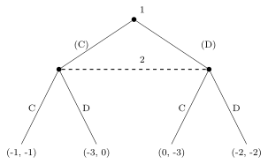
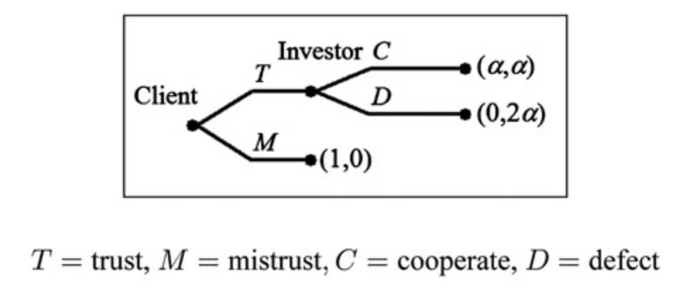
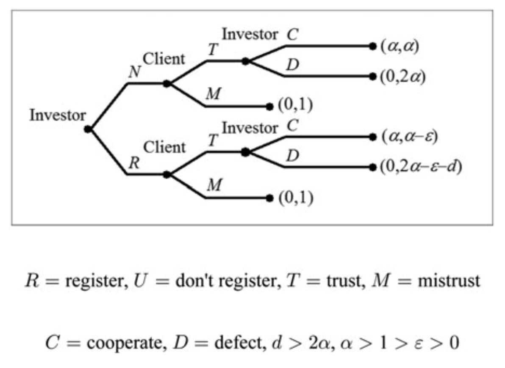

<!--<style>-->
<!--  body {-->
<!--    width: 50vw;-->
<!--    font-size: 19px;-->
<!--    margin: auto;-->
<!--    }-->
<!--  .annotation-highlight {-->
<!--    background: yellow;-->
<!--    cursor: pointer;-->
<!--    }-->
<!--</style>-->
<!---->
<!-- <script>-->
<!--    // 1) При отпускании мыши спрашиваем комментарий-->
<!--    document.addEventListener('mouseup', function () {-->
<!--      const sel = window.getSelection();-->
<!--      if (!sel || sel.rangeCount === 0) return;-->
<!---->
<!--      const text = sel.toString().trim();-->
<!--      if (!text) return;-->
<!---->
<!--      const comment = prompt('Комментарий к: "' + text + '"');-->
<!--      if (!comment) return;-->
<!---->
<!--      const range = sel.getRangeAt(0);-->
<!---->
<!--      // 2) Оборачиваем выделенный текст в span-->
<!--      const wrapper = document.createElement('span');-->
<!--      wrapper.className = 'annotation-highlight';-->
<!--      wrapper.dataset.comment = comment;-->
<!---->
<!--      try {-->
<!--        range.surroundContents(wrapper);-->
<!--      } catch (e) {-->
<!--        const contents = range.extractContents();-->
<!--        wrapper.appendChild(contents);-->
<!--        range.insertNode(wrapper);-->
<!--      }-->
<!---->
<!--      sel.removeAllRanges();-->
<!--    });-->
<!---->
<!--    // 3) Делегирование: клик по любому span.annotation-highlight показывает комментарий-->
<!--    document.addEventListener('click', function (e) {-->
<!--      const target = e.target.closest('.annotation-highlight');-->
<!--      if (!target) return;-->
<!--      const comment = target.dataset.comment || '(нет комментария)';-->
<!--      alert(comment);-->
<!--    });-->
<!--  </script>-->

::: {.epigraph}
Социальная наука будущего может быть настолько же онтологически удивительной, как физика 20-го века

Дон Росс
:::


# Глава 1. Принудительная сила институтов в социальной онтологии

Социальные институты — деньги, право, собственность, брак — представляют собой не просто описания наших взаимодействий, но активные силы, формирующие социальную реальность. Их отличительная черта — способность не только направлять, но и ограничивать репертуар действий, создавая устойчивые, самовоспроизводящиеся паттерны поведения. Этот феномен — *принудительная сила институтов* — и составляет центральную проблему настоящего исследования. Вопрос «что такое социальный институт?» в данном контексте сводится к более конкретному и одновременно фундаментальному: каков источник и механизм силы, которая позволяет институтам предписывать поведение и воспроизводиться даже вопреки интересам отдельных индивидов?

Поиск ответа на вопрос о природе института сталкивается с радикальным расхождением в существующих теоретических подходах. Одни теории, уходящие корнями в философию действия, выводят принудительность из сферы ментального: из коллективных убеждений, интенций и разделяемых правил [@searle1995; @gilbert1992]. Другие, развиваемые в рамках экономики и теории рационального выбора, видят её источник в структуре материальных стимулов и стратегических равновесий, возникающих из взаимодействий рационально-эгоистичных агентов [@lewis1969; @greif2006]. Этот конфликт интерпретаций указывает на более глубокую методологическую проблему — каким способом вообще стоит искать онтологическое основание социальных феноменов?

Философ науки Дон Росс предлагает различать *аналитическую* и *научную* социальную онтологию, где основной метод первой — концептуальный анализ, а второй — эмпирические исследования и вывод к наилучшему объяснению (inference to the best explanation, далее IBE)[^ibe] [@ross2023]. Для Росса «натуралистическая метафизика», как он её называет, не применяет концепции, которые не встречаются в теориях, моделях или объяснениях самой науки.

[^ibe]: Есть мнение, что метод вывода к наилучшему объяснению принципиально недоступен для социальных наук и социологии, в частности, поскольку в них «нет аналогов гравитационных волн или бозона Хиггса» [@hawley2018] — то есть, фундаментальных единиц анализа, исходя из которых можно выводить онтологию по лекалам научного реализма [@psillos1999]. В данном исследовании мы постараемся показать обратное: что IBE — единственно возможный путь к онтологии социального.

*Аналитическая социальная онтология*, исходя из априорного теоретизирования, стремится выявить необходимые и достаточные условия социальных феноменов через логический разбор и интуитивную проверку ключевых понятий — «правило», «интенциональность», «функция» и т.д. Такая онтология утверждает, что она *логически предшествует* методологии социальных наук [@searle1995; @epstein2016; @lauer2019]. Иначе говоря, невозможно изучать социальное, не определив заранее его ключевые характеристики, или видовые свойства. 

Классическим примером служит проект Джона Сёрла, который через формулу «X считается Y в контексте C» пытается эксплицировать *конститутивные правила*, лежащие в основе институциональной реальности [@searle1995]. В этой парадигме принудительная сила института логически выводится из факта коллективного принятия определённых статусных функций. Аналитический подход, таким образом, начинает с концептуальных допущений о природе социального и пытается вывести из них структуру реальности. К тому же, этот подход предполагет человеческую уникальность и антропоцентризм.

<!--отсутствие ментальных конструктов и разделяемых целей не позволяет животным иметь институты, хотя мы видим протонормативное поведение (кооперативные альянсы с санкциями за нарушение, восприятие справедливости) в животных видах — от ворон [@wascher2013] до шимпанзе [@rudolfvonrohr2011].-->

*Научная (натуралистическая) социальная онтология*, напротив, использует метод вывода к наилучшему объяснению (inference to the best explanation, IBE). Её исходная точка — не интуиция или анализ понятий, а успешные, зрелые научные теории, демонстрирующие предсказательную и объяснительную силу. Онтологические заключения в этом случае не предшествуют научному исследованию, а являются его результатом: мы вправе считать реальным то, что постулируется теориями, наилучшим образом объясняющими наблюдаемые явления [@psillos1999]. В контексте социальных наук это означает, что онтология институтов должна быть выведена из тех моделей, которые наиболее адекватно описывают их устойчивость, влияние на поведение и, что наиболее важно для нас, принудительную силу.

Важным следствием принятия метода IBE является вопрос о природе социальных категорий. Если мы выводим онтологию из успешных теорий, то должны спросить: на какие единицы ссылаются эти теории? Традиционная философия науки связывает надёжный индуктивный вывод и успех объяснения с существованием *естественных видов* — категорий, которые обладают внутренней, гомеостатической структурой свойств, позволяющей делать индуктивный вывод [@mill1843; @boyd1991]. Применение IBE к социальному миру ставит проблему в более чёткой форме: можно ли рассматривать социальные институты как естественные виды, поддерживающие индуктивный вывод?

Критика аналитического подхода со стороны натурализма [@kincaid2021; @churchland2019; @ross2023] сосредоточена на риске *концептуального круга*. Анализируя *понятия* об институтах, мы рискуем вскрыть не устройство социального мира, а структуру наших собственных, исторически и культурно обусловленных, представлений о нём. Как отмечает Патрисия Чёрчленд, концептуальный анализ часто выдаёт камуфлированные теории, которые ошибочно принимают черты наших текущих убеждений за черты мира [@churchland2019]. В результате аналитическая социальная онтология, несмотря на свою концептуальную изощрённость, вполне может оказаться оторванной от реальных механизмов, изучаемых эмпирической социальной наукой [@sarkia2023].

Физика ярко иллюстрирует контраст между научной и аналитической онтологией [@ross2023]. Онтология, которую описывает физическая теория, формулируется с помощью математического языка. Как утверждает Дон Росс, её формулировка в отрыве от языка самой физики с помощью аналитического языка — например, в терминах семантики возможных миров — была бы контринтуитивной и излишне сложной. Иначе говоря, онтология, предполагаемая физикой, обусловлена её матетматическим языком настолько удачно, что другие формулировки этой онтологии за пределами понятий и методов самой физики просто не нужны. 

Социальные науки и социальная онтология не обладают такой прямолинейностью математических формулировок своих концепций, как физика[^mathsoc]. Вместо этого они используют «народные» концепции (folk concepts) вроде «убеждений», «групп» и «социальных фактов».

Некоторые философы утверждают, что «народных» онтологий достаточно [@ruben1989; @thomassen2003], а другие выдвигают на первый план взаимодействие «народных» и научных онтологий [@asta2012; @guala2016; @haslanger2018][^folk-psychology]. Неоднозначность между «народной» и научной социальной онтологией может зависеть от математического аппарата и его недостаточно развитого характера в социальных науках (который связан скорее с отсутствием теоретического консенсуса внутри социальной науки, а не с нехваткой математических инструментов). Росс также отмечает, что построение социальной онтологии, возможно, потребует её формулировки с помощью математических моделей, чувствительных к структурному моделированию (таких как иерархический байесовский вывод[^hbi]), а не теории множеств, которую стандартно используют как инструмент для исследования метафизических проблем вроде композиции, онтологической зависимости и отношении части/целого [@ross2023; @fine1995a].

[^mathsoc]: Хотя это и не стало мейнстримом, подобные попытки были во второй половине 20 века в лице «математической социологии» [@fararo1989] и унификационных проектов вроде «аналитического ядра социологии» философа Герберта Гинтиса [@gintis2007].

[^folk-psychology]: Это отражает давнюю дискуссию в философии сознания о «народной психологии» и элиминативизме (сведению «ментальных» понятий к состояниям мозга), где одна сторона утверждает, что «народные» понятия, такие как убеждения и желания, приблизительно соответствуют реальным внутренним процессам работы мозга [@fodor1983; @gopnik1994], а другая сторона сводит эти понятия к состояниям мозга и утверждает, что истинные внутренние процессы могут быть описаны только в материальных и механистических терминах [@churchland1992; @turner2019].

[^hbi]: Иерархический Байес — это модель с вероятностными параметрами, которая допускает иерархические отношения между случайными величинами и их распределениями.

В данной работе мы принимаем установки натуралистической социальной онтологии и метод IBE в качестве основополагающих. Наш выбор обусловлен природой исследуемой проблемы. Если мы хотим объяснить реальный, действующий в мире механизм институционального принуждения, а не реконструировать наше концептуальное понимание последнего, то отправной точкой должны стать не априорные конструкции, а наиболее эффективные из существующих объяснительных моделей, предлагаемых наукой.

Этот выбор означает отказ от тезиса об уникальности социальной онтологии. Согласно этому тезису, социальная реальность, во-первых, «интерактивна» (зависит от убеждений о ней самих участников и потому изменчива) [@hacking1999], а во-вторых, по своей сути нормативна, что делает её недоступной для дескриптивного, естественнонаучного подхода [@haslanger2012; @asta2024]. 

Здесь становится важным различение интерактивных и нейтральных видов (interactive / indifferent kinds) [@hacking1999]. Критики натурализма утверждают, что социальные сущности по определению принадлежат к интерактивным видам: наши классификации меняют их, подрывая стабильность, необходимую для индукции и трактовки в качестве естественных видов [@hacking1999; @asta2013]. 

Мы оспариваем это утверждение. Хотя социальные институты действительно могут быть чувствительными к убеждениям, это не отменяет возможности существования их как устойчивых *структурных паттернов*, возникающих из материальных ограничений и сетевых эффектов. Эти паттерны могут обладать достаточной регулярностью, чтобы служить основой для научного обобщения и, следовательно, для IBE. 

Задача, таким образом, состоит в том, чтобы найти и описать параметры такой структурной устойчивости, которые и могли бы претендовать на роль «видовых свойств» института в натуралистическом смысле. 

В качестве рабочей гипотезы мы принимаем, что таким ключевым видовым свойством является *принудительная сила*, понимаемая не как «мистическая нормативность» или деонтология, а как поддающийся моделированию механизм поддержания социальной координации.

Помимо этого, интерактивность (или рефлексивность) и нормативность — это не метафизические барьеры, а *эмпирические свойства социальных систем*, которые должны стать не предпосылкой, а *объяснительной целью* адекватной социальной онтологии.

Таким образом, наша методологическая позиция заключается в том, что онтология института, и в частности его принудительной силы, должна быть *выведена индуктивно* из корпуса социальных теорий, которые демонстрируют наибольшую объяснительную силу в отношении наблюдаемых социальных феноменов — стабильности социального порядка. Метод заключается в том, чтобы взять объяснительно успешные теории и сделать вывод о существовании тех сущностей, которые лучше всего объясняют явление. Теория эволюции методом естественного отбора Чарльза Дарвина — пример подобного вывода: есть виды как морфогенетические кластеры, есть процесс (или алгоритм), влияющий на изменение видов. Теория объясняет наблюдаемые феномены (разнообразие видов) лучше альтернативных объяснений [@okasha2002, 9].

Мы проводим критический анализ основных исследовательских программ, которые претендуют на роль объяснения стабильности институтов и являются кандидатами для вывода онтологии института. Каждая из этих программ имплицитно или эксплицитно предлагает свой ответ на вопрос о «видовых свойствах» института и его онтологическом статусе — является ли он естественным видом:

1. *Институт как равновесие (Раздел 1.1).* И хотя истоки этой традиции, идущей от Дэвида Льюиса, не связаны с институтами *per se*, её представители в философии, теории игр и новой институциональной экономике отождествляет институт с *равновесием в стратегическом взаимодействии* рациональных агентов. Принудительная сила здесь исходит из структуры стимулов: каждому участнику невыгодно отклоняться от своей стратегии в одностороннем порядке, если он ожидает, что другие будут следовать своим стратегиям. Кандидат на «наилучшее объяснение» — *структура стимулов как объективных ограничений*.

2. *Институт как система правил (Раздел 1.2).* Эта традиция делится на два русла. *Конститутивное* правило видит в институте систему *статусных функций*, создаваемых и поддерживаемых коллективным согласием. *Регулятивное* правило рассматривает институты как формальные и неформальные *ограничения*, структурирующие взаимодействие. В обоих случаях принудительная сила — в нормативной или когнитивной силе правил. Кандидат на «наилучшее объяснение» — *власть правила или коллективной интенциональности*.

3. *Институт как правило-в-равновесии: синтетический подход (Раздел 1.3)*. Теория Франческо Гуалы и Фрэнка Хиндрикса представляет собой наиболее влиятельную попытку синтеза двух предыдущих подходов [@guala2016; @hindriks2015a; @hindriks2019; @hindriks2022]. Институт здесь понимается как *равновесие*, стабилизированное *правилом*. В равновесии находятся стратегии агентов, а правило — устройство корреляции стратегий и фокальная точка. Стратегии агентов зависят от общего знания правила, поэтому правило координирует ожидания. Кандидат на «наилучшее объяснение»: *единство нормативной координации и стратегической устойчивости*.

Каждая из этих программ предлагает мощный концептуальный аппарат и претендует на то, чтобы схватить суть институциональной реальности. Наша задача — подвергнуть их имманентной критике, чтобы обнаружить внутренние противоречия и лакуны. 

Наш выбор в пользу теоретико-игрового и экономического подходов в качестве основного материала для построения *социальной онтологии* также требует пояснения. Мы отдаём себе отчёт, что социология предлагает несравненно более богатый и детализированный эмпирический портрет социального мира. Однако отсутствие общего теоретического основания среди теорий препятствует выводу к наилучшему объяснению [@hawley2018]. Задача же настоящего исследования — поиск *минимальных онтологических оснований принудительной силы социального*. Для решения такой задачи нужен минималистичный инструментарий, поэтому мы оттолкнёмся от моделей парного стратегического взаимодействия. Теория игр и институциональная экономика предоставляют наиболее разработанный концептуальный и формальный аппарат для нашей задачи.

Важно, что мы не утверждаем, что социальное «состоит из равновесий». Мы рассматриваем идеи равновесий в стратегических играх как *эвристический инструмент*. Наша цель — не усилить «экономический империализм» [@maki2009], а использовать мощный инструментарий для прояснения фундаментальной онтологической проблемы. Выводы, полученные с помощью такого эвристического инструмента, в дальнейшем могут быть проверены на возможность интерпретативного расширения на более сложные, нередуцируемо культурные и исторические феномены, изучаемые социологией. Однако первый шаг — построение общей параметрической модели — необходим для придания любым дальнейшим расширениям чёткого онтологического каркаса.

Исходя из изложенного, задача настоящей главы заключается в систематической оценке трёх основных исследовательских программ онтологии социальных институтов, чтобы показать, что ни одна из них не даёт удовлетворительного объяснения принудительной силы институтов, если следовать принципам IBE.

1.  Мы начнём с наиболее формализованного и строгого кандидата — *института как равновесия (1.1)*. Анализ покажет, что, хотя теория игр блестяще объясняет устойчивость, она сталкивается с фундаментальными трудностями при объяснении *нормативной силы* и *нормативного принуждения*, сводя их к расчёту издержек.

2.  Затем обратимся к *институту как системе правил (1.2)*. Критика здесь будет двоякой: конститутивные теории (Сёрл и последователи) оказываются «замкнуты» в коллективных представлениях и не объясняют источник принуждения, в то время как регулятивные теории (Норт, Остром) не вполне объясняют мотивацию следования правилу.

3.  Наконец, мы проанализируем *синтетическую модель «правил-в-равновесии» Франческо Гуалы (1.3)*. Несмотря на её элегантность и объяснительные успехи, мы выявим её глубинную напряжённость: соотношение правил и равновесий и наличие готовой конвенции как условие стабильности института (что подменяет объясняемое готовым объяснением).

Общим итогом главы станет демонстрация того, что существующие подходы, взятые по отдельности или в синтезе, оставляют *проблему принудительной силы социального института нерешённой*. Этот теоретический тупик создаёт необходимость для разработки новой модели, которая сможет интегрировать сильные стороны рассмотренных программ, преодолев их ограничения. Построению такой модели и будут посвящены последующие главы данного исследования.

Мы начинаем наш анализ с самого фундаментального уровня — с концепции института как равновесия стратегического взаимодействия.

## 1.1 Институт как равновесие
<!--:принудительная сила из стратегических ограничений взаимодействия-->

Ниже мы кратко представим интеллектуальные истоки теоретико-игрового подхода к социальной координации, исходящие от Дэвида Юма и Томаса Гоббса, затем рассмотрим важные для нашей работы понятия теории игр, — игра, платёжная функция, равновесие и несколько их разновидностей — а после представим реконструкцию традиции как *эндогенизации стратегического ограничения* — попытки поместить условия успешной координации внутрь структуры игры

Начать стоит с того, что традиция понимания социальной координации как источника социального порядка имеет богатую историю. Аристотель обосновывал социальные конвенции человеческой природой и стремлением к *эвдемонии*, или процветанию. Он рассматривал людей как «политических животных», которые естественным образом формируют сообщества для достижения коллективного благополучия. Справедливость и добродетель, центральные элементы его этики, считались основой политического порядка. В отличие от более поздних последователей теории общественного договора, Аристотель рассматривал социальную организацию как неотъемлемую часть человеческой рациональности, а не как преднамеренное соглашение [@aristotle1998].

Томас Гоббс переосмыслил социальные конвенции как конструкции, порождаемые насильственным «естественным состоянием» человечества. Он утверждал, что самосохранение побуждает индивидов отказываться от свобод в пользу суверена посредством общественного договора, являющегося результатом явного *соглашения* и обдумывания (deliberation) [@hobbes2016]. Таким образом, у Гоббса конвенции возникают из страха и рационального эгоизма, а не из врождённой общительности.

Согласно философу науки Брайану Эпштейну [@epstein2018], понятие *конвенции* впервые было явно использовано в качестве альтернативы понятию *соглашения* Пуфендорфом [@pufendorf1673] для обозначения языка и права. Пуфендорф синтезировал идеи Гоббса с теологическим естественным правом. Соглашаясь с тем, что люди преследуют собственные интересы, он приписывал «закон социальности» божественному предписанию, требующему мирного сосуществования. Для Пуфендорфа естественное право обязывает людей создавать гражданские общества, а Бог является конечным автором социальных конвенций. Тем самым было введено моральное измерение, отсутствующее в инструменталистской системе Гоббса, предполагающее, что конвенции не только утилитарны, но и морально оправданы. Точка зрения Пуфендорфа заключалась в том, что конвенции не обязательно должны быть явно согласованы и могут существовать и функционировать без их преднамеренного создания. Эта интуиция в значительной степени сохранилась в последующей традиции.

Теория социальных конвенций Дэвида Юма [@hume2003; @hume1998] предложила новаторский подход к объяснению того, как конвенции возникают органически в результате взаимодействия, а не в результате рационального замысла или божественного предписания. Анализ Юма основывается на трёх ключевых предпосылках:

- роль обычаев в формировании поведения;
- центральная роль взаимной выгоды;
- искусственность конвенций.

Конвенции рассматриваются как *продукты коллективной привычки*, а не явного словесного соглашения. Эти компоненты составляют основу его теории, которая связывает психологию, этику и политическую философию.

Концепция Юма предполагает, что человеческое понимание возникает из чувственных впечатлений и идей, вытекающих из них. Это распространяется и на социальное поведение: конвенции возникают не из разума, а из повторяющегося опыта, формирующего привычки. Например, известный пример Юма с двумя гребцами в лодке иллюстрирует, как синхронизация возникает методом проб и ошибок, а не в результате предварительных переговоров:

> «Двое мужчин, гребущих веслами в лодке, делают это по соглашению или договоренности, хотя никогда не давали друг другу обещаний» [@hume2003].

Однако некоторые современные исследователи утверждают, что подобная координация не является «юмовскими конвенциями», поскольку они, по мнению самого Юма [^humean-conventions], требуют наличия *положительной социальной экстерналии*, тогда как два преступника могут эффективно покинуть место преступления [@schliesser2024]. В настоящей работе мы не будем сосредотачиваться на этом морально обусловленном понятии конвенций.

[^humean-conventions]: Как пишет Юм [@hume1998], «некоторые утверждают, что справедливость проистекает из человеческих условностей и исходит из добровольного выбора, согласия или объединения людей… если под условностью понимать чувство общего интереса — чувство, которое каждый человек испытывает в своей душе, которое он замечает в своих ближних и которое ведёт его, в согласии с другими, к общему плану или системе действий, направленных на общественную пользу, — следует признать, что в этом смысле справедливость проистекает из человеческих условностей. Ибо если допустить (что, действительно, очевидно), что конкретные последствия конкретного акта справедливости могут быть вредны как для общества, так и для отдельных лиц, то следует, что каждый человек, принимая эту добродетель, должен учитывать весь план или систему и ожидать согласия своих ближних в том же поведении. Если бы все его взгляды сводились к последствиям каждого его собственного поступка, его благожелательности и гуманности, а также “его любви к себе”, то она часто могла бы предписывать ему меры поведения, совершенно отличные от тех, которые соответствуют строгим правилам права и справедливости…». Шлиссер  отмечает, что положительная социальная экстерналия является необходимым условием для чисто «юмовской» конвенции [@schliesser2024].

Со временем повторяющиеся поведенческие паттерны закрепляются в конвенциях, поскольку решают практические проблемы, такие как координация труда и установление прав собственности, минимизируя при этом социальные трения. Обычай, как пишет Юм, «делает наш опыт полезным для нас», создавая стабильные ожидания относительно поведения других, даже в отсутствие формальных правил [@hume2003]. Акцент на привычке бросает вызов рационалистическим теориям вроде Гоббса, показывая, как конвенции возникают, не требуя рациональности, посредством итеративных корректировок.

Юм выделяет четыре ключевые особенности конвенций:

- *взаимная выгода*: все стороны получают выгоду от соблюдения конвенции (например, синхронная гребля обеспечивает продвижение; стандартизированная валюта облегчает торговлю);
- *множество потенциальных решений*: теоретически могут работать разные решения (например, грести быстро или медленно), однако последовательность важнее конкретного выбора;
- *незапланированное соглашение*: конвенции развиваются спонтанно посредством «медленного прогресса» проб и ошибок, а не в результате преднамеренного договора;
- *взаимность*: соблюдение конвенции зависит от ожидания взаимности со стороны других, создавая *самоподдерживающийся* цикл доверия.

Для Юма конвенции вроде прав собственности, возникают потому, что люди признают «общий интерес» в стабилизации владения имуществом во избежание конфликтов, даже если их естественные склонности тяготеют к личной выгоде [@hume1998]. Этот прагматический подход отличает его теорию от моралистических рассуждений, рассматривающих конвенции исключительно как инструменты сдерживания оппортунизма.

<!--Юм классифицирует конвенции как *искусственные добродетели* — социальные конструкты, разработанные для противодействия «ограниченной щедрости» человечества. В отличие от естественных добродетелей, таких как доброжелательность, возникающих инстинктивно, условности, такие как справедливость или соблюдение обещаний, требуют культивации. Однако их искусственность не делает их произвольными. Напротив, они приобретают нормативную силу благодаря коллективному чувству: индивиды одобряют условности, способствующие социальной полезности, а неодобрение их нарушений со временем усиливает приверженность им. Этот процесс объясняет, как условности приобретают моральный вес, превращаясь в нормы, которые кажутся обязательными даже тогда, когда рациональный эгоизм может побуждать к их нарушению. Экспериментальные исследования, вдохновлённые работами Юма (а точнее — Льюиса [-@lewis2008]), подтверждают, что условности стабилизируют поведение даже при возникновении стимулов к нарушению, подчёркивая взаимодействие привычки и нормативности [@guala2010].-->

<!--Теория Юма резко расходится с моделями общественного договора. В то время как Гоббс основывал конвенции на преднамеренных соглашениях, призванных предотвратить хаос или обеспечить права, Юм отвергал идею первоначального «естественного состояния», требующего таких соглашений. Вместо этого он утверждал, что конвенции возникают постепенно из жизненного опыта, что отражает его более широкий скептицизм по отношению к рационалистическим абстракциям. Его концепция также предвосхитила современную теорию игр, в частности анализ конвенций Льюиса как координационных равновесий [@lewis2008], хотя сам Юм уделял больше внимания психологическим механизмам.-->

Важно отметить, что подход Юма объединил описательную и нормативную области. Показав, как конвенции развиваются от практических потребностей к моральным нормам, он предложил достаточно натуралистическое объяснение социального порядка, избегающее апелляций к божественному закону или метафизической необходимости. Это согласуется с его неприятием причинно-следственной связи как чего-либо, выходящего за рамки наблюдаемой закономерности, и подкрепляет его точку зрения о том, что человеческие институты являются случайными продуктами обычаев, а не вечными истинами.

После Юма философы шотландского Просвещения утверждали, что социальный порядок является результатом взаимодействия отдельных людей, однако такой порядок не был специально задуман ими. Как писал Фергюсон [@ferguson1980], «нации натыкаются на установления, которые, действительно, являются результатом человеческой деятельности, но не воплощением какого-либо человеческого замысла».

Льюис возродил и операционализировал идеи Юма в теории конвенций, используя теорию игр и рассматривая конвенции как равновесия, поддерживаемые общими знаниями и прецедентами. В то время как Юм подчёркивал историческую случайность и постепенное возникновение, Льюис сформулировал более строгие критерии рациональности и взаимных ожиданий [@lewis2008]. Он рассматривал конвенции как решения проблем координации — класса проблем в теории игр (разделе математики, изучающем стратегическое поведение), — которые требуют от двух или более агентов согласования своих действий для достижения совместно оптимального результата. В следующем разделе мы кратко рассмотрим основные концепции теории игр, прежде чем вернуться к теории конвенций Льюиса, поскольку теория игр будет иметь решающее значение в оставшейся части нашего исследования.


### 1.1.1 Важные понятия теории игр
Теория игр — это математическая теория, используемая для анализа ситуаций стратегического взаимодействия между рациональными агентами, принимающими решения. Первоначально разработанная Джоном фон Нейманом и Оскаром Моргенштерном в их фундаментальной работе *Theory of Games and Economic Behavior* [@morgenstern1944], теория игр впоследствии эволюционировала и охватила широкий спектр приложений в экономике, биологии, политической науке и социологии [@gintis2009; @osborne2004]. Она предоставляет инструменты для изучения того, как индивиды или группы принимают решения в условиях, когда их результаты зависят не только от собственных действий, но и от действий других. Базовыми элементами теории игр являются игры, игроки, стратегии, выигрыши (выплаты) и равновесия [@zamir2013].

Стратегическая игра в теории игр определяется как тройка

$$G = (N, S, P),$$

где:

* $N$ — множество игроков;
* $S = (S_1, S_2, \dots, S_n)$ — наборы стратегий игроков, где $S_i$ обозначает множество стратегий, доступных игроку $i$;
* $P = (P_1, P_2, \dots, P_n)$ — функции выигрыша, где

$$P_i : S_1 \times S_2 \times \dots \times S_n \rightarrow \mathbb{R}$$

задаёт полезность игрока $i$ при заданном профиле стратегий [@myerson1991].

*Стратегия* $s_i \in S_i$ представляет собой полный план действий, которому игрок следует в любой возможной ситуации, возникающей в рамках игры. Выигрыши отражают вознаграждения, которые игроки получают в зависимости от комбинации стратегий, выбранных всеми участниками.

Одним из центральных понятий теории игр является *равновесие*, при котором ни один игрок не имеет стимула в одностороннем порядке изменять свою стратегию, учитывая стратегии других игроков. Наиболее известным понятием равновесия является *равновесие Нэша* (РН), введённое Джоном Нэшем в начале 1950-х годов [@nash1950]. Профиль стратегий $(s_1^*, s_2^*, \dots, s_n^*)$ образует равновесие Нэша, если для каждого игрока $i$ выполняется следующее условие:
$$
P_i(s_i^*, s_{-i}^*) \geq P_i(s_i, s_{-i}^*) \quad \forall s_i \in S_i.
$$

Здесь:

* $P_i$ — функция выигрыша игрока $i$;
* $s_i^*$ — стратегия, выбранная игроком $i$ в равновесии;
* $s_{-i}^*$ — профиль стратегий всех остальных игроков, кроме $i$.

Это неравенство означает, что игрок $i$ не может увеличить свой выигрыш, односторонне отклоняясь от стратегии $s_i^*$ к любой другой допустимой стратегии $s_i$.

Крупная часть разработок в теории игр связана с *очищениями равновесия Нэша* — сужением множества возможных равновесий Нэша до более правдоподобных и реалистичных подмножеств. Среди них можно выделить совершенное по подыграм [@selten1965], последовательное (sequential) [@kreps1982], байесовское [@fudenberg1991], равновесие дрожащей руки [@selten1975] и другие. Эти уточнения направлены на устранение ограничений равновесия Нэша.

В области эволюционной биологии Джон Мейнард Смит и Роберт Прайс в 1973 году ввели понятие *эволюционно стабильной стратегии* (ЭСС) [@maynard1973]. В строгом смысле она не является очищением равновесия Нэша, поскольку последние имеют дело с рациональными агентами, а ЭСС — со статистикой популяции. Однако формально ЭСС — это подмножество равновесий Нэша, устойчивых к «вторжению» мутантных стратегий, и удовлетворяющая следующему условию:
$$
P(s^*, s^*) > P(s', s^*)
\quad \text{или} \quad
\bigl[P(s^*, s^*) = P(s', s^*) \ \text{и} \ P(s^*, s') > P(s', s')\bigr].
$$
Здесь:

* $P(s^*, s^*)$ — выигрыш, когда и резидент, и захватчик используют стратегию $s^*$;
* $P(s', s^*)$ — выигрыш мутанта, использующего стратегию $s'$, против резидента, придерживающегося стратегии $s^*$.

В отличие от очищений равновесия Нэша, концепция *коррелированного равновесия* (КР), введённая Робертом Ауманном, представляет собой радикально отличный подход к стратегическому взаимодействию [@aumann1974]. Это *обобщение* равновесия Нэша вводит эпистемическую надстройку над игрой и позволяет игрокам координировать свои стратегии посредством сигналов от доверенного посредника. В отличие от равновесия Нэша, в котором игроки действуют независимо, КР допускает корреляцию стратегий через доступную обоим игрокам информацию. В рамках КР случайный сигнал рекомендует каждому игроку стратегию, и игроки следуют этой рекомендации, потому что отклоняться от неё невыгодно. Формально КР удовлетворяет условию:

$$\sum_{s'*{-i}} q(s_i, s'*{-i}) \cdot \bigl[P_i(s_i, s'_{-i}) - P_i(s'*i, s'*{-i})\bigr] \geq 0 \quad \forall s_i, s'_i.$$

Здесь:

* $q(s_i, s'*{-i})$ — вероятность того, что посредник рекомендует стратегию $s_i$ игроку $i$ и профиль стратегий $s'*{-i}$ остальным игрокам;
* $P_i(s_i, s'*{-i})$ — выигрыш игрока $i$, если он выбирает стратегию $s_i$, а остальные игроки выбирают $s'*{-i}$.

Это неравенство гарантирует, что ожидаемый выигрыш от следования рекомендации не меньше, чем ожидаемый выигрыш от отклонения от неё.

Как отмечал экономист Роджер Майерсон:

> «Если на других планетах существует разумная жизнь, то в большинстве из них коррелированное равновесие было бы открыто раньше, чем равновесие Нэша» [@solan1999].

КР может рассматриваться как более естественное понятие по сравнению с РН, поскольку его математическая простота и опора на координацию делают его более легко обнаружимым и вычислимым. Майерсон утверждал, что приоритет, отданный равновесию Нэша в научной традиции, мог быть результатом исторической случайности, а не отражением его фундаментальной значимости. В обществах или цивилизациях, где кооперативное поведение поощряется или широко распространены внешние посредники, КР может выступать более интуитивной отправной точкой для анализа стратегических взаимодействий.

Стоит сказать про формы представления игр: *нормальную* (матричную, стратегическую) и *развёрнутую*. Игра в нормальной форме фиксирует статичную картину равновесия, когда все участники уже приняли решения и получили выплаты по их итогам. Игра в развёрнутой форме часто похожа на дерево, где каждый узел — принятие решения одним из игроков. Её основная характеристика — отражение *последовательности* ходов. Особенно стоит подчеркнуть, что при свертке в матрицу много информации — о последовательности ходов, наличии информации о ходах оппонентов и др. — теряется.

Ниже — «Дилемма заключённого» в нормальной и развёрнутой формах. В этой игре два заключённых, допрашиваемые в разных камерах, независимо решают, промолчать или выдать партнёра полиции.

<div style='display: flex; justify-content: space-between;'>

<div class='table'>

$$\begin{array}{|c|c|c|}
\hline
 & C & D \\
\hline
C & -1,-1 & -3,0 \\
\hline
D & 0,-3 & -2,-2 \\
\hline
\end{array}$$

<figcaption>Дилемма заключённого в нормальной форме</figcaption>
</div>


</div>

Также важно другое различение — статических (one-shot) и динамических игр. Оно отражает не форму представления игры, а *характер принятия решений игроками* в ней. В статических играх решение принимается одновременно и без знания действий других. В динамических — решения последовательны и наблюдаемы обоими игроками. Шахматы — пример такой динамической стратегической ситуации. Важно, что динамические игры могут быть разными: играми в развёрнутой форме, где видна последовательность ходов, повторяющимися играми вроде «Дилеммы заключённого» и другими.

Ещё одно важное для нас различение — *полнота информации* в динамических играх. Если каждый игрок видит все предыдущие ходы другого игрока или знает, информация в игре полная, а если один из игроков не различает состояния игры (вроде «типа» оппонента), то неполная. Эти различения станут особенно важными при анализе теории правил-в-равновесии в Главе 2.

Можно выделить проблемы координации и проблемы кооперации:

- *Проблемы координации* возникают, когда индивидам или группам необходимо выбрать одно из нескольких возможных равновесий. Например, по какой стороне дороги ездить. Это создаёт неопределённость относительно того, какое решение будет реализовано. Подобные проблемы отражают ситуации, в которых все стороны выигрывают от согласованных действий, но испытывают трудности с выбором конкретного варианта. Если есть дорога с двумя полосами, то нужно выбрать, по какой стороне ездить *всем*, чтобы избежать аварий. Важно, что в проблемах координации индивидуальный и общий интерес *совпадают* — ехать по правой стороне независимо от направления выгодно и каждому отдельному водителю, и популяции в целом [@bicchieri2005]. Философ науки Кейлин О'Коннор различает *коррелятивные* и *комплементарные* проблемы координации [@oconnor2019]. В первых успешная координация требует выбора *одинаковых действий*, во вторых — различных. Например, чтобы избежать столкновения, обоим водителям на разных полосах дороги нужно ехать по правой стороне дороги. А для того, чтобы хорошо подготовиться к вечеринке, одному нужно прибраться в квартире, а другому — заказать пиццу. В первом случае успешная координация зависит от выбора одного и того же действия, во втором — разных.

<div class="table">

$$
\begin{array}{|c|c|c|}
\hline
& L & R \\
\hline
L & 1,1 & 0,0 \\
\hline
R  & 0,0 & 1,1 \\
\hline
\end{array}
$$
<figcaption>Координационная игра. $L$ и $R$ — левая и правая сторона дороги</figcaption>
</div>

- *Проблемы кооперации*, напротив, подчёркивают конфликт между индивидуальной рациональностью и коллективной выгодой: взаимная кооперация обеспечивает лучший результат для всех, однако индивидуальный эгоизм может приводить к социально неэффективным исходам. Например, перевыпас скота на общем пастбище, когда разные пастухи максимизируют индивидуальную полезность, в сумме истощая общий ресурс [@ostrom1990]. Равновесие Нэша в стратегия «пасти скот вдоволь» даёт меньшие выплаты, чем кооперативное равновесие, когда все используют общий ресурс ограниченно. Такие проблемы часто требуют механизмов принуждения или ограничения. Пример проблемы кооперации — «Дилемма заключённого».

Не все равновесия эффективны. Если невозможно улучшить выплату одного игрока, не ухудшив у другого, говорят о *Парето-оптимальности* исхода. 

Для нашей работы особенно важно КР. Его отличие от РН имеет *онтологические следствия*: оно Парето-доминирует смешанные равновесия Нэша, потому что имеет устройство корреляции, *согласующее* стратегии игроков. Подобное согласование будет важным при рассмотрении институтов. Чтобы проиллюстрировать отличие КР от РН, рассмотрим игру *«Битва полов»* с чистым и смешанным РН, а также КР. Матрица игры:

$$\begin{array}{|c|c|c|}
\hline
& \text{Футбол} & \text{Балет}\\
\hline
\text{Футбол} & 2,1 & 0,0 \\
\hline
\text{Балет} & 0,0 & 1,2 \\
\hline
\end{array}$$

В чистых стратегиях существуют два равновесия Нэша: оба игрока выбирают либо балет, либо футбол. Эти равновесия обеспечивают координацию, но по своей сути несправедливы, поскольку один игрок всегда получает не то, чего хочет.

В смешанном, то есть вероятностном РН, выплаты будут меньше. Пусть муж выбирает балет с вероятностью $p$ и футбол с вероятностью $1-p$, а жена выбирает балет с вероятностью $q$ и футбол с вероятностью $1-q$. Используя принцип безразличия, согласно которому игрок рандомизирует свои стратегии таким образом, чтобы противник был безразличен к доступным стратегиям, получаем:
$$
2q = 1 - q \Rightarrow q = \frac{1}{3},
$$
$$p = \frac{2}{3} \Rightarrow EU_H = EU_W = \frac{2}{3}.$$

В КР публичный сигнал (например, подбрасывание честной монеты) рекомендует обоим игрокам пойти либо на балет, либо на футбол с равной вероятностью, обеспечивая ожидаемый выигрыш $1.5$ каждому игроку. КР помогает игрокам получать более справедливые выигрыши по сравнению как с чистым, так и со смешанным РН, используя общую случайность или коммуникацию [@vanderschraaf1995].

Чтобы продемонстрировать, как сигнал влияет на структуру выигрышей, добавим стратегию *Орёл → Балет, Решка → Футбол*, где игроки выбирают стратегию на основе подбрасывания монеты. Это легитимно, поскольку КР — это равновесие Нэша в расширенной игре (не путать с игрой в развёрнутой форме) с дополнительным набором стратегий [@gintis2009a; @gintis2009].Тогда матрица примет вид:

<div class="table">

$$\begin{array}{|l|c|c|c|}
\hline
& \text{Футбол} & \text{Балет}  & \text{Орёл → Балет, Решка → Футбол} \\
\hline
\text{Футбол} & 2, 1 & 0, 0 & 1, 0.5 \\
\hline
\text{Балет} & 0, 0 & 1, 2 & 0.5, 1 \\
\hline
\text{Орёл → Балет, Решка → Футбол} & 1, 0.5 & 0.5, 1 & 1.5, 1.5 \\
\hline
\end{array}
$$
<figcaption>«Битва полов» с коррелированным равновесием</figcaption>
</div>

Профиль стратегий *Орёл → Балет, Решка → Футбол* образует РН в расширенной игре и лучше отражает реальные координационные механизмы.

Рассмотренных концепций достаточно, чтобы погрузиться в равновесный подход к социальным институтам. Начать стоит с основополагающей теории конвенций Дэвида Льюиса. В ней Льюис предлагает систематическое объяснение стабильности социальных конвенций с помощью координационных равновесий.

### 1.1.2 Координационное равновесие: традиция «конвенций» Дэвида Льюиса

Интеллектуальная атмосфера, в которой создавалась работа Дэвила Льюиса *Convention*, была в значительной степени сосредоточена на вопросах языка, значения и социального поведения.

<!--В середине XX века интерес к влиянию социальных практик на лингвистическое значение неуклонно возрастал, поскольку такие философы, как Уиллард Куайн [@quine1960] и Людвиг Витгенштейн [@wittgenstein1953], утверждали, что значение возникает из совместного употребления внутри сообщества. Витгенштейн подчёркивал, что значение языка формируется через публичное использование, а не задаётся какими-либо внутренними семантическими свойствами. Продолжая эту традицию, Льюис стремился объяснить, каким образом языковые конвенции формируются, стабилизируются и сохраняются в сообществах, предложив систематическое описание их развития во времени. Концептуализируя значение слов как координированное поведение, Льюис заложил основания для понимания языка как социально организованной деятельности, а не как врождённой или сугубо индивидуалистической способности.-->

Дух времени аналитической философии 1960-х годов был связан с переосмыслением наследия логического позитивизма, который с помощью формальной логики и эмпирической верификации определял значение через аналитически истинные высказывания или эмпирически проверяемые утверждения [@godfrey-smith2003]. Однако к 1960-м годам критика со стороны Куайна, Патнэма и других философов поставила под сомнение этот подход — в особенности различие между аналитическими и синтетическими истинами, где первые считались истинными в силу значения, а вторые — в силу их отношения к миру.

Куайн отвергал традиционные представления о различении необходимости/контингентности и аналитичности/синтетичности, утверждая, что онтологические обязательства встроены в теории и язык [@quine1951; @quine1960; @quine1969], и подчёркивал роль эмпирических данных и прагматических соображений в формировании убеждений. Его критика аналитичности акцентировала изменяемость языка, показывая, что конвенции являются подвижными, а не фиксированными. Мысленный эксперимент Патнэма «Двойная Земля»[^twin-earth] развил эти идеи далее, отстаивая *семантический экстернализм* — позицию, согласно которой значение слов зависит от внешних фактов, а не только от ментальных состояний, — тем самым бросая вызов интерналистским теориям значения и подчёркивая роль внешних факторов в языковых практиках. В результате *конвенции понимаются как зависящие от контекста и окружающей среды*, выходя за рамки чисто внутренних или необходимых определений.

[^twin-earth]: На планете, почти во всём идентичной Земле, но где вода состоит не из $H_2O$, а из $XYZ$, жители используют слово «вода», однако обозначают им иное вещество. По Патнэму, этот пример показывает, что одних лишь психологических состояний недостаточно для определения значения; внешние факторы, такие как химический состав и условия усвоения, влияют на языковую референцию. Эта идея выражена в его знаменитом тезисе: «значения не находятся в голове».

Для Льюиса языковые значения являются *конвенциональными* в том смысле, что слова и их значения связаны произвольно и могли бы быть связаны иначе. Однако договорённости о такой связи, как показывает Льюис, могут быть неявными и возникать спонтанно. Согласно Льюису, даже самые строгие обычаи начинались как случайные поведенческие паттерны, которые могли бы быть иными, но усиливались с каждой итерацией.

Ещё одной важной философской проблемой, к которой обращался Льюис, была онтология социальных правил и норм, находящаяся под сильным влиянием работ Юма. Льюис развил юмовскую идею о том, что конвенции могут возникать и сохраняться даже при отсутствии централизованного принуждения. Он утверждал, что конвенции являются самоподдерживающимися: после их установления у индивидов нет причин отклоняться от них, пока остальные продолжают им следовать. Главное расхождение с Юмом состояло в акценте на рациональности агентов как источнике такого конформизма, тогда как Юм подчёркивал роль психологической привычки.

Примером может служить развитие денег как средства обмена. Изначально в качестве валюты использовались различные объекты — скот, раковины или металлические монеты. Со временем бумажные деньги получили широкое признание не из-за внутренней ценности, а потому, что люди ожидали, что другие будут принимать их в обмене. Этот вывод впоследствии оказал влияние на теории спонтанного порядка и децентрализованных систем в политической философии и экономике, в частности у Фридриха Хайека [@hayek1973]. Объясняя конвенции как естественные результаты повторяющихся социальных взаимодействий, Льюис внёс вклад в более широкое понимание того, как нормы, институты и языковые практики могут возникать органически, без явного замысла или принуждения.

<!--Кроме того, юмовский скептицизм в отношении морального реализма — позиции, согласно которой существуют объективные моральные нормы, — сыграл роль в формировании взгляда Льюиса на конвенции как произвольные, но устойчивые[^alexander]. Юм утверждал, что моральные различия не укоренены в объективных свойствах, а основаны на человеческих чувствах и социальной обусловленности. Аналогично Льюис настаивал, что конвенции не определяются какой-либо внутренней необходимостью, а возникают контингентно в ходе социальных практик. Например, выбор стороны дороги для движения — правой или левой — является произвольным, однако после установления он становится самоподдерживающимся, поскольку все индивиды выигрывают от соблюдения единого правила. Это отражает более широкий юмовский тезис о том, что социальный порядок возникает не из абсолютных принципов, а из разделяемых ожиданий и усвоенных форм поведения.-->

<!--[^alexander]: Развитие идеи объективных, но относительных моральных норм в духе льюисовского подхода и с аналогичной строгостью представлено у Александра МакКензи [@mackenzie2007], что перекликается с концепцией «произвольных, но устойчивых» инструментальных конвенций.-->

Если проблемы значения, языка и конвенциональности были вопросами, которые Льюис стремился решить, а юмовское понимание конвенций — источником философского вдохновения, ему всё же требовался инструмент для построения этого аргумента. Таким инструментом стала теория игр и, в частности, идеи Томаса Шеллинга о «фокальных точках» и стратегическом взаимодействии в играх со смешанными мотивами [@schelling1980].

Работы Шеллинга отличались от преобладавшего в теории игр акцента на играх с нулевой суммой, где всегда есть победитель и проигравший. Шеллинг показал, что реальные взаимодействия часто характеризуются «смешанными мотивами», в которых интересы участников одновременно и конфликтуют, и совпадают. Он критиковал ограничения сугубо математического анализа стратегического взаимодействия и отстаивал необходимость эмпирических исследований условий, формирующих поведение, в частности возможности коммуникации и наличия заметных (salient) альтернатив [@schelling1980]. Этот расширенный взгляд, включающий как конфликт, так и кооперацию, охватывал именно те феномены сотрудничества и координации, которые привлекли Льюиса в контексте проблемы социальных конвенций.

<!--Шеллинг утверждал, что конфликт и кооперация не обязательно являются противоположными силами, а тесно переплетены в стратегических взаимодействиях. Одним из его ключевых вкладов стало понятие *достоверного обязательства*, согласно которому способность заранее зафиксировать приверженность определённой стратегии может повлиять на решения оппонента [@schelling1960, p. 22]. Существенным элементом этого является *самоограничение*, когда игрок сознательно сокращает собственные возможности, чтобы усилить свою переговорную позицию.-->

Ещё одним важным вкладом стало понятие *фокальных точек* — решений, к которым индивиды естественным образом склоняются в координационных играх без явной коммуникации. Шеллинг продемонстрировал это, попросив у случайных прохожих выбрать место встречи в Нью-Йорке со своим знакомым без предварительной договорённости. Подавляющее большинство выбирало полдень на Центральном вокзале, несмотря на отсутствие каких-либо внутренних выигрышных преимуществ у этого места [@schelling1960, p. 57].

В исследовании *чистых координационных игр* Шеллинг анализировал взаимодействия, в которых интересы игроков совпадают, но отсутствует коммуникация, например выбор одинаковых чисел ради вознаграждения. Участники часто сходились на «заметных» вариантах, таких как число $1$, благодаря его свойству как наименьшего положительного целого [@schelling1960, p. 102]. Работы Шеллинга также дали новый взгляд на концепцию равновесия Нэша, показав, каким образом фокальные точки помогают выделять устойчивые и заметные исходы среди множества равновесий Нэша [@lewis1969, p. 78]. 

Льюис формализовал идеи Шеллинга в теории конвенций, определив их как решения повторяющихся проблем координации, в которых агенты сходятся на фокальных точках благодаря взаимным ожиданиям [@lewis1969, p. 43]. *Конвенции опираются на внешние стимулы, такие как избегание провалов координации*, а не на внутренние обязательства. Льюис также подчёркивал, что сама коммуникация является координационной игрой, в которой сигналы получают значение через разделяемые конвенции [@lewis1969, p. 95].

Одной из центральных идей, заимствованных Льюисом у Шеллинга, является понятие фокальной точки, или «салентности» (salience, которую дальше мы будем называть *«заметностью»*). Он показал, что социальные конвенции возникают как фокальные точки координации. Так, во многих обществах люди ездят по одной стороне дороги не из-за внутреннего предпочтения именно этой стороны, а потому, что универсальное следование одной конвенции обеспечивает безопасность и предсказуемость. Развивая эту мысль, Льюис утверждает, что агенты выбирают наиболее «заметную» конвенцию — ту, которая «выделяется» среди альтернатив благодаря прецеденту, явному соглашению или внутренним свойствам. Согласно Льюису, «заметность« — это субъективная психологическая характеристика, независимая от стратегической ситуации, которая управляет возникновением и поддержанием конвенций. В частности, Льюис анализирует, как конвенции возникают (динамика — через первоначальный выбор и последующее усиление «заметности«) и почему им следуют (статика — из-за подавляющей заметности уже существующей конвенции, формирующей ожидание конформизма). Последователи Льюиса переосмысляют и формализуют понятие «заметности» в эволюционном и информационном ключе [@vanderschraaf1995; @oconnor2019; @oconnor2020; @skyrms2014; @gintis2007a].

Ещё одним важным заимствованием у Шеллинга является роль ожиданий и самопринуждения в стратегическом равновесии. Шеллинг показал, что во многих координационных сценариях после установления равновесия отклонение становится иррациональным, поскольку издержки нескоординированных действий превышают потенциальные индивидуальные выгоды. Льюис развивает эту идею, определяя конвенции как самоподдерживающиеся: индивиды следуют им не из-за внешнего принуждения, а потому, что взаимные ожидания делают отклонение затратным. Это особенно наглядно проявляется в языковых конвенциях, где использование определённых слов и грамматических структур сохраняется благодаря ожиданию, что другие будут делать то же самое.

Кроме того, понятие *общего знания*, являющееся фундаментальным для теории конвенций Льюиса, тесно связано с идеей Шеллинга о взаимной осведомлённости в стратегическом взаимодействии. Хотя у Шеллинга не было строгой формализации, он подчёркивал ключевую роль разделяемого понимания для успешной координации. Льюис развил эту идею, утверждая, что устойчивость конвенции требует не только фактического следования ей, но и *признания* её ожидаемым образцом поведения внутри группы, что делает возможным поддержание конвенций в больших популяциях.

<!--Опираясь на работы Шеллинга, Льюис смог придать исследованию конвенций теоретико-игровое основание, показав, каким образом они возникают, стабилизируются и сохраняются во времени. В то время как Шеллинг сосредотачивался на стратегических выборах в условиях конфликта и переговоров, Льюис распространил эти принципы на сферу языка, социальных норм и эпистемической координации, тем самым значительно расширив применимость игровых идей в философии и социальных науках. В результате *The Strategy of Conflict* Шеллинга остаётся одним из ключевых интеллектуальных источников *Convention* Льюиса и её долгосрочного влияния на теории социальной координации.-->

#### 1.1.2.1 Теория конвенций Льюиса

Льюис определял социальную конвенцию как произвольный, но самоподдерживающийся поведенческий паттерн, возникающий из повторяющихся проблем координации между двумя или более игроками. Её отличительной чертой является конформизм участников по отношению к этим паттернам, поскольку они ожидают, что другие будут поступать так же, и это является *общим знанием*: каждый игрок ожидает конформизма остальных. Отклонение от конвенционального выбора действия приводит к меньшему выигрышу, поэтому у игроков нет стимулов к одностороннему отклонению. Так, если все ездят по правой стороне дороги, для каждого водителя рационально поступать так же, чтобы избежать столкновений. Льюис формулирует понятие конвенции следующим образом [@lewis1969, p. 76]:

Поведенческая регулярность $R$ в популяции $P$ в повторяющейся ситуации $S$ является конвенцией тогда и только тогда, когда:

1. Каждый член $P$ следует $R$
2. Каждый индивид ожидает, что остальные будут следовать $R$
3. Все члены имеют сходные предпочтения относительно возможных поведенческих регулярностей
4. Каждый предпочитает всеобщее следование $R$ при условии, что почти все остальные ему следуют
5. Члены популяции также предпочли бы альтернативную регулярность $R'$, при прочих равных условиях, если $R'$ и $R$ являются взаимно исключающими.

Позднее Льюис уточнил свой анализ, допуская редкие отклонения от конвенции, а Брайан Скирмс недавно ввёл понятие *квазиконвенций* как неустойчивых конвенций, основанных на концепции *грубого коррелированного равновесия* (coarse correlated equilibrium) [@skyrms2023].

Льюисовская конвенция представляет собой особый вид равновесия, называемый *координационным равновесием*, которое в общих чертах напоминает РН, но выходит за его пределы. В РН ни один участник не может улучшить свой результат посредством одностороннего изменения стратегии. Если отклонение строго снижает выигрыш, равновесие считается строгим. В этом смысле РН представляет собой «устойчивое состояние», в котором каждый индивид действует оптимально, принимая действия других как заданные. Однако льюисовская конвенция расширяет эту концепцию, подчёркивая коллективное предпочтение конформизма даже при наличии незначительных отклонений.

Важной особенностью льюисовского подхода является *произвольность* конвенций: $R$ является конвенцией только в том случае, если альтернативная регулярность $R'$ могла бы столь же успешно выполнять ту же функцию. Это подчёркивает, что конвенции являются контингентными решениями среди множества возможных вариантов, а не внутренне необходимыми структурами, что продолжает идеи Куайна [@quine1969], Патнэма [@putnam1975] и других.

Кроме того, Льюис ввёл понятие *общего знания* как необходимое условие конвенции, определяя факт $p$ как общее знание, если:

* все знают $p$;
* все знают, что все знают $p$;
* все знают, что все знают, что все знают $p$, и так далее.

Эта рекурсивная концепция знания стала предметом обширных обсуждений в философской и теоретико-игровой литературе. Роберт Ауманн [@aumann1976] и другие предложили формальные модели общего знания, отличающиеся от первоначального неформального подхода Льюиса.

Поскольку теория Льюиса опирается на теорию игр, рациональность играет в ней фундаментальную роль. Льюис предполагал, что агенты инструментально рациональны, то есть выбирают действия, максимизирующие ожидаемую полезность с учётом их убеждений и ожиданий относительно мира и поведения других. Хотя метафора человека как максимизирующего агента подвергалась критике [@paternotte2020a], она по-прежнему служит эвристическим ориентиром в экономической теории [@gintis2007; @gintis2013], биологии [@okasha2017; @okasha2012; @engel2008] и человеческой экологии [@mouden2012a; @sterelny2012]. Вместе с тем существуют альтернативные взгляды на необходимость рациональности для существования конвенций. Например, философ биологии Рут Милликан утверждает, что конвенции стабилизируются исключительно статистической силой прецедента и не требуют рациональности или сознания [@millikan2022].

Льюисовская концепция конвенций объединяет поведение, убеждения, предпочтения и ожидания в рамках общего знания и рациональности для объяснения устойчивости конвенций. Каждый элемент определения играет ключевую роль:

- общее знание обеспечивает разделяемое понимание конвенции;
- предпочтение конформизма создаёт стимулы к следованию при условии кооперации других;
- рациональность направляет индивидуальный выбор в контексте общих ожиданий.

Поскольку одной из главных мотиваций анализа Льюиса была философская проблема языкового значения, он стремился показать, что язык укоренён в конвенциях, не требующих предварительного соглашения о терминах. Подобно тому как водители координируются относительно стороны движения без формального контракта, носители языка формируют конвенции употребления звуков или жестов для обозначения определённых объектов через повторяющееся взаимодействие и взаимные ожидания. Льюис рассматривал язык как систему сигналов, в которой значение возникает из конвенциональной связи между сигналами (словами, выражениями) и состояниями мира. Например, слово «кошка» конвенционально сигнализирует наличие представителя семейства кошачьих. Эта конвенция поддерживается тем, что говорящие обычно намерены говорить правду, а слушающие — доверяют этому намерению. Взаимные ожидания и опора на устойчивость связей «сигнал–значение» обеспечивают эффективную коммуникацию как форму координации.

Это привело Льюиса к различению *поведенческих* и *сигнальных* конвенций [@lewis2008, pp. 147–150]: первые координируют действия, вторые — значения в коммуникации. В качестве классического примера сигнальной конвенции Льюис приводит историю Пола Ревира и фонарей, вывешенных на колокольне Старой Северной церкви в 1775 году для предупреждения колониального ополчения о наступлении британских войск: два фонаря означали наступление с моря, один — с суши. Действия получателей сообщения различались в зависимости от сигнала. Отправители и получатели координируются вокруг заранее установленного паттерна вида «если $X$, то $Y$»[^skyrms-learning].

[^skyrms-learning]: Как показал Скирмс [@skyrms2010; @skyrms2010a], такие паттерны могут формироваться динамически в повторяющихся играх: как $X$, так и $Y$ устанавливаются и распознаются методом проб и ошибок через обучение с подкреплением или другую динамику — обучающую или эволюционную.

Для Льюиса сигнальные конвенции служат особым случаем, или подтипом, поведенческих конвенций, поскольку разделяют с ними произвольность, конформизм и статус общего знания. Отличие сигнальных конвенций состоит в том, что они включают коммуникацию и интерпретацию значения и решают проблемы координации посредством *передачи информации*. Они требуют процессов кодирования и декодирования, то есть производства и интерпретации сигналов.

Важной особенностью соотношения этих двух классов конвенций является то, что, по Льюису, *сигнальные конвенции фундаментально опираются на уже существующие поведенческие конвенции* и формируются под их влиянием. Например, значения слов зависят от соблюдения обеими сторонами установленных норм произношения и грамматики. Сигнальные системы часто демонстрируют вложенность, когда конкретные конвенции встроены в более широкие поведенческие регулярности. Так, поднятие руки для получения слова на собрании является сигнальной конвенцией, вложенной в более общую поведенческую конвенцию очередности высказываний [@vanderschraaf].

Существует различие между поведенческими (или «общими», как их называет Льюис) и сигнальными конвенциями. В сигнальных играх игроки выступают либо отправителями, либо получателями: первые обладают приватной информацией о состоянии мира и посылают сигнал, вторые наблюдают сигнал и действуют на его основе:

{.small}

Если сигнал отправителя, представляющий состояние мира, корректно интерпретируется получателем, оба игрока получают выигрыш $(1, 1)$; если же кодирование или декодирование информации не удаётся, игроки получают $(0, 0)$. В рамках этого «информационного слоя» сигнальных систем существует множество вариантов — объединение сигналов, синонимия, обман и другие — которые подробно изучаются прежде всего философами биологии [@skyrms2010a; @skyrms2010; @huttegger2008; @godfrey-smith1991; @shea2018a; @martinez2019].

Философ биологии Питер Годфри-Смит уточнил модель Льюиса, различив *координацию состояние–действие* и *координацию действие–действие* [@godfrey-smith2014]:

- *состояние–действие*: сигналы сопоставляют состояния мира действиям получателя;
- *действие–действие*: сигналы синхронизируют действия агентов без обращения к внешним состояниям.

Координация действие–действие позволяет интерпретировать юмовских гребцов как сигнальную систему этого типа: ритм гребков служит императивным сигналом («Греби сейчас!»), который непосредственно координирует совместные действия, а не передаёт информацию о внешних условиях [@martinez2016]. Отсутствие экзогенного состояния сводит систему к чистой координационной игре с равновесием Нэша или координационным равновесием, где «сигнал» (ритм гребков) функционирует как самоподдерживающаяся конвенция, *эндогенно* стабилизированная общими интересами и взаимными ожиданиями. В отличие от зависимой от состояния мира сигнализации, координация действие–действие ориентирована на *межличностную синхронизацию* через поведенческую обратную связь в реальном времени. Это демонстрирует, как коммуникация может организовывать совместное действие без репрезентативного содержания (representational content), что является важной проблемой в философии биологии и философии сознания.

Парадигматический пример координации «состояние–действие» — тревожные крики мартышек-верветок, специфичные для каждого типа хищника. При виде орла крик побуждает прятаться в траве, при виде змеи — взбираться на дерево [@seyfarth1990]. Совпадение состояния мира, сигнала и действия образует полноценную сигнальную систему, или конвенцию. В данном контексте важно, что конвенция служит функции адаптивной цели — выживанию.

Хотя формально поведенческие и сигнальные конвенции схожи, поскольку обе могут быть описаны как игры с игроками и выигрышами, они различаются тем, что вторые включают дополнительный «информационный слой» между участниками. И хотя сам Льюис считал сигнальные конвенции подтипом поведенческих, их взаимосвязь остаётся неоднозначной. Для Скирмса сигналы *информируют* действия, а сигнальные сети *координируют* действия, что неявно предполагает первичность сигнальных конвенций по отношению к поведенческим, а не наоборот. Более того, Скирмс выдвигает тезис о том, что сигнализация ответственна за эволюцию командной работы как таковой [@skyrms2010], что ставит под вопрос иерархию Льюиса и порождает проблему «курицы и яйца», выходящую за рамки данной диссертации.


#### 1.1.2.2 Конвенция как информационная стабильность в теории Вандершраафа 

Теория конвенций Льюиса стала отправной точкой для исследований конвенций, и последующие авторы уточняли его теорию, порой до неузнаваемости. Существует множество уточнений, однако мы рассмотрим лишь наиболее важные для нашей темы — разработки Питера Вандершраафа и Брайана Скирмса.

Расплывчатость понятия равновесия была одной из критик теории Льюиса, и этот компонент активно разрабатывался и уточнялся. Две заметные переработки понятия конвенций представлены в виде *коррелированных равновесий* и *эволюционно стабильных стратегий*.

Философ науки Питер Вандершрааф [@vanderschraaf1995; @vanderschraaf1998; @vanderschraaf2001] расширил льюисовский анализ конвенций, трактуя их как КР, возникающие в процессе *индуктивного обучения* (inductive deliberation). Он формализовал понятие «заметности» как информационные разбиения (information partitions) и применил байесовское обновление убеждений (в частности, правило Дирихле*[^dirichlet]), чтобы показать, как агенты постепенно приходят к *эндогенному* равновесию, без предзаданного внешнего сигнала.

[^dirichlet]: Правило Дирихле — это байесовская процедура обновления, основанная на распределении Дирихле, используемом для моделирования вероятностей на конечном множестве дискретных исходов («распределение распределений»). В моделях обучения правило Дирихле обновляет вероятность, приписываемую каждому распределению, подсчитывая число случаев, когда оно приводило к определённому исходу, например вознаграждению. Эти счётчики служат параметрами распределения Дирихле, которое затем задаёт распределение вероятностей по вариантам. Формально, если вариант $j$ был вознаграждён $\gamma_j$ раз, обновлённая вероятность для варианта $j$ пропорциональна $\gamma_j$, а вектор вероятностей $\mathbf{x} = (x_1, \ldots, x_k)$ по $k$ вариантам таков, что $x_j \in (0,1)$ и $\sum_{j=1}^k x_j = 1$. Это правило отражает, как эмпирические частоты формируют вероятностные убеждения в рамках байесовского подхода.

Льюис считал координационное равновесие конвенцией, если игроки обладают общим знанием о взаимных ожиданиях. Вандершрааф называет это *критерием взаимных ожиданий* (КВО) [@vanderschraaf1995]. У каждого агента есть причина следовать своей части конвенции, ожидая, что другие агенты поступят так же. Льюис утверждал, что равновесие должно быть координационным, чтобы отражать идею о том, что человек, следующий конвенции, хочет, чтобы его намерение было распознано как таковое. Вандершрааф называет это *критерием публичных намерений* (КПН). Кроме того, с точки зрения Вандершраафа, Льюис полагал, что общее знание КВО необходимо для существования конвенции. Однако, как отмечает Вандершрааф, этого недостаточно, поскольку общее знание КВО может выполняться в любом строгом равновесии Нэша.

Согласно Вандершраафу, конвенция задаётся не просто профилем стратегий, а механизмом корреляции — функцией из состояний мира в стратегические профили. Пусть задана игра в стратегической форме $\Gamma = (N, S, \mathbf{u})$, где:

- $N = \{1, \ldots, n\}$ — множество игроков;
- $A = A_1 \times \cdots \times A_n$ — множество профилей чистых стратегий, где $A_i$ — множество стратегий игрока $i$;
- $\mathbf{u}: A \to \mathbb{R}^n$ — функция полезности.

Далее, $\Omega$ — множество *состояний мира*. У каждого игрока $i$ есть *информационное разбиение* (information partition) $\mathcal{H}_i$ множества $\Omega$. Ячейка $H_{ij} \in \mathcal{H}_i$, содержащая состояние $\omega$, представляет собой *частную информацию* игрока $i$ о том, какое состояние реализовалось.

Ключевым для конвенции является понятие *общего информационного разбиения* (common information partition) $\mathcal{H} = \bigcap_{i \in N} \mathcal{H}_i$. Элементы этого разбиения — это события, которые являются *общим знанием* среди всех игроков.

Функция $f: \Omega \to A$ определяет систему экзогенно скоррелированных стратегических $n$-наборов. Для каждого $\omega \in \Omega$,
$$f(\omega) = (f_1(\omega), \ldots, f_n(\omega)) \in A,$$
где $f_i(\omega)$ — действие, предписанное игроку $i$ в состоянии $\omega$.

Согласно Вандершраафу, функция $f: \Omega \to A$ является конвенцией тогда и только тогда, когда для каждого $\omega \in \Omega$ и для каждого игрока $i \in N$:
1.  $f_i$ является $\mathcal{H}$-измеримой (то есть предписание игроку $i$ зависит только от общедоступной информации);
2.  Выполняется условие строгого превосходства следования предписанию:

$$E(u_k \circ f \mid \mathcal{H})(\omega) > E(u_k \circ (f_{-j}, g_j) \mid \mathcal{H})(\omega)$$
для любого игрока $j \in N$ и для любой $\mathcal{H}$-измеримой функции $g_j: \Omega \to S_j$, где $g_j \neq f_j$.

Условное математическое ожидание $E(u_k \circ f \mid \mathcal{H})(\omega)$ — это ожидаемый выигрыш игрока $k$, когда все следуют предписаниям конвенции $f$, при условии общей информации $\mathcal{H}$. Неравенство означает, что если *любой* игрок $j$, включая самого $k$, отклонится от предписания $f_j$ на альтернативную стратегию $g_j$, то *каждый* игрок $k$ окажется строго в худшем положении. Это и есть формализация КВО.

Иначе говоря, конвенция у Вандершраафа — это *строгое коррелированное равновесие* с общим информационным разбиением. Условие общности разбиения ($\mathcal{H} = \bigcap_i \mathcal{H}_i$) гарантирует, что предписания основываются на публичной информации, и каждый игрок *желает*, чтобы его намерение было общим знанием, поскольку это даём всем участникам более высокий выигрыш.

Понимание конвенции как КР допускает более «справедливую» координацию, как мы показали ранее на примере игры «Битва полов». Эта игра имеет смешанное равновесие Нэша, в котором оба агента выбирают стратегии с вероятностью $\frac{2}{3}$. Однако это равновесие не удовлетворяет КПН и не является конвенцией. Тем не менее, существует КР, справедливое для обоих игроков и Парето-оптимальное по сравнению с равновесиями в чистых стратегиях. 

При подбрасывании честной монеты задаётся вероятностное пространство $\Omega = \{H, T\}$ с исходами «орёл» и «решка». У агентов есть общее информационное разбиение $\mathscr{H} = \{\{H\}, \{T\}\}$, а коррелированная комбинация стратегий задаётся функцией

$$f: \Omega \rightarrow \{A1, A2\} \times \{A1, A2\}$$

где $f(H) = (A1, A1)$ и $f(T) = (A2, A2)$. Если выпадает «орел», оба идут на балет, а если «решка» — на футбол. 

Первый игрок получает более высокий ожидаемый выигрыш при этой комбинации, чем при любой другой стратегии, поэтому он не будет от неё отклоняться. Ожидаемый выигрыш первого игрока равен $2$, если выпадает $H$, и $1$, если выпадает $T$. То же верно и для второго игрока.  Ни один игрок не захочет отклоняться, поскольку общий ожидаемый выигрыш каждого игрока в этом равновесии Парето-доминирует над выигрышами в РН:

<!--$$-->
<!--\begin{aligned}-->
<!--& E(u_1 \circ f \mid H)=2>0=E(u_1(A2, A1)\mid H), \text{ и } \-->
<!--& E(u_1 \circ f \mid T)=1>0=E(u_1(A1, A2)\mid T)-->
<!--\end{aligned}-->
<!--$$-->

$$
E(u_k \circ f)=\frac{1}{2} \cdot E(u_k \circ f \mid H)+\frac{1}{2} \cdot E(u_k \circ f \mid T)=\frac{3}{2}.
$$

Это означает, что каждый игрок предпочитает ожидаемый выигрыш от $f$ выигрышу смешанного равновесия и чистых РН.

<!--Вандершрааф опирается на модель Ауманна [@aumann1987], поэтому и него каждый игрок имеет собственное *информационное разбиение* $\mathscr{H}_k$ вероятностного пространства $\Omega$. Элементарные события на $\Omega$ называются *состояниями мира*. В каждом состоянии $\omega$ игрок $k$ знает, какой элемент $H_{kj} \in \mathscr{H}_k$ реализовался, но не знает, какое именно $\omega$. $H_{kj}$ представляет частную информацию игрока $k$ о состояниях мира. Хотя $k$ знает о существовании разбиений оппонентов, он не знает их конкретного содержания. Функция $f: \Omega \rightarrow S$ задаёт *экзогенно коррелированный кортеж стратегий*, так что в каждом состоянии мира $\omega \in \Omega$ каждый игрок $k$ выбирает комбинацию стратегий $f(\omega) = (f_1(\omega), \dots, f_n(\omega)) \in S$, коррелированную с $\omega$. Следовательно, играя $f_k(\omega)$, игрок $k$ следует *байесовской рациональности* и максимизирует ожидаемый выигрыш с учётом частной информации и ожиданий относительно оппонентов.-->

<!--Ограничение измеримости на $f_k$ означает, что агент $k$ знает свою стратегию в каждом $\omega$. Это определение предполагает, что игроки *обладают общим знанием структуры выигрышей, разбиений $\Omega$ и функции $f: \Omega \rightarrow S$*, что необходимо для вычисления ожидаемых выигрышей и достижения коррелированного равновесия. Если игроки также обладают общим знанием байесовской рациональности, они будут следовать своим частям функции $f$, ожидая, что другие поступят так же, поскольку таким образом совместно максимизируется ожидаемая полезность.-->

Формирование конвенций, согласно Вандершраафу, происходит не посредством когнитивно затратного рационального рассуждения, а через относительно дешёвые механизмы *индуктивного обучения*. Агенты обновляют свои убеждения о стратегиях оппонентов согласно динамике Дирихле — одной из возможных реализаций байесовского обновления. *Делиберативное равновесие* определяется как фиксированная точка этой обучающей динамики, в которой убеждения агентов стабилизируются. Стабилизированные совместные убеждения и стратегии, возникающие в результате такого итеративного обновления, соответствуют тому, что Вандершрааф называет *эндогенным коррелированным равновесием* (ЭКР)[^ece]. Это КР, возникающее благодаря индуктивному обучению агентов и взаимному пересмотру убеждений, а не из внешнего устройства корреляции, как это часто представляется в более широкой литературе по теории игр[^choreographer].

[^ece]: Различие между «экзогенной» и «эндогенной» информацией, влияющей на выбор стратегии агента, уже присутствует у Аумана [@aumann1987]. Первый тип информации поступает из внешних сигналов, второй — из рассуждений агентов о том, как рассуждают другие. Ауман не считал это различие важным, поскольку знание экзогенности или эндогенности информации (и даже действий) агентов не способствует достижению КР. Использование Вандершраафом динамики Дирихле прояснило, как эндогенность может способствовать этому, хотя полностью внешний сигнал устранён не был.

[^choreographer]: Многие исследователи используют метафоры, подчёркивающие внешний характер КР: «посредник» и «корреляционное устройство» [@fudenberg1991], «хореограф» [@gintis2009a] и другие.

<!--Важной частью теории конвенций Вандершраафа является его вклад в моральную философию и теорию справедливости. По его мнению, КР более справедливо, чем РН в конвенциях, которые создают Парето-улучшения[^pareto] по сравнению с некооперативными базовыми состояниями. Справедливая конвенция $\sigma^J$ должна удовлетворять $u_i(\sigma^J) \geq u_i(\sigma^B)$ для всех агентов $i$, где $\sigma^B$ обозначает базовое равновесие [@vanderschraaf2018].-->

Вклад Вандершраафа состоит в формализации «заметности»: он использует *общее* информационное разбиение $\mathscr{H}$ как необходимое ограничение, согласующее определение конвенции с духом теории Льюиса. Остаётся вопрос о происхождении самой очевидности. Льюис предполагал, что предыгровая коммуникация, прецеденты и сигналы среды позволяют агентам связывать ожидания и действия с различными «состояниями мира», достигая равновесия. Однако такие источники сталкиваются с проблемой бесконечного регресса, поскольку неясно, как они могли возникнуть без уже существующих конвенциональных правил. Вандершрааф совместно со Скирмсом [@vanderschraaf1993] предложили *индуктивную делиберацию* как механизм формирования очевидности. Она действует через *рекурсивную модификацию убеждений*: игроки могут достичь коррелированного равновесия без коммуникации, динамически обновляя свои убеждения по общему индуктивному правилу, даже если исходные убеждения не допускают равновесия.

Что для нас самое важное в идеях Вандершраафа? То, что конвенция — это КР, а не РН, причём это *эндогенное* КР. Оно механистически объясняет принудительную силу конвенции — каким образом агенты приходят к этому равновесию и почему не отклоняются от него. Агенты реекрсивно обновляют свои убеждения из наблюдений за *состояниями мира* и проецируют последние в действия. Рекурсия делает одни убеждения более заметными просто потому, что они встречались чаще, и это натурализует «заметность» Льюиса, что делает вклад в натуралистическое объяснение социальной стабильности.


#### 1.1.2.3 Скирмс и конвенция как динамический аттрактор

Скирмс поместил теорию конвенций Льюиса в динамическую и эволюционную рамку. Он показал, как сигнальные конвенции могут возникать в процессе эволюции и обучения агентов с ограниченными когнитивными способностями, что позволяет обойтись без общего знания, индуктивного научения и даже индивидуальной рациональности [@skyrms2010].

Хотя Скирмс фактически создал целую исследовательскую программу с многочисленными последователями [@huttegger2007a; @huttegger2007; @oconnor2020; @lacroix2020; @franke2014], стоит отметить, что он вряд ли сделал бы это без своей ранней, менее известной работы по теории игр, связанной с обобщением концепции ЭСС.

ЭСС, сформулированная Джоном Мейнардом Смитом и Робертом Прайсом [@smith1973], — это стратегия, которая, если её примет большинство популяции, не может быть вытеснена никакой мутантной стратегией. Её формулировка предполагает *случайное распределение пар*[^pairing], когда индивиды встречаются для стратегических взаимодействий независимо от своих типов, так что вероятность встретить любую стратегию пропорциональна её частоте в популяции. Хотя это упрощает анализ и даёт элегантные теоретические результаты, оно ограничивает применимость ЭСС к смешанным популяциям и не отражает сложности структурированных взаимодействий.

[^pairing]: Случайное распределение пар — стандартное предположение в эволюционной теории игр, когда индивиды в большой хорошо смешанной популяции объединяются для взаимодействий случайным образом, т.е. каждый имеет равные шансы встретить любого другого, независимо от его стратегии. В этом контексте ЭСС зависит исключительно от средних выигрышей, определяемых частотами стратегий в популяции, и такие стратегии, как кооперация, обычно не могут сохраниться, если они напрямую не поддерживаются структурой выплат. Отклонения от случайного распределения (ассортативные или структурированные пары) вводят корреляции между стратегиями, что принципиально меняет, какие типы поведения могут быть эволюционно стабильными [@jensen2018; @izquierdo2024].

Скирмс ослабил допущение случайного распределения пар и выяснил, что ЭСС не генерирует *устойчивые* стратегии при неслучайных парах, возникающих, например, через селекцию по родственникам, сигнальные системы, пространственные или социальные структуры. Эти корреляции создают зависимости взаимодействий, увеличивая вероятность встреч с аналогичной стратегией. Такие зависимости кардинально изменяют эволюционную динамику и могут стабилизировать стратегии вроде кооперации или сигнальной конвенции, которые были бы нестабильны при классических ЭСС [@skyrms1994].

Это привело Скирмса к введению понятия *адаптивно ратифицируемой стратегии* — обобщения  ЭСС, которое учитывает, что структура взаимодействий в популяции может формироваться эндогенно, а не быть случайной.

Стратегия считается адаптивно ратифицируемой, если она даёт наибольшую ожидаемую приспособленность в ситуации, когда почти вся популяция уже её использует — с учётом того, что вероятность встретить разные стратегии может зависеть от корреляций в поведении. Иначе говоря, важно не только то, как стратегия работает *против случайного оппонента*, но и то, что носители схожих стратегий чаще взаимодействуют друг с другом.

Это обеспечивает динамическую устойчивость при репликаторной динамике: даже если появляются мутанты, они не получают систематического преимущества, потому что структура контактов уже «поддерживает» доминирующую стратегию [@skyrms1994].

Понятие адаптивно ратифицируемой стратегии позволило Скирмсу ввести ещё одно понятие — *коррелированная конвенция* [@skyrms2014]. Это стабильные, но не обязательно Парето-оптимальные паттерны поведения, возможные благодаря *любым зависимостям* взаимодействий между агентами. Скирмс исследовал множество источников таких корреляций: пространственные взаимодействия [@alexander1999], социальные структуры [@skyrms2003], социальные сети [@skyrms2004] и сигнальные системы [@skyrms2010a].

Подход Скирмса к конвенциям отличается от Льюиса тем, что он не опирается на общее знание, заменяя его динамическим давлением эволюции или обучения. Это давление обеспечивает возникновение и сохранение конвенций. Он показал, что даже простейшие организмы вроде бактерий могут приходить к сигнальным системам, аналогичным конвенциям Льюиса, с помощью простых адаптивных механизмов, таких как мутация-селекция или обучение с подкреплением (reinforcement learning, RL) [@skyrms2014].

<!--Скирмс исследовал различные динамики обучения, которые позволяют сигнальным системам возникать в популяциях. Например:-->
<!---->
<!--- Простое обучение с подкреплением, когда агенты корректируют стратегии на основе проб и ошибок, опираясь на успешные взаимодействия. В базовой игре Льюиса-Скирмса с 2 состояниями мира, 2 сигналами и 2 действиями отправители и получатели начинают со случайных предрасположенностей и постепенно усиливают успешные комбинации состояний, сигналов и действий [@skyrms2010a].-->
<!---->
<!--- Динамика «Win-Stay/Lose-Shift», где конвенции формируются быстрее, чем при простом RL. Агент сохраняет успешную стратегию и отказывается от неудачной, что ускоряет сходимость и повышает стабильность [@skyrms2014].-->

Фреймворк Скирмса моделирует конвенции как стабильные равновесия игр «отправитель–получатель», которые развиваются через RL и эволюционную динамику, а не рациональное размышление. Формально, сигнальная игра включает:

- множество состояний мира $S = {s_1, s_2, \ldots, s_n}$
- множество сигналов $M = {m_1, m_2, \ldots, m_k}$
- множество действий $A = {a_1, a_2, \ldots, a_l}$.

Отправитель наблюдает состояние $s \in S$ и выбирает сигнал $m \in M$. Получатель, получив $m$, выбирает действие $a \in A$. Выплаты $u_S(s, m, a)$ и $u_R(s, m, a)$ для отправителя и получателя зависят от того, насколько хорошо действие получателя соответствует состоянию. В отличие от модели Льюиса, которая предполагает общее знание очевидности определенного выбора для координации, Скирмс показывает, что конвенции могут возникать через адаптивные процессы даже при случайных начальных стратегиях и отсутствии фокальных точек. Стоит заметить, что здесь также не нужны критерии Вандершраафа — взаимные ожидания и публичные намерения. *Равновесия, которые можно описать как коррелированные (поскольку есть источник корреляции в виде пространственной, сетевой или сигнальной структуры), возникают динамически*.

<!--Центральным понятием в анализе Скирмса является *информационное содержание сигналов*, которое он количественно оценивает с помощью информационно-теоретических мер. Для априорного распределения вероятностей состояний $P(S_i)$ и апостериорного распределения, обусловленного сигналом $m$, $P(S_i \mid m)$, информация, передаваемая сигналом $m$, выражается как вектор отношений правдоподобия:-->

<!--$$-->
<!--\left( \log_2 \frac{P(S_1 \mid m)}{P(S_1)}, \log_2 \frac{P(S_2 \mid m)}{P(S_2)}, \ldots, \log_2 \frac{P(S_n \mid m)}{P(S_n)} \right),-->
<!--$$-->

<!--где $P(S_i)$ — априорная вероятность состояния, а $P(S_i \mid m)$ — апостериорная вероятность, обусловленная сигналом. Эта формализация связывает концептуальную рамку Льюиса с математическими моделями информации и коммуникации и показывает, как сигнал обновляет условную стратегию получателя в зависимости от состояния мира, направляя выбор действия [@skyrms2010].-->

<!--Скирмс также исследует равновесия сигнальных систем при частичном совпадении или конфликте интересов между отправителем и получателем. В таких случаях равновесие может включать обманные или частично информативные сигналы. Формально, если функция выплат отправителя $u_S$ отличается от функции выплат получателя $u_R$, концепция равновесия расширяется до сигнальных равновесий, где стратегии $\sigma_S: S \to \Delta(M)$ и $\sigma_R: M \to \Delta(A)$ удовлетворяют взаимным наилучшим ответам:-->

<!--$$-->
<!--\sigma_S(s) \in \arg\max_{m \in M} \mathbb{E}*{a \sim \sigma_R(m)}[u_S(s, m, a)], \quad \sigma_R(m) \in \arg\max*{a \in A} \mathbb{E}_{s \sim P(\cdot \mid m)}[u_R(s, m, a)],-->
<!--$$-->
<!---->
<!--где $\Delta(X)$ — множество вероятностных распределений по $X$ [@skyrms1996].-->

Эволюционную динамику, которая приводит к возникновению конвенций, часто моделируют с помощью алгоритмов обучения с подкреплением (RL), таких как модель Рота-Эрева [@erev1998]. Так же поступает и Скирмс. Агенты поддерживают *склонности* (propensities) $q_i(x)$ к выбору действий $x$ (сигналов или ответов), которые обновляются итеративно в зависимости от полученных выплат:

$$
q_{i}^{t+1}(x) = q_{i}^t(x) + \alpha \cdot \left( r_i^t(x) - q_i^t(x) \right),
$$

где $\alpha$ — скорость обучения, а $r_i^t(x)$ — вознаграждение за действие $x$ в момент времени $t$ [@skyrms2010]. При многократных взаимодействиях такая динамика обучения приводит к конвергенции на стабильные сигнальные конвенции без необходимости явной координации или рационального предвидения.

Передача информации через сигналы и акцент на *информационном содержании* сигнала вызвали жаркие дискуссии в философии биологии, критикующие Скирмса за отсутствие причинно-следственной связи [@shea2018a; @godfrey-smith2020; @harms2004] и чрезмерную опору на статистические, а не функциональные связи.

Интересная часть расширения Скирмсом игры сигнализации Льюиса — это *неявная опора на эпистемический язык*: «наблюдать» состояния мира и «интерпретировать» сигналы для «обновления убеждений». Хотя Скирмс отвергает байесовское толкование своих сигнальных игр [@lacroix2020a], его иногда интерпретируют как привнесшего эпистемологию в своих агентов, особенно при сравнении с теориями ментального содержания [@millikan1987; @millikan2004; @baraghith2019; @harms2004]: отправители «представляют» состояния мира и передают это публичное представление получателю, который затем «интерпретирует» его через свои собственные ментальные состояния. Например, уже упоминавшиеся тревожные сигналы мартышек-верветок: они могут быть описаны как включающие ментальные состояния, где «представляется» орёл и передаётся сигнал другим мартышкам, которые «декодируют» это представление и выбирают соответствующее действие. Хотя это правдоподобно для большинства натуралистических теорий ментального содержания [@millikan2004, @papineau2003], это не верно для Скирмса.

Хотя структура игры Льюиса-Скирмса отражает поток информации в эпистемических контекстах (состояние → сигнал → действие), и возникает соблазн рассматривать отправителей и получателей как байесовских агентов с убеждениями, *агенты Скирмса обновляют свои поведенческие предрасположенности*, а не убеждения, так как не обладают способностью к выводу и могут лишь корректировать свои отображения на основе частоты неудач [@skyrms2012].

Система «отправитель–получатель» Скирмса — это *информационный канал*, сосредоточенный на том, как возникают и стабилизируются эффективные коды (связки сигнал–значение), а не на убеждениях или намерениях агентов. Его сигнальные игры механистичны, как у Мейнарда Смита: учитываются только объективные («онтические») характеристики агентов, такие как частота стратегий в популяции или, в случае сигнальной игры, *отображения* состояния в сигнал и сигнала в действие в соответствии с частотой координационных сбоев.

Сравним игру Льюиса-Скирмса:

$$
\text{World} \xrightarrow{state} \text{Sender} \xrightarrow{Message} \text{Receiver} \xrightarrow{act}
$$

с каналом информации по Шеннону:

$$
\text{Source} \xrightarrow{original , message} \text{Encoder} \xrightarrow{signal} \text{Channel} \xrightarrow{signal} \text{Decoder} \xrightarrow{decoded , message}
$$

Философ биологии Маноло Мартинез  предлагает «channel-first» подход к сигнальным играм и утверждает, что центральной поведенческой единицей игры Льюиса-Скирмса является не стратегия, а *пара кодирования-декодирования*, что аналогично вышеупомянутым отображениям [@martinez2019].

В этой рамке состояния мира, сигналы и действия могут быть представлены как случайные величины $S$, $M$ и $A$, каждая из которых состоит из дискретных элементов, например состояний, сообщений и действий $[S_1, \dots, S_s]$, с вероятностным распределением $[Pr(S_1), \dots Pr(S_s)]$ по ним. То же самое относится к сообщениям и действиям.

Отправитель наблюдает текущее состояние и передаёт сигнал — один из $M$ возможных. Получатель получает сигнал и выбирает действие $A_i$ из множества доступных действий. И сигнал, и выбранное действие являются случайными величинами. Вероятности этих случайных величин связаны через стратегии отправителя и получателя, которые представлены матрицами вероятностей: сигналы, условные на состояния мира, и действия, условные на сигналы.

<div class="table">

$$
\left[\begin{array}{ccc}
\operatorname{Pr}\left(M_1 \mid S_1\right) & \ldots & \operatorname{Pr}\left(M_m \mid S_1\right) \\
\vdots & \ddots & \vdots \\
\operatorname{Pr}\left(M_1 \mid S_s\right) & \ldots & \operatorname{Pr}\left(M_m \mid S_s\right)
\end{array}\right]\left[\begin{array}{ccc}
\operatorname{Pr}\left(A_1 \mid M_1\right) & \ldots & \operatorname{Pr}\left(A_a \mid M_1\right) \\
\vdots & \ddots & \vdots \\
\operatorname{Pr}\left(A_1 \mid M_m\right) & \ldots & \operatorname{Pr}\left(A_a \mid M_m\right)
\end{array}\right]
$$
<div class="caption">Матрица условных вероятностей сообщений и действий</div>
</div>

Критикуя Скирмса, Мартинез отмечает, что тот недостаточно углубился в математическую теорию информации и анализировал информацию только *после того, как стратегии были приняты*, что не объясняет, как агенты к ним пришли. Мартинез предлагает использовать *функцию скорости–искажения Шеннона* (rate-distortion function) [@shannon1948], чтобы показать минимальную *взаимную информацию* между состояниями и действиями при минимальном уровне искажения. Это позволяет *интерпретировать выплаты как показатели искажения в канале*. С этой точки зрения, координационная игра сигнализации, даже включающая обман или блеф, воспринимается как кооперативная информационная структура, поскольку этот код радзеляется обоими агентами и делает полезную работу для обоих, пусть и иногда в большую сторону для одного из них.

В целом, расширение Скирмсом теории конвенций Льюиса отказалось от требований рациональности и ввело более натуралистическое описание сигнальных систем в широком контексте. Ключевое: оно подразумевает минимальную когнитивную архитектуру (или её отсутствие), что кардинально отличается от условных агентов Вандершраафа.

Что важного для нас в идеях Скирмса? Во-первых, предельная натурализация стратегического ограничения с помощью естественных динамических процессов — эволюции и научения. Во-вторых, идея *коррелированной конвенции* — что *любая* информационная асимметрия может создать конвенцию динамически. Эти идеи пригодится нам в Главах 3 и 4. 

<!--***-->
<!---->
<!--В традиции, восходящей к Шеллингу, Льюису, Вандершрафу и Скирмсу, социальные институты и конвенции трактуются как равновесия ожиданий или популяционной динамики, возникающие в координационных играх [@lewis1969; @vanderschraaf1998; @skyrms2010]. Ключевым механизмом здесь является *взаимная согласованность ожиданий* или фактическая приспособленность стратегии (у Скирмса), а не санкции.-->
<!---->
<!--У Льюиса конвенция — это регулярность поведения $R$, такая что:-->
<!---->
<!--1. все ожидают, что другие будут следовать $R$;-->
<!--2. у всех есть причина следовать $R$, если другие следуют $R$;-->
<!--3. эта структура является общим знанием.-->
<!---->
<!--Формально это равновесие Нэша в координационной игре без наказаний за отклонение. Санкции, если они и присутствуют, являются *внешними* по отношению к самой конвенции.-->
<!---->
<!--Именно здесь возникает разрыв с подходами Грейфа, Норта и Остром: в условиях конкуренции, конфликта интересов и асимметричной информации равновесия ожиданий оказываются недостаточными для устойчивости. Без $\delta$-санкции такие равновесия либо локальны, либо чрезвычайно хрупки.-->
<!---->
<!--#### Промежуточный вывод-->
<!---->
<!--Таким образом, институциональные теории Грейфа, Норта и Остром предлагают альтернативу как нормативным, так и чисто координационным моделям. В них институты понимаются как равновесия, стабилизированные *эндогенно возникающими санкционными структурами*, а не разделяемыми нормами или общим знанием. Это позволяет аналитически отделить вопрос происхождения мотивации от вопроса устойчивости равновесия и подготовить почву для формализации институциональной стабильности через параметр $\delta$.-->
<!---->

### 1.1.3 Равновесие с модификаторами выплат: социальные нормы как слабое принуждение

Помимо традиции Льюиса в теоретико-игровом подходе к социальной стабильности есть и другие направления. Оно активно пытается преодолеть ограничение и критику равновесных концепций, сводящих нормативность социальных конвенций к инструментальной рациональности или вовсе к нерациональным агентам и эволюционной динамике. В теориях этого подхода социальная нормативность моделируется с помощью теории игр, что иногда смещает фокус со стабильности социальных контрактов на мотивацию агентов следовать правилам. Эти теории важны, поскольку пытаются объяснить социальную нормативность как *основу* социальной стабильности и источник принудительной силы, однако они моделируют не структуру координационных стимулов, а структуру нормативных ожиданий.

#### 1.1.3.1 Теория социальных норм Гинтиса

Влиятельная равновесная концепция социальной стабильности, которая, однако, не опирается на идеи Дэвида Льюиса, принадлежит Герберту Гинтису. Он предложил *многоуровневую эволюционную модель* социальных норм, интегрирующую идеи теории игр, поведенческой экономики, эволюционной биологии и теории сложных систем. Гинтис утверждал, что *нормы — это форма социально передаваемого правила поведения*, которое коэволюционировала с человеческой способностью к сотрудничеству и наказанию, а их устойчивость объясняется через *коэволюцию генов и культуры* [@gintis2003; @gintis2009].

Гинтис определял социальную норму как правило поведения, которое:

1. Всеобще разделяется в группе,
2. Индивидуально интернализуется, так что отклонение вызывает отрицательные эмоции, такие как вина или стыд,
3. Принудительно поддерживается через наказание третьей стороны, и
4. Обременительно для индивидов, но адаптивно на уровне группы [@gintis2003, pp. 259–260].

Эволюционная жизнеспособность таких норм возникает из взаимодействия *индивидуальной приспособленности и группового отбора*: хотя следование нормам может быть затратным для отдельных индивидов, группы с высокой приверженностью нормам — особенно нормам сотрудничества, справедливости или наказания — превосходят менее сплочённые группы в межгрупповой конкуренции. Это формализуется в моделях *многоуровневого отбора*, где внутри группы динамика благоприятствует эгоизму, а между группами — сотрудничеству, опосредованному нормами. 

Как отмечает Влерик [@vlerick2019], решения координационных проблем возникают из внутригрупповой динамики, тогда как решения проблем с конфликтом преимущественно формируются через межгрупповую конкуренцию. Внутригрупповые процессы объясняют появление очевидных координационных правил. Для решения проблем с конфликтом, однако, ключевую роль, по мнению Влерика, играют межгрупповые процессы. Они выбирают *игровые нормы*, которые изменяют выплаты для доступных стратегий через наказания или награды, решая проблему «безбилетников» и создавая более оптимальные равновесия, чем те, что были доступны изначально. Это означает, что социальные нормы изменяют матрицы выплат так, чтобы *стратегии, ориентированные на собственный интерес, совпадали с интересами группы*, без необходимости самопожертвования. Они формируются взаимодействием между индивидами и между группами: последние выбирают эффективные равновесия, первые — «очевидные». .*Санкции применяются для решения проблем конфликта интересов*

Гинтис моделирует поддержание и стабильность норм через *репликаторную динамику* и игры на общественные блага. Пусть $x_i$ — доля индивидов, использующих стратегию $i$. Пусть $f_i$ — приспособленность (ожидаемый выигрыш) стратегии $i$. Уравнение репликатора:

$$
\dot{x}_i = x_i(f_i - \bar{f}),
$$

где $\bar{f} = \sum_j x_j f_j$ — средняя приспособленность в популяции. Норма устойчива, когда стратегия, которую она кодирует, становится ЭСС благодаря своей адаптивной выгоде на уровне группы.

Особенность норм в подходе Гинтиса — включение *сильной взаимности* (strong reciprocity), поведенческой черты, характеризующейся *сотрудничеством с другими и наказанием несотрудничающих*, даже с личными затратами. Сильная взаимность наблюдается эмпирически в межкультурных экспериментах (игры на доверие, ультиматум, игры на общественные блага) и противоречит прогнозам моделей, основанных исключительно на эгоизме [@gintis2005]. Гинтис рассматривает эту черту не как аномалию, а как *эволюционно устойчивый поведенческий фенотип*, поддерживаемый через *социализацию, основанную на нормах*, и групповой отбор.

Центральная и новаторская идея Гинтиса заключается в том, что социальные нормы трансформируют не только индивидуальные *предпочтения*, но и *структуру самого стратегического взаимодействия*, изменяя субъективные представления агентов о выплатах и действиях. Эта трансформация кодируется в так называемой *матрице убеждений*, отображающей, как агенты воспринимают и оценивают свои стратегические варианты с учётом социальных норм [@gintis2009, ch. 12; @gintis2003, pp. 266–268].

В классической теории игр игра определяется как:

* множество игроков $N$,
* множество стратегий $S_i$ для каждого игрока $i \in N$,
* функция полезности $u_i: S \to \mathbb{R}$, задающая выплаты.

Гинтис утверждает, что эта схема неполна для моделирования нормоподчинённого поведения, так как предполагает, что агенты оценивают стратегии на основе статических функций полезности. Социальные нормы, однако, *вызывают эндогенные изменения функций полезности*, через социально усвоенные ожидания, эмоции вроде вины и стыда и репутационные стимулы. Это отражается через *модифицированную функцию выплат*:

$$
u'_i(s) = u_i(s) + n_i(s),
$$

где $u'_i$ — нормо-скорректированная полезность, а $n_i(s)$ кодирует нормативные оценки профиля стратегии $s$. Функция $n_i$ зависит от убеждений агента $i$ о том, что ожидается, что является правильным или наказуемым, — формируя часть матрицы убеждений.

*Матрица убеждений* — это не просто список убеждений, а *когнитивная структура*: она кодирует, как игроки *трансформируют исходную игру* в игру, насыщенную нормами. Например, в дилемме заключённого, если оба игрока считают взаимное предательство морально неправильным и потенциально репутационно опасным, их матрица выплат *эндогенно преобразуется* в координационную игру или даже в «Охоту на оленя», в зависимости от силы нормативных убеждений.

Для формализации пусть $M$ — исходная матрица выплат, а $B$ — матрица убеждений, которая преобразует социальные ожидания, наказания и награды в численные модификаторы. Тогда:

$$
M' = M + B
$$

где $M'$ — нормо-управляемая игра, фактически воспринимаемая и реализуемая игроками.

<!--Эта идея близка к общей теории Гинтиса о **«сильно эндогенных играх»** [@gintis2009, pp. 187–189], где предпочтения и выплаты не фиксированы, а формируются культурным и институциональным контекстом. Здесь **социальные нормы действуют как приоритеты или фильтры**, которые перераспределяют игру. Матрица убеждений $B$ может эволюционировать со временем через культурную передачу, образование или обратную связь от повторяющихся игр.-->

Таким образом, Гинтис предлагает механизм внедрения норм в стратегическое поведение, связывая рациональную структуру теории игр с эволюционной и культурной психологией. Подход Гинтиса резко отличается от статических или экзогенных моделей норм, таких как конвенции Льюиса, и сближает его с конструктивистскими и динамическими традициями в поведенческой экономике.

Теория Гинтиса рассматривает нормы как культурно передаваемые и биологически обоснованные механизмы, поддерживающие масштабное сотрудничество. В отличие от теорий равновесия или основанных на ожиданиях, его модель встраивает соблюдение норм в коэволюцию генов и культуры и объясняет их устойчивость через многоуровневый отбор.

Для нас наиболее важно, что *Гинтис явно вводит механизм, делающий стабилизацию игровых равновесий эндогенным*. У Льюиса, Вандершраафа и Скирмса структурное ограничение равновесия — это свойство информации или эволюционной динамики. Гинтис также пытается встроить норму как результат биологической и культурной эволюции, однако норма сама по себе у него являет собой уже *готовый механизм стабилизации* и по сути чёрный ящик. В традиции Льюиса равновесия ограничены ожиданиями, информацией или динамикой, а у Гинтиса — социальной нормой, *уже интернализованной индивидом*. Именно эта норма, а точнее, общее знание о ней и модифицируют матрицу игры, делая отклонение от равновесия нерациональным.

Теория Гинтиса — это попытка ответить на обвинения теории игр в выхолащивании нормативности. Иначе говоря, для Гинтиса принудительная сила исходит из двух источников: 

1. эволюционно- и культурно-сформированной и передаваемой социальной нормы, которая регулирует поведение, 
2. делая отклонение нерациональным по внутренним причинам (стыд, вина). 

Однако, социальная норма в концепции Гинтиса онтологически первичнее равновесия, поскольку является условием его возможности.


#### 1.1.3.2 Социальные нормы как ожидаемые санкции в теории Кристины Биккиери

Философ Кристина Биккиери предложила самостоятельный и ныне ставший мейнстримным *эпистемический и психологический подход* к социальным нормам, отходящий от традиционных моделей теории игр, функционалистских и чисто поведенческих объяснений [@bicchieri2005]. Она проводит различие между конвенциями и социальными нормами на основе идеи *условных предпочтений* (conditional preference). Согласно Биккиери, индивиды следуют правилу, если они:

(a) ожидают, что достаточно многие другие будут ему следовать (*эмпирическое ожидание*);
(b) верят, что достаточно многие другие считают, что они *должны* ему следовать (*нормативное ожидание*).

В льюисовских конвенциях значимы только эмпирические ожидания, тогда как нормативные ожидания и потенциальные санкции отсутствуют. Главная «санкция» в традиции Льюиса — провал координации сам по себе. Напротив, по мнению Биккиери, нормы зависят от *обоих* уровней ожиданий и поддерживаются социальными санкциями — внешними (наказания) или внутренними (чувство вины) [@bicchieri2006, pp. 11–13]. Подход Биккиери подчёркивает, что изменение убеждений агентов относительно установок других может превратить конвенцию в норму.

Используя похожий на Льюиса синтаксис, Биккиери определяет социальную норму как поведенческое правило $R$ нормой в популяции $P$ относительно ситуации $S$, если выполняются следующие условия:

1. Правило $R$ *распознаётся* как применимое в ситуации $S$;
2. Достаточно большая часть $P$ следует $R$ в $S$, и каждый индивид $i \in P$ имеет *эмпирическое ожидание*, что другие следуют $R$ в $S$;
3. Каждый $i \in P$ верит, что другие считают, что он *должен* следовать $R$ в $S$ (то есть обладает *нормативными ожиданиями*);
4. Каждый $i \in P$ предпочитает следовать $R$ *при условии*, что:

   * (a) он верит, что другие следуют $R$ в $S$;
   * (b) он верит, что другие верят, что он должен следовать $R$ в $S$.

Это часто выражается через *предпочтение, условное по отношению к ожиданиям*:

$$i \text{ предпочитает } R \text{ in } S \iff EE_i(R) \land NE_i(R)$$

где:

* $EE_i(R)$ — эмпирическое ожидание: «другие будут делать $R$ в $S$»;
* $NE_i(R)$ — нормативное ожидание: «другие ожидают, что я буду делать $R$ в $S$».

Такая условность принципиально отличает Биккиери от моделей рационального выбора и равновесных подходов. Для неё соблюдение норм зависит не от фиксированных функций полезности, а от *контекстно-зависимых сдвигов предпочтений*, обусловленных .*структурой убеждений*, а не структурой стимулов.

В противовес Льюису Биккиери настаивает, что *нормы не сводимы к равновесным стратегиям* или к взаимно ожидаемому поведению. Они включают предписывающий слой — представление о том, что другие считают, что *следует* делать. Более того, в отличие от Льюиса, она не требует общего знания регулярности: нормы могут существовать в смешанных популяциях и активироваться локально [@bicchieri2006, pp. 41–45].

Биккиери утверждает, что соблюдение норм в значительной степени ситуативно и зависит от структуры ожиданий, а не от глубокой интернализации ценностей или длительного морального воспитания, подобного *self-command* в смежных с теорией игр подходах [@elster1989]. Экспериментальные данные показывают, что многие индивиды являются *условными кооператорами*, чувствительными к воспринимаемым ожиданиям, и склонными к *стратегическому уклонению от норм*, когда нормативный контекст ослаблен (например, никто не смотрит) [@bicchieri2006, pp. 153–156]. В её модели нормы не требуют полной интернализации, как у Гинтиса: они контекстуальны и могут соблюдаться инструментально в соответствующих ситуациях.

По сравнению с классической теорией социальных норм Ульманн-Маргалит, которая концептуализировала нормы прежде всего как решения повторяющихся социальных проблем — координации, кооперации и предотвращения конфликтов — и рассматривала их как функциональные образования [@ullmann-margalit1977], подход Биккиери расходится с этим в двух отношениях:

1. Биккиери разрывает связь между возникновением нормы и функциональной необходимостью: *не все нормы решают проблемы*, поскольку они зависят от структуры убеждений, а не объективных стимулов, и некоторые сохраняются, даже будучи субоптимальными.
2. Биккиери выстраивает *эпистемическую модель снизу вверх*: норма существует не потому, что она решает координационную задачу, а потому что агенты *верят*, что она существует, и соответствующим образом условливают свои предпочтения. Тем самым существование нормы является *психологическим фактом о сетях убеждений*, а не просто системным решением.

Таким образом, Биккиери предлагает модель норм как *контекстуально активируемых сценариев*, укоренённых в микроуровневых эпистемических структурах и способных объяснить вариативность, хрупкость и быстрые изменения социального поведения. Важно также отметить, что агенты Биккиери условны (в смысле conditional preference): они формируют, имеют и обновляют явные убеждения и обладают *когнитивными схемами*, достаточными для обработки этих убеждений [@bicchieri2018].

Для нас теория Биккиери важна тем, что объясняет мотивацию поведения, ответственного за социальную стабильность. Она не моделирует принуждение формально, но описывает социальную норму как мягкую внутреннюю форму принуждения, влияющего на общий исход. С точки зрения механизма это похоже на матрицу убеждений Гинтиса, где платежи игроков модифицируются нормами. Но если для Гинтиса нормы — это продукт эволюции и «чёрный ящик», то для Биккиери это эпистемическая сеть, причинно влияющая на выбор стратегий поведения. Иначе говоря, для Биккиери источник социальной стабильности — социальные нормы, понятые как эндогенные и контекстуально активируемые модификаторы платежа.

Слепое пятно теории Биккиери, по нашему мнению — что она объясняет мотивацию действия, но не сам феномен устойчивости: почему вообще норма существует? Она просто берёт норму как данность и использует её для объяснительной работы.


### 1.1.4 Равновесие с модификатором выплат: сильное принуждение с $\delta$-параметрами

В широком спектре теорий — от новой институциональной экономики до исторической политэкономии — институты иногда трактуются как *устойчивые паттерны стратегического поведения*, поддерживаемые не только ожиданиями, но и механизмами исполнения (enforcement) [@schotter1980; @calvert1995; @kandori1992; @greif2006; @greif2011]. Точнее, институты в этой традиции — это самоподдерживающиеся (self-enforcing) равновесия. Важное отличие от традиции Льюиса — в акценте на механизмах принуждения и контроля, которыми институт себя поддерживает.

Общая интуиция этих подходов — что институт существует постольку, поскольку он трансформирует исходную стратегическую ситуацию, уменьшая привлекательность отклоняющихся стратегий. Формально это может быть представлено как вычитание из выигрыша отклонения величины $\delta > 0$, интерпретируемой как санкция или потеря будущих возможностей. Важно подчеркнуть, что в данных теориях *эндогенны не предпочтения и не нормы*, а *механизмы принуждения*, возникающие из повторяющихся взаимодействий, репутационных эффектов, организационных форм или материальной инфраструктуры. Они отличаются от Гинтиса и Биккиери тем, что моделируют не конкретный механизм принуждения (внутренний — социальные нормы), а *материальную структуру принуждения*, источник которой может быть разным. 

Другое отличие от нормативных и эпистемических подходов — Биккиери и Гинтиса [@bicchieri2005; @gintis2009a]: теории институтов-как-равновесий фокусируются не на том, *почему агенты считают некоторое поведение обязательным*, а на том, *почему отклонение от равновесия становится невыгодным*.

Например, Калверт [@calvert1995, 22-23] буквально приравнивает институт к равновесию, говоря, что «…нет отдельного "животного", которое можно назвать институтом. Есть только рациональное поведение, обусловленное ожидаемым поведением других… "Институт" — это просто имя определённых частей отдельных видов равновесий».

<!--Авнер Грейф же  определяет институт как систему элементов, экзогенных для индивида, но эгдогенных для самой системы — верований, ожиданий и норм [@greif2006]. «Правила» относятся к поведению, эндогенно мотивированному самопринуждающими (self-enforcing) верованиями и ожиданиями.-->

Согласно экономическому историку Авнеру Грейфу, отождествление институтов с правилами поведения (или даже нормами) несостоятельно, поскольку правила не обладают принудительной силой [@greif2006]. Правило — лишь инструкция, которую можно игнорировать. Для объяснения устойчивости социального порядка необходимо ответить на вопрос, почему люди следуют правилам, а не вопрос о том, какие именно правила существуют и как меняются. 

Грейф определяет институт как систему социальных факторов, совместно порождающих регулярность поведения. В эту систему входят правила, убеждения, нормы и организации. Однако решающим элементом, обеспечивающим принудительную силу института, являются не нормы или убеждения, а *санкции*. При этом санкции у Грейфа принципиально не экстернальны — они не добавляются к институту извне в виде издержек принуждения, а возникают эндогенно, как часть равновесного поведения самих агентов. 

Санкция у Грейфа — не штраф, налагаемый внешним гарантом, а ожидаемая потеря будущих выгод от кооперации, которую агент несет в результате собственного решения обмануть. 

Грейф формулирует эту идею в модели магрибских купцов: санкция за обман — это исключение из сети и потеря всех будущих доходов от торговли внутри коалиции [@greif2006, Гл. 8]. Разрыв в приведенной стоимости ожидаемой полезности между честным агентом и обманщиком и есть та дельта, которая удерживает агента от оппортунизма.

Важно подчеркнуть, что у Грейфа санкция не постулируется, как норма у Гинтиса и Биккиери, а *выводится из структуры повторяющейся игры*. Она не требует наличия государства, писаных законов или специализированных органов принуждения. Санкция возникает из факта, что агенты обладают способностью запоминать прошлое поведение контрагентов и координировать свои будущие действия на основе этой информации. В этом смысле, материальные требования к эндогенной санкции достаточно минимальны.  

Принудительная сила института по Грейфу, таким образом, коренится не во внешнем насилии или государстве как гаранте, а в *эндогенно сформированных ожиданиях*. Это позволяет Грейфу объяснять возникновение порядка в ситуациях, где формальные правовые институты отсутствуют или неэффективны.

Вместе с тем, подход Грейфа обнаруживает границы. Санкция в его модели работает только при условии, что агенты *уже обладают* способностью к координации и обмену информацией. Сама эта способность — наличие сети, общих когнитивных категорий, механизмов выявления нарушителей — принимается как данность. Грейф не ставит вопроса о том, как возникает первичная способность налагать санкции, как формируются каналы информации и почему вероятность применения санкции может быть различной в разных контекстах. Его анализ блестяще объясняет устойчивость *уже сложившихся* институтов, но оставляет открытым вопрос о генезисе самой возможности (или необходимости) принуждения. 

Санкция у Грейфа является необходимым элементом определения института, однако источник этой санкции и условия ее надежности остаются экзогенными факторами, принимаемыми в качестве предпосылок модели.

В модели магрибских купцов Грейф формализует санкцию как разрыв в приведённой стоимости ожидаемой полезности между честным агентом и агентом, совершившим обман. Этот разрыв возникает эндогенно — из самого факта, что купцы координируют свои действия и отказываются нанимать агента, который когда-либо обманул любого члена коалиции. Центральное уравнение, определяющее условие честности агента, имеет вид:

$$V_h \geq \alpha + V_c^u$$

где $V_h$ — приведённая стоимость ожидаемой полезности занятого честного агента, $\alpha$ — немедленный выигрыш от обмана, а $V_c^u$ — приведённая стоимость ожидаемой полезности безработного агента, однажды совершившего обман. Раскрывая это условие, Грейф получает выражение для минимальной заработной платы $W^*$, при которой агенту выгодно быть честным. Ключевой результат состоит в том, что $W^*$ монотонно убывает по $h_h$ (вероятности найма честного агента) и монотонно возрастает по $h_c$ (вероятности найма обманщика). В равновесии с коллективными санкциями $h_c = 0$, что делает обман строго невыгодным.

Купцы не нанимают обманщика не потому, что им запрещает социальная норма или это сопряжено с издержками, а потому что это их наилучший ответ на ожидаемое поведение других купцов. Разрыв в заработной плате ($W_c^* > W_h^*$) не назначается централизованно, а возникает как агрегированный результат децентрализованных решений. Грейф показывает, что при $h_c = 0$ каждый купец строго предпочитает нанимать честного агента, и это предпочтение самоподдерживается. Важно, что это равновесие — не координационное, как в традиции Льюиса, где агенты выбирают одно из равновесий. Этот факт станет особенно важным в Главе 3 при построении нашей собственной модели.

Однако в подходе Грейфа важную роль играют и другие «институциональные элементы» — убеждения, правила, нормы и организации. В частности, «правила» координируют мотивируемое поведение — уточняют ожидания и определяют когнитивные категории, с помощью которых люди обуславливают своё поведение: знаки, символы и понятия.

Мотивация, выраженная в самопринуждающих равновесиях (self-enforcing) зависит от правил — точнее, от когнитивных категорий, в терминах которых формулируются ожидания. Это значит, что институты-как-равновесия невозможны без правил. Это станет особенно важно в при рассмотрении теории правил-в-равновесии в следующем разделе данной главы.

<!--Чтобы «правило» имело значение, поведение должно быть самопринуждающим и обусловленным видимыми аспектами ситуациями [@greif2011]. -->

Если правило предшествует равновесию (поскольку оно формирует ожидания, необходимые для равновесия), то эффективность правила не может исходить из самопринуждения (self-enforcement), поскольку оно служит следствием уже работающих ожиданий. Это делает подход Грейфа онтологически неустойчивым — что появляется раньше: правило или равновесие. Однако для Грейфа это не проблема, поскольку его редукция — объяснительная, а не онтологическая.

С точки зрения институтов-как-равновесий, именно ожидаемое поведение других создаёт ограничения поведения, и это поведение должно быть объяснимо эндогенно как часть равновесия [@greif2011]. Ожидания *создают ограничения*, которые закрепляют поведение. Эти ожидания нужно отражать в равновесии, постольку они по сути определяют институт.  

С этим связана другая проблема теории Грейфа: он описывает ожидания как основу стратегических ограничений равновесия, однако не говорит, что изначально мотивирует людей взаимно ожидать определенного исхода. Он объясняет мотивацию действия, а не мотивацию ожидания, мотивирующего действие. Точнее, он принимает «исторический процесс» как данность, маскируя проблему первоначального ожидания [@greif2006]. Для работы ожидания уже должна быть решена проблема выбора равновесия. А выбор равновесия, или процесс инститционального изменения — это выбор стратегических ограничений последующих взаимодействий. Поэтому говорить, что ожидания «создают» ограничения не вполне верно — скорее, они подкрепляют уже выбранные ограничения. Это, в свою очередь, говорит о том, что *равновесное объяснение института уже степени предполагает его существование как решённой проблемы выбора равновесия* и не объясняет его появление из до-институционального состояния.

Подход эндогенного принуждения, и теория Грейфа, в частности, послужит для нас важным отправным пунктом при построении своей модели в Главе 3. Главная идея для нас — эндогенные материальные издержки, встроенные в структуру мотивации.

### 1.1.5 Критика традиции: выхолащивание нормативности и экономический империализм
Традицию равновесного анализа социальной стабильности критикуют по разным основаниям: «империализм» как необоснованная объяснительная экспансия, выхолащивание нормативности, переоценка рациональности агентов и требования общего знания. 

Во многом критика этого подхода связана с критикой самой теории игр и её предпосылок, причём нередко с такой критикой выступают и представители теории игр [@guala2006; @gintis2007; @gintis2009a]. В частности, Гинтис считает, что предпосылка о рациональности агентов эмпирически опровергнута психологией и экспериментальной экономикой, а теория игр не «возвышается» над другими поведенческими дисциплинами, а комплементарна им [@gintis2009a].

<!--[? что традиция институтов-как-равновесий упускает или не может объяснить]-->
Одна из основных критических линий относительно институтов как равновесий и теории игр как способа объяснения социальной стабильности в целом — выхолащивание нормативности. Это неспособность теории игр объяснить моральную сторону нормативности — как люди могут выбирать стратегию исходя из понимания, что делать «правильно» по их мнению, а не просто рационально.

<!--[? почему выхолащивание нормативности это проблема для равновесий]-->
Критики утверждают, что равновесное объяснение редуцирует сложную нормативность к мотивации действия, основанной на рациональности избегания издержек. Например, Сёрл считает, что равновесия не способны схватить нормативность в принципе, потому что она «находится» не в стратегических ограничениях ситуаций взаимодействия, а в статусах, придаваемых объектам с помощью конститутивных правил [@searle2015]. Помимо этого, Сёрл считает, что равновесие — это всегда оптимальная конфигурация (что, конечно, не так). Хиндрикс считает, что деонтическая сила правил исходит не из эмпирических ожиданий, а из понимания, почему конкретное правило «правильно» и применимо в конкретной ситуации [@hindriks2019]

Эмпирические исследования показывают, что индивиды не всегда эгоистичны, и могут быть условными кооператорами (conditional cooperators) или, как их иногда называют, *сильными реципрокаторами* [@henrich2004; @gintis2005]. Это означает, что игроки выбирают свою стратегию в зависимости от того, как себя вёл другой игрок в прошлом раунде игры: если «предавал», то условный кооператор тоже «предаст», а если кооперировался — то тоже скооперируется.

В большом обзоре Джеймс Вудворд показывает, что личного интереса в повторяющихся играх (ЛИПИ) эмпирически недостаточно для кооперации. Нужны и нормы, и условные кооператоры — без них кооперация трудно осуществима, если не невозможна вовсе [@woodward2009]. Аргумент против в том, что социальные нормы позволяют людям с разными мотивациями подчиняться одним и тем же нормам [@gibbard1990]. Вудворд, критикуя результатоориентированные теоретико-игровые модели (outcome-based), предлагает включать в них информацию о верованиях и намерениях, чтобы лучше отразить источник мотивации выбора той или иной стратегии [@woodward2009, 243].

<!--[? почему переоценка рациональности агентов это проблема для равновесного объяснения институтов]-->
Теории социальной стабильности, так или иначе опирающиеся на идеи Льюиса, сталкиваются с одной и той же проблемой — статус общего знания как необходимого для существования и стабильной работы поведенческого паттерна. Проблема в том, что «общее знание» создаёт проблему бесконечного регресса причин верить (reasons to believe), и разные исследователи по-разному реагируют на этот регресс и его импликации для теории конвенций и институтов.

Распространённое мнение — что, в противовес Льюису, общее знание не необходимо для работы конвенций [@cubitt2003; @binmore2008] или его менее радикальная версия — что индивиды обладают ограниченной рациональностью и фактически не используют бесконечные уровни регресса, потому что это невычислимо и психологически неправдоподобно [@gilbert1992; @bicchieri2005]. В частности, Бинмор считает, что достаточно первого уровня ожиданий для схождения поведения в равновесия [@binmore2008]. Подобный взгляд делает акцент на *предсказуемости* поведения других как критически важном условии координации. Бинмор также замечал, что анализ Льюиса подходит только для небольших обществ, поскольку делает акцент на общих наблюдаемых событиях. Франческо Гуала предлагает «координацию без верований» (belief-less), говоря, что повседневные конвенции не требуют трудно вычислимого общего знания и оперируют на уровне дешёвых эвристик [@guala2020]. В экспериментальных условиях появление лингвистических конвенций сложно исследовать, опираясь на «общее знание» ввиду его неизмеримости. Вместо этого исследователи используют сигнальные игры с подкреплением вроде рассматриваемых Скирмсом [@bruner2018].

<!--[? почему экономический империализм это проблема для равновесного подхода]-->
Другая частая критика, которая обобщает предыдущие — уже не столько самого подхода к институтам как равновесиям, а к теории игр в её попытке объяснить социальную стабильность — это «экономический империализм». Это стремление экономистов использовать методы экономики для объяснения не только экономических, но и политических и социальных феноменов [@maki2009]. Гинтис иронизирует, называя теорию игр «молотком, который видит всё вокруг гвоздями» [@gintis2009a, xiv]. Философ науки Ускали Маки определяет подобный империализм как «форму экономической экспансии, где новые типы объясняемого (explanandum) помещены в территории, оккупированные дисциплинами, отличными от экономики, и где экономика демонстрирует себя как гегемон, обладающий более совершенными теориями и методами и исключающий конкурирующие теории из рассмотрения» [@maki2009, 374]. 


## 1.2 Институт как система правил 
Традиция рассмотрения институтов как правил неоднородна: в неё мы включили как философские, так и экономические подходы. Общее между ними — примат правил в объяснении стабильности институтов, а разница — в характере и функции этих правил. Ниже мы рассмотрим две традиции — философскую традицию коллективной интенциональности и конститутивных правил Джона Сёрла и экономическую традицию регулятивных правил в лице Дугласа Норта, Элинор Остром и других. В первой правила «создают» социальную реальность, а во второй — регулируют поведение.

Идея рассматривать институты как правила берёт начало в работах Макса Вебера [@weber1924], который называл институты «правилами игры», и Толкотта Парсона [@parsons1937] и развивается во многих социальных науках. Можно сказать, что теории институтов в социологии, философской антропологии и экономике *уточняют, как и с помощью чего правила регулируют поведение*: как инкорпорированные практики и символическое насилие [@bourdeau — todo], как (само)дисциплинирование тела через паноптический надзор [@foucault — todo], как формальные и неформальные предписания [@north1990; @ostrom1990] и иначе. Мы начнём рассмотрение этой традиции с подхода конститутивных правил.


### 1.2.1 Институт как статусные функции и конститутивные правила: традиция Джона Сёрла 
<!--[? как серл решает проблему стабильности институтов]-->

Джон Сёрл [@searle1995] одним из первых сформулировал проблему онтологического статуса социальных фактов и институтов: как можно быть эпистемологически объективным касательно онтологически субъективных вещей? Сёрл показал, что социальные (или, как он их называет, институциональные) факты создаются *конститутивными правилами* вида «X считается Y в контексте C», где X — факт как таковой (brute fact). Например, «забить мяч в сетку ($X$) считается голом ($Y$) в футбольном матче ($C$)» [@searle1995]. Такие правила не просто регулируют уже существующее поведение, а *создают* новые социальные факты. 

По словам Сёрла, «институциональные факты существуют только в системах конститутивных правил» [@searle1995]. Эти правила зависят от коллективного признания (collective acceptance) и имеют принудительную силу[^durkheim]. Коллективное признание зависит от коллективной интенциональности (we-intentionality) — постулируемой Сёрлом когнитивной способности индивидов иметь сонаправленность мысли.

[^durkheim]: Однако эта принудительная сила не является надындивидуальной, как у Дюркгейма [@durkheim2014], определившего социальные факты как способы действия, мышления и чувствования, обладающие принудительной силой. Для Сёрла нет надындивидуальной социальной реальности за пределами коллективного признания.

Сёрл считает, что институциональные факты — это статусные функции, присваивающие материальным объектам новый статус, а институты — это системы, делающие возможных создание и поддержанием статусных функций [@searle2015].

Принудительная сила и каузальность конститутивных правил исходят из их «деонтических сил» — создаваемых конститутивными правилами прав, обязанностей, полномочий, разрешений, требований и запретов. Например, факт «Этот человек — судья» наделяет его деонтической силой: правом выносить приговор, обязанностью соблюдать процедуру, полномочиями требовать показания. Эти полномочия имеют причинную силу, потому что *мотивируют поведение*. Люди признают эти полномочия и действуют в соответствии с ними, а также требуют их признания от других. 

Сёрл подчеркивает, что деонтические силы создают мотивы для действия, которые не зависят от личных желаний. Люди платят налоги не потому, что сами хотят, а потому, что есть обязанность их платить, вытекающая из *статуса* гражданина/налогоплательщика. Каузальная сила конститутивного правила — это способность *статусной функции* (Y), присвоенной объекту (X) коллективным признанием людей, мотивировать их поведение через систему деонтических сил.

Интеллектуальные корни теории Сёрла уходят в аналитическую философию середины XX века. Он опирается на идеи Джона Остина, который в своей теории речевых актов ввёл понятие *перформативов* — высказываний, которые «создают» реальность (например, «объявляю вас мужем и женой") [@austin1962]. Сёрл развивает эту идею, показывая, что перформативы лежат в основе институциональных фактов [@searle1969]. Другим ключевым интеллектуальным источником идей Сёрла послужил Людвиг Витгенштейн, чьи идеи о языковых играх и правилах [@wittgenstein1953] Сёрл адаптирует для различия между регулятивными и конститутивными правилами. Витгенштейн подчеркивал, что значение возникает из использования, а Сёрл применяет это к социальным институтам, где правила не просто регулируют, но формируют деятельность.

Влияние также заметно от Джона Ролза, который ввёл различение «практических» и «резюмирующих» правил [@rawls1955]. Практические правила конституируют практику — задают структуру деятельности заранее и логически предшествуют самой практике. Ролз подчёркивает, что такие правила обосновываются целиком, а не обобщаются из частных случаев. Резюмирующие правила — это обобщения или эмпирические закономерности, выведенные из повторяющихся случаев для предсказания или упрощения. Они обосновываются через сумму утилитарных последствий отдельных действий. Сёрл расширяет эти идеи на социальную реальность: конститутивные правила формулируют логическую структуру практики («X считается Y в контексте C»), а регулятивные — описывают условную логику действия в отдельной ситуации («Если X, то делай Y»).

В более широком контексте теория Сёрла повлияла на социальную онтологию, интегрируя ее с философией разума: *коллективная интенциональность* — это биологическая способность, возникшая эволюционно, что, по мнению Сёрла, связывает сферу социального с естественными науками [@searle2010]. В русскоязычном академическом дискурсе идеи Сёрла адаптируют для анализа власти и институтов, подчеркивая роль языка в создании нормативных структур [@baidlaeva2014; @nikitin2019].

Теория Сёрла также перекликается с критической теорией, хотя он отвергает редукционизм марксизма или структурализма. Вместо этого он предлагает натуралистический подход: социальные факты объективны эпистемически, несмотря на их субъективную онтологию — зависимость от ментальных состояний [@searle2006].

Будучи зависящей от понятия коллективных представлений и коллективной интенциональности, теория Сёрла не объясняет их строение и возникновение. Подобную натурализацию его проекта продолжают философы, близкие к эволюционной психологии [@tomasello2014; @gallotti2012; @gallotti2013] и теории «совместного действия» (joint action) в когнитивной науке [@paternotte2020; @vesper2017; @sebanz2021; @torok2019]. Одна из основных проблем в этом поле — вопрос производности совместной интенциональности от индивидуальной (I-mode vs. we-mode).

Статус-функции — ключевой компонент теории Сёрла: они наделяют объекты или действия функциями, зависящими не от их физических свойств, а от коллективного принятия этих функций. Именно статусные функции создают «деонтические силы» — принудительную силу институтов. Например, статус «президент» наделяет индивида правом вето и обязывает других признавать его [@searle2010]. Принудительная сила здесь — нормативная: она мотивирует поведение через обязательства, возникающие из коллективной интенциональности, а не внешнего принуждения.

В поздних работах Сёрл вводит «декларации статусных функций» — декларативные речевые акты, создающие реальность (например, объявление войны), подчеркивая роль языка в конституировании институтов [@searle2010].


#### 1.2.1.1 Последователи Сёрла: уточнение природы коллективной интенциональности — [? как традиция серла решает проблему стабильности социальных институтов]

Последователи Сёрла развивают его идеи в социальной онтологии. Раймо Туомела фокусируется на "мы-аттитюдах" (we-attitudes), интегрируя их в теорию коллективного принятия: институты возникают из совместных интенций, но Туомела подчеркивает роль норм и санкций в поддержании принудительной силы [@tuomela2002; @tuomela2007]. Фрэнк Хиндрикс, пересматривая роль конститутивных правил, отмечает их нормативность: они касаются статусов с нормативными атрибутами (import), а не только наделения физического объекта статусом, позволяя учитывать неявные институты без явного языка [@hindriks2009; @hindriks2013].

В русскоязычном академическом пространстве идеи Сёрла в основном применяют к анализу власти, политики и культуры. Язык создает социальные институты с принудительной силой через перформативы, подчеркивая эволюцию от фактов как таковых к институциональным фактам [@baidlaeva2014]. Г.Н. Гумницкий исследует минимальные условия политики в онтологии Сёрла, фокусируясь на коллективной интенциональности как основе политических институтов [@gumnitskiy2020]. М.А. Никитин связывает язык и культуру в институциональном измерении, развивая идеи о деонтических полномочиях [@nikitin2019]. В целом, последователи расширяют теорию, добавляя акцент на неявные правила и эволюционные аспекты, делая её более гибкой для эмпирических наук.

Что их всех объединяет? В стандартных аналитических формулировках, которые Франческо Гуала называет «Стандартной моделью социальной онтологии», социальная онтология описывает слабо ограниченные индивидуалистические основы социальных явлений и имеет три ключевых элемента [@guala2007], как их описывает Туомела [@tuomela2002]:

- рефлексивность
- перформативность
- коллективная интенциональность.

Рефлексивность — идея о том, что социальные сущности в значительной степени состоят из убеждений об убеждениях. Такие убеждения могут быть в индивидуальными или групповыми, в зависимости от того, кто считается их носителем: разделяют «я»-режим и в «мы»-режиме (I-mode, we-mode). Некоторые философы утверждают, что фундаментальные убеждения, составляющие «ткань» социального, находятся в режиме «мы» и не сводятся к режиму «я» [@tuomela2002; @gilbert1992; @schmid2023]. Однако существуют также более индивидуалистические описания рефлексивных убеждений, основанные на теории игр [@guala2016; @bicchieri2005].

Перформативность — идея о том, что социальные сущности необходимо постоянно поддерживать, демонстрировать или воссоздавать, чтобы они продолжали существовать. Социальная реальность не существует самостоятельно «вовне» — её нужно постоянно воссоздавать и поддерживать [@law2004].

Коллективная интенциональность — идея о совместной направленности внимания и/намерения множества индивидов на явление. Именно это намерение и наделяет физические объекты статусом социальных и нормативно-нагруженных. Коллективная интенциональность представляется либо как производная от общих знаний и «я-убеждений» в форме «все знают, что все знают, что $P$», где $P$ — социальный факт, например, социальная норма [@bicchieri2005], либо как базовое понятие, делающее общее знание избыточными. Более того, существуют попытки натурализовать коллективную интенциональность, показывая её несводимость к индивидуальной интенциональности [@rakoczy2007; @gallotti2012].

Согласно идеям рефлексивности и перформативности, наши классификации социального мира помогают его устанавливать и поддерживать, тогда как несоциальные объекты безразличны к нашим классификациям, как это предлагает Ян Хакинг , выделяя интерактивные и нейтральные виды[^kinds][@hacking1999]. Природные объекты не меняют своего поведения в зависимости от этих классификаций, в отличие от социальных объектов. Если социальные сущности состоят из убеждений об убеждениях, то их природа зависит от этих убеждений, и если убеждения меняются, то и социальные сущности — тоже. Для этого индивидам необходимо обладать коллективной интенциональностью в отношении этих убеждений. Например, чтобы деньги существовали, сообщество должно иметь коллективное намерение верить, что определенные физические объекты могут использоваться в качестве средства обмена.

[^kinds]: Это различие отражает классическое различие между природными и социальными видами, где первые представляют собой «кластеры гомеостатических свойств», наборы необходимых и стабильных характеристик [@boyd1991].

#### 1.2.1.2 Критика традиции конститутивных правил
<!--[? почему теории серла недостаточно для объяснения стабильности институтов]-->

Теория Сёрла часто подвергалась критике: из-за недостаточности деонтических сил для объяснения следования правилам [@guala2015], отсутствия механизма возникновения конститутивных правил [@hindriks2009], переоценки роли рационального коллективного признания и «сверхинтеллектуализма» [@gilbert1992] и других. Помимо критики внутри философии и социальной онтологии, теория Сёрла подвергалась критике в философии социальной науки — особенно за постулирование примата социальной онтологии над методологией изучения социальной реальности [@lauer2019; @little2020; @kincaid2021; @ross2023]. Однако почему традиции Сёрла недостаточно для объяснения именно стабильности институтов? Как считают критики традиции и теории Сёрла, в частности, есть несколько причин:

- поверхностное различение типов правил;
- переоценка роли языка и коллективного признания;
- отсутствие объяснения механизма создания и поддержания стабильности института.

Дферрфи Уорнок был одним из первых, кто прокомментировал идеи Сёрла. Она считал, что различение типов правил у Сёрла — лишь лингвистическое: действия конститутивны или регулятивны относительно описания, а не онтологически [@warnock1971]. Подобную линию продолжили Дэвид-Хиллел Рубен [@ruben1997] и, что интересно, социолог Энтони Гидденс. Последний считает различение конститутивных и регулятивных правилам искусственным: все правила, по его мнению, имеют оба аспекта. Например, правило «работники должны отмечаться в 8:00» регулирует поведение, но конституирует индустриальную бюрократию [@giddens1984]. Миллер [@miller2001, 191] и Людвиг [@ludwig2017, 262] переопределяют конститутивные правила как регулятивные. В частности, Людвиг называет конститутивные правила такими регулятивными правилами, намеренное следование которым и конституирует управляемую им активность. Иначе говоря, конститутивные правила — это просто целенаправленно следуемые регулятивные правила.

Фрэнк Хиндрикс ставит под сомнение акцент Сёрла на языке как источнике всей институциональной власти. Он говорит, что различение регулятивных и конститутивных правила — грамматическое: регулятивные правила формулируются с использованием явных императивов или деонтических терминов, в то время как конститутивные правила — с помощью конструкции «считается как», но оба содержат одно и то же нормативное содержание [@hindriks2009]. Нормативные обязательства явно присутствуют в регулятивных правилах («Сделай X» / «Если Y, сделай X»), тогда как конститутивные правила подразумевают эти обязательства, не заявляя о них явно. Таким образом, место нормативности на самом деле не отличается между ними; отличается только языковое представление. Несмотря на то, что он предлагает логическую схему сводимости одних к другим, он также считает, что это не умаляет онтологического значения конститутивных правил. Даже если лингвистически они похожи, то онтологически (или, скорее, функционально) — нет, утверждает Хиндрикс.

<!--[? критика хиндрикса про институты без конститутивных правил] -->
Хиндрикс показывает, что институты могут существовать без явных деклараций. В 

<!--- посмотреть @hindriks2009 и статью institutions without constitutive rules — todo-->

Нам близка точка зрения Уорнока — что различение типов правил зависит от описания, однако вместе с тем, по нашему мнению понятие правил в принципе не вполне способно «схватить» полноту социальной онтологии. Мы согласны, что в социальной онтологии есть место созданию новых сущностей, и в этом — привлекательность интуиций Сёрла о конститутивном правиле и деонтических силах. Однако несмотря на то что отношение учреждения (constitution), как отмечает Линн Бейкер, — это «двигатель новизны», который вводит новые сущности в социальную онтологию [@baker2019], понятие конститутивного правила, по нашему мнению, не вполне схватывает это отношение, потому что делает акцент на результате (готовом правиле), а не механизме и динамике учреждения социального института.

<!--[? критика про переоценку интеллектуализма]-->
Другая лакуна в теоретической традиции Сёрла — переоценка коллективной интенциональности и языка, или «сверхинтеллектуализм», как это назвала Маргарет Гильберт [@gilbert1992]. Институты, по мнению Сёрла, создаются только целенаправленными речевыми актами. Однако это создаёт трение — можно ли сказать, что наличие такого акта необходимо и достаточно для существования института? Пока люди эволюционно не развили способности к речи, следуя этой логике, институты были невозможны в принципе. Однако сложно отрицать, что эволюционные предки обладали способностью к социальной координации, ведь они, судя по данным когнитивной археологии, организовывали «огненные станции», где был ответственный за разведение огня в укрытии и «прихожане»[^language] [@sterelny2021]. Мы могли бы сказать, что эти «станции», наряду с другими формами социальной организации, наделяли людей ролями, статусами и деонтическими полномочиями. Согласно Сёрлу, это не институт, поскольку здесь нет явной декларации статусной функции, а вот согласно Хиндриксу — институт, поскольку есть коллективное принятие и деонтические силы.

[^language]: Философ биологии Ким Стерельны утверждает, что социальные институты (или человеческий социальный контракт), понимаемые как разделяемые и поддающиеся принуждению нормы, регулирующие кооперацию и взаимность, возникли *до появления сложного языка* [@sterelny2021]. Археологические данные показывают, что ранние гоминины участвовали в кооперативном добывании пищи и согласованном использовании орудий. Это указывает на взаимовыгодное сотрудничество и неявное принуждение к нормам в малых мобильных группах уже около 1,8 млн лет назад [@sterelny2021; @sterelny2016]. Сравнительные исследования приматов также подтверждают правдоподобие *доязыковой кооперации и элементарного нормативного контроля*, демонстрируя формы взаимности и социальной регуляции у человекообразных обезьян, которые, вероятно, служили основой раннего человеческого сотрудничества [@birch2022]. Вместе эти данные поддерживают модель Стерельного, согласно которой прото-социальные контракты, укоренённые в нормах, репутации и координации, существовали в доязыковых обществах, а язык позднее позволил формировать более абстрактные, масштабируемые и формализованные нормы по мере расширения человеческих групп. 

<!--[? критика гуалы про умозависимость] -->
Франческо Гуала критикует онтологическую зависимость институтов Сёрла от интенций и языка. Такой подход предполагает инфаллибилизм — что люди не могут ошибаться в своих верованиях относительно того, чем является тот или иной институт по существу, поскольку последний зависит от декларации статусной функции, определяемой самими людьми [@guala2016]. С точки зрения философии науки, это противоречит реализму и преграждает путь к научному изучению сущности социальных институтов. Гуала выдвигает тезис *каузальной зависимости* институтов (в противовес онтологической зависимости) от верований и намерений индивидов. Это значит, что верования и намерения играют роль в функционировании институтатов, но не являются их условиями возможности. Это автоматически означает, что Гуала ставит во главу угла не коллективные намерения и статусные функции как видовые свойства института, поскольку если они не «создают» институт, то это делает что-то другое.

<!--[? критика гуалы и хиндрикса про игнорирование правил и отсутствие механизма]-->
Помимо этого, Гуала совместно с Хиндриксом показывают, что люди могут игнорировать правила и законы [@hindriks2015a]. Они приводят пример французского закона 1799 года, запрещавшего женщинам носить брюки и «одеваться как мужчина», который был официально отменён лишь в 2010 году. Неудача этого «конститутивного правила» — а французские женщины продолжали носить брюки, несмотря на этот закон — показывает хрупкость определения социальных институтов исключительно через правила. Как и Авнер Грейф, авторы считают, что правила не объясняют мотивацию действия, поскольку любое правило — конститутивное или регулятивное — неизбежно требует (и оставляет в стороне) механизмы приведения себя в исполнение (enforcement).

В целом, традиция Сёрла не объясняет генезис и эволюцию институтов — например, денег из бартера. Видовая характеристика института для этой традиции — наличие статусной функции, которая возможна только при наличии языка и коллективного намерения [@atiyah1981].

<!--- найти и чекнуть Atiyah, 1981 — todo-->

<!--According to Searle, ‘deontic powers’ are an essential feature of institutions:-->
<!--> The simplest test for whether a phenomenon or fact is genuinely institutional is to ask, Does its existence imply deontic powers, powers such as those of rights, duties, obligations, requirements, and authorizations? (Searle 2010: 91; see also 8, 9)-->

<!--[? рефлексия критики традиции серла]-->
На наш взгляд, спор о различении типов правил, как и другие аспекты критики, имеют под собой несколько вопросов:

1. каковы условия, при которых нечто *считается* социальным фактом (counts as)?
2. каковы условия, при которых нечто фактически *функционирует* как социальный факт?[^ourageous]
3. что значит «функционировать как социальный факт»?
4. необходимо ли, чтобы нечто считалось социальным фактом, чтобы функционировать как социальный факт?

[^ourageous]: Для Сёрла сама постановка такого вопроса невозможна, мы не можем знать, как работает социальное безотносительно наших намерений и верований относительно него. Согласно Сёрлу, у нас нет другого способа обосновать функционирование чего-то как социального факта, кроме как коллективно признать что-то таковым.

1. Традиция Сёрла детально отвечает на первый вопрос — если сообщество коллективно наделяет объект статусной функцией, которая имплицирует деонтические силы. 
2. Однако мы можем сказать, что для Сёрла первый и второй вопрос — одно и то же. И это пытаются опровергнуть исследователи вроде Гуалы, показав онтологическую независимость институтов от верований и намерений. Именно поэтому Гуала и Сёрл непримиримы в своём споре: для последнего суть института — в невозможности отличить «считается» от «функционирует», а для первого — в функционировании без «считается» [@searle2015; @guala2018]. 
3. Ответ на третий вопрос — «что значит функционировать как социальный факт» — дать сложнее всего, однако традиционно это означает оказывать каузальное давление и принудительную силу, быть внешним ограничением [@durkheim2014; @guala2012]. 
4. На четвёртый вопрос — необходимо ли, чтобы нечто считалось социальным фактом, чтобы функционировать как социальный факт — Сёрл ответил бы положительно, а другие вроде Гуалы или Брайана Эпштейна — отрицательно, поскольку наличие коллективных намерений не совпадает с наличием принуждения. В частности, Эпштейн приводит пример с банкроством сети кофеен: если в одну ночь система охлаждения выходит из строя в сразу в нескольких кофейнях, и это заставляет испортиться продукты и снаряжение, то на утро сеть кофеен не способна вести бизнес, и банкротится [@epstein2015, 46-47]. Это означает, что институциональный факт «сеть кофеен является банкротом» не зависит от конкретных верований.

Несмотря на критику, теория Сёрла остается влиятельной в философии науки, предлагая рамку для анализа, как социальные институты с принудительной силой возникают из коллективных практик и языка. Теперь перейдём к подходу регулятивных правил.


### 1.2.2 Институт как регулятивные правила

<!--[? что значит институт как регулятивное правило]-->
Подход к институтам как регулятивным правилам делает *акцент на регуляции поведения*, а не на создаваемых статусах с деонтическими силами. Эти правила известны всем в сообществе и ограничивают возможные способы поведения в разных ситуациях, создавая повторяемый и масштабируемый социальный порядок.

<!--[? чем регулятивные правила отличаются от других подходов: разделением принуждения и содержания правил]-->
Как и в подходах институтов-как-равновесий и конститутивных правил, подход регулятивных правил включает в себя идею принуждения. Однако если в первом случае оно либо элиминировано (в играх координации Льюиса-Вандершраафа-Скирмса), либо эндогенизировано (в играх кооперации Грейфа), а во втором — имплицировано деонтическими силами статусных функцих, то *подход институтов-как-правил рассматривает принуждение к следованию правилам отдельно от содержания и процесса формирования самих правил* [@greif2011].

Принуждение к следованию правилам имеет «стоимость издержек». И институт определяется как структура правил — формальных и неформальных — и структура принуждения к следованию им [@greif2011]. Согласно Оливеру Уильямсону [@williamson2000], «транзакционные издержки» — это издержки в процессе стратегического взаимодействия, связанные с ограниченной рациональностью и оппортунизмом участников. Важно, что эффективные правила (или «структуры управления», как их называет Уильямсон) ведут к снижению таких издержек. Эффективность институтов связана с тем, *насколько хорошо они минимизируют трансакционные издержки.*

<!--[? как теория норта отвечает на вопрос о сущности института и из чего состоит] -->
Экономист Дуглас Норт — один из заметных представителей подхода институтов-как-правил. Он определяет институты как «правила игры» или «созданные человеком ограничения поведения» и делит их на формальные (законы, бюрократия) и неформальные (традиции, нормы, конвенции). Оба типа *принудительны* и регулируют поведение, потому что *подкреплены силой*. Эти «правила игры» структурируют стимулы и ограничения человеческого взаимодействия [@north1990]. 

Для Норта институт изменяет стратегическое пространство, если он:

1. увеличивает издержки отклонения для игроков;
2. повышает предсказуемость санкций;
3. снижает транзакционные издержки исполнения.

Хотя Норт не формализует эту идею, её можно было представить как изменение функции выплат для игроков:
$$
\pi_i'(s) = \pi_i(s) - \delta_i(s)
$$
где $\delta_i(s)$ определяется институциональной средой, а не субъективными убеждениями агента. Хотя Норт признаёт роль идеологий и убеждений, они выступают скорее как *факторы, влияющие на эффективность принуждения*, чем как конститутивные элементы института. В этом смысле Норт радикально расходится с традицией Льюиса: институты у него не редуцируются к равновесиям ожиданий, поскольку без материальных и организационных механизмов санкционирования равновесие остаётся хрупким и локальным. 

<!--[? как теория остром отвечает на вопрос о сущности института и из чего состоит] -->
Наиболее полный пример подхода регулятивных правил можно найти в теории Элинор Остром [@crawford1995; @ostrom2005]. Она изучала сообщества, которые без внешнего надзора со стороны муниципалитета или государства регулируют использование общих ресурсов. 

Согласно эмпирическим наблюдениями Остром, сообщества способны поддерживать социальный порядок с помощью:

- мониторинга — слежения за исполнением принятых правил,
- градуированных санкций, где размер санкции зависит от «тяжести» и повторяемости нарушения,
- локальных правил применения наказаний — конкретного содержания правил.

Санкции Остром выражает формально как дельта-параметры:
$$
\begin{table}[h]
\centering
\begin{tabular}{|c|c|c|}
\hline
& $C$ & $D$ \\
\hline
$C$ & $-1,-1$ & $-3,0$\\
\hline
$D$ & $0,-3$ & $-2,-2$ \\
\hline
\end{tabular}
\begin{tabular}{|c|c|c|}
\hline
& $C$ & $D$ \\
\hline
$C$ & $-1,-1$ & $-3,0-\delta$\\
\hline
$D$ & $0-\delta,-3$ & $-2,-2$ \\
\hline
\end{tabular}
\caption{\label{fig:delta-transformation-coordination-game}{Delta parameter transforming cooperation game into coordination game.}}
\end{table}
$$
<!--- русифицировать подпись и переделать в маркдаун-таблицу — todo-->

Подобные параметры трансформируют игру на кооперацию вроде «Дилеммы заключённого» в игру на координацию. Однако в отличие от подхода Грейфа, у которого также есть модификаторы платежа, у Остром санкции — это *параметры, которые исследователь добавляет в матрицу выигрышей*, описывая экзогенно заданные «издержки мониторинга и принуждения». Она не выводит эти издержки из структуры взаимодействия самих агентов, как это делает Грейф. Вместо этого они постулируются как часть институционального контекста. У Грейфа, напротив, санкция — это *эндогенное равновесное явление*. Наша позиция, развиваемая в следующих главах, будет ближе к позиции Грейфа.

Остром формулирует концепцию иерархии правил, выделяя четыре уровня:

- операционные (индивидуальное поведение),
- правила коллективного выбора,
- конституционные,
- мета-конституционные.

Каждый следующий уровень определяет правила выбора правил на предыдущем уровне. Так, чтобы изменить операционные правила, нужно обсудить это на уровне правил общего выбора. К тому же, правила более высокого уровня «дороже» изменить — это видно на примере изменения конституции. Подобная идея иерархии правил также есть у Норта. Сразу можно заметить, что подобная идея напоминает бесконечный регресс и проблемы «охраны охранников» (who guards the guardians), согласно которой гарант соблюдения правил вам нуждается в надсмотре из-за отсутствия основания для доверия.
<!--- найти и вставить источник про who guards the guardians — todo-->

<!--- прочитать @crawford1995 и, возможно апдейтнуть всю первую главу точечено — todo-->

<!--<!--- чекнуть формулу ниже с текстами остром — todo-->-->
<!--Формально её подход можно представить как локальное равновесие в повторяющейся игре с вероятностным мониторингом:-->
<!---->
<!--$$-->
<!--\mathbb{E}[\pi_i(\text{deviate})] = \pi_i - p \cdot \delta-->
<!--$$-->
<!---->
<!--где $p$ — вероятность обнаружения отклонения, а $\delta$ — величина санкции. Институт стабилен, если ожидаемые потери превышают выигрыш от отклонения.-->

<!--[? что теории объясняют хорошо: устойчивость небольших сообществ] -->
Как замечают Грейф и Кингстон, теории регулятивных правил фокусируются на проблемах *выбора эффективных правил*. С этим связаны определённые эмпирические успехи представителей этого подхода. Например, Элликсон  предполагает, что группы, в которых информация циркулирует легко, склонны создавать эффективные неформальные правила [@ellickson1991]. А согласно Остром [@ostrom2005], наиболее эффективные правила создают группы с небольшим числом ответвленных за решение, большими временными горизонтами и схожими интересами участников. В теории Бруссо и Райно [@brousseau2008] новые правила появляются как неформальные, локальные и подвижные порядки, которые «соревнуются» за последователей. Успешные правила распространяются и по мере распространения становятся более глобальными и обязательными, «укрепляясь» в формальные правила. 

Согласно Грейфу и Кингстону, исследования Эликсона [@ellickson1991] и Остром [@ostrom2005] показывают проблему немасштабируемости неформальных правил при росте популяции. В качестве примера они приводят eBay, в котором при быстром росте в конце 1990-х перестало хватать механизма доверия продавцу, и руководство ввело формальные санкции против обмана и добавило инструменты для разрешения споров [@greif2011].

<!--[? критика: неформальные правила не объясняют поведение + разделение содержания правил и принуждения не обхясняет мотивацию]-->
Однако акцент на эффективности правил имеет и обратную сторону. Поскольку для подхода институтов-как-правил принуждение к исполнению правил — отдельный вопрос от их содержания, поведение, не согласующееся с формальными правилами, автоматически объясняется неформальными правилами [@greif2011]. 

Проблема в том, что неформальные правила имплицитны, и их сложно определить и измерить. Объяснять поведение неформальными правила, по мнению Грейфа и Кингстона — неверифицируемо. Сама Остром [@ostrom2005] отмечает, что много писаных утверждений имеют форму правила, но не влияют на поведение: они — правила-по-форме, но не правила-в-использовании. 

Например, формальное ограничение скорости на шоссе — 65 миль/час, однако многие ездят со скоростью 75 миль/час, и их не штрафуют. Однако при превышении 75 миль/час можно уже получить штраф. Грейф и Кингстон приводят этот пример, чтобы проиллюстрировать разницу между формальными и неформальными правилами и сложность объяснения следованию неформальным правилам [@greif2011]. 

Франческо Гуала объясняет этот случай тем, что формальное правило — это *сигнал*, показывающий, какое поведение ожидается, но никто из водителей не верит, что оно будет соблюдаться: штрафовать за пренебрежительно небольшое превышение — избыточно и расточительно с точки зрения полицейских. Гораздо логичнее штрафовать за большее нарушение и использовать стохастическую стратегию: штрафовать каждую машину, превышающую 75 миль/час; штрафовать некоторые машины, едущие около 75 миль/час; не штрафовать машины, едущие 65-70 миль в час [@hindriks2015a].

Однако Остром и Кроуфорд считают, что *только правила* помогают определить общее основание для стратегий агентов. Это смещает акцент с результата координации на её источник — *общее понимание ограничений ситуации* [@crawford1995].

Несмотря на то, что подход институтов-как-правил рассматривает и правила, и принуждение к их исполнению как структурные элементы института, он ограничивается формированием институтов, а не *мотивацией* людей следовать правилам. Иначе говоря, принуждение к следованию правилам не рассматривается как мотивация.

Согласно Грейфу и Кингстону, схождение мотивации (aligning motivation) — центральная проблема стабильности института в противовес проблеме выбора правил, минимизирующих «издержки», как это есть в подходе институтов-как-правил [@greif2011]. Это так, поскольку эффективность института, выразимая как низкие транзакционные издержки — это желаемый результат, а не проблема сама по себе. Проблема — в механизме, который создаёт эту эффективность, и для Грейфа и Кингстона это схождение мотивации агентов. Однако Остром и Кроуфорт могли бы возразить, что они не отказываются от равновесного подхода, а только идут «вглубь», рассматривая источник разделяемого понимания стратегий игроков. С нашей точки зрения, это более верный ход, поскольку, как мы показали ранее, институты-как-равновесия предполагают правила как решения проблемы выбора равновесия.

Грейф и Кингстон считают, что несмотря на то, что правило может координировать действия агентов, в конечном счёте именно ожидаемое поведение других мотивирует собственное поведение агента, а не абстрактное правило. Мы с этим согласны, но эти авторы упускают из виду, что ожидания поведения других опираются на что-то.

Отличительная черта подхода институтов-как-правил — его *функционалистская перспектива*. Институты отзывчивы к интересам и нуждам своих создателей, неважно, созданы ли они намеренно или спонтанно [@greif2011]. Это значит, что правила по определению нацелены на решение определённой проблемы.

<!--[? рефлексия: что традиция регулятивных правил значит для нашего исследования унифицированной онтологи]-->
Стоит отметить, что различение правил и равновесий в экономике — не онтологическое, а объяснительное. Представители каждого направления не отрицают существования правил или равновесий в своём подходе, а делают акцент на источнике объяснительной силы для стабильности института. Например, у Грейфа как представителя институтов-как-равновесий сами равновесия зависят от разделяемых агентами правил.

Рассмотрев оба подхода к институтам — равновесный и правилоориентированный — и выявив их лакуны, мы можем перейти к синтетической теории правил-в-равновесии, которая пытается преодолеть многие лакуны каждой теории по отдельности.


## 1.3 Институт как правила-в-равновесии: теория Франческо Гуалы
Франческо Гуала и Фрэнк Хиндрикс предлагают синтез правило-ориентированных и теоретико-игровых подходов к институтам [@guala2015]. Они называют его теорией правил-в-равновесии (ПвР) и говорят, что он может служить унифицированной социальной онтологией. Эта теория — самая современная и широко обсуждаемая попытка унификации социальной онтологии.

В этой теории регулятивные правила находятся в координационных равновесиях, символически репрезентированных терминами вроде «денег» или «брака» [@hindriks2015]. Это значит, что агенты выбирают стратегии, основываясь на знании регулятивного правила как устройства корреляции, «рекомендующего» наилучший выбор для агента. Например, «пасти скот, если находишься к югу/северу от реки» — регулятивное правило, помогающее решить территориальный спор и работающее как устройство корреляции. Оно помогает каждому агенту выбрать оптимальную стратегию.

Теория ПвР соединяет подходы, основанные на регулятивных правилах, равновесиях стратегических игр и конститутивных правилах. Первые два дополняют друг друга и составляют собственно правила‑в‑равновесии, а третий дополняет его, предоставляя символическую репрезентацию — возможность описывать поведенческие паттерны вида «Если X, делай Y» как термин вроде «денег» или «брака». 

*Подход, основанный на правилах* — это экономические теории, которые мы рассматривали выше. В них правила направляют и ограничивают поведение в социальном взаимодействии. Они — «человечески созданные ограничения» социальных взаимодействий [@north1990]. *Равновесный подход* рассматривает институты как поведенческие регулярности и, что наиболее важно, как решения проблем координации (традиция Льюиса) и кооперации (традиция институциональной экономики). *Подход конститутивных правил* видит институты как системы правил, присваивающих статусы физическим объектам и наделяющих их деонтическими силами (традиция Сёрла).

Авторы утверждают, что концепции конститутивных правил и равновесных объяснений, распространённые в экономике, могут быть интегрированы с помощью понятия КР. Их ключевая идея состоит в том, что *конститутивные правила не являются онтологически фундаментальными*, а могут быть реконструированы из систем регулятивных правил, действующих в условиях координационных равновесий в повторяющихся играх. Также можно преобразовать любое конститутивное правило обратно в регулятивную форму. Предполагаемая новизна конститутивных правил оказывается вторичной: они маркируют то, что уже установлено стратегиями агентов. Институты, согласно теории правил-в-равновесии, «состоят из регулятивных правил», и конститутивные формулировки могут быть опущены без потери содержания:

> Ключевая идея заключается в том, что конститутивные правила можно создавать по своему усмотрению, используя более фундаментальные строительные блоки — регулятивные правила или теоретико-игровые стратегии — путем введения институциональных терминов [@hindriks2015a, 477].

В КР каждый агент следует *условной стратегии* вида «если $X$, делай $Y$». Гуала и Хиндрикс отмечают, что это и есть регулятивное правило, как оно встречается у Сёрла [@guala2015]. Например, два пастуха могут принять стратегии «пасти скот, если находишься к северу от реки» и «пасти скот, если к югу», тем самым решая проблему координации. Стратегия каждого агента эквивалентна регулятивному правилу, предписывающему, что делать при данных обстоятельствах. Следовательно, согласно Гуале и Хиндриксу, институты есть *совокупности регулятивных правил*, образующих устойчивое КР.

Более того, привычная конститутивная формулировка «X считается Y в контексте C» может быть выведена из регулятивного правила как сокращённая запись. Об этом мы упоминали ранее, говоря про Хиндрикса. Гуала и Хиндрикс показывают, что, вводя новые институциональные термины, можно преобразовать регулятивные условные конструкции в конститутивную форму:

**Участок земли к северу от реки (X) считается *собственностью* племени Нуэр (Y) в контексте локализации соседства племён Нуэр и Динка(C)**

По мнению авторов, подход, основанный на правилах, недостаточен, поскольку не может объяснить, почему одни правила соблюдаются, а другие — нет. Чтобы решить эту проблему, необходим равновесный подход, демонстрирующий стратегический характер следования правилам.

Гуала и Хиндрикс иллюстрируют это, сравнивая две парадигмальные игры из теории игр: «Дилемму заключённого» и «Охоту на оленя».

 <div class="table"> 

 $$ 
 \begin{array}{|c|c|c|} 
 \hline 
   & C & D \\ 
 \hline 
 C & -1,-1 & -3,0 \\ 
 \hline 
 D & 0,-3 & -2,-2 \\ 
 \hline 
 \end{array} 
 \quad 
 \begin{array}{|c|c|c|} 
 \hline 
   & S & H \\ 
 \hline 
 S & 4,4 & 1,3 \\ 
 \hline 
 H & 3,1 & 2,2 \\ 
 \hline 
 \end{array} 
 $$ 
 <div class="caption">Диллема заключенного (слева) и Охота на оленя (справа)</div> 
 </div> 

<!--- сделать маркдаун-таблицы игр — todo-->

Хотя взаимное предательство в дилемме заключённого — равновесие Нэша, это не социальный институт, поскольку оно не является самоподдерживающимся из‑за независимости стратегий игроков. Напротив, обоюдное решение охотиться на оленя, а не на зайца (оба варианта также являются равновесиями Нэша) — это, по мнению Гуалы и Хиндрикса, уже институт, поскольку для достижения большего совместного выигрыша требуется корреляция стратегий игроков. Последнее означает, что стратегия является «заметной» и выгодной для игроков, что и объясняет, почему одни правила соблюдаются, а другие — нет.

Однако, как отмечают авторы, понятие коррелированных стратегий игроков как объяснительный принцип устойчивости институтов также недостаточно, поскольку слишком широко. Авторы приводят пример решения проблем координации животными с помощью коррелирующих устройств при отсутствии институтов. Например, самцы бабуинов, львов, ласточек, бабочек и других видов демонстрируют поведенческую модель, которую можно описать в терминах КР: самцы патрулируют территорию для спаривания с самками и вступают в *ритуальные* бои с нарушителями при встрече. Эта пара стратегий минимизирует возможный ущерб для обеих сторон и позволяет доминирующему самцу занимать территорию и спариваться [@smith1982].

Согласно авторам, различие между «животными конвенциями» и человеческими социальными институтами заключается в спектре сигналов, на которые можно реагировать. Набор сигналов, на которые могут реагировать животные, значительно уже, чем у людей, из‑за тесной связи стимула и реакции, необходимой для достижения координации. Однако, как отмечают Гуала и Хиндрикс с опорой на идеи Кима Стерельны [@sterelny2003], люди способны разъединять стимул и поведение с помощью репрезентации окружающей среды, обусловливающей поведение. Иначе говоря, люди, по мнению авторов, способны изобретать и следовать различным правилам при наличии одного и того же коррелирующего устройства. 

По мнению Гуалы и Хиндрикса, *правила — это репрезентации стратегий в заданной игре*. Эти репрезентации не только служат символическими маркерами свойств равновесий, но и значительно экономят когнитивные усилия самим агентам. Как отмечает экономист Масахико Аоки, на идеи которого опираются Гуала и Хиндрикс:

> Институт — это самоподдерживающийся, заметный паттерн социального взаимодействия, репрезентированный значимыми правилами, которые знает каждый агент и которые инкорпорированы как разделяемые агентами убеждения о способах разыгрывания игры [@aoki2007, 6].

Тот же Аоки очерчивает институт как двухуровневую систему, где стратегический выбор агентов создаёт объективное состояние игры, это состояние выражается публичной репрезентацией, эта репрезентация способствует формированию ожиданий и верований, которые служат источником стратегического выбора агентов [@aoki2011]. Гуала и Хиндрикс согласны с такой механикой функционирования института:

```
--------------------                  --------------
стратегический выбор    создаёт →     состояние игры
--------------------                  --------------
         ↑                                        
     мотивирует                         выражено как 
                                             ↓
------------------                    -----------------------
верования/ожидания    ← выведены      публичная репрезентация
------------------         из         -----------------------
   ИНДИВИД                                  ОБЩЕСТВО
```

В ответ на ПвР и Сёрл утверждает, что для конститутивных правил необходима нормативность, и конститутивные правила принципиально несводимы к регулятивным. поскольку между ними есть онтологическая разница [@searle2015]. Гуала и Хиндрикс же защищают позицию, что конститутивные правила фактически выводимы из регулятивных и, следовательно, редуцируемы к последним [@hindriks2015]. Однако если для Гуалы важен объяснительный редукционизм, согласно которому и нормативность, и стабильность института объясняются равновесием, то для Хиндрикса в его поздних работах подобный редукционизм уже неприемлем [@hindriks2019; @hindriks2022]. Сёрл считает, что чтобы действительно редуцировать конститутивные правила к регулятивным, нужно показать, как регулятивные правила на одном «уровне» генерируют деонтические силы «на уровень выше». Сёрл считает, что это невозможно. Однако в Главе 4 мы предложим вариант, как это может быть возможно.


Важно, что *Гуала переосмысляет проект Серла в теоретико-игровых терминах, не отказываясь от его интуиций*. Он признаёт, что институциональные статусы влияют на то, как мы классифицируем мир и действуем в нём, но настаивает, что эти статусы всегда согласованы с поведенческими регулярностями, выраженными как КР. Тем самым акцент Серла на конструкции «считается как» можно восстановить как эпифеномен координации — кажущуюся творческую силу языка, которая в действительности является не более чем эффектом коррелированных стратегических профилей. Как формулируют Гуала и Хиндрикс:

> … язык — лишь одно из множества координационных устройств и не обладает большей творческой силой, чем подбрасывание монеты или любое другое событие, которое игроки могут использовать для координации своих решений [@guala2015].

Гуала и Хиндрикс утверждают, что нормативные аспекты можно моделировать как модификации выигрышей базовой игры, аналогичные $\delta$-параметрам у Остром [@crawford1995]. Нормативное правило добавляет стимулы или санкции, делающие определённые действия — например, кооперацию — более привлекательными. На практике это означает, что если агенты получают «право» или несут «обязанность», мы представляем это, вставляя издержки или выгоды в матрицу выигрышей. Это преобразует игру с ненулевой суммой в координационную игру, где эффективное равновесие становится более заметным.

\begin{table}[h]
\centering
\[
\begin{array}{cc}
\begin{array}{|c|c|c|}
\hline
 & C & D \\
\hline
C & -1,-1 & -3,0 \\
\hline
D & 0,-3 & -2,-2 \\
\hline
\end{array}
&
\begin{array}{|c|c|c|}
\hline
 & C & D \\
\hline
C & -1,-1 & -3,0-\delta \\
\hline
D & 0-\delta,-3 & -2,-2 \\
\hline
\end{array}
\end{array}
\]
\caption{\label{fig:delta-transformation-coordination-game}Delta parameter transforming cooperation game into coordination game.}
\end{table}

Гуала показывает, что добавление таких нормативных издержек может создавать новые равновесия, ранее отсутствовавшие, или делать социально оптимальный исход устойчивым. Важно, что эти модификации не требуют введения отдельной онтологической категории помимо стандартных инструментов теории игр. Нормативные силы просто становятся частью равновесной структуры: они обеспечивают координацию, изменяя стимулы. Гуала и Хиндрикс демонстрируют, что любое статусное правило — например, право пользоваться, передавать или исключать — может быть переформулировано как регулятивное правило после включения нормативных полномочий.

По сути, Гуала и Хиндрикс поддерживают трансформационный взгляд: любой институт, описываемый конститутивным правилом, может быть равным образом описан как набор регулятивных норм, включающих необходимые разрешения и запреты. Само существование статуса $Y$ просто обозначает определённые равновесные отношения между агентами, стоящие «за ним». Переводя статусные функции Серла в терминологию равновесий, унифицированная онтология связывает институциональные «долженствования» со стратегической координацией.


### 1.3.2 Критика теории правил-в-равновесии
Несмотря на инновационность, теория Гуалы и Хиндрикса не лишена критики, поскольку сведение конститутивных правил к равновесиям, по мнению оппонентов, упускает важные аспекты социальной реальности. Среди линий критики можно выделить:

- Пренебрежение материальными и историческими аспектами 
- Редукция нормативности
- Переоценку роли координации

Кен Бинмор утверждает, что реалистичные модели институтов предполагают повторяющиеся игры, поскольку а реальности взаимодействия повторяются. И есть два способа их смоделировать: рациональный и эволюционный. Рациональный, представленный Льюисом, Бинмор критикует, говоря, что требование общего знания для рабочей конвенции нереалистичное, а сам подход игнорирует историю [@binmore2015].

Также Бинмор, соглашаясь с Гуалой и Хиндриксом, считает, что устройства корреляции важны. Однако он настаивает, что они важны настолько, что их *структура должна быть предметом детального рассмотрения*. Нужно рассматривать *равновесие Нэша* в расширенной игре, а не коррелированное равновесие в базовой. В этом смысле критика направлена на отсутствие эксплицитной динамической формы игры.

Рабинович хвалит Гуалу за широкий синтез, но высказывает опасения по поводу сосредоточенности на понятии равновесия. Он указывает, что трактовка институтов как «правил‑в‑равновесии» может искажать их онтологию, игнорируя материальные субстраты и историю [@rabinowicz2018]. Многие институты, такие как университеты, денежные системы, рынки и традиции, включают *конкретных людей, практики и блага*, а не только абстрактные стратегии. Материальная основа разыгрываемых игр — например, студенты и аудитории в университете, — по утверждению Рабиновича, является неотъемлемой частью институтов, и её нельзя абстрагировать, не проигнорав «базовую онтологию» моделируемых явлений. 

<!--Эта критика представляется нам неубедительной, поскольку понятие «базовой онтологии» вводит в заблуждение, подразумевая некую «народную онтологию» и приверженность концептуальному анализу, который рассматривает интуицию о социальном мире как валидную отправную точку для онтологического исследования. Модели абстрагируют несущественные части рассматриваемых систем. -->

Хотя мы согласны, что всегда есть конкретные люди и практики со своей материальной основой, включение «базовой (или народной) онтологии» несущественно для объяснения структуры социальной онтологии, возникновения и устойчивости её ключевых элементов. Также можно сказать, что теория Гуалы уже учитывает подобные «народные» онтологии в виду Y-понятий (деньги, брак и т.д.).

Другой аргумент Рабиновича — что множество возможных КР шире множества РН. Это усложняет, а не упрощает проблему выбора равновесия, поскольку существует бесконечное количество возможных вероятностных распределений, способных порождать множество КР‑конфигураций. 

Сёрл критикует ПвР, говоря что равновесия не объясняют деонтическую силу и что невозможно редуцировать конститутивные правила к регулятивным. Он начинает с того, что институциональные факты — это статусные функции, присваивающие материальным объектам новый статус, а институты — это системы, делающие возможных создание и поддержание статусных функций. Он делает сильное утверждение, что любая теория институтов — это теория статусных функций [@searle2015, 506]. 

Согласно Сёрлу, равновесный подход не способен объяснить деонтологию: права и обязанности, служащие определяющей чертой институциональных фактов. При этом он разводит нормативность и деонтическую силу: любое правило нормативно, но не любое создаёт, например, обязательства. Для Сёрла «способность создавать обязательства и права» — определяющее свойство институтов, которое равновесный подход, по его мнению, не схватывает. 

Помимо этого Сёрл имплицитно относится к равновесию как чему-то оптимальному и приводит пример федерального закона США 1862 года о частной собственности: что несмотря на закон, люди все равно находили способы его обойти, и это, по мнению Сёрла, не может быть «равновесием Нэша».

Сёрл считает, что чтобы редуцировать конститутивные правила к регулятивным, нужно показать, как регулятивные правила на одном «уровне» генерируют деонтоические силы «на уровень выше». Сёрл считает, что это невозможно.  

Роверси менее радикально отстаивает важность конститутивных правил и тоже критикует редукционизм теории [@roversi2021]. Трактовка конститутивных правил как «сжатых» регулятивных лишает их нормативной сущности. С его точки зрения, этот взгляд не объясняет, почему индивиды чувствуют себя связанными институциональными нормами. Роверси настаивает, что нельзя уловить смысл статуса (например, профессора) одними лишь условными правилами, поскольку они подразумевают более сложное понятие нормативности. 

<!--[? как и почему хиндрикс критикует своего союзника]-->
В недавних работах Хиндрикс развивает собственную ветку теории ПвР и критикует Гуалу по тем же основаниям, что Сёрл и Роверси — что инструментальная рациональность равновесий не схватывает нормативности и деонтических оснований следования правилам [@hindriks2019]. В концепции Хиндрикса, которую он называет «правила-и-равновесия», социальные институты — это *управляемые нормами социальные практики*. Он утверждает, что моделирование социальных норм как санкций, налагающих издержки за их нарушение, недостаточно для восприятия норм агентами как *легитимных*. В его концепции есть два вида правил: одни создают пространство для игры, вторые его регулируют, что очень похожие на различение конститутивных и регулятивных правил Сёрла. 

Согласно Хиндриксу, инструментальный подход не схватывает мотивацию *самими нормами*, а не издержками её нарушения. Это проблема восприятия агентами стратегических ограничений равновесий как *легитимных*. Именно *нормативные ожидания*, по мысли Хиндрикса, и особенно *нормативные убеждения*, дополняют санкции в качестве источника нормы и её восприятия как легитимной. *Социальная норма управляет практикой*, если её участники в значительной степени *мотивированы* следовать её правилу. В этом смысле Хиндрикс разводит нормативность и равновесия. Точнее, он включает нормативность как условие равновесия, что сближает его подход с Биккиери, на работы которой он опирается, а также с Гинтисом.

Хиндрикс чётко разделяет нормы и конвенции: соблюдение норм дополнительно мотивировано, а конвенции подкрепляют сами себя. Биккиери сформулировала эту разницу в терминах личной выгоды и общего интереса [@bicchieri2005]. Они совпадают в конвенциях и не совпадают в нормах. Это означает, что конвенции могут существовать без норм. Но могут ли нормы существовать без конвенций? Экспериментальные данные Гуалы и Бреннаа говорят, что нет — конвенции обретают нормативные черты в процессе повторяющейся игры [@guala2010; @brennan2013].

На наш взгляд отношение нормы, конвенции и института — недоисследованное. Потому что хоть Хиндрикс и говорит, что институт — это нормоуправляемая практика, и что норма — это убеждение о применимости правила в текущем контексте, почему-то его теория (как и теория Гуалы) не способна точно объяснить место и роль каждого из этих понятий и остаётся на уровне метафоры. Мы вернёмся к этой проблеме подробнее в следующей главе, когда будем обсуждать онтологический статус правил в ПвР.

<!--[? насколько критика Хиндриксом Гуалы валидна]-->
Также мы согласны, что проблема легитимности, о которой говорит Хиндрикс, важна для социальных институтов, однако не вполне ясен статус легитимности как условия возможности института. Насколько она необходима и достаточна, чтобы нечто было институтом? По мысли Хиндрикса, только легитимная норма, мотивирующая поведение, может считаться институтом. Однако, по нашему мнению, подобное утверждение подвержено той же ошибке, что и теория Сёрла — оно не разделяет «считаться легитимным группой людей» и «функционировать как если бы норма была легитимной». В этом смысле подход Хиндрикса продолжает антиреалистическую направленность теории Сёрла.

<!--[? как и почему вандершраф критикует Гуалу]-->
Ванершрааф критикует ПвР за слишком широкую трактовку институтов и отсутствие механизмов коррекции неравновесных состояний [@Vanderschraaf_2017]. С его точки зрения, координационные равновесия не вполне отражают суть институтов: *не все конвенции — социальные институты*, поскольку последние предполагают права, обязанности и *несимметричные роли*.

Чтобы показать, что не все конвенции — институты, Вандершрааф использует игру на доверие. В ней Клиент либо доверяет Инвестору свои деньги в размере 1 единицы ($T$), либо нет ($M$). Если Клиент доверяет, Инвестор использует эти деньги, чтобы создать $2\alpha \gt 2$ и после этого либо сотрудничает ($C$, cooperate) c Клиентом, деля с ним выручку поровну, либо нет ($D$, defect), забирая всё себе. 



Ожидаемо, что в такой конфигурации игроки будут следовать неэффективному равновесию ($M$, $D-if-T$), поскольку $D$ — строго доминирующая стратегия Инвестора, если клиент выбирает доверять ($T$), поскольку это классическая «Дилемма заключенного». 

Чтобы равновесие стало эффективным, считает Вандершрааф, нужен институт. Для этого он расширяет игру на доверие, следуя идее Роберта Таделиса [@tadelis2013, 205-7]. В ней Инвестор может либо зарегистрироваться ($R$) у Гаранта за стоимость $\epsilon \in (0,1)$, либо нет ($N$). Если Инвестор регистрируется, то он платит защитный депозит $d \gt 2\alpha$ Гаранту, который затем следит за сделкой между Клиентом и Инвестором. Если Клиент доверяет, а Инвестор обманывает, то Гарант забирает депозит Инвестора себе. А если Инвестор не обманывает, то Гарант возвращает ему  депозит.



В такой конфигурации обманывать Клиента Инвестору становится невыгодно, поскольку защитный депозит превышает возможный выигрыш от обмана. А регулятивные правила Клиента ($R_C$) и Инвестора ($R_I$) выглядят так:
$$
\begin{gathered}
R_I: \text{R then C if T} \\
R_C: \text{T if R, M if N}
\end{gathered}
$$
Вандершрааф называет подобную конфигурацию «открытым институтом», поскольку роли Клиента и Гаранта не связаны между собой и следуют своим стратегиями автоматически. Для «закрытого института» нужны дополнительные механизмы, регулирующие случаи, когда Клиент не доверяет Инвестору, даже если у того есть регистрация с Гарантом, или если Гарант забирает себе депозит даже у честного инвестора.

<!--[? лакуны критики Вандершрафом Гуалы]-->
Наша позиция близка к предложению Вандершраафа и критикует ПвР на подобных основаниях, однако у него не вполне ясна роль правил — конститутивных и регулятивных — в контексте унифицированной социальной онтологии. Если Гарант и есть институт, то как это укладывается в формулу «X  считается Y в контексте C»? Также неясно, нужны ли правила онтологически для работы объяснения.

Эдуин критикует ПвР за переоценку координации как основы института [@hedoin2016; @hedoin2021]. Хотя теоретико‑игровой подход Гуалы предлагает элегантную и экономную модель институтов как координационных равновесий, в конечном счёте она слишком «тонка», чтобы охватить полную социальную онтологию институтов. Конструктивный тезис Эдуина призывает к более широкой, нормативно насыщенной и исторически укоренённой рамке, которая признаёт институты как конституирующие предпочтения и идентичности агентов, встроенные в социальные и культурные контексты и наделённые нормативными силами, порождающими подлинные обязательства. 

Подобный более богатый подход призван объяснить не только то, как институты решают проблемы координации, но и то, как они формируют социальную жизнь на фундаментальном уровне. Основная новая идея состоит в том, чтобы *сделать экзогенные предпочтения эндогенными*, где равновесия не отражают предпочтения агентов, а *формируют* их. Например, институт брака меняет то, как индивиды ценят отношения, а не только то, как они координируют поведение. Это измерение отсутствует в подходе Гуалы, основанном на матрице выигрышей. 

<!--- добавить критику из новой статьи (посмотреть researchrabbit) — todo-->

Хотя указанная критика высвечивает важные недостатки теории правил‑в‑равновесии, большинство её авторов не углубляются достаточно, чтобы увидеть проблему в самой структуре этой теории, которая влияет на её объяснительную силу. 

<!--Как я буду доказывать в следующем разделе, существуют внутренние проблемы с ключевыми понятиями «корреляция» и «репрезентация» в рамках теории правил‑в‑равновесии, которые делают проблематичным введение правил и всё объяснение, основанное на сравнении теоретико‑игровых моделей в человеческих и животных случаях.-->


### 1.3.3 Глубокая проблема: соотношение правил и равновесий
Обширная критика лишь частично отражает проблему ПвР. Корень проблемы, по нашему мнению, лежит глубже — в отношении между правилами и равновесиями. 

Аргументируя унификацию институтов как правил и равнвовесий, Гуала исходит из *недостаточности* каждого элемента по отдельности: правила могут не иметь принудительной силы и не соблюдаться, а равновесия описывают слишком большой класс феноменов — например, решение территориальных споров у животных [@hindriks2015a]. 

Решение Гуалы — приравнять регулятивные правила вроде «стой на красный, иди на зеленый» к условным стратегиям агентов в играх. Точнее, он говорит, что это два взгляда на одну и ту же сущность: с точки зрения действующего агента это правила, а с точки зрения наблюдателя — условные стратегии, ведущие к коррелированному равновесию [@guala2015]. Правила, по утверждению Гуалы, «неотъемлемы для *достижения* равновесий, формирующих институты» [@hindriks2015a, 463, курсив мой], то есть логически им предшествуют. Однако в другом месте Гуала говорит, что правила — это «репрезентации стратегий <…>, которым *должно* (ought) следовать в игре» [@hindriks2015a, 467, курсив мой]. При этом долженствование, выражающее принудительный характер институтов, следует из инструментальной рациональности КР — игрокам не выгодно отклоняться от стратегии, предложенной устройством корреляции. Сам Гуала признаёт, что это «слабая нормативность» инструментальной рациональности, а не деонтические силы в полной мере, как это есть у Сёрла [@guala2015].

Правила как условие возможности равновесия и как его репрезентация — логические разные объекты. Первые — *ex ante*, вторые — *ex post*. Это создаёт круг в определении: правила помогают агентам достичь равновесий и одновременно репрезентируют уже существующие стратегии, которым необходимо следовать в игре, а нормативность возникает из равновесия. Неясно, что из этого онтологически первично — правила или равновесия, и откуда и почему возникает нормативность. Всё это затрудняет определение онтологии социального института. Это значит, что несмотря на вполне успешную объяснительную редукцию, собственно онтологическая унификация не вполне осуществлена — есть две сущности с логически неясным отношением между ними.

В этой главе мы рассмотрели три основные традиции рассмотрения социальных институтов в рамках социальной онтологии, которые пытаются ответить на вопрос об источнике его принудительной силы. Показав сильные и слабые стороны каждой, мы рассмотрели синтез этих традиций в теории ПвР Гуалы и Хиндрикса, и, рассмотрев её существующую критику, нашли критичную лакуну, которая ставит под вопрос объяснительную мощь ПвР — проблему «курицы и яйца» в отношениях правил и равновесий. 

В следующей главе мы детально рассмотрим отношение между правилом и равновесием в ПвР, чтобы наметить непротиворечивый путь не только объяснительной, но и онтологической унификации.

# Глава 2. Анализ теории правил-в-равновесии Франческо Гуалы
<!--: круг в определении и допущение о полноте информации-->

<!--[? что и зачем будет в 2 главе]-->
В этой главе мы рассмотрим лакуны теории правил-в-равновесии (ПвР) Франческо Гуалы и Фрэнка Хиндрикса. Это важно сделать, чтобы обнаружить конкретные преграды к логически непротиворечивой унифицированной социальной онтологии.

Поскольку ПвР вбирает в себя многие теории и подходы к социальным институтам как в философии, так и в экономике, анализ её лакун послужит анализом лакун ассимилированных теорий. В частности, проблема отношения правил и равновесий есть как минимум в теориях Авнера Грейфа [@greif2006] и Герберта Гинтиса [@gintis2009a].

<!--[? что и как мы будем анализировать ПвР в 2 главе]-->
Мы рассмотрим логику аргументации ПвР, которая во многом опирается на *недостаточность* правил и равновесий по отдельности для объяснения стабильности социальных институтов. В этом аргументе Гуала и Хиндрикс сравнивают две игры — «Ястреб-Голубь-Буржуа» животных на примере бабочек (далее — ЯГБ) и игру с выпасом скота у людей, структурно похожую на первую. Это сравнение проходит красной нитью через основные работы о ПвР [@guala2016a; @hindriks2015a; @guala2015].

Оценив формальные параметры игр, — допущения об агентах и их свойствах и предполагаемые концепции равновесия в каждом случае — мы оценим легитимность сравнения этих игр.

<!--[? почему отношение правил и равновесий, а не что-то другое]-->
Сравнив структуру игр, мы покажем, что это разные игры: первая — игра на конфликт, вторая — на координацию. Это позволит эксплицировать проблему логического круга в отношениях правил и равновесий — чтобы существовало коррелированное равновесие (КР) в ПвР, уже должен быть решён конфликт за ресурс.

<!--[? почему неполнота информации, а не что-то другое]-->
Далее мы углубимся в эту разницу и вскроем допущения, позволяющие Гуале и Хиндриксу сравнивать столь разные внутренне, но схожие по форме игры. Ключевая лакуна — допущение о полноте информации. Это значит, что ПвР в сухом остатке описывает идеально работающий институт *без принуждения*: чистая координация без конфликта с полной информацией, где стратегический обман невозможен по правилам игры — КР предполагает, что устройство корреляции сообщает наилучший способ действия для каждого игрока, и игроки не имеют причин ему не доверять. Это сильное допущение.

Иначе говоря, мы будем анализировать условия правдивости ключевых аргументов Гуалы и Хиндрикса. Начнём с рассмотрения их сравнения игр.

## 2.1 Логический круг в определении института

<!--[? почему институт это правила-в-равновесии, а не что-то другое]-->
Аргумент об унификации социальной онтологии в теории ПвР строится на *недостаточности правил и равновесий по отдельности* для объяснения стабильности социальных институтов как повторяющихся правило-ориентированных практик. Гуала и Хиндрикс прикладывают много усилий, чтобы показать, что оба подхода не способны в полной мере объяснить стабильность институтов, и делают акцент на том, что каждый из подходов схватывает лишь часть общей картины. Равновесия объясняют *мотивацию* рациональных эгоистичных агентов, а правила — *разделяемые убеждения*, которые ограничивают и направляют поведение. Гуала и Хиндрикс, вдохновлённые идеями философии науки, хотят создать теорию с *большей объяснительной глубиной* [@ylikoski2012] по сравнению с каждой теорией по отдельности — правил или равновесий. Поэтому объединение правил и равновесий в одной теории для них — логичный и, вероятно, единственно возможный шаг.

<!--[? как устроена логика этого аргумента]-->
Только правил недостаточно, считают авторы, поскольку правила могут существовать, но не действовать, ведь они не схватывают мотивацию агентов. Это, как мы говорили в прошлой главе, отмечали представители обоих подходов — и правил, и равновесий [@ostrom1990; @greif2011]. Только равновесий недостаточно, по мысли Гуалы и Хиндрикса, поскольку они схватывают слишком широкий класс феноменов, позволяя описывать взаимодействия не только людей, но и животных. А это затрудняет объяснение институтов как нормативных (деонтических) сущностей.

<!--[? с помощью чего авторы делают этот аргумент]-->
Чтобы показать, что равновесия схватывают слишком большой класс феноменов, авторы сравнивают две игры, где решением служит КР — ЯГБ животных и схожую игру с выпасом скота у людей. Матрицы этих игр идентичны, но названия стратегий отличаются. Аргумент Гуалы и Хиндрикса строится на структурном сходстве этих игр.

<!--[? как устроены игры, которые сравнивают авторы]-->
В первой игре два самца бабочки разрешают конфликт за территорию, координируя поведение на простом физическом сигнале — «кто первым занял место» [@davies1978]. При встрече у каждого из них есть три возможных стратегии — две «чистых» и одна условная: 

- «драться»
- «отступить»
- «драться, если я занял территорию первым, и отступить, если вторым». 

Условная (conditional) стратегия зависит от наблюдаемых признаков среды — наличия или отсутствия оппонента на территории. Гуала и Хиндрикс трактуют подобное равновесие в условных стратегиях как КР.

<div class="table">
$$
\begin{array}{|c|c|c|c|}
\hline
& Ястреб & Голубь & Буржуа \\
\hline
Ястреб & 0,0 & 2,1 & 1,0.5 \\
\hline
Голубь & 1,2 & 1,1 & 1,1.5 \\
\hline
Буржуа & 0.5,1 & 1.5,1 & \textcolor{red}{1.5,1.5} \\
\hline
\end{array}
$$
<figcaption class="caption">Случай территориального спора животных: когда оба игрока выбирают <span style="color: red">условную стратегию</span> (играть Ястреба, если владеешь территорией, и Голубя, если вторгаешься на чужую), каждый получает максимально возможный равный выигрыш. Значения выплат — от Гуалы.</figcaption>
</div>

<!--|   | Ястреб     | Голубь     | Буржуа     |-->
<!--|---|-------|-------|-------|-->
<!--| Ястреб | 0,0     | 2,1     | 1,0.5   |-->
<!--| Голубь | 1,2     | 1,1     | 1,1.5   |-->
<!--| Буржуа | 0.5,1  | 1.5,1   | 1.5,1.5   |-->

Во второй игре два человеческих племени — Нуэр и Динка — соседствуют в долине реки и пасут свои стада каждый на своём берегу. Когда река высохла, племена продолжили соблюдать границу [@guala2015]. В этой игре у членов каждого из племён есть также по три стратегии: 

- «пасти скот»
- «не пасти скот»
- «пасти скот, если находишься к югу реки и не пасти, если к северу» (и наоборот для другого племени)

Стратегия членов каждого племени также условна, но зависит уже не от физического маркера — порядка очередности — а от разделяемого *правила* — «Если земля находится к югу (или к северу — для другого племени) от русла реки, пасти скот»[^scaffold].

<div class="table">
$$
\begin{array}{|c|c|c|c|}
\hline
& \text{Пасти} & \text{Не пасти} & \text{Пасти, если юг/север} \\
\hline
\text{Пасти} & 0,0 & 2,1 & 1,0.5 \\
\hline
\text{Не пасти} & 1,2 & 1,1 & 1,1.5 \\
\hline
\text{Пасти, если юг/север} & 0.5,1 & 1.5,1 & \textcolor{red}{1.5,1.5} \\
\hline
\end{array}
$$
<figcaption class="caption">Территориальный спор людей с выпасом скота.</figcaption>
</div>

<!--|   | Пасти     | Не пасти     | Пасти, если юг/север     |-->
<!--|---|-------|-------|-------|-->
<!--| Пасти | 0,0     | 2,1     | 1,0.5   |-->
<!--| Не пасти | 1,2     | 1,1     | 1,1.5   |-->
<!--| Пасти, если юг/север | 0.5,1  | 1.5,1   | 1.5,1.5   |-->

[^scaffold]: Хотя эта стратегия связана с высохшим руслом, в ней это русло важно не само по себе, а как *средство кодирования информации*. Высохшее русло поддерживает (scaffolds) эпистемическую структуру, основанную на общем знании (или общей причине полагать) [@lewis1969] о том, что это высохшее русло *означает*. Это делает «регулятивное правило» Гуалы и Хиндрикса похожим на «социальную норму» Биккиери: оба «активируются» контекстуально и зависят от «когнитивной схемы», как это называет Биккиери. Подобной «схемой» у Гуалы и Хиндрикса выступает когнитивная репрезентация правила как стратегии в игре.

Члены племён, по мысли Гуалы и Хиндрикса, координируют действия на *разделяемом убеждении* — правиле. Это устройство корреляции, *абстрагированное* от физического маркера с помощью *когнитивной репрезентации* разделяемого правила. Здесь равновесие в условных стратегиях также трактуется как КР.


Гуала и Хиндрикс пишут, что несмотря на то, что в обоих случаях — и у животных, и у людей — решением служит КР, разница между ними — в объёме сигналов, которые игроки могут использовать в качестве устройств корреляции [@hindriks2015a]. Люди, в отличие от животных, могут выбирать, на чем координировать свои действия, что, по мнению авторов, равноценно способности одновременно *следовать нескольким правилам*. 

Чтобы отразить это в теории, считают авторы, нужно показать *источник* корреляции в этих равновесиях. Если у животных это генетически предзаданные способы координации (например, бабочки не могут координировать действия ни на чём, кроме как «кто первым занял место» [@guala2015]), то у людей — потенциально бесконечное множество возможных устройств корреляции, обусловленное гибкостью языка и культуры. 

<!--Именно поэтому, считают Гуала и Хиндрикс, к равновесиям необходимо добавить правила — они выступают устройством корреляции. Содержание правила — как в «если находишься к югу от реки, паси скот» — подсказывает каждому из игроков наилучшую стратегию. В этом смысле институты — это практики, управляемые правилами: все игроки знают правило и следуют ему, поскольку отклоняться от него невыгодно по условию задачи.-->

Наличие радикально большего числа возможных устройств корреляции у людей означает, что у них, по сравнению с животными, может быть больше возможных равновесий. Однако, по мнению авторов, это возможно *только потому*, что люди способны использовать явно сформулированные правила в качестве устройств корреляции, чего животные не могут.

Как следует из аргумента Гуалы и Хиндрикса, правило «пасти скот, если находишься к югу от реки» — это *функционально* такое же устройство корреляции, как и очерёдность занятия территории у бабочек и других животных. Однако это сильное допущение: когнитивная репрезентация как способность расцеплять полученный сигнал и поведенческий ответ, которые ответственны за большее число доступных людям устройств корреляции, *не имплицирует* следование правилу «если…, то…», а лишь создаёт возможность более подвижной интерпретации сигнала. Иначе говоря, вывод Гуалы и Хиндрикса о том, что если людям доступно больше устройств корреляции, то это автоматически означает, что эти устройства корреляции — регулятивные правила — логически не вполне обоснован.

$$
\begin{align*}
\text{И у людей, и у животных КР — решение проблемы координации} \\
\text{Когнитивная репрезентация позволяет людям иметь больше устройств корреляции, чем животным} \\
\hline
\not\therefore \quad \text{Устройства корреляции у людей — регулятивные правила}
\end{align*}
$$

<!--[? какие допущения предполагает каждая игра с формальной точки зрения]-->
Если внимательнее присмотреться к играм, можно заметить разницу в допущениях, — онтологических и эпистемологических — которые делают невалидность вывода о необходимости правил явной.

Первое, что бросается в глаза — что Гуала и Хиндрикс используют классический пример из *эволюционной* теории игр, чтобы говорить про недостаточность КР для объяснения институтов — понятия из *рациональной* теории игр. Мейнард Смит ввёл ЯГБ для иллюстрации понятия ЭСС [@maynardsmith1982], сама идея которой предполагает, что стратегии в игре — это не действия индивидов, а поведенческие фенотипы организмов: генетически закодированные формы поведения. Конечно, можно представить ЯГБ как рациональную игру — взаимодействие двух животных, что Гуала и Хиндрикс и пытаются сделать, однако таким образом они, по мнению К. Бинмора, «мутят воду» [@binmore2015]. 

<!--[? > каковы допущения об агентах в играх]-->
Сравнивать ЯГБ животных с выпасом скота у людей не вполне методологически корректно, поскольку это значит вырвать ЯГБ из своего теоретического контекста. Сама идея ЯГБ (именно как ЯГБ, а не похожей на неё игры из экономики «Цыплёнок») *имеет смысл только* в эволюционном контексте [@maynardsmith1982; @smith1973], где: 

- есть бесконечно растущая *хорошо перемешанная* популяция агентов;
- между агентами происходят состязания (contests) — в основном асимметричные по одному из признаков — силе, размеру, полу, владению территорией;
- у каждого из агентов в состязании — разные роли (владелец/захватчик, крупный/мелкий, старший/младший), основанные на *объективной* асимметрии;
- каждый агент знает свою роль;
- обоим агентам доступны одинаковые стратегии;
- роль может влиять на исход игры.

Помимо этого, для игры важны две переменные — ценность ресурса $V$ и «цена» драки $C$. В целом, структура игры ЯГБ описывается через эти переменные: 

<div class='table'>
$$
\begin{array}{|l|c|c|c|} \hline 
 & \textbf{H} & \textbf{D} & \textbf{B} \\ \hline 
\textbf{H} & \frac{V-C}{2} & V & \frac{3V-C}{4} \\ \hline 
\textbf{D} & 0 & \frac{V}{2} & \frac{V}{4} \\ \hline 
\textbf{B} & \frac{V-C}{4} & \frac{3V}{4} & \frac{V}{2} \\ \hline 
\end{array}
$$
</div>

Когда Гуала и Хиндрикс пишут, что две бабочки «играют КР», они берут только *форму* игры ЯГБ, отбрасывая почти все её допущения выше — в том числе саму структуру переменных $C$ и $V$.

<!--[? в чем разница игр помимо методологии]-->
Критически важно, что в ЯГБ по правилу игры есть *ресурс*, за который происходит состязание. Конфликт — это неотъемлемая часть игры. Условная стратегия Буржуа, согласно Мейнарду Смиту, на которого опираются Гуала и Хиндрикс, минимизирует конфликт — встречи «ястребов» с другими «ястребами».

В свою очередь, стратегии в игре с племенами предполагают, что *конфликт уже решён* — территория уже раздела и не оспаривается. Такое решение само по себе является конвенцией, и игрокам остаётся лишь следовать *уже существующему правилу* — «пасти скот, если находишься к югу от реки». 

Строго говоря, матрица игры с выпасом скота, представленная Гуалой, не вполне верна. По форме это игра с конфликтом, а по сути — на координацию. Чистые стратегии «Пасти скот» и «Не пасти скот» в этой игре бессмысленны. Если есть условная стратегия, предполагающая конвенцию, которая решает конфликт («пасти, только если к югу от реки»), то стратегии Ястреба и Голубя здесь поведенчески невозможны, поскольку *нет ресурса, который предстоит делить* — он уже «поделён» с помощью конвенции.

Это ключевая логическая лакуна, ставящая под сомнение всю теоретическую конструкцию Гуалы. *Гуала в своей аргументации переносит случай, где институты не нужны (ЯГБ животных) на случай, где они являются предметом объяснения*.

<!--[? почему игра с выпасом скота не может быть игрой на координацию]-->
Как так получилось, что разные по своей сути игры — на конфликт и на координацию — стали одинаковыми по форме? По нашему мнению, так получилось, потому что Гуала выбрал логически невозможный объект в качестве решения игры — конвенцию, «естественно» возникшую из «истории игры» в ситуации, где истории игры быть не может.

Описывая пример с племенами, Гуала говорит, что сначала их разделяла река, и они могли пасти свои стада только на территории до реки. Когда река высохла, линия песка стала границей. Гуала, ссылаясь на Льюиса [@lewis1969], объясняет это заметностью (salience) истории игры: так всегда делали, поэтому будем делать и сейчас. Однако это сильное допущение.

*Пока есть река, игры «Ястреб-Голубь» и ситуации стратегического выбора нет* — оба племени физически разделены рекой, и у них нет рациональных альтернатив своим территориям для выпаса скота: переходить реку со стадами слишком рискованно. *Игра, подобная ЯГБ, появляется только тогда, когда река высыхает*: физического ограничения больше нет, и можно заявить права на новую территорию. В этот момент ещё нет и не может быть конвенции «пастись, если нахожусь к югу от реки» — есть только ресурс (территория) и матрица «Ястреба-Голубя». Условная стратегия Буржуа лишь может появиться, но не гарантирована «историей игры», как считает Гуала, потому что игры как таковой, не было. Более того, условная стратегия в данной игре не обязательно будет связана с положением племени относительно реки — устройство корреляции могло бы быть другим.


<!--[ > каковы допущения об источнике корреляции]-->
<!--В сравниваемых играх стратегии агентов коррелируются по-разному. У животных, даже если мы примем, что Гуала и Хиндрикс говорят от двух самцах бабочки вместо двух её фенотипов внутри одной популяции, корреляция *экзогенная*. Это значит, что каждая новая встреча двух самцов бабочек заново распределяет роли — в каждой конкретной ситуации будет свой владелец и захватчик. Экзогенность означает, что корреляция не встроена «внутрь» игры. В случае с племенами факт того, что каждое племя уже находится на «своём» берегу — историческая случайность, которой агент ограничен в каждой новой ситуации. Не «Природа» распределяет роли, как в случае животных, а историческая случайность.-->

<!--[? НАПИСАТЬ]-->
Подобная картина предполагает, что, согласно Гуале и Хиндриксу, *для существования института нужна уже существующая конвенция*, решающая конфликт — например, «одно племя пасёт скот слева от высохшей реки, второе — справа». Подобная конвенция — это регулятивное правило и устройство корреляции в игре с выпасом скота: игроки ориентируются на него в принятии решений. А акцент авторов на «истории игры» позволяет полностью избежать разговора о конфликте и собственно территориальном .*споре*

Институт в ПвР, следовательно — это «двухэтажная» конструкция, в отличие от решения территориального спора животных: в ней устройство корреляции — это уже существующая конвенция (которая, согласно Вандешраафу, сама является КР). Другими словами, это КР внутри другого КР. Это делает институт действительно правилами в равновесии, но эти «правила» — *уже существующая конвенция*, решающая конфликт в другой игре. Подобная картина отражает не суть института, а *результат его идеальной работы*, когда все конфликты уже решены.

<!--- мб вставить картинку двухууровневого института — игра где конвенция это КР и игра гуалы? — todo-->

<!--[? что означает двухуровневая конструкция института для проблемы правил в ПвР]-->
Если институт — это конвенция «второго уровня», то правила для базовой конвенции, решающей конфликт, откуда-то должны взяться. Базовая конвенция, решающая территориальный спор с помощью произвольного устройства корреляции вроде высохшей реки, создаёт пространство игры «второго уровня», где появляется равновесие в правилах, которое Гуала и называет институтом. Однако Гуала не объясняет, откуда берутся эти правила. Вместо этого он говорит, что правила «если…, то…» — это и есть устройства корреляции, но это корректно только для случая, когда конфликт *уже решён* и есть базовая конвенция.

Это создаёт напряжение: Гуала, пытаясь в редукционистском порыве схлопнуть различение конститутивных и регулитвных правил, на самом деле говорит о *двух разных конвенциях*: конститутивные правила разрешают конфликт в базовой игре ЯГБ, хотя Гуала и не говорит явно про конфликт, а регулятивные — регулируют поведение в игре «второго уровня», где конфликта уже нет и есть координация. «Схлопывая» их, Гуала *подменяет базовую конвенцию конвенцией «второго уровня»*, что нелегитимно.

Эта *подмена и создаёт проблему амбивалентности правил* — *ex ante*/*ex post* — за которую его критикуют [@hindriks2019; @hedoin2021]. В первом случае равновесий не может быть без правил — например, в случае с публичным объявлением границы старейшинами соседствующих племён [@guala2015, 192], а во втором — правил не может быть без равновесий, потому что первые «репрезентируют стратегии, которым нужно следовать в игре» [@hindriks2015a, 466][^hindriks].

[^hindriks]: В этом заключается основное отличие теории Гуалы от теории Фрэнка Хиндрикса, названной им «правила-и-равновесия» [@hindriks2019]. Хиндрикс, вслед за Серлом, различает два типа правил: первые создают пространство игры наподобие конститутивных, а вторые регулируют игру.

В итоге, Гуала и Хиндрикс строят теорию, где институт как готовая конвенция является предпосылкой для института как равновесия. Это значит, институт объясняется через самого себя, что фатально, поскольку весь унифицирующий пафос ПвР — в том, чтобы показать, как правила и равновесия совместно *порождают* институты. Но в ключевом примере ПвР правило «пасти скот, если к югу от реки» не порождается игрой — *оно дано изначально как часть истории*. 

Это означает, что Гуала и Хиндрикс не моделируют онтологию института. Они моделируют воспроизводство уже существующего института в изменившихся условиях — река исчезла, но «правило» осталось. Эта модель объясняет не «почему есть граница», а «почему сохраняется инерция уже существующей конвенции о границе, если физический маркер исчез». Это другая, более простая проблема, которая не схватывает онтологию институтов.

<!--[? как бы выглядела игра с выпасом, если бы она не предполагала уже решенного конфликта]-->
Чтобы более корректно сравнивать игры и делать вывод о недостаточности равновесий для института, Гуале и Хиндриксу стоит показать общее основание этих игр. Для этого стоит рассмотреть игру с племенами как игру с конфликтом, а не на координацию. Её нужно сделать более похожей на классическую ЯГБ. 

В этой игре также будут два племени, однако после высыхания реки они решают оспорить территорию — *появляется* ситуация стратегического взаимодействия. В этой игре встречаются два пастуха, один из которых первым занял территорию, а второй — вторым. У каждого пастуха есть три стратегии: драться, отступить и драться, если пришёл первым, и отступить, если вторым. Эта игра описывается обычными стратегиями Ястреб-Голубь-Буржуа, поскольку в ней есть ресурс (территория) и правило не дано изначально в структуре игры, как у Гуалы:

<div class="table">
$$
\begin{array}{|c|c|c|c|}
\hline
& Ястреб & Голубь & Буржуа \\
\hline
Ястреб & 0,0 & 2,1 & 1,0.5 \\
\hline
Голубь & 1,2 & 1,1 & 1,1.5 \\
\hline
Буржуа & 0.5,1 & 1.5,1 & \textcolor{red}{1.5,1.5} \\
\hline
\end{array}
$$
<figcaption class="caption">Более реалистичный территориальный спор пастухов (ЯГБ)</figcaption>
</div>

И хотя матрица не изменилась, *изменилась онтология*: в этой игре есть только базовая конвенция, которая будет КР — «драться, если занял территорию первым и отступать, если вторым». Это тоже правило вида «если…, то…», но оно не отсылает к уже существующей конвенции, а само может ей стать в рамках повторяющейся игры. По форме это не отличается от института Гуалы — есть и правило, и КР. Однако это не «правила» в онтологическом смысле, какими их хочет видеть Гуала — они не являются заранее существующими устройствами корреляции и не обладают нормативной и принудительной силой.

В онтологическом смысле, правила у Гуалы существуют *только потому*, что являются результатом базовой игры, как мы показали выше. То есть, на самом деле у Гуалы всё же два вида правил — одни *создают* пространство игры «второго уровня», описывающей институт, а вторые — *регулируют* игру «второго уровня». Это очень похоже на конститутивные и регулятивные правила. Трюк заключается в том, что их формулировка в обоих случаях *одинакова* — «если…, то…». Это даёт Гуале возможно редуцировать все правила к регулятивным, поскольку они таковы по форме, но, как мы показали, не по функции.

Достаточно ли такой онтологической конструкции для института? С точки зрения Гуалы, нет, потому что в ней нет правила как коррелирующего устройства, что для него служит необходимым условием института. Вместо этого, правило «пасти, если пришел первым» привязано к контексту конкретной игры и к чистой стратегии в ней. Такая конфигурация возвращает нас к теории институтов как равновесий, делая правила избыточными.

Получается, что в текущем виде *институт в смысле Гуалы не может быть правилом-в-равновесии*, поскольку в таком случае он — конвенция об использовании другой конвенции. При этом изначальная конвенция — это такая же «магия», как и конститутивное правило Сёрла: возникает неясно откуда и каким-то образом обретает силу мотивировать действие в новой игре. Это подрывает унифицирующий пафос теории ПвР и снова возвращает нас к различению института-как-правила и института-как-равновесия.

Гуала чувствует рекурсивность и динамичность института, вводя готовую конвенцию — осознанно или нет — как решение игры и говоря о повторяющейся игре, однако схлопывает эту конструкцию в статичную картину её идеальной работы, которая предполагает множество допущений.

В теории Гуалы принудительная сила социального института возникает *ex nihilo* — она уже встроена в структуру игры. При этом, как мы показали, институт мог бы быть простым «одноэтажным» КР в игре ЯГБ, делая абстрактные правила не необходимыми. Однако это возвращает нас к теориям институтов-как-равновесий, и мы теряем конститутивность и новые сущности вроде «границы», «брака» и других институтов, что отдаляет нас от унифицированной социальной онтологии.

Подводя итог, скажем, что правила в ПвР не вполне нужны, поскольку не следуют логически из аргументов Гуалы и Хиндрикса. Скорее, авторы пронесли их в теорию «контрабандой» — через сравнения онтологически разных, но формально схожих игр. Это означает, что теория ПвР не способна быть непротиворечивой унифицирующей социальной онтологией, поскольку одно из основных её понятий не имеет надёжного основания.

Если правила пронесли в теорию «контрабандой», то со статусом КР всё точно должно быть в порядке, ведь Гуала и Хиндрикс делают акцент на центральной роли равновесия в ПвР. Однако, как мы покажем в следующей секции, КР недостаточно для объяснения стабильности института, поскольку оно *предполагает* полную информацию между игроками — что все знают правила. Однако это тоже сильное допущение.


## 2.2 Неустойчивость КР и допущение о полной информации

Один из главных тезисов теории ПвР — что КР *адекватно* описывает устойчивость института. Чтобы это показать, Гуала и Хиндрикс даже вводят элементы адекватной теории институтов: координацию, корреляцию стратегий и когнитивную репрезентацию [@hindriks2015a, 469]. Институты, по мнению авторов, помогают эффективно решать *проблемы координации* с помощью уникальных для людей устройств корреляции — правил, которые возможны благодаря способности к когнитивной репрезентации. Однако, в прошлой секции мы показали, что правила логически не необходимы для ПвР и не следуют из её аргументов, что ставит под сомнение критерий репрезентации. Другой важный вопрос — необходима и достаточна ли корреляция стратегий агентов для решения проблем координации?

Чтобы ответить на этот вопрос, мы вновь рассмотрим игру. Однако поскольку пример Гуалы с выпасом скота уже содержит в себе готовую конвенцию, он не подходит. Поэтому мы рассмотрим обновлённую нами игру с выпасом скота из прошлой секции, где два пастуха встречаются на территории высохшей реки и решают, кто из них будет пасти на ней свой скот.

В этой игре один из пастухов пригоняет своё стадо на территорию высохшей реки раньше другого. Это служит асимметрией ролей, подобной асимметрии в примере Гуалы с бабочками: кто-то пришёл раньше, а кто-то позже, и это может повлиять на исход встречи.

Как предполагает Гуала и как мы показали в прошлой секции, в данном случае стратегия Буржуа будет КР. Однако это так только в случае, если мы полагаем, что факт раннего прибытия нельзя оспорить — как будто это факт природы, как в примере с бабочками. Однако в случае с пастухами это может быть не так: прибывший позже может сказать, что он был здесь ещё до первого, и первый может либо поверить и уступить, либо не поверить и вступить в схватку.

Подобное допущение связано с *полнотой информации* в игре — что игроки знают возможные стратегии, историю игры и реальный *тип* другого игрока. Тип — это характеристика, доступная только самому игроку. Например, в классической ЯГБ это «владелец» или «захватчик», и каждый игрок знает свой тип, но не знает наверняка типа другого [@maynardsmith1982].

В классической ЯГБ у животных это не является проблемой, поскольку все возможные сигналы коррелирующего устройства, которых всего два — роль захватчика или владельца — взаимоисключающи, и если один игрок — владелец, и знает свой тип, то он «знает», что другой игрок — точно не владелец. Такая конфигурация исключает вероятность стратегического блефа, поскольку, типы здесь «назначаются» Природой, а не являются социальными конструктами. Гуала переносит эту конфигурацию на свою игру с выпасом скота. Это позволяет ему говорить о возникновении конвенции из «истории игры», где конвенция об использовании линии песка функционирует как факт природы. Однако у животных это так, поскольку устройство корреляции не посылает каждому игроку истинно приватный сигнал, недоступный другим, как в КР Аумана [@aumann1987; @vanderschraaf1995].

Важно, что стратегия Буржуа в ЯГБ является КР только в случае полной информации — если оба игрока могут наблюдать (или, как мы сказали выше, «знать») тип другого игрока. Однако если типы не наблюдаемы и возможен стратегиеский блеф, условная стратегия Буржуа не будет наилучшим ответом на поведение оппонента, что будет означать, что профиль Буржуа-Буржуа не будет КР и не будет решением игры. Чтобы это показать, мы представим нашу игру с пастухами в развёрнутой форме. Для этого введём понятия *истории игры* и *информационного множества*.

История $h \in H$ — это конечная последовательность ходов или узлов дерева игры в развёрнутой форме $h = (a_1, a_2,\dots, a_k)$. Информационное множество $I_R$ — это набор *неразличимых для получателя сигнала* историй игры. Если $|I_R| > 1$, то получатель не знает, в каком узле игры он находится. Это усложняет принятие решения для него. В ЯГБ в примере Гуалы с бабочками мы можем сказать, что:
$$
\begin{gathered}
h_1 = \{\theta_1, m_1\} \\
h_2 = \{\theta_2, m_2\} \\
I_R = \{h\}
\end{gathered}
$$

В игре есть две ветки, — две истории — и они не пересекаются. Поскольку $I_R = 1$, истории игры эквивалентны — идентичны по форме. Это значит, что получатель сигнала точно знает, в каком узле игры находится.


А в нашем примере с пастухами, где каждый может сказать, что пришёл раньше:
$$I_R(m_1) = \{h, (\theta_2, m_1)\}$$


Это означает, что возможна как ситуация из первой игры, где ветки игры не пересекаются и игрок точно знает, в каком узле игры находится, так и ситуация, где посылаемый сигнал не соответствует типу (поэтому $\theta_2$ и $m_1$ — тип один, а сигнал другой).

В этом случае первый пастух, который уже пришёл на территорию высохшей реки, не может различить, действитеьлно ли вновь пришедший второй пастух был здесь до него (например, вчера) и не может точно определить его тип — истинно первый или обманщик. Эта неопределённость обозначена на схеме пунктирной линией — первый пастух не способен различить одинаковые сигналы и понять, в каком узле дерева игры он находится. Это создаёт неопределённость и лазейку для эксплуатации первого пастуха вторым.


Поскольку первый пастух не может различить, в каком узле игры он находится и кто его оппонент по реальному типу, второй пастух может всегда посылать сигнал «я — владелец», даже не являясь им фактически. Однако это работает в случае, если уже есть готовое устройство корреляции. Мы положили, что в данном случае им служит очерёдность прибытия на место. Однако само устройство корреляции может и, скорее всего, будет предметом оспаривания: один пастух говорит, что пришёл первым, второй — что был здесь вчера, первый — что первым поставил камень и «обозначил» территорию, второй — что этот камень ничего не значит и т.д.

Для простоты аргумента допустим, что у пастухов закрепилась некоторая условная стратегия, позволяющая избежать конфликта и дающая КР — например, «пасти, если пришёл первым». Уже сейчас видно, что такая конфигурация неустойчива и не может быть институтом — в ней слишком много лазеек: каждый игрок может либо приходить очень рано, либо вовсе не уходить с территории, что приведёт к конфликту. Отчасти поэтому, как мы полагаем, Гуала отказывается рассматривать конфликт и предполагает полную информацию в игре.

Мы также допустим условия классической ЯГБ — что оба пастуха приходят первыми в ¹⁄₂ случаев, что равноценно тому, что каждый в одной половине случаев «владелец», а в другой — «захватчик».

Теперь введём новую стратегию «Блефующий» — он играет Буржуа, но с одним отличием: всегда посылает сигнал «я — владелец» или, в нашем случае — «я был здесь раньше». Рассчитаем средние платежи согласно стандартным условиям игры «Ястреб-Голубь», где стоимость конфликта выше ценности ресурса $C > V$, и каждый игрок может быть либо захватчиком, либо владельцем [@maynardsmith1982]:

1. Буржуа ($B$) — честная стратегия:
   - Сигналит свой истинный тип;
   - Получив сигнал «владелец», играет Голубя, то есть, уступает территорию;
   - Получив сигнал «захватчик», игрет Ястреба и борется за территорию

2. Блефующий ($L$, liar — лжец) — обманывающая стратегия:
   - Всегда сигналит «владелец»;
   - Остальное так же, как у Буржуа.

Если предположить, что среди обоих племён закрепилась конвенция, и оба племени ей следуют, то Буржуа — самая часто встречающаяся стратегия в повторяющихся взаимодействиях. Тогда проверим платежи Буржуа против Блефующего:

<div class='table'>
| Истинный тип L | Истинный тип B | Сигналы | Действия         | Платёж L |
|------------|------------|------------------|------------------|----------|
| Владелец   | Захватчик  | (Владелец, Захватчик) | Ястреб, Голубь   | V   |
| Захватчик  | Владелец   | (Владелец, Владелец) | Голубь, Голубь   | V/2 |

</div>

В первом случае — при встрече Блефующего с Буржуа, который пришел вторым, исход идентичен встрече Буржуа-владельца и Буржуа-захватчика: владелец играет Ястреба, а захватчик — Голубя, и владелец полностью отстаивает свой ресурс. Однако во втором случае всё становится интереснее — при встрече Блефующего с Буржуа, который пришёл раньше и де факто является «владельцем», Блефующий также заявляет свои права и посылает сигнал владельца. Поскольку оба игрока уважают сигнал «владельца», они не будут драться, а разделят ресурс. Таким образом, Блефующий не только избегает конфликта, но и использует доверчивость других Буржуа вкупе с их уважением сигнала владения, что позволяет ему получать больший средний платёж.

Чтобы сравнить со стандартной картиной, взглянем на платежи Буржуа против Буржуа:

<div class='table'>
| Истинный тип $B_1$ | Истинный тип $B_2$ | Сигналы | Действия         | Платёж B |
|------------|------------|------------------|------------------|----------|
| Владелец   | Захватчик  | (Владелец, Захватчик) | Голубь, Голубь   | V/2   |
| Захватчик  | Владелец   | (Захватчик, Владелец) | Голубь, Голубь   | V/2 |

</div>

Однако Блефующий может встретиться с другим Блефующим. Посмотрим на их платежи:

<div class='table'>
| Истинный тип L | Истинный тип L | Сигналы | Действия        | Платёж L |
|------------|------------|------------------|------------------|----------|
| Владелец   | Захватчик  | (Владелец, Владелец) | Голубь, Голубь   | V/2 |
| Захватчик  | Владелец   | (Владелец, Владелец) | Голубь, Голубь   | V/2 |

</div>

В отличие от Блефующего, Буржуа в обоих случаях — будучи как владельцем, так и захватчиком — получает одинаковый выигрыш. Средний платёж Блефующего будет:
$$
EU(BL,B) = \frac12 \cdot \frac{V}{2} + \frac12 \cdot V = \frac{3V}{4}
$$
Выигрыш Блефующего больше выигрыша Буржуа: $\frac{3V}{4} > \frac{V}{2}$ при $C > V$ (и, следовательно, $V - C < 0$). Это означает, что следование условной стратегии — например, «если пришёл первым, паси скот» — не наилучший ответ в ситуации неполной информации. Гораздо выгоднее обмануть. Однако обман не может стать равновесием в этой игре, поскольку его средний выигрыш такой же, как у Буржуа — эти стратегии как минимум будут сосуществовать в популяции. Буржуа-стратегия в этой игре не будет КР, поскольку у игроков есть мотивация отклониться от сигнала КР и обмануть. В этой игре будет смешанное равновесие.

Подобная ситуация означает, что КР будет решением игры с выпасом скота только в случае полной информации, когда все игроки знают достоверные типы оппонентов как факт природы. А это сильное допущение. В ситуации, где доступен стратегический блеф, обман более выгоден, и КР в условных стратегии не будет Парето-доминирующим равновесием. Это означает, что *КР недостаточно для объяснения стабильности института*.

Другими словами, Гуала и Хиндрикс полагают, что институт — это прозрачная информационная структура, где сигналы всегда истинные, блеф невозможен, и игроки всегда знают свой тип и истинный тип оппонента. Как мы говорили выше, это происходит потому, что авторы переносят ситуацию, где институты не нужны (ЯГБ) на ситуацию, где они являются предметом объяснения. Институт прозрачен, потому что он как будто бы уже существует — достаточно посмотреть на квазиинституциональные формулировки ролей даже у животных — «владелец» и «захватчик». Однако как мы показали, в ситуации неполной информации КР не может быть Парето-доминирующим равновесием в игре. А это ставит под вопрос центральность понятия КР для ПвР. 

Чтобы условная стратегия Буржуа вновь стала КР, нужно сделать стратегию Блефующего менее привлекательной. Для этого можно снизить её платёж с помощью санкции так, чтобы он стал меньшим или равным платежу Буржуа: 

$$\frac{3V}{4} - \delta < \frac{V}{2} $$

Гуала и Хиндрикс говорят о $\delta$-параметрах как способе представить нормы или санкции, но не интегрируют их в свою теорию — они их либо уже предполагают встроенными в игру, делая институт черным ящиком, либо игнорируют.

Это означает, что санкция за блеф $\delta$ должна превышать ожидаемую выгоду от блефа, равную $\frac{V}{4}$. Значит, КР в условных стратегиях при неполной информации в ЯГБ может быть Парето-доминирующим даже при небольших санкциях. Однако само понятие КР этого не объясняет. Как мы покажем в следующей главе, конкретный тип равновесия — коррелированное или эволюционно стабильное — не влияет на вывод о нестабильности института при неполной информации.

Таким образом, концепции КР и корреляции стратегий недостаточна для объяснения устойчивости института: они не гарантируют устойчивость и стабильность института, которую пытаются объяснить Гуала и Хиндрикс. Вместо этого важна *защита от блефа при неполной информации*. КР схватывает лишь финальное состояние работающего института в игре с полной информацией. 

Наш анализ формально показывает то, что интуитивно схватывал Вандершрааф в своей критике ПвР: отсутствие механизмов регуляции и возврата института в равновесие [@Vanderschraaf_2017]. Однако наш вывод радикальнее — что равновесие в условных стратегиях хоть и является необходимым условием института, оно не является достаточным, и, самое главное — онтологически фундаментальным. *В ситуации игры с неполной информацией без санкции — модификатора платежа блефующей стратегии — не может быть Парето-улучшения равновесия по сравнению с существующими равновесиями в игре*. Когда санкция ограничивает блеф, возможно то, что Гуала и Хиндрикс описывают как КР.

Институт в человеческом обществе не может быть смоделирован как КР в игре с объективными, проверяемыми сигналами, как у Гуалы и Хиндрикса. Более реалистичная картина института — это попытка установить Парето-улучшенное равновесие вроде КР в игре со стратегическими, ненадёжными сигналами. 

Это значит, что ПвР не вполне объясняет принудительную силу институтов. Правила в ней, как мы показали ранее, предзаданы как готовая конвенция, а равновесие работает, только если блеф невозможен и все доверяют сигналам устройства корреляции. Подобная теория описывает статическую картину идеально работающего института и не отвечает на вопрос о его принудительной силе и о том, почему он вообще существует — как и в результате чего из до-институционального состояния он возникает.

Ответы на эти вопросы требуют динамической онтологии, исходящей из до-институционального состояния, не предполагающей существования готовой конвенции и интегрирующей равновесия, регулятивные и конститутивные правила в смысле Сёрла.

Концепция КР, даже если бы она была логически непротиворечивой в теории Гуалы и Хинрикса, оказывается статичной. Она описывает состояние системы *после* того, как координация достигнута и общее знание установлено. КР — это хороший инструмент для описания функционирования зрелого института, но он принципиально не способен смоделировать его возникновение из состояния, где этого общего знания и координации ещё нет. Для этого нужна концепция равновесия, которая может объяснить, как определённая поведенческая стратегия становится общепринятой.

Такой концепцией является эволюционно стабильная стратегия (ЭСС). В отличие от КР, которое является равновесием в статической игре с фиксированными ожиданиями, ЭСС — это равновесие в динамическом процессе. Стратегия является ESS, если, будучи принятой популяцией, она не может быть вытеснена вторжением малой доли мутантов, играющих по-другому. Это не просто равновесие «здесь и сейчас» — это равновесие, устойчивое к помехам и изменениям. Именно это свойство — устойчивость к вторжению «нарушителей» (мутантов) — делает ESS релевантной для моделирования институтов, которые должны противостоять стратегиям обмана и блефа. Так же считает К. Бинмор, критикуя ПвР [@binmore2015].

Ключевая проблема института, выявленная нашей критикой ПвР, — неполнота информации и угроза блефа. КР молчаливо предполагает, что сигналы достоверны. ESS же позволяет явно смоделировать вторжение стратегий-«мутантов», которые эксплуатируют неполноту информации и блефуют. Поэтому переход к анализу ESS — это логичный шаг: мы берём за отправную точку координационную игру Гуалы, но вместо постулирования готового решения (КР), спрашиваем: «При каких условиях условная стратегия в этой игре может быть эволюционно устойчивой против вторжения блефующих мутантов?».

Следовательно, для построения онтологии, способной объяснить существование (а не эффективную работу) институциональной реальности, необходимо сменить аналитический аппарат. Мы переходим от статической концепции КР, описывающей результат, к динамической концепции ЭСС, моделирующей процесс. Это позволяет нам начать анализ с до-институционального состояния — игры с конфликтом и неполной информацией — и показать, какие минимальные условия необходимы для возникновения в ней устойчивого социального порядка. Разработка такой формальной модели — предмет следующей главы.

Таким образом, в этой главе мы сделали несколько вещей:

1. Выявили амбивалентный статус правил в отношении равновесий — *ex ante* и *ex post*: правила одновременно и условия возможности равновесий и их репрезентация, что зеркалирует различение конститутивных и регулятивных правил, которое Гуала пытается схлопнуть;
2. Показали нелигитимное сравнение игр, которое делает Гуала, чтобы аргументировать недостаточность равновесий для объяснения социального института. Игры имеют разные эпистемические и онтологические допущения: 
  - стратегии как фенотипы и как действия
  - Буржуа-стратегия — ЭСС в примере с животными, а с людьми — нет
3. Выявили допущение Гуалы о полноте информации в игре, без которого корреляции стратегий недостаточно для поддержания института;
5. Чтобы разрешить указанные проблемы, нужно решить проблему блефа в примере с людьми — восстановить равновесие в условных стратегиях в игре с неполной информацией.


# Глава 3. Формальные условия устойчивости института: к параметрической онтологии
<!--: локальная компенсация блефа и взаимная информация между стратегическими ситуациями-->

<!--[? что и зачем будет в 3 главе]-->
В этой главе мы рассмотрим формальные условия устойчивости социального института. Для этого мы построим модель игры ЯГБ с неполной информацией и покажем, при каких условиях равновесие в условных стратегиях будет в ней эволюционно стабильным, а также формально покажем разницу института и протоинститута. Это позволит подготовить почву для более нюансированной унифицированной социальной онтологии, совмещающей равновесия, регулятивные и конститутивные правила.

<!--[? что и как мы будем моделировать]-->
Как мы выяснили в прошлой главе, КР недостаточно для стабильности института в случае неполной информации, и нужна санкция в виде $\delta$-параметра, вычитаемого из платежа Блефующего. Ниже мы кратко покажем, что то же самое верно и динамически — для условной стратегии как ЭСС. Это позволит нам сказать, что *санкция необходима* для поддержания стабильности равновесия в условных стратегиях при неполной информации вне зависимости от конкретной концепции равновесия. Подобная независимость позволит перейти от реифицированной онтологии сущностей — в частности, правил и равновесий — к онтологии параметров.

<!--Можно сказать, что часть проблемы с кругом в определении института в теории Гуалы — в выборе модели для сравнения. В классической ЯГБ изначально есть термины, которые можно назвать квазиинституциональными — роли «захватчика» и «владельца». В этом смысле объяснять разрешение территориального спора животных на основе роли владения — тоже предполагать подлежащий «институт»: игроки уже знают, кто из них владелец, а кто — нет. Однако это менее проблематично, чем кажется.-->
<!---->

### 3.1. $\delta$-параметр как необходимое условие локальной устойчивости

Как мы показали в прошлой главе, КР в игре с неполной информацией перестаёт быть Парето-доминирующим равновесием из-за возможности блефа. То же самое применимо и для ЭСС: согласно условиям ЭСС [@maynardsmith1982], чтобы показать, что стратегия $B$ не является ЭСС, достаточно показать, что существует мутантная стратегия $M$, платёж которой против Буржуа выше, чем у Буржуа против себя:

$$\exists\ M : \quad \pi(M,B) > \pi(B,B)$$

Мейнард Смит и Прайс исследовали разрешение асимметричных конфликтов с блефом у животных и пришли к выводу, что если игрок имеет возможность симулировать асимметрию в каком-либо признаке (например, в размере с помощью шерсти или перьев вместо реальной массы), подобная характеристика закрепится в популяции [@maynardsmith1976]. Это близко по смыслу к нашей идее о Блефующем, который получает больший платёж, чем Буржуа: как мы показали в прошлой главе, в игре в развёрнутой форме Буржуа не различает тип соперника, поэтому против себя получит стандартный платёж:
$$
\pi(B,B) = \frac{V}{2}$$

где «владелец» получает $V$ с вероятностью ¹⁄₂, «захватчик» получает $0$ с вероятностью ¹⁄₂. Блефующий эксплуатирует неполную информацию о сигнале, всегда сигнализируя «я — владелец» и в остальном играя как Буржуа:

$$\pi(M,B) = \frac12 \cdot \frac{V}{2} + \frac12 \cdot V = \frac{3V}{4}$$

Выигрыш Блефующего, как и в случае с КР, больше выигрыша Буржуа: $\frac{3V}{4} > \frac{V}{2}$ при $C > V$.

Стратегия Блефующего направлена на эксплуатацию Буржуа, что подрывает статус последней как ЭСС. Это означает, что условная стратегия сама по себе не может быть эволюционно стабильной — блеф нарушает равновесие.

Восстановление стабильности требует поддерживающего механизма. Здесь, как и в случае с КР из прошлой главы, это $\delta$-параметр, который выравнивает платежи стратегий Буржуа и Блефующего:

$$\pi(M, B) - \delta < \pi(B, B)$$

Подобный дельта-параметр можно определить, указав платежи Буржуа и Блефующего. Вычтем из выплаты последнего штраф $\delta$, применяемый к факту эксплуатации неопределенности, а не к самому конфликту:
$$
\pi_{M}^\delta=\frac{3V}{4} - \delta
$$
Это означает, что *эволюционно стабильное равновесие в условных стратегиях не может существовать в среде с ненулевой вероятностью блефа без модификатора платежей*. Введение $\delta$ делает стратегию Буржуа устойчивой на уровне платежа. Получаем минимально необходимый модификатор платежа для поддержания условной стратегии Буржуа для агента:

$$\delta_{\min }=\frac{3V}{4} - \frac{V}{2} = \frac{V}{4}$$

Минимальная дельта — это нижнее значение санкции, необходимое для восстановления Буржуа как ЭСС. 

Таким образом, $\delta$-параметр — это *структурная необходимость* для восстановления эволюционной стабильности равновесия в условных стратегиях в ситуации неполной информации — возможности несоответствия сигнала типу игрока-отправителя. Этот параметр восстанавливает стабильность за счёт введения стоимости, *независимой от реализации конфликта*. Он «штрафует» сам факт эксплуатации неопределённости.


### 3.2. Проблема масштаба: параметр $r$ и надёжность санкции в сети игр

Равновесие в условных стратегиях с модификатором платежа $\delta$ стабильно только *локально*, в одной игре, но рушится при наличии множества игр. Различение локальной и глобальной ЭСС позволяет ближе подойти к онтологическим основаниям института и отделить его от прототинститута, чего ни одна теория из рассмотренных нами в Главе 1, не делает.

Локальная ЭСС означает устойчивость стратегии в одной игре $𝐺_i$. Глобальная устойчивость — в популяции, где много копий игры $G_N$ происходят в разных местах (и/или моментах):

$$\mathcal{G} = \{G_1, G_2,…,G_N\}$$

Другими словами, мы говорим о *сети* стратегических ситуаций — множестве эпизодов с идентичной структурой выплат и значением $\delta$, связанных общим информационным каналом. 

Важно, что хотя $\delta$ — объективный параметр стабильности равновесия, его применение в каждой конкретной игре *не гарантировано*. Блеф может быть не наказан по ряду причин, а это значит, что Блефующий получит платёж $\frac{3V}{4}$ вместо $\frac{3V}{4} - \delta$. 

Чтобы равновесие было глобальным в сети игр, нужно, чтобы *санкция применялась как можно в большем количестве игр*. И если санкция $\delta$ — это механизм компенсации блефа *в одной игре,* то «доставка санкции» — это механизм *масштабирования* компенсации блефа на сеть игр.

Чтобы это показать, отделим общее число игр от игр, где имел место блеф. Пусть $N$ — множество всех игр в сети, а $M \subseteq N$ — подмножество игр с блефом. На теоретическом уровне *каждый* блеф входит в $M$, независимо от того, был ли он зафиксирован. 

Для каждой игры с нарушением $i = (1,\dots,M)$ введём бинарную случайную величину $E_i$, где $E_i = 1$ при наказании нарушения в игре $i$, и $E_i = 0$ в противном случае. Тогда исходы санкционирования по этим $M$ играм можно записать как вектор $E = (E_1,\dots,E_M)$. Среднее по исходам санкционирования позволяет ввести параметр *надёжности санкции* $r$: 

$$r = \Pr(\text{санкция} \mid \text{нарушение}) \approx \hat r_M = \frac{1}{M}\sum_{i \in M} E_i$$

Это условная вероятность применения санкции к нарушению. Она отражает *идеализированную* надёжность санкций: реальная надёжность зависит от *зафиксированных* нарушений — подмножества $M_{\text{observed}} \subseteq M$. Когда институт ещё формируется и нестабилен, фиксация — это простые формы мониторинга, сплетни и т.д., однако в действующем институте это могут быть регистрации дел, видеофиксация и т.д. Так мы получаем *эмпирическую оценку надёжности санкций*:

$$\hat r_{M_{\text{observed}}} = \Pr(\text{санкция} \mid \text{зафиксированное нарушение}) = \frac{1}{M_{\text{observed}}} \sum_{i \in M_{\text{observed}}} E_i$$

Она описывает вероятность санкции при зафиксированном нарушении и даёт лишь *нижнюю границу* для истинной надёжности санкций.

Надёжность санкции показывает, насколько часто санкция следует за нарушением. Это влияет на матрицу выигрышей для сети игр: становится важным *усреднённое* (или «эффективное») значение санкции, при котором условная стратегия снова станет ЭСС, но уже глобально:

$$\delta_{eff} = r \times \delta$$

Например, есть $N = 10$ стратегических ситуаций, в пяти их которых имел место блеф $M = 5$, а в трёх из последних — санкция: $E = \{0, 1, 1, 0, 1\}$. Тогда $r$ по ним будет $\frac{3}{5} = 0.6$, а эффективная санкция $\delta_{eff} = 0.6\delta$.

Для глобальной стабильности профиля условных стратегий $(B, B)$ средняя эффективная санкция должна быть выше минимально допустимой:

$$\delta_{eff} = r\delta \geq \delta_{min} \quad {\text{при}} \quad \delta_{min} = \frac{V}{4}$$

Иначе говоря, минимальная частота реализации санкции в сети игр должна быть:

$$r_{min} = \frac{1}{M} \sum^M_{i=1}E_i = \frac{\delta_{min}}{\delta}$$

Это значение можно назвать *порогом институциональности* поведенческого паттерна: ниже этого значения применение санкций станет непредсказуемым в сети игр.

Повышение надежности санкции — частоты ее применения в сети игр — требует *механизма повышения связности* между играми — статистической зависимости фактов реализации санкции. Это можно выразить как снижение дисперсии $D(r)$, энтропии доставки санкции $H(r)$ или повышение взаимной информации между двумя случайными играми $I(E_i, E_j) > 0$. Однако точное определение для нашей модели не так важно. Важно, что подобный механизм выравнивает среднее значение санкции $\delta_{eff}$ по сети игр, а статистическая связь между реализациями санкций в играх сети — это структура *информационного канала* между играми, а не модификация платежа или отдельная сущность. Это значит, что *чем лучше информация о применении санкции за нарушение передаётся по сети игр, тем ближе условная стратегия к чистой ЭСС* (а не смешанной).

Если надёжность применения санкции в сети игр — это статистический факт, то *механизм повышения этой надёжности — онтологически важный аспект института*. Такой механизм делает применение санкции за блеф предсказуемым. Подобный механизм и составляет *глубинную онтологическую основу института*, что мы подробно рассмотрим в Главе 4. Именно идея о *системности санкции* позволит нам связать равновесия, регулятивные и конститутивные правила.


## 3.3 Пример использования модели
Как наша модель объясняет возникновение и стабилизацию института? Рассмотрим пример игры ЯГБ с двумя пастухами. Два пастуха встречаются на высохшем русле реки, чтобы пасти скот, и используют условную стратегию «если пришёл первым, паси скот». В динамическом смысле, если условная стратегия — ЭСС, то она вытесняет стратегии Голубя и Ястреба из популяции. Положим, что условная стратегия уже закрепилась как ЭСС. 

Один из пастухов племени Нуэр, вновь приведя стадо и увидев, что пастух племени Динка уже на месте, решает схитрить: заявляет, что пришёл первым, но был вынужден отвести стадо из‑за волков. Пастух Динка может либо поверить и уступить, либо не поверить и наказать его — забрать несколько голов скота, испортить репутацию, создать угрозу будущего исключения и т.д. Мы будем обозначать суммарный ущерб от такого наказания через $\delta \geq \frac{V}{4}$ при $V = 50$ и $C = 100$.

Для простоты мы не будем «вшивать» конкретный источник ущерба и вероятностную структуру санкций внутрь стратегии Буржуа. Вместо этого положим, что минимальный источник санкции $\delta$ — сам Буржуа: если он не верит блефующему, он реализует санкцию и наносит ущерб. Формально источник санкции здесь не важен, но он важен онтологически: в доинституциональном состоянии она порождается непосредственной реакцией участника (Буржуа), тогда как в институциональном состоянии она доставляется через отдельный канал — полицию, суд, совет старейшин, репутационную систему и т.д. Таким образом, один и тот же параметр $\delta$ имеет различные «носители» в доинституциональном и институциональном режимах.

Основные параметры рассматриваемой нами игры — ценность ресурса $V$ и цена конфликта $C$. Игра повторяется: в каждом раунде попарно встречаются представители каждого из двух племён. Поскольку Буржуа — уже ЭСС, фактически в игре доступны две стратегии — Буржуа ($B$) и Блефующий ($L$), что можно трактовать как стратегии «следовать правилу» и «отклоняться от правила».

Стоит сказать про матрицу 4х4 и её онтологический смысл. Она содержит в себе все возможные типы игроков для данной игры и отражает *два разных этапа работы института*. Стратегии Ястреба ($H$) и Голубя ($D$) определяют поведенческую основу для условных стратегий и важны в *доинституциональном* состоянии. Когда условная стратегия становится ЭСС (и Блефа ещё нет), она вытесняет Ястреба и Голубя из популяции. А стратегия Блефа *становится возможной* только когда условная стратегия уже есть.

Поэтому концептуально игру с пастухами можно разбить на два этапа: доинституциональный и институциональный. В первом случае условная стратегия становится ЭСС, а стратегии Блефа просто нет, потому что пока нет чистой ЭСС, нет структуры, которую можно эксплуатировать:

<div class='table'>

$$
\begin{array}{|l|c|c|c|} 
\hline 
 & \textbf{H} & \textbf{D} & \textbf{B} \\ 
\hline 
\textbf{H} & -25 & 50 & 12.5 \\ 
\hline 
\textbf{D} & 0 & 25 & 12.5 \\ 
\hline 
\textbf{B} & -12.5 & 37.5 & 25 \\ 
\hline 
\end{array}
$$
<figcaption>Платёжная матрица ЯГБ 3х3 — доинституциональное состояние</figcaption>
</div>

Во втором случае условная стратегия изначально ЭСС, но если появляется Блеф, то при значении $\delta < \frac{V}{4}$ он вытесняет условную стратегию:

<div class='table'>

$$
\begin{array}{|l|c|c|c|c|} 
\hline 
& \textbf{B} & \textbf{L} \\ 
\hline 
\textbf{B} & 25 & 12.5 \\ 
\hline 
\textbf{L} & \textcolor{red}{37.5 - \delta} & 25 \\ 
\hline 
\end{array}
$$
<figcaption>Платёжная матрица Буржуа-Блеф</figcaption>
</div>


Когда условная стратегия уже ЭСС и есть Блеф, она защищена от редкого мутанта‑блефующего $L$, если при встрече с Буржуа она даёт строго больший выигрыш:

$$\pi(B,B) > \pi(L,B).$$

Подставляем значения:

$$25 > 37.5 - \delta \Longleftrightarrow \delta > \frac{V}{4} = 12.51.$$

Для симуляции удобно взять $\delta_{min} = 12.51$, чтобы удовлетворить строгому неравенству $\pi(I,I) > \pi(J,I)$ в ЭСС [@maynardsmith1982]. При $\delta = 12.5$ выигрыши $B$ и $L$ в игре против Буржуа совпадают ($25$), так что условная стратегия Буржуа теряет статус *чистой* ЭСС, потому что исчезает перекос в её пользу. Однако значения выше этого порога стабильно приведут Буржуа к чистой ЭСС. 

Чтобы продемонстрировать это, рассмотрим *репликаторную динамику* в игре между Буржуа и Блефующими без Ястребов и Голубей.

<!--Стоит подчеркнуть, что $\delta > \frac{V}{4}$ гарантирует Буржуа как чистую ЭСС только локально, против *редкого* $L$ в одной игре. В смешанных популяциях, где помимо Буржуа и Блефующих есть Ястребы и Голуби и где их доли эволюционируют, этого порога будет недостаточно для защиты от блефа. -->

Пусть $x_i$ — доля стратегии $i$, $f_i$ — её ожидаемый выигрыш, $\bar f$ — средний выигрыш по всем стратегиям. Уравнение репликатора:

$$\begin{gathered}
\dot{x}_i = x_i(f_i - \bar{f}), \\
\bar{f} = \sum_{j=1}^n x_j f_j, \quad \sum_{i=1}^n x_i = 1, \quad x_i \geq 0 \\
\end{gathered}$$

Для проверки устойчивости условной стратегии Буржуа против *редкого* блефа рассмотрим стартовую долю Буржуа $x_B(0) = 0.98$ и Блефующих $x_L(0) = 0.02$. Численное решение уравнения репликатора[^code] показывает:

[^code]: Код симуляции можно посмотреть по ссылке — добаивить ссылку на код — todo


- При $\delta = 0$ стратегия Буржуа — не ЭСС, блеф — ЭСС и захватывает популяцию;
- При $\delta = \frac{V}{4} = 12.5$ Буржуа держится ровно на уровне начальной доли популяции — $0.98$. Буржуа — ещё не чистая ЭСС, и популяция находится в смешанном равновесии $B-L$;
- При $\delta = 12.51$ Буржуа начинает вытеснять Блефующего, но полностью вытесняет блеф только на более длинном временном горизонте;
- Минимальное значение, при котором популяция перейдёт к Буржуа-стратегии как чистой ЭСС $\delta_{min} = 12.58$.

Чтобы удостовериться в важной роли граничного значения $\delta = \frac{V}{4}$, проверим динамику при равном начальном составе популяции $x_B(0) = x_L(0) = 0.5$ (маловероятном состоянии популяции):


Равный начальный состав популяции позволяет более явно увидеть те же тенденции, что и в ситуации почти однородной популяции $B$ с редкими $L$: 

- При $\delta = 0$ блеф захватывает популяцию;
- При $\delta = 12.5$ стратегии занимают равные доли популяции, что говорит о нейтральной (слабой) устойчивости смешанного равновесия;
- При $\delta = 12.51$ доля Буржуа растёт, но не вытесняет Блефующих — для этого как минимум нужно больше времени;
- При $\delta = 12.58$ и выше Буржуа полностью вытесняет Блеф.

Другими словами, порог $\delta > \frac{V}{4}$ действительно защищает Буржуа в локальном смысле ЭСС, служа аттрактором в игре с двумя стратегиями. 

Однако если в игре доступны не две стратегии, четыре, то отсутствие санкции за блеф приведёт к смешанному равновесию $H-L$, вытеснив Голубей и Буржуа. При этом, пороговое значение $\delta$ для восстановления условной стратегии $B$ как ЭСС будет $≈ 12.76$:


Если вместо одной игры положить сеть игр, то значение будет иметь не только существование порога $\delta$, но и то, как фактически реализуются санкции в этой сети. 

Пусть есть $N$ стратегических ситуаций, где разные пастухи из племён Нуэр и Динка встречаются, чтобы пасти скот. У этих ситуаций одинаковая матрица выплат и значение $\delta$. В $M$ ситуаций имел место блеф, в $S \subseteq M$ которых за ним последовала санкция. Все $N$ ситуаций связаны друг с другом информационным каналом, по которому передаётся информация о фактах применения санкции среди игр.

В сети игр защиту условной стратегии Буржуа определяет не $\delta$ сама по себе, а произведение $r\delta$. Большая $\delta$ при малом $r$ (формально жёсткая, но редко применяемая санкция) может давать тот же эффект, что и умеренная $\delta$ при высоком $r$ (мягкая, но почти неизбежная санкция), а слишком малое $r\delta$ вообще не обеспечивает динамической устойчивости условной стратегии.

Для популяции из двух стратегий $B$ и $L$ линия $r\delta = \frac{V}{4}$ на плоскости $(\delta,r)$ отделяет область параметров, в которой условная стратегия Буржуа динамически устойчива и доля Буржуа $x_B^{*}(\delta,r)$ близка к 1, от области, в которой блеф внедряется в популяцию и $x_B^{*}(\delta,r)$ падает.


Жёлтым показана область параметров $(\delta, r)$, где условная стратегия Буржуа находится *в режиме института* — предполагает санкцию за отклонение, и является предсказуемой для агентов. Фиолетовым показана область параметров, где условная стратегия вытеснена Блефом и находится в *доинституциональном* состоянии — институт фактически коллапсирует. Линия *прототинситута* проходит по $r\delta = \frac{V}{4}$ — формально санкция за отклонение от условной стратегии есть, но она недостаточно часто применяется в сети игр, и её едва хватает для удержания нейтральной устойчивости. Протоинститут не способен стабилизировать кооперацию и остаётся хрупким, частичным, «де юре».

В репликаторной модели с четырьмя стратегиями $H, D, B, L$ протоинститут реализуется лишь номинально — как «неуловимое» слабо устойчивое состояние динамики: 


В этом случае при $r\delta < \frac{V}{4}$ популяция наполовину состоит из Ястребов и наполовину — из Блефующих (бирюзовый цвет на графике). Однако на пороге и выше него популяция полностью состоит из Буржуа.

Протоинститут здесь номинален, поскольку точное пороговое значение $\delta$ невозможно «поймать» с помощью репликаторной динамики: из‑за чувствительности к округлению траектория всегда скатывается в один из двух аттракторов — институт или его коллапс, а само пороговое состояние остаётся теоретической границей в пространстве параметров, а не наблюдаемым аттрактором, как в случае с динамикой $B-L$.

Это можно назвать *бифуркационной неустойчивостью*: при любом сколь угодно малом отклонении параметров или состава популяции динамика моментально уходит либо в устойчивый режим доминирования Буржуа-стратегии, либо в режим доминирования смешанной популяции Ястребов и Блефующих.

Поэтому модель с четырьмя стратегиями больше подходит для описания *возникновения и распада института*. Она показывает, что при недостаточных санкциях система откатывается к доинституциональному состоянию или похожему на него. Однако динамика сложившегося института устроена проще: стратегии $H$ и $D$ практически вытеснены, и релевантными остаются только условная стратегия и блеф. В такой матрице порог $r\delta = \frac{V}{4}$ задаёт границу между устойчивым институтом и его коллапсом. Протоинститут в этом смысле — не отдельное устойчивое состояние динамики, а пороговая поверхность в параметрическом пространстве санкций, которая разделяет две устойчивые фазы: институциональную и доинституциональную.

Это наводит нас на мысль, что институт — это не одно равновесие, а *конфигурация параметров, где динамическое равновесие в принципе реализуемо*.

Стоит подчеркнуть, что надёжность санкции зависит от общего числа игр с блефом: чем выше $N$, — больше игр в сети — тем больше $M$ игр с блефом и тем сложнее обеспечить достаточное значение $r\delta$ по сети игр. Это значит, что при масштабировании работающего института из малого числа $N$ в большое нужно одновременно следить и за силой санкции, и за её надёжностью.

Важно, что параметры $r$ и $\delta$ — *эндогенные*: их можно смоделировать как зависимые от числа игр $N$ (и, следовательно, $M$) и «инвестиций» части популяции, заинтересованной в стабильности условной стратегии, в санкции и мониторинг их исполнения и поддержание достаточного уровня $r\delta$. Формально это можно было бы описать коэволюционной динамикой, где $\delta(t)$ и $r(t)$ зависят от доли таких стратегий. Для целей нашего аргумента достаточно зафиксировать, что *институт соответствует устойчивому режиму, в котором эндогенно поддерживаемое $r\delta$ превышает порог $\frac{V}{4}$*, тогда как доинституциональные состояния остаются по эту сторону порога.

Подобная интуиция подкрепляется тем, что в реальных институтах сила санкции $\delta$ зависит от того, какие ресурсы общество или конкретные группы готовы вкладывать в наказание: от бюджета правоохранительных органов, длительности и суровости наказаний до технологий мониторинга и обычаев социальной стигматизации. Аналогично $r$ определяется плотностью мониторинга и эффективностью обработки зафиксированных нарушений. То, что мы видим в данных — это лишь вершина айсберга, а реальное $r$ формируется через практики наблюдения, фильтрации и отбора. 

Например, часть видеокамер для фиксации превышения скорости на дороге — муляжи. Если водители об этом не знают, то камеры фактически поднимают $r$, поскольку эффективно доставляют угрозу санкции. Однако «инвесторы» в поддержание порядка потратили в данном случае меньше ресурсов, чем могли бы.

Это позволяет нам говорить о реальном и воспринимаемом агентами $r$ — с точки зрения «инвесторов» в институт и его пользователей. Агенты могут воспринимать институт как «сильный», хотя с точки зрения инвестиций в него он не обеспечивает нужное значение $r\delta$. Это позже позволит нам говорить о фаллибилизме — что агенты могут ошибаться по поводу силы института, но не по поводу его содержания.

Другая вещь, которая вытекает из эндогенности $r$ — что надёжность санкции $r$ снижает минимальную жёсткость санкции, нужную для поддержания условной стратегии Буржуа как ЭСС. Санкция вряд ли будет непропорционально высокой. Это так, поскольку если допустить, что санкция имеет стоимость поддержания $k(\delta)$, «оплачиваемую» популяцией «инвесторов», то чем выше надёжность санкции, — то есть чем в большем количестве игр она применена — тем «дешевле» её поддерживать. Если на дорогах страны треть камер — муляжи, и водители не знают в каждый конкретный момент, муляжи перед ними или нет, это снижает количество нарушений скоростного режима и последующих разбирательств. Однако если стоимость поддержания санкции небольшая, то зависимости между $k(\delta)$ и $\delta$ может и не быть: например, автоматический штраф при видеофиксации нарушения имеет минимальные издержки и может быть сколь угодно высоким. Это создаёт другую проблему — проблему легитимности санкции, к которой мы вернёмся в Главе 4.

Хотя параметры $r$ и $\delta$ — эндогенные, в нашей модели они задаются как внешние параметры для простоты описания. В дальнейших исследованиях их можно смоделировать с помощью мультиагентного обучения с подкреплением (MARL).

Также отметим, что если убрать из модели возможность блефа, то санкция станет не нужна, и мы увидим картину, близкую к описанной Гуалой и Хиндриксом в их теории ПвР: условная стратегия Буржуа будет ЭСС (и КР, если рассмотреть её статически). Интересно, что такая картина идентична ситуации, где выигрыш Блефующего равен 0. При стандартных $V = 50$ и $C = 100$ это возможно при $\delta = 37.5$ и $r = 1$. 

Это означает, что для теории Гуалы и Хиндрикса, где институт — это чистая координация, выраженная как КР, отклонение от координации настолько невыгодно, что в 1.5 раза превышает выигрыш условной стратегии. Однако это так только при условии, что все знают о последствиях мискоординации.

Иначе говоря, *наша модель позволяет показать модель Гуалы и Хиндрикса как частный случай*, предполагающий цену мискоординации, превосходящую выигрыш условной стратегии, и общее знание о последствиях этой мискоординации.

## 3.4 Допущения и ограничения модели

Применима ли наша модель к другим играм или работает только с ЯГБ? Утверждает ли наша модель, что институт — это всегда ЯГБ-подобная структура с борьбой за ресурс? Каковы допущения модели для того, чтобы она делала объяснительную работу, а также каковы её границы — что она принципиально не способна объяснить? Ответим на эти вопросы по порядку.

Наша модель не утверждает, что каждый институт буквально реализует игру ЯГБ. Она также не сводит все социальные порядки к борьбе за ресурс в узком биологическом смысле. Однако она предполагает конфликт за ценность — ресурс, статус, доступ или даже координационный исход. Она использует $H–D–B–L$ как *структурный шаблон*: в доинституциональном состоянии есть агрессия и уход от конфликта ($H$ и $D$), ролевая условная стратегия $B$ оппортунистический блеф $L$ (притворяться $B$, не будучи им).

В этом смысле модель применима не только к классической ЯГБ, а к ситуациям, где есть:

1. конфликт за ценность $V$ — ресурс, доступ, статус
2. наблюдаемая асимметрия ролей, одинаково интерпретируемая игроками: пришёл раньше/позже, крупнее/меньше, резидент/гость, отправитель/получатель
3. неполная информация о типе игроков, позволяющая блеф: наблюдатель видит заявку на роль, но не знает, честный это $B$ или оппортунист $L$.
4. множество идентичных ситуаций, описываемых игрой со свойствами выше.

Наблюдаемая асимметрия может быть как простой, так и сложной, но важно, что она доступна обоим игрокам и они согласны, кто находится «в сильной» и «в слабой» роли в данном взаимодействии. Как показывают Скирмс и коллеги, появление условных стратегий требует *любой* асимметрии в окружающей среде, которая бы коррелировала действия игроков [@herrmann2021; @skyrms1998]. Она может исходно быть нейтральной, но как только стратегии начинают на неё ориентироваться, она становится основой для закрепления ролей. 

Такая асимметрия может быть встроена в самые разные типы игр. В играх распределения и конфликтов вроде ЯГБ она задаёт роли владельца/захватчика, в координационных играх и «Битве полов» — роли сторон. В играх обмена и сигнализирования — статусы отправителя и получателя, продавца и покупателя. Ключевое свойство: как только в игре появляется устойчиво распознаваемая асимметрия ролей, агенты могут эволюционно выработать условные стратегии, которые выбирают разные действия в разных ролях, и именно это открывает место для института.

Неполнота информации о типе игрока означает, что даже если асимметрия наблюдаемая, её можно «подделать», введя оппонента в заблуждение. При полной информации — когда оба игрока точно знают тип оппонента — это становится игрой на чистую координацию, и внешняя санкция, принуждающая к определённому поведению, не нужна. Именно неполнота информации — условие существования санкции в игре.

Наличие множества игр — требование не к конкретной игре, а к объяснительной функции самой модели. Модель имеет смысл только при положении множества игр, поскольку без него она «не видит» большинство важных для нас аспектов института. Множество игр создаёт условие для наджёности санкции и канала её доставки.

Границы модели появляются там, где эти допущения ломаются. В чистых координационных играх (сторона движения, формат розетки) нет ни типа $L$, ни канала $(\delta,r)$, поскольку блеф невозможен по условиям игры. Если нет общепринятой и наблюдаемой асимметрии ролей, то сама условная стратегия $B$ не определена, и модель не сможет ничего объяснить.

Модель, таким образом, *не говорит, что институт — это игра ЯГБ*. Вместо этого она утверждает, что везде, где есть конфликт за ценность, ролевая асимметрия, оппортунизм и множество идентичных копий игры в сети, институт можно анализировать как HDBL‑структуру — как динамику между ролевым поведением и блефом под действием канала санкций, с чётко определённой пороговой областью параметров, в которой институт устойчив или рушится. За пределами этих условий она не универсальна и должна сочетаться с другими типами моделей. Однако, как мы покажем в следующей главе, этого уже достаточно не только для объяснительной, но и для онтологической унификации поля социальной онтологии.

<!---->
<!--- Формально, институт в нашей концепции — это сеть дельта-стабилизированных равновесий в условных стратегиях с высокой взаимной информацией. -->
<!--- *Прото-институт* (как часть определения института) — .*это равновесие в условных стратегиях (неважно, коррелированное, байесовское, ЭСС) в расширенной игре с неполной информацией и конфликтом интересов, которое является Парето-улучшением по отношению к существующему равновесию в базовой (не расширенной) игре*-->
<!--  - Эквивалентная ситуация — множество игр с таким равновесием, но с низкой взаимной информацией: применение санкции в одной ситуации ничего не говорит об ее применении в другой.-->
<!--- для существования института нужны:-->
<!--  - ситуация с конфликтом интересов (описываемые играми ЯГБ, дилемма заключенного, битва полов)-->
<!--  - условная стратегия, решающая конфликт и связанная с чистыми стратегиями (а не как у Гуалы)-->
<!--  - $\delta$-параметр — модификатор платежа для стратегии, эксплуатирующей условную стратегию-->
<!--  - равновесие в условных стратегиях (неважно, какое)-->
<!--  - множество структурно идентичных игровых ситуаций с равновесием и дельтой-->
<!--  - любой механизм или устройство, повышающий взаимную информацию (или статистическую корреляцию) о применении санкции между игровыми ситуациями-->

\*\*\*

Таким, образом, в этой главе мы построили параметрическую модель социального института. Основные параметры — размер санкции за блеф $\delta$ и надёжность санкции в сети игр $r$. Также мы рассмотрели условия применимости нашей модели: наличие конфликта (даже скрытого или потенциального) за ресурс $V$, функционально интерпретируемая игроками асимметрия ролей, неполнота информации в игре и сеть связанных идентичных игр. Это позволило нам отделить института от протоинститута и конвенции.

В следующей главе мы «наполним» формальный каркас модели онтологическим содержанием и объясним статус равновесий, регулятивных и конститутивных правил и покажем, как именно наша модель способствует унификации социальной онтологии.

# Глава 4. Каузально-информационная онтология института: теория $\delta/r$-сетей
<!---->
<!--- Институт — это набор механизмов, глобально наказывающих эксплуатацию условной стратегии в определенном классе стратегических ситуаций.-->
<!--- Институт решает две информационных проблемы: компенсация стратегической эксплуатации и масштабирование применения компенсации. Можно объединить в одну задачу — глобальная компенсация стратегической эксплуатации-->
<!--- *Масштабирование существующей санкции* — онтологическая суть института. Равновесия с санкцией недостаточно для существования института (это протоинститут).-->
<!--- Если санкция для компенсации блефа необходима эволюционно в ситуации неполной информации, то масштабирование этой санкции — нет. -->
<!--  - Это означает, что в него инвестируют те, кто хотят обладать монополией на дельту (это дает критический угол нашей теории, позволяя смотреть на источники статистической связности санкций)-->
<!--- И правила, и равновесия не являются онтологически фундаментальными для определения института. Вместо этого, санкция за отклонение от условной стратегии и канал доставки этой санкции между играми — онтологически фундаментальны. -->
<!--- Правила — удобный язык для описания состояния параметров $\delta$ и $I$ в обпределенной сети стратегических ситуаций, а не онтологически фундаментальный слой реальности. Однако они полезны как эпистемический «плагин» для описания-->
<!--  - Конститутивное и регулятивное правило действительно идентичны по форме (как предполагает Гуала), но первое несводимо ко второму. Конститутивное правило — это та же самая условная стратегия в игре с конфликтом интересов и неполной информацией, только ставшая общим знанием в сети игр благодаря высоко взаимной информации $I$ о применении санкции: «Я знаю, что все знают, что если пришел первым на холм, то можешь пасти стадо, иначе последует рейд от другого племени». -->
<!--  - *При достижении высокой взаимной информации о применении санкции между игровыми ситуациями санкция обретает новый смысл* — она теперь не за блеф в локальной стратегической ситуации, а за игнорирование общего знания о применении санкции. Это согласуется с идеей Сёрла о деонтических силах конститутивного правила, не противоречит формальной логике нашей модели и реализует интуицию Гуалы о близкой связи конститутивных и регулятивных правил-->
<!---->
<!--### 4.1 Институт и протоинститут: значение параметров $\delta$ и $I$-->
<!--- *Масштабирование существующей санкции* — онтологическая суть института.-->
<!--- Если санкция для компенсации блефа необходима эволюционно в ситуации неполной информации, то масштабирование этой санкции — нет. -->
<!--  - Это означает, что в него инвестируют те, кто хотят обладать монополией на дельту (это дает критический угол нашей теории, позволяя эмпирически смотреть на источники статистической связности санкций в конкретном классе ситуаций)-->
<!--- Если каналы доставки и масштабирования санкции — суть института, то они должны быть до-институциональными. Они онтологически примитивны и выполняют одну или несколько функций:-->
<!--  - Социальная память и репутация («В этом племени все знаютб что Х — обманщик»)-->
<!--  - Физическая связанность территории (возможность быстро дойти до нарушителя)-->
<!--  - Наблюдаемость действий (открытая местность, где всё видно)-->
<!--- Любой механизм или устройство, обеспечивающие одну или больше функций (память, физическая доступность, наблюдаемость), может служить эмпирическим каналом «доставки» санкции.-->
<!--  - Каналы доставки санкции являются интерсубъективно интерпретируемыми материальными носителями или социальными технологиями (все знают, что они кодируют дельту):-->
<!--    - Физические артефакты: дорожные знаки, униформа, печати, камеры, стены, оружие.-->
<!--    - Социальные технологии: ритуалы, процедуры, публичные казни, формализованные речи (клятвы, приговоры).-->
<!--    - Символические системы: письменные кодексы, базы данных, репутационные рейтинги.-->
<!--- При этом, и *за локальную дельту, и за каналы доставки дельты можно конкурировать*. Это позволяет объяснить многие феномены от клановых войн (борьба конкретных локальных дельт) до политической борьбы (борьба за право насаждать одну дельту глобально)-->
<!---->
<!--### 4.2 Статус равновесий-->
<!--Равновесия необходимы, но недостаточны для определения института:-->
<!---->
<!--- равновесие действительно отражает стабильное состояние социальной системы, однако для института оно невозможно без модификатора платежа — вне зависимости от типа устойчивости (ЭСС, КР)-->
<!--- это означает, что равновесие не схватывает сущность института само по себе-->
<!--- вместо этого, санкция, компенсирующая блеф схватывает суть института-->
<!--- однако даже дельты недостаточно самой по себе, поскольку она решает конфликт локально, и нужна корреляция не только стратегий внутри игры, но и корреляция применения санкций между играми-->
<!--- 🔥 интуиция института как корреляции стратегии, встречаемая в литературе [@guala2015; @gintis2009a; @Vanderschraaf_2017], верна, но неточна — *институт требует не только скоррелированных стратегий, но и скоррелированных фактов наказания за отклонения от этих скоррелированных стратегий*, иначе это просто конвенция, а не институт.-->
<!---->
<!--### 4.3 Статус правил-->
<!--- Правила не имеют собтвенной онтологии в нашей концепции, но могут служить удобными интерфейсами к этапам развития сети, определяемыми значением параметров $\delta$ и $I$:-->
<!--  - Условная стратегия в игре с конфликтом за ресурс может быть описана как регулятивное правило «если…, то…», которое агент использует как рецепт действия — так, как предполагает Гуала. Однако это не добавляет ничего в онтологию — это просто условная стратегия-->
<!--  - Конститутивное и регулятивное правило действительно идентичны по форме (как предполагает Гуала), но первое несводимо ко второму. Конститутивное правило — это та же самая условная стратегия в игре с конфликтом за ресурс, только ставшая общим знанием в сети игр благодаря высоко взаимной информации $I$ о применении санкции: «Я знаю, что все знают, что если пришел первым на холм, то можешь пасти стадо, иначе последует рейд от другого племени». -->
<!--  - При достижении высокой взаимной информации о применении санкции между игровыми ситуациями санкция обретает новый смысл — она теперь не за блеф в локальной стратегической ситуации, а за игнорирование общего знания о применении санкции. Это согласуется с идеей Сёрла о деонтических силах конститутивного правила.-->
<!--  - Это объясняет эмердженцию автономного социального порядка без магии, как это есть у Серла или Дюркгейма в социологии-->
<!--- Если сеть игр — онтологический «бэкенд» института, то правила с их различением конститутивных и регулятивных — пользовательский интерфейс, делающий описание более удобным и в терминах агентов, и в терминах внешнего наблюдателя.-->
<!--- Правила — эпистемическия «плагин» для удобства описания онтологии, а не онтологический примитив, как полагал Сёрль. Однако это не умаляет важность его интуиции.-->
<!---->
<!--В отличие от Гуалы, который подчёркивает фаллибилизм относительно содержания правил (агенты могут расходиться в представлениях о том, что именно предписывает институт), я делаю акцент на фаллибилизме относительно надёжности санкций. Предполагается, что агенты в значительной степени разделяют представление о том, какие действия являются “правильными” или “неправильными” (содержание R), но могут существенно ошибаться в оценке того, насколько нарушение этих правил приводит к санкции (оценки \hat r_i относительно реального r^\ast). В моей модели это различие отражается в развёрнутой структуре института: правила (R) фиксируют содержательную сторону институционального порядка, тогда как санкционный канал (S) и параметры r^\ast,\hat r_i отвечают за эпистемическую и поведенческую сторону его устойчивости.-->
<!---->
<!--В онтологических терминах предлагаемая модель не сводит институт к равновесию или системе правил. Напротив, она исходит из того, что онтологически первичным является **социоматериальный канал фиксации нарушений и доставки санкций**. Именно этот канал задаёт параметры \((\delta,r)\) для соответствующей игры: насколько болезненна санкция за оппортунизм и с какой частотой нарушения фактически конвертируются в наказания. Условные стратегии, которые мы обычно описываем с помощью “правил” (например, буржуазное поведение и блеф), в этой перспективе — просто динамически закрепившиеся паттерны действия внутри такой инфраструктуры. Равновесия и текстуализированные нормы оказываются компактными **описаниями** этих устойчивых паттернов, а не отдельными сущностями, к которым редуцируется институт. В частности, буржуазная структура равновесия может возникать и в конвенциях без явного принуждения; в этом случае “санкции” реализованы через повторяемость, репутацию, исключение из кооперации и другие социоматериальные механизмы, которые тоже можно свести к некоторым эффективным \(\delta\) и \(r\). [aeaweb](https://www.aeaweb.org/articles?id=10.1257%2Fjel.38.1.45)-->
<!---->
<!--В такой трактовке H–D–B–L‑модель даёт именно **онтологическую унификацию**, а не лишь объяснительную: разные институты (право собственности, налоговая система, лицензирование, конкурсные рынки, очереди, экзамены) понимаются как разные реализации одного и того же родового объекта — структуры, в которой (i) есть конфликт за ценность \(V\), (ii) есть наблюдаемая асимметрия ролей, одинаково распознаваемая участниками (кто “владелец”, “первый”, “уполномоченный”), (iii) есть неполная информация о типах (честный носитель роли или оппортунист, который притворяется им), и (iv) существует канал санкций, распределяющий издержки нарушения. В этой структуре стратегия B — следование ролевому паттерну, L — блеф и эксплуатация неопределённости, H и D — доинституциональные опции грубой силы и ухода. Институт как таковой — это не набор “правил” на бумаге, а конфигурация \((V,\delta,r)\) и ролевая структура, при которых B оказывается динамически устойчивой против L, а H и D вымываются на фон. То, что в юриспруденции и социологии права описывается как совокупность конститутивных и регулятивных правил, в этой рамке — различные уровни описания одной и той же инфраструктуры: конститутивные правила фиксируют ролевую асимметрию, регулятивные задают форму и силу санкций, а математическая модель показывает, при каких значениях \((\delta,r)\) соответствующее ролевое поведение действительно удерживается динамикой. [users.ox.ac](https://users.ox.ac.uk/~grafen/cv/bourgeois.pdf)-->
<!---->
<!--Эта перспектива не редуцирует институт к равновесию, но позволяет понять, **почему** определённые равновесия являются институциональными. Равновесия здесь — статусы поведенческих паттернов (устойчивые или нет) относительно заданного канала санкций, а не первичные “кирпичики” социальной реальности. С этой точки зрения даже классические координационные проблемы — выбор одного из нескольких порядков движения, стандартов, фокальных точек — можно рассматривать как особый вид конфликта за ресурс: ресурсом становится сам паттерн координации, различным образом выгодный разным участникам. Институт тогда — это механизм, который делает один паттерн “буржуазным” (легитимным фокусом) и делает попытки навязать альтернативный паттерн (через силовой нажим или блеф о статусе) динамически невыгодными. В тех случаях, где есть чёткая ролевая асимметрия и пространство для оппортунизма, HDBL‑шаблон можно применить и к координационным играм: B — следование установленному фокусу в своей роли, L — симуляция права выбирать фокус или саботаж координации, H — попытка навязать свой фокус силой; санкционный канал определяет, какой порядок будет устойчив. [economics.mit](https://economics.mit.edu/sites/default/files/inline-files/coordination%20and%20incomplete%20information.pdf)-->
<!---->
<!--Для теоретической социологии такая модель может работать в двух режимах. С одной стороны, как **“линейка”** для оценки и сопоставления разных теорий институтов. Любое описание института — от неоинституционализма до теорий практик и правового реализма — неявно содержит ответы на вопросы: (1) какие ролевые асимметрии оно предполагает, (2) где расположено пространство блефа и неполной информации, (3) как устроен канал санкций, и (4) какие паттерны поведения поддерживаются как устойчивые. HDBL‑рамка делает эту структуру явной: она позволяет проецировать разные подходы на общий язык стратегий H,D,B,L и параметров \((V,\delta,r)\), и тем самым сравнивать их, не сводя содержательные различия к тривиальной “игровой” метафоре. [plato.stanford](https://plato.stanford.edu/archives/sum2025/entries/game-theory/)-->
<!---->
<!--С другой стороны, модель может играть роль **слабой общей динамической теории**, отдалённо аналогичной естественному отбору в биологии. Она не претендует объяснить всё разнообразие социальных форм, но предлагает общий механизм отбора: в среде, заданной конфликтами за ценности, ролевой структурой и санкционным каналом, разные комплексы стратегий (способы поведения и соответствующие “правила”) конкурируют за устойчивость. Институты в этой перспективе — это те социоматериальные конфигурации, которые делают определённые условные паттерны (B) устойчивыми против оппортунизма (L), и тем самым “переживают” альтернативные, менее надёжные или более блефуемые конструкции. Если \((\delta,r)\) опускаются ниже порога, институт становится протоинститутом и в долгосрочной динамике вытесняется либо доинституциональными режимами (H+L), либо новыми, более устойчивыми формами. Эту рамку можно применять как к локальным юридическим и организационным институтам, так и к крупным историческим порядкам (например, смене режимов собственности или форм государства), трактуя их как конкурирующие способы материализации канала санкций и управления блефом в условиях ролевой асимметрии и конфликта за ценность. [journalofsocialontology](https://journalofsocialontology.org/index.php/jso/article/view/6767)-->
<!--Чистые конвенции координации (в льюисовско–скеремсовском смысле) возникают только в ситуациях, где выбор согласованной схемы уже индивидуально выгоден для всех участников. Они не требуют масштабирования, управления или специализированных инвестиций: их распространение зависит лишь от относительной выгодности разных схем координации и механизмов обучения/подражания. В этом смысле конвенции не могут служить основанием социального порядка в сильном смысле — порядка, который устойчиво регулирует доступ к благам при наличии конфликта интересов.-->
<!---->
<!--Там, где существует стабильный социальный порядок в условиях конфликтующих интересов (собственность, налоги, правопорядок, часть статусных режимов), мы неизбежно выходим за рамки конвенций и приходим к институтам. Институты — это не просто устойчивые схемы координации, а такие правила, которые (а) распределяют доступ к благам или позициям с конкурирующими притязаниями и (б) поддерживаются через канал санкций с эффективной силой r\delta, превышающей некоторый порог T. Без этого порога порядка в условиях конфликта не возникает.-->
<!---->
<!--Конвенции работают там, где “вести себя правильно” и “вести себя выгодно” совпадают. Но социальный порядок в реальных обществах — это, прежде всего, способы поддерживать нормы там, где “правильно” и “выгодно” расходятся. В таких ситуациях устойчивость уже не может быть обеспечена конвенцией: она требует института, то есть санкционного канала и инвестиций в его поддержание.-->
<!---->
<!--Поэтому я утверждаю: социальный порядок не может быть редуцирован к конвенциям; он возможен только как институт — как структура, обеспечивающая кооперацию под принуждением.-->
<!---->
<!--Унификация здесь в том, что разные институты (собственность, налоги, правопорядок, часть статусных институтов) описываются одной и той же параметрической схемой: они существуют тогда и лишь тогда, когда для соответствующей игры есть канал санкций с эффективной силой r\delta, превышающей порог T, и тем самым условная “институциональная” стратегия становится динамически устойчивой. Чистые конвенции координации, напротив, представляют собой особый случай, в котором исходная структура игры такова, что порог T равен нулю или достигается без специализированного канала санкций; поэтому они не требуют институционализации в строгом смысле.-->
<!---->
<!--<!--связная сеть $\delta$-стабилизированных равновесий в условных стратегиях-->-->
<!---->
<!--## 4.2 Статус равновесий-->
<!---->
<!--В моей модели институты — это не любые устойчивые правила, а именно такие, которые распределяют доступ к благам (материальным, статусным, координационным) и опираются на специализированный канал санкций. Для таких случаев естественно ввести порог эффективной санкции r\delta > T: ниже порога мы имеем протоинституты и локальные нормы, выше — динамически устойчивый институт. В координационных ситуациях, где индивидуальные и общие интересы совпадают, возможно существование конвенций без принуждения; они не требуют институционализированного ресурса и сети санкций и потому составляют особый класс социальной организации, отличающийся от институтов в строгом смысле. Моя модель описывает прежде всего институты кооперации под принуждением и институты распределения спорных благ; она не редуцирует все формы социальности к борьбе за ресурс, но утверждает, что именно там, где есть оспариваемый доступ к благам, институты становятся онтологически необходимыми.-->
<!---->
<!--Моя модель описывает глубинную динамическую структуру, которая делает возможными те феномены, о которых говорят Сёрл, Гуала, Грейф и Остром:-->
<!---->
<!---->
<!--статусы Сёрла фиксируют, кто имеет право на ресурс;-->
<!---->
<!---->
<!--правила‑in‑use Остром описывают, как этот доступ организован;-->
<!---->
<!---->
<!--исторические нарративы Грейфа показывают, как сети санкций и репутации стабилизировали определённые режимы;-->
<!---->
<!---->
<!--а игровая теория Гуалы фиксирует, что всё это создаёт специфические коррелированные равновесия.-->
<!---->
<!--В моём формализме все эти описания сидят на глубинном уровне, где есть (а) блага/позиции, за которые возможен конфликт, (б) канал санкций с эффективной силой r\delta, и (в) порог T, выше которого условная стратегия кооперации становится эволюционно устойчивой.-->
<!---->
<!--В предлагаемой онтологии институтов необходимым условием института является наличие ресурса или блага, доступ к которому распределяется не автоматически, а через социальные правила: от земли и денег до статуса и координационных исходов. Там, где нет содержательного вопроса “кто и на каких условиях получает доступ к благу”, нет и института в строгом смысле.-->
<!---->
<!--Санкции в моей онтологии не добавляются к уже существующему координационному равновесию; напротив, они становятся необходимыми именно потому, что у агентов нет полной информации и нет гарантии, что условная стратегия будет соблюдена. При полной информации и стабильном КР роль санкций исчезает: конвенция сама по себе устойчиво реализуется, и “институт” как канал между играми не нужен.-->
<!---->
<!--Я не утверждаю, что все социальные взаимодействия буквально реализуют игру ястреб–голубь, но считаю, что за любым институтом стоит потенциальная борьба за доступ к какому‑то ресурсу — материальному, статусному или координационному. В этом смысле институциональный анализ собственности оказывается прототипическим: он показывает, как сеть санкций r\delta переводит потенциально конфликтную ситуацию (ястреб–голубь) в устойчивую координацию. Координационные институты в духе Гуалы можно тогда понимать как предельный случай, когда эффективная санкция настолько велика, что опция “ястреба” фактически исчезает из поведенческого репертуара, и мы видим только мягкую координацию на фокальных правилах.-->
<!---->
<!--В моей модели институт собственности (и аналогичные институты) задаётся не только структурой ролей, но и эффективной силой санкций r\delta. Доинституциональное состояние соответствует области параметров, в которой санкции существуют, но их эффективная сила ниже порога r\delta < V/4, и условная стратегия буржуа не является динамически устойчивой. Переход к институциональному состоянию происходит тогда, когда через инвестиции в мониторинг и наказания (построение сети фиксации нарушений и доставки санкций) эндогенные параметры \delta(t) и r(t) толкают систему в область r\delta > V/4. В этом смысле теория объясняет появление институтов как решение проблемы масштабирования санкций: институциональная сеть превращает локальные, эпизодические наказания в устойчивый и достаточно надёжный канал санкций. Сила и хрупкость института в таком формализме можно оценивать по запасу прочности (r\delta - V/4) и по скорости возврата к институциональному аттрактору после малых шоков.-->
<!---->
<!--В моей модели института центральными параметрами являются не только размер санкций δ, но и надёжность их применения r, которая зависит от наличия или отсутствия каналов, связывающих отдельные игры в сеть. Локально (в одной игре) δ может быть эволюционно достаточной для устойчивости условной стратегии (буржуа, честного доверяемого и т.п.), но в усреднённой игре по сети взаимодействий решающим оказывается произведение r\delta. Институт, в онтологическом смысле, — это не просто правило с заданным δ, а механизм доставки санкции между играми, который обеспечивает высокое r. Построение и поддержание такого канала — результат стратегического выбора и инвестиций тех игроков, которым выгодно контролировать δ и, тем самым, структуру устойчивых равновесий в популяции.-->
<!---->
<!--В этой картине институт — это социоматериальная инфраструктура фиксации нарушений и доставки санкций, которая делает наказания за отклонение от условной стратегии статистически надёжными. Параметры r и \delta не являются самостоятельными онтологическими объектами; они лишь компактно описывают структурные свойства этой сети. -->
<!---->
<!--один и тот же институциональный режим описывается как (i) устойчивое распределение стратегий и ролей (равновесие), (ii) устойчивые параметры δ, r, эмпирически задаваемые сетью санкций, и (iii) язык правил, которым исследователь и участники описывают этот режим.-->
<!---->
<!--Правила тогда действительно эпифеноменальны в онтологическом смысле (они ничего не добавляют к базовой структуре), но не тривиальны объяснительно: именно через язык правил мы связываем игровую динамику с участническими интерпретациями, нормативностью, ответственностью и т.п.-->
<!---->
<!--То есть это объяснительная унификация: разные феноменальные классы (правила, “нормативные ожидания”, “конститутивные статусы”) редуцируются к одному типу базовой структуры (динамика стратегий в сети санкций), а язык правил — наш инструмент описания и интерпретации этой структуры, а не ещё одна сущность в онтологии.-->
<!---->
<!--“институт” = не только δ и r, но и распределение контроля над каналом:-->
<!---->
<!--кто может включать/выключать санкции,-->
<!--у кого доступ к информации, которая определяет E∈{0,1},-->
<!---->
<!--кто получает выгоду от санкций (как в твоём MARL‑примере, где санкционер получает δ).4.3 Статус правил-->
<!---->
<!--Независимость от конкретного типа (Nash/CE/PBE/ESS) означает: институт (sanction channel δ/r) — universal stabilizer для класса equilibria, уязвимых к bluff/miscoordination в signaling/asymmetry. Онтологически: статус-функции (Searle) emergent не от eq refinement, а от anti-deviation mechanism, применимого cross-theoretically (static/dynamic/evo/rational) — институт transcends game solution concept.-->
<!---->
<!---->
<!--### Санкционная связность, материальность и нормативность институтов-->
<!---->
<!--Один из центральных споров в теории социальных институтов касается относительной роли нормативных ожиданий и материальных или технических структур в обеспечении устойчивости социального порядка. Нормативные подходы трактуют институты как системы правил, поддерживаемых убеждениями, ожиданиями и санкциями, тогда как социоматериальные и акторно-сетевые теории подчёркивают роль объектов, инфраструктур и технических артефактов в стабилизации социальных практик. Часто предполагается, что эти объяснения конкурируют между собой. Однако такое противопоставление является методологически вводящим в заблуждение.-->
<!---->
<!--В настоящей работе предлагается альтернативная перспектива, согласно которой нормы и материальные структуры не являются онтологически различными основаниями институциональной устойчивости, а выступают *взаимозаменяемыми носителями санкционной связности*. Под санкционной связностью понимается степень, в которой применение санкций за отклонение от равновесного поведения является регулярным, ожидаемым и связным между различными игровыми ситуациями. Институты различаются не по своей «нормативности» или «материальности» как таковой, а по тому, каким образом достигается и поддерживается необходимый уровень санкционной связности.-->
<!---->
<!--Это позволяет переосмыслить классическую проблему, сформулированную в социоматериальных теориях, в частности в вопросе Латура о «недостающей массе» социального, где технические объекты интерпретируются как воплощённые моральные нормы. В предлагаемой рамке такие объекты не столько материализуют нормы, сколько выполняют функциональную роль стабилизации поведения за счёт повышения плотности санкций. Ремень безопасности, бюрократическая процедура или алгоритмический фильтр различаются по форме, но эквивалентны в той мере, в какой они обеспечивают предсказуемость и неизбежность последствий отклонения.-->
<!---->
<!--Эта идея может быть обобщена в следующем структурном принципе институциональной устойчивости:-->
<!---->
<!--> **Устойчивые институты требуют структур обеспечения санкций, плотность которых пропорциональна информационной хрупкости поддерживаемого равновесия.**-->
<!---->
<!--Под *информационной хрупкостью* понимается степень чувствительности равновесия к неполной информации, асимметрии ожиданий, блефу и стратегической неопределённости. В условиях низкой хрупкости — например, в малых группах с высокой повторяемостью взаимодействий — институциональная стабильность может поддерживаться преимущественно за счёт нормативных ожиданий и неформальных санкций. По мере роста хрупкости равновесия возрастает необходимость в более плотных и автоматизированных механизмах санкционирования, включая формальные организации, материальную инфраструктуру и, в современных условиях, алгоритмические системы исполнения правил.-->
<!---->
<!--Таким образом, спор между нормативными и социоматериальными теориями институтов может быть разрешён не путём выбора одной из сторон, а через функциональное различение уровней и механизмов стабилизации. Нормы, бюрократия и технические системы представляют собой различные решения одной и той же задачи — поддержания устойчивого равновесия при заданном уровне информационной неопределённости. Это смещает акцент институциональной теории с онтологического вопроса о природе социального к анализу условий, при которых те или иные механизмы стабилизации становятся необходимыми или избыточными.-->
<!---->
<!--# Заключение: параметрическая социальная онтология-->
<!--и новая исследовательская программа -->
<!--## 5.1. Диагностика тупика: почему «правила-в-равновесии» не решают проблему принудительной силы-->
<!--## 5.2. Предложенное решение: параметрическая социальная онтология $\delta/I$-сетей и её фундаментальные параметры-->
<!--## 5.3. Методологическая рефлексия: статус теории и её позиция в философии науки-->
<!--Предлагаемая модель $\delta/I$-сетей позволяет сформулировать версию структурного реализма для социальных наук. Мы воздерживаемся от утверждений о том, чем по сути являются институты (материальные практики? ментальные конструкции?), но идентифицируем инвариантную структурную формулу их принудительной силы: F = f($\delta$, $I$). Эта формула, выведенная из «лабораторных условий» теории игр, претендует на статус онтологического остова, вокруг которого могут быть выстроены более богатые исторические и культурные интерпретации, составляющие предмет социологии. Таким образом, работа намечает путь к преодолению разрыва между формальной онтологией и эмпирическим исследованием: строгий параметрический каркас задаёт общие условия возможности социального порядка, а конкретные социальные науки наполняют этот каркас конкретным содержанием-->
<!--## 5.4. Продуктивность теории $\delta/I$-сетей как исследовательской программы: обратная совместимость с эмпирикой-->
<!--Формально модель можно рассматривать как минимальный “динамический движок” для анализа институтов: она задаёт общий механизм, через который конфликты, ролевые асимметрии, блеф и санкции производят устойчивые паттерны поведения. Классические социологические теории при этом не отменяются и не сводятся к игре, а выступают как различные семантические интерфейсы к этому механизму: они предоставляют понятийные схемы (мораль, рационализация, поле, структурация, взаимодействие, функциональные системы), с помощью которых описываются конкретные реализации одного и того же базового процесса стабилизации и санкционирования институциональных порядков.-->
<!--В этом смысле предложенная модель не претендует на роль “надстройки” над классической социологией и не заменяет содержательные теории Дюркгейма, Вебера, Бурдьё, Гидденса, Гофмана, Лумана или Фараро. Скорее, она предлагает минимальную онтологическую инфраструктуру, в терминах которой можно единообразно реконструировать то, что эти авторы говорят о стабильности норм и институтов: везде, где речь идёт о санкциях, дисциплине, легитимности, символическом насилии, порядке взаимодействия, правилах и ресурсах или функциональных кодах, можно спросить, как именно устроены ролевые асимметрии, пространство оппортунизма и канал санкций, которые делают одни паттерны поведения устойчивыми, а другие — нет. Строго говоря, я не доказываю, что классические теории логически выводятся из этой инфраструктуры; моя претензия скромнее: показать, что большинство их объяснений институциональной устойчивости допускают естественную переформулировку в терминах конфликта за ценности, ролевых стратегий и социоматериальных механизмов фиксации нарушений и доставки санкций. В этом ограниченном, но важном смысле модель выступает именно как инфраструктура: она задаёт общий онтологический каркас, к которому могут быть привязаны различные семантические перспективы фундаментальной социологии, не устраняя их различий, но помещая их в одну динамическую схему.-->
<!--Наконец, предложенная рамка естественным образом соотносится с социоматериальными подходами, в первую очередь с акторно‑сетевой теорией и теориями ассамбляжей. Эти подходы подчёркивают, что устойчивость социальных порядков опирается на гетерогенные связки человеческих и нечеловеческих акторов (людей, артефактов, текстов, пространств), и что институты существуют как материально закреплённые сети, а не как “чистые” нормативные структуры. В моём описании институты также понимаются как социоматериальные инфраструктуры фиксации нарушений и доставки санкций: именно конкретные конфигурации технических устройств, процедур учёта, документов, пространств и организационных ролей определяют, какие нарушения становятся видимыми, какие санкции возможны, и с какой надёжностью они реализуются (то есть фактически задают параметры \delta и r). В этом смысле H–D–B–L‑модель и её сокращения предоставляют абстрактный “движок”, а социоматериальные описания акторно‑сетевой или ассамбляжной традиции можно рассматривать как детализированные реконструкции того, как именно конкретные сети акторов и артефактов реализуют тот или иной канал санкций. Моя цель здесь не в том, чтобы подчинить эти подходы игровой теории, а в том, чтобы показать, что их интуиция о материальной “сборке” институтов имеет естественное динамическое выражение в терминах стратегий H,D,B,L и параметров (V,\delta,r).-->

<!--Диаграмма институционального ассамбляжа — это не просто описание его составных элементов, а динамическая схема, которая показывает, какие типы поведения (H,D,B,L) он делает устойчивыми при различных значениях параметров, и где проходят пороги, отделяющие устойчивые режимы от режимов распада. Предлагаемая модель H–D–B–L и её сокращения можно рассматривать как минимальный пример такой диаграммы: она параметризует институциональный ассамбляж через (V,\delta,r,M) и описывает пространство возможных состояний популяции стратегий, включая критические поверхности, на которых институт превращается из стабильного порядка в протоинститут или распадается.-->
<!--Ранее я обсуждал теорию ассамбляжей М. Деланды и показывал, что её ключевые опоры — идея плоской онтологии и радикальной эмерджентности — плохо согласуются друг с другом. Если всерьёз принять эмерджентность институциональных порядков, необходимо признать наличие интериорных отношений и онтологической зависимости между частями и целым, что в свою очередь подталкивает к структурному реализму, в духе которого всё существующее исчерпывается устойчивыми структурными отношениями, поддающимися формальному описанию. Предлагаемая здесь модель института как социоматериальной инфраструктуры фиксации нарушений и доставки санкций реализует именно такой ход: она трактует “диаграмму ассамбляжа” не как метафору, а как конкретную динамическую систему (пространство параметров (V,\delta,r,M) и динамику стратегий H,D,B,L), определяющую пространство возможных состояний институционального порядка и пороги перехода между ними. Тем самым мотив теории ассамбляжей — внимание к гетерогенным социоматериальным конфигурациям — сохраняется, но помещается в рамку структурного реализма, где фундаментальными являются не сами “ассамбляжи”, а структурные отношения санкционирования и ролевого поведения, которые могут реализовываться множеством конкретных ассамбляжей.-->
<!--## 5.5. Ограничения и направления дальнейшего развития-->

# Источники

<!--подвал-->
<!---->
<!--В центре современной социальной онтологии — вопрос, сформулированный Джоном Сёрлем: как возможны институциональные факты? Каким образом конечные существа, взаимодействуя друг с другом, создают объективную реальность прав, обязанностей, полномочий и обязательств? Ответ Сёрля основан на понятии **конститутивного правила**, имеющего структуру «X считается Y в контексте C». Физический объект считается деньгами, произнесение определённых слов считается обещанием. Эта формула фиксирует механизм порождения институциональных фактов из грубых физических фактов.-->
<!---->
<!--Однако сёрлевская онтология сталкивается с фундаментальной трудностью. Конститутивные правила объясняют, *как* создаются статусные функции, но не объясняют, *почему* эти статусные функции обладают **принудительной силой**. Почему обладание статусом «деньги» обязывает других принимать эти бумажки в уплату долгов? Почему статус «обещание» создаёт обязательство его выполнить? Сёрль апеллирует к коллективной интенциональности и «фоновым способностям», но эти понятия являются описательными, а не объяснительными. Они констатируют наличие принудительной силы, но не раскрывают ни её источника, ни условий устойчивости.-->
<!---->
<!--Эта проблема — **проблема принудительной силы институтов** — является сквозной для всей социальной онтологии и институциональной теории. В современной литературе сложилось два основных подхода к её решению, которые принято противопоставлять друг другу.-->
<!---->
<!--Первый подход, восходящий к Дугласу Норту и Элинор Остром, определяет институты как «правила игры» — формальные и неформальные ограничения, структурирующие социальные взаимодействия. В этой традиции принудительная сила институтов обеспечивается **санкциями**, которые либо заданы экзогенно, либо постулируются как часть институциональной среды в виде «издержек принуждения» и «издержек мониторинга». Санкция здесь — это **параметр**, добавляемый в матрицу выигрышей или в описание правил коллективного выбора. Её происхождение и устойчивость остаются за пределами анализа.-->
<!---->
<!--Второй подход, развиваемый Дэвидом Льюисом, Эндрю Шоттером, Брайаном Скирмсом и Авнером Грейфом, рассматривает институты как **равновесия** в координационных или координационно-распределительных играх. Институт здесь — не внешнее ограничение, а самоподдерживающийся исход взаимодействия. Принудительная сила возникает эндогенно: агенты следуют правилу не потому, что за его нарушение последует внешняя санкция, а потому что ожидают такого же поведения от других, и это ожидание делает следование правилу их наилучшим ответом.-->
<!---->
<!--Однако и этот подход обнаруживает границы. У Льюиса и Скирмса санкция за отклонение от конвенции — это лишь потеря координации. В более сложных моделях, таких как модель магрибских торговцев Грейфа, санкция принимает форму исключения из сети и потери всех будущих выгод от кооперации. Грейф показывает, как эта санкция может быть **эндогенным равновесным феноменом**: купцы отказываются нанимать обманщика не потому, что им запрещает правило, а потому что это их наилучший ответ на ожидаемое поведение других купцов. Разрыв в заработной плате между честным агентом и обманщиком возникает из структуры ожиданий, а не назначается внешним гарантом.-->
<!---->
<!--Но здесь обнаруживается граница иного рода. Чтобы механизм коллективных санкций работал, необходимо наличие сети, в которой информация о нарушениях распространяется быстро и достоверно. Грейф принимает это условие как историческую данность. Он не ставит вопроса: **при каких параметрах связности сети репутационный механизм вообще возможен?** И, что более важно, он не ставит вопроса о **генезисе самой способности налагать санкцию**. Откуда берётся первичная возможность исключить нарушителя из сети? Эта способность принимается как предпосылка, а не выводится из анализа.-->
<!---->
<!--Таким образом, обе традиции, при всех их различиях, сходятся в одном. В традиции «институты-как-правила» санкция остаётся **экзогенным параметром**, источник которого вынесен за скобки. В традиции «институты-как-равновесия» санкция эндогенна по отношению к равновесию, но сама **способность** налагать санкцию остаётся экзогенной предпосылкой. И та, и другая традиция принимают наличие принудительной силы как данность, расходясь лишь в вопросе о том, как она *поддерживается*, но не ставя вопроса о том, как она *возможна* в принципе.-->
<!---->
<!--Однако есть и третья, менее явная стратегия. В рамках проекта унификации, предложенного Франческо Гуалой, предпринята попытка снять само различение между правилами и равновесиями. Гуала утверждает, что институты — это «правила-в-равновесии»: правила выполняют функцию устройств корреляции, направляющих агентов к одному из множества возможных равновесий. В этом смысле принудительная сила института проистекает не из санкций и не из ожиданий, а из самой логики коррелированного равновесия: отклоняться от рекомендации устройства корреляции невыгодно, поскольку это нарушает координацию.-->
<!---->
<!--Однако, как будет показано в следующей главе, эта конструкция оказывается внутренне противоречивой. Гуала, стремясь преодолеть разрыв между двумя традициями, неявно воспроизводит их общий недостаток. Его теория не решает проблему принудительной силы, а лишь маскирует её, постулируя уже готовое решение игры в качестве исходного условия. Более того, сравнивая игры животных и людей, он незаметно для себя вводит допущение о **полноте информации**, которое делает его примеры несопоставимыми, а его синтез — логически неустойчивым.-->
<!---->
<!--Именно анализ этой неустойчивости позволяет выявить те условия, которые обе традиции оставляют за скобками. Он показывает, что при **неполноте информации** (возможности блефа) коррелированное равновесие перестаёт быть равновесием в строгом смысле. Для его восстановления требуется не просто устройство корреляции, а **санкция**, делающая блеф невыгодным. Это открывает путь к иной онтологии — онтологии, которая не постулирует принудительную силу ни как экзогенный параметр, ни как предпосылку равновесия, а **выводит её из структурной необходимости, возникающей в самой игре при ослаблении информационных допущений**.-->

<!--Что такое социальный институт? Ответы на этот вопрос есть как в теоретической социологии, так и в философии науки. -->

<!--Согласно философу Шеймусу Миллеру [@miller2024], современные социологи называют социальными институтами сложные самовоспроизводящиеся социальные формы вроде правительств, семьи, языков, университетов, госпиталей и правовых систем. Некоторые теоретики определяют институты как довольно простые социальные формы вроде конвенций, ролей, правил и норм. Однако с этой точки зрения «полнокровный» институт вроде права представляет собой набор подобных простых форм. Философ науки Чарльз Тэйлор  называет подобные теории институтов *атомистическими* (atomistic) [@taylor1985, Гл. 7]. В них действия агентов — это «атомы» институтов. Проблема таких теорий — необходимость объяснения возникающей структуры и единства. Помимо атомистических есть и холистические теории, начинающие с социального как нередуцируемого к индивидам: это есть и в социологии [@durkheim1995], и в социальной философии [@searle1995].-->


<!--Более конкретный ответ на вопрос, чем являются институты по существу, зависит от того, что мы будем считать его неотъемлемыми видовыми свойствами — что его отличает от других социальных форм: конвенций, норм, правил и ролей.-->
<!---->
<!--- Для традиции рационального выбора и теории игр такие свойства — самовоспроизводимость и устойчивость практик. Её главный вопрос — как устойчивые социальные формы могут возникать из взаимодействий эгоистичных индивидов. -->
<!--- Для традиции коллективной интенциональности и философии действия видовые свойства института — коллективные намерения группы и общее действие. Главный вопрос этой традиции — каковы ментальные и концептуальные основы совместного действия и социальных фактов. -->
<!---->
<!--Объяснить наш методологический выбор можно, сказав, что значительная часть современной социальной онтологии оторвана от реальной социальной науки [@sarkia2023], и наша работа — попытка это исправить. В основном социальная онтология развивалась в рамках аналитической философии [@baker2019; @searle1995; @epstein2015; @gilbert1992] и социально-научной традиции критического реализма [@archer1995; @elder-vass2010]. -->
<!---->
<!--Некоторые философы считают, что социальная онтология принципиально сложнее любой естественнонаучной онтологии. Во-первых, потому что она «интерактивна» — зависит от убеждений индивидов и, следовательно, подвержена изменению [@hacking1999; @epstein2015]. Во-вторых, потому что социальная реальность, согласно этим теориям, *по своей природе* нормативна, то есть *не может быть описательной* и, следовательно, не может заимствовать методологии из естественнонаучных онтологий [@asta2024; @haslanger2012]. Такая позиция обосновывает важность «вненаучного» (то есть, философского и антиэмпирического) изучения социального мира. На наш взгляд, ни интерактивность, ни нормативность не препятствуют их объяснению с натуралистической точки зрения, а наоборот — предоставляют отличные объяснительные цели.-->
<!---->
<!--<!--мб убрать 3 абзаца про эпштейна-->-->
<!--Согласно философу социальной науки Брайану Эпштейну, социальную онтологию можно разделить на два направления [@epstein2018]. Первое касается составляющих социальных сущностей и отвечает на вопрос «из чего состоит социальный мир?». Второе связано с построением социальных категорий и с вопросом «как возникают и стабилизируются такие социальные категории, как деньги, границы, брак и другие?». Отдельные люди, составляющие социальную группу, иллюстрируют первое направление, а дети, играющие в игру, где плюшевые игрушки устраивают чаепитие, — второе, поскольку они «создали» условия для того, чтобы что-то считалось чаепитием [@epstein2015, 57].-->
<!---->
<!--Разница между этими направлениями заключается в метафизическом отношении между индивидами и социальными фактами. В первом случае социальные факты зависят от (или вытекают из, supervene on) фактов об индивидах, то есть социальные свойства не могут измениться без изменения индивидуальных свойств. Во втором случае факты об отдельных лицах *создают условия* для того, чтобы что-то считалось социальным фактом, например, рублёвые купюры, напечатанные определенными чернилами на определенной бумаге, и коллективное принятие их в качестве денег [-@epstein2015, 58].-->
<!---->
<!--Одно из самых известных выражений последнего — формула философа Джона Сёрла [@searle1995] «X считается как Y в контексте C». Например, «купюры, выпущенные Бюро гравировки и печати (X), считаются долларами (Y) в Соединенных Штатах (C)» [@searle1995, 28]. Эпштейн называет первое отношение (иллюстрируемое словом «выпущено») *обоснованием* (grounding), а второе (иллюстрируемое словом «считается как») *привязкой* (или «якорением», anchoring), где первое отвечает за *условия реализации* того, чтобы быть, например, деньгами в определенном контексте, а второе отвечает за *механизм установления условий реализации*. Например, в случае Сёрла, *коллективное принятие* факта X является таким механизмом.-->
<!---->
<!--Идеи Эпштейна иллюстрируют одну из двух основных точек зрения на роль метафизики[^метафизика] в научном исследовании. Первая — эмпирическая — делает метафизику неактуальной и избыточной или, если воспринимать её всерьёз, ожидает, что её ограничения на научные модели будут препятствовать росту объяснительной и предиктивной силы теорий. Вторая — собственно метафизическая — предполагает наличие специальных метафизических концепций, выходящих за рамки самого научного словаря, как это есть у Эпштейна [@ross2023].-->
<!---->
<!--[^метафизика]: Метафизика отличается от онтологии тем, что последняя представляет собой совокупность сущностей в определенной области, существование которых считается очевидным, а первая изучает более широкие понятия тождества, причинности и т.д. В данном исследовании мы сосредоточены на социальной онтологии, а не социальной метафизике.-->
<!---->
<!--Философ науки Дон Росс предлагает различать *аналитическую* и *научную* социальную онтологию, где основной метод первой — концептуальный анализ, а второй — эмпирические исследования и вывод к наилучшему объяснению[^ibe] [@ross2023]. Для Росса «натуралистическая метафизика», как он её называет, не применяет концепции, которые не встречаются в теориях, моделях или объяснениях «науки первого порядка». Подобную онтологичскую картину мы постараемся построить в данном исследовании.-->
<!---->
<!--[^ibe]: Есть мнение, что метод вывода к наилучшему объяснению принципиально недоступен для социальных наук и социологии, в частности, поскольку в них «нет аналогов гравитационных волн или бозона Хиггса» [@hawley2018] — то есть, фундаментальных единиц анализа, исходя из которых можно выводить онтологию по лекалам научного реализма [@psillos1999]. В данном исследовании мы постараемся показать обратное: что IBE — единственно возможный путь к онтологии социального.-->
<!---->
<!--Чтобы показать контраст между научной и аналитической метафизикой, хорошо подходит физика. Онтология физики формулируется в математических терминах, требующих технической компетентности. Формулировка онтологии физики аналитическим способом с использованием семантики возможных миров была бы контринтуитивной и излишне сложной. Она потребовала бы перевода уже существующих научных концепций на язык аналитической метафизики.-->
<!---->
<!--Социальные науки и социальная онтология не обладают такой прямолинейностью математических формулировок своих концепций, как физика[^mathsoc]. Вместо этого они используют «народных» концепций (folk conepts), таких как «убеждения», «группы» и «социальные факты». Дальнейшее теоретическое разделение возникает из-за отношения к этой неоднозначности. -->
<!---->
<!--Некоторые философы утверждают, что «народных» онтологий достаточно [@ruben1989; @thomassen2003], а другие выдвигают на первый план взаимодействие «народных» и научных онтологий [@asta2012; @guala2016; @haslanger2018][^folk-psychology]. Неоднозначность между «народной» и научной социальной онтологией может зависеть от математического аппарата и его недостаточно развитого характера в социальных науках (который связан скорее с отсутствием теоретического консенсуса, а не с нехваткой математических инструментов). Росс также отмечает, что построение социальной онтологии, возможно, потребует её формулировки с помощью математических моделей, чувствительных к структурному моделированию (таких как иерархический байесовский вывод[^hbi]), а не теории множеств и подобных инструментов аналитической метафизики [@ross2023].-->
<!---->
<!--[^mathsoc]: Хотя это и не стало мейнстримом, подобные попытки были во второй половине 20 века в лице «математической социологии» [@fararo1989] и унификационных проектов вроде «аналитического ядра социологии» философа Герберта Гинтиса [@gintis2007].-->
<!---->
<!--[^folk-psychology]: Это отражает давнюю дискуссию в философии сознания о «народной психологии» и элиминативизме (сведению «ментальных» понятий к состояниям мозга), где одна сторона утверждает, что «народные» понятия, такие как убеждения и желания, приблизительно соответствуют реальным внутренним процессам работы мозга [@fodor1983; @gopnik1994], а другая сторона сводит эти понятия к состояниям мозга и утверждает, что истинные внутренние процессы могут быть описаны только в материальных и механистических терминах [@churchland1992; @turner2019].-->
<!---->
<!--[^hbi]: Иерархический Байес — это модель с вероятностными параметрами, которая допускает иерархические отношения между случайными величинами и их распределениями.-->
<!---->
<!--Аналитическая социальная онтология основана на концептуальном анализе и утверждает, что она *логически предшествует* методологии социальных наук [@searle1995; @epstein2016; @lauer2019]. Иначе говоря, невозможно изучать социальное, не определив заранее его ключевые характеристики, или видовые свойства, как мы их назвали ранее. Натуралистическая социальная онтология критикует подход аналитической как оторванный от социальной науки [@elder-vass2007; @sarkia2023; @kincaid2024; @ross2023; @little2020]. Фокус её пропонентов скорее метаонтологический, поскольку они задаются вопросом, что значит задавать вопросы об онтологии социальных наук и каковы способы достижения онтологии, вместо того чтобы предлагать или критиковать конкретные онтологические модели.-->

<!--Грейф и Кингстон утверждают, что теория рационального выбора позволяет сформулировать эмпирически опровергаемую теорию институтов. Два основных вопроса в рамках такого подхода: как институты выбираются и что мотивирует людей следовать институционализированным паттернам поведения. Подход институтов-как-правил отвечает на первый вопрос, а институтов-как-равновесий — на второй.-->


<!--Если традиция «Стандартной модели» социальной онтологии полагает коллективную интенциональность источником нормативных сил правил, которые создают и регулируют социальный порядок (и институты в частности), то теоретико-игровая традиция в философии науки и институциональной экономике полагает таким источником *стратегическое ограничение* в ситуации взаимодействия. -->
<!---->
<!--Это большая онтологическая разница: социальная устойчивость из общего понимания нормативности и из иррациональности отклонения от выгодного паттерна поведения. Первое требует коллективного принятия и распознавания конститутивного правила вида «X считается Y в контексте C», которое генерирует регулятивные правила, обязательные к следованию просто в силу того, что все заранее приняли конститутивное правило. Второе требует лишь инструментальной рациональности агентов в ситуациях выбора (хотя не всегда, как мы покажем ниже): агент выбирает действие, которое потенциально окажется для него более желательным. В этом смысле мы будем говорить о «максимизации полезности». -->
<!---->
<!--Теория игр, таким образом, концептуализиует институты и социальный порядок в целом как проблему оптимизации и выбора наилучшей стратегии действии в зависимости от контекста ситуации. Подобный акцент на инструментальной рациональности часто подвергался критике как «выхолащивание нормативности» и неспособность схватить нормативное измерение социальной реальности. Однако, как мы покажем ниже, это тоже не всегда так.-->
<!---->
<!--Если источник социальной стабильности — это рациональность и оптимизация выбора в условиях ограничений контекста, то именно понятие *ограничения* (constraint), в рамках которого и происходит выбор, будет основным понятием для описания этой традиции.-->

<!--Подход институтов-как-равновесий ставит теорию мотивации в центр исследования, тем самым эндогенизируя («делая внутренним») принуждение к следованию правилам.  -->


<!--«Моя теория не конкурирует с историческими исследованиями Грейфа. Она задаёт минимальные онтологические условия, при которых такие феномены, как «репутация» или «коллективная ответственность», вообще могут выполнять функцию стабилизации. Я не объясняю, почему именно Магрибские купцы, а не кто-то другой, создали эту сеть. Я объясняю, почему любая сеть, выполняющая функцию института, должна удовлетворять условию I*D > B. Грейф показывает, как это было реализовано в конкретном случае. Я показываю, что вообще делает возможным такую реализацию»-->

<!--Я показываю, что все разнообразные механизмы, описанные Грейфом, Кингстоном, Вейнгастом и другими, являются исторически конкретными способами поддержания одного и того же минимального условия: rD > B. Остракизм у Магрибских купцов, сообщества ответственности в Шампани, конституционный баланс в Англии — это разные технологии повышения r (надёжности санкции) и стандартизации D (силы санкции). Моя теория не заменяет их объяснения, а даёт им общий онтологический знаменатель. Она позволяет перевести их нарративы с языка истории на язык сравнительной институциональной динамики»-->

<!--Для Гуалы именно *правило как репрезентация* равновесия мотивирует поведение. Грейф и Кингстон говорят, что это не необходимо и достаточно ожидания поведения других [@greif2011].-->

<!--- Austin, J. L. (1962). *How to Do Things with Words*. Oxford University Press.-->
<!--- Байдлаева, А. К. (2014). Власть и язык: теория создания социальных институтов. *Вестник КазНУ. Серия философия. Серия культурология. Серия политология*, 2(48), 78-85. [URL](https://bulletin-philospolit.kaznu.kz/index.php/1-pol/article/download/280/271)-->
<!--- Buekens, F. (2014). Institutions without constitutive rules? In *Deconstructing Searle's Making the Social World* (ed. F. Hindriks). Oxford University Press.-->
<!--- Epstein, B. (2015). *The Ant Trap: Rebuilding the Foundations of the Social Sciences*. Oxford University Press.-->
<!--- Giddens, A. (1984). *The Constitution of Society: Outline of the Theory of Structuration*. Polity Press.-->
<!--- Guala, F. (2010). The philosophy of social science: Metaphysical and empirical. *Philosophy Compass*, 5(4), 254-264.-->
<!--- Гумницкий, Г. Н. (2020). Фундаментальная онтология Джона Серля и минимальные условия политического. *Вестник Томского государственного университета. Философия. Социология. Политология*, 55, 5-17. [URL](https://cyberleninka.ru/article/n/fundamentalnaya-ontologiya-dzhona-serlya-i-minimalnye-usloviya-politicheskogo)-->
<!--- Hindriks, F. (2009). Constitutive rules, language, and ontology. *Erkenntnis*, 71(2), 253-275. [URL](https://www.rug.nl/staff/f.a.hindriks/constitutive_rules_language_ontology.pdf)-->
<!--- Hindriks, F. (2013). Restructuring Searle's Making the Social World. *Philosophy of the Social Sciences*, 43(3), 373-389.-->
<!--- Hindriks, F. (2015). Deconstructing Searle's Making the Social World. *Philosophy of the Social Sciences*, 45(3), 363-369.-->
<!--- Lawson, T. (2012). Ontology and the study of social reality: Emergence, organisation, community, power, social relations, corporations, artefacts and money. *Cambridge Journal of Economics*, 36(2), 345-385.-->
<!--- Miller, S. (2010). *The Moral Foundations of Social Institutions: A Philosophical Study*. Cambridge University Press.-->
<!--- Никитин, А. П. (2019). Связь языка и культуры в социально-институциональном измерении: решение проблемы в аналитической традиции. *Философия и культура*, 1, 45-56.-->
<!--- Ransdell, J. (1971). Constitutive rules and speech-act analysis. *The Journal of Philosophy*, 68(13), 385-400.-->
<!--- Rawls, J. (1955). Two concepts of rules. *The Philosophical Review*, 64(1), 3-32.-->
<!--- Ruben, D.-H. (1997). John Searle's The Construction of Social Reality. *Philosophy and Phenomenological Research*, 57(2), 443-447.-->
<!--- Searle, J. R. (1969). *Speech Acts: An Essay in the Philosophy of Language*. Cambridge University Press.-->
<!--- Searle, J. R. (1995). *The Construction of Social Reality*. Free Press.-->
<!--- Searle, J. R. (2006). Social ontology: Some basic principles. *Anthropological Theory*, 6(1), 12-29.-->
<!--- Searle, J. R. (2010). *Making the Social World: The Structure of Human Civilization*. Oxford University Press.-->
<!--- Tuomela, R. (2002). *The Philosophy of Social Practices: A Collective Acceptance View*. Cambridge University Press.-->
<!--- Tuomela, R. (2007). *The Philosophy of Sociality: The Shared Point of View*. Oxford University Press.-->
<!--- Warnock, G. J. (1971). The object of morality. Methuen.-->
<!--- Wittgenstein, L. (1953). *Philosophical Investigations*. Blackwell.-->
<!---->

<!--Согласно Норту, «ключ к пониманию процесса изменения — в интенциональности игроков, учреждающих институциональные изменения, и в их понимании проблем» [@north2005, 3].-->

<!--- правило как устройство корреляции требует общего знания (об этом Гуала говорит сам) — если игроки не разделяют правило, то конструкция института рушится: Ястребы, игнорирующие правило легко получают выгоду;-->
<!--- правило как существующая конвенция (и решение другой игры) не может быть экзогенным игре: это не факт природы, а подвижная конструкция, зависящая от истории игры.-->


<!--As the authors note, constitutive rules are linguistically transformed regulative rules, aided with a new term to name an institution. Combining these accounts enables researchers to investigate Y terms like “money” used by individuals in everyday life and analyze their internal regulative and strategic character, thus bridging explicit ontology of social science and implicit ontology of ordinary language. The main idea of this argument, thus, is that constitutive rules can be developed at will from regulative rules or game-theoretic strategies by introducing institutional terms [@guala2015, 477].-->
<!---->
<!--$$\text{Regulative rules} \, + \, \text{Institutional terms}= \text{Constitutive rules}$$-->
<!---->
<!--For example, one can transform a regulative rule "if a bill is issued by the Bureau of Engraving and Printing, it can be used to pay for goods in the United States" into "Bills issued by the Bureau of Engraving and Printing count as money in the United States" by adding an institutional term “money”. Now let us turn to the relationship between the concepts of rules, norms, conventions and institutions in rules-in-equilibria theory.-->


<!--Онтологически это означает две вещи: -->
<!---->
<!--1. Институт — это не санкция в одной игре, а *санкционная структура и канал её доставки между играми* с идентичной $\delta$-структурой. Ключевое расхождение с Гуалой — в положении множества связанных игр, в то время как для Гуалы институт — это одна игра;-->
<!--2. Интуиция конвенции или социального института как корреляции стратегий в одной игре [@vanderschraaf1995; @guala2016a; @gintis2009a] верна, но неточна: *институт — это статистическая связь игр с коррелированным равновесием и санкционирующим механизмом*. Если угодно, это «корреляция второго уровня».-->


<!--Онтологически она может быть множественно реализована (multiply realized) — когнитивно (как репрезентация в виде «правил» Гуалы, которые служат интерфейсом к каузальной структуре института и снижают энтропию применения), экологически, технически и т.д.-->

<!--Это имеет ряд следствий: -->
<!--1. Равновесие первично, но недостаточно — нужен санкционный механизм, а также инфраструктура его доставки между играми-->
<!--2. Протоинститут отличается от института локальностью — в нём есть только дельта-структура и нет канала между играми. Институт же требует дельта-структуры, множества игр, канала между ними и мезанизма повышения статистической взаимосвязи между ними.-->


<!--Иначе говоря, *чем больше игр в популяции, тем меньше вероятность доставки санкции во все игры популяции*.-->
<!---->
<!--При $r \leq 0.5$ Буржуа-стратегия перестаёт быть ЭСС в популяции игр, несмотря на то, что значение $\delta$ остаётся неизменным. Это объясняется неопределённостью применения санкции $\delta$ между играми:-->
<!---->
<!--$$H(E) = -r \text{log} r - (1 - r) \text{log} (1 - r)$$-->
<!---->
<!--Эта неопределённость измеряет *шум в канале доставки санкции* между играми. Это не субъективная репрезентация агента, а эмерджентное свойство множества игр.-->


<!--Естественно формализовать такую ситуацию в рамках **multi-agent reinforcement learning (MARL)**. В MARL каждая популяция представлена множеством обучающихся агентов, которые адаптируют свои политики на основе наблюдаемых вознаграждений и санкций. На доинституциональном этапе \(\delta(t)\) и \(r(t)\) низки: санкции слабые и редкие, буржуазная стратегия не окупается, и большинство агентов склоняется к оппортунизму. Инвесторы либо отсутствуют, либо не получают достаточной отдачи, чтобы делать вложения в мониторинг и наказания. В такой фазе даже при наличии формальных правил “на бумаге” реальный канал санкций остаётся ненадёжным, а наблюдаемая \(\hat r_N\) фиксирует лишь редкие и случайные случаи наказания. [arxiv](https://arxiv.org/abs/2301.08278)-->
<!---->
<!--По мере обучения возможна траектория, в которой некоторые инвесторы экспериментируют со стратегиями, увеличивающими вложения в санкционный аппарат. Если структура вознаграждений такова, что рост \(\delta(t)\) и \(r(t)\) приводит к существенному увеличению кооперативного выхода и, соответственно, ренты инвесторов, то такие стратегии получают эволюционное и обучающее преимущество. В итоге система может войти в режим, где \(\delta(t)\) и \(r(t)\) стабилизируются на высоких уровнях \(\delta^{*}, r^{*}\), обычные агенты в ответ на возросшую фактическую (пусть частично невидимую) надёжность санкций переобучаются на буржуазное поведение, а наблюдаемая \(\hat r_N\) постепенно приближается к истинной \(r^{*}\), оставаясь её нижней оценкой для внешнего наблюдателя. Такой устойчивый режим с эндогенно поддерживаемыми \(\delta^{*}\) и \(r^{*}\) как раз и заслуживает название **института**: это сеть доставки санкций, поддерживаемая инвестициями заинтересованных акторов и закреплённая в устойчивой динамике популяции игр. [journals.sagepub](https://journals.sagepub.com/doi/10.1177/26339137231162025)-->
<!---->
<!--В противоположном сценарии MARL‑динамика может так и не породить значимых инвестиций в санкции: \(\delta(t)\) и \(r(t)\) остаются низкими, институт в строгом смысле не формируется, а наблюдаемая \(\hat r_N\) фиксирует лишь редкие, фрагментарные наказания. С этой точки зрения, переход от доинституционального состояния к динамически устойчивому институту — это не смена “параметров, заданных богом”, а результат совместного обучения и инвестиций, в ходе которого эндогенные \(\delta\) и \(r\) выходят в область, где буржуазная стратегия становится устойчивой и самоподдерживающейся.-->
