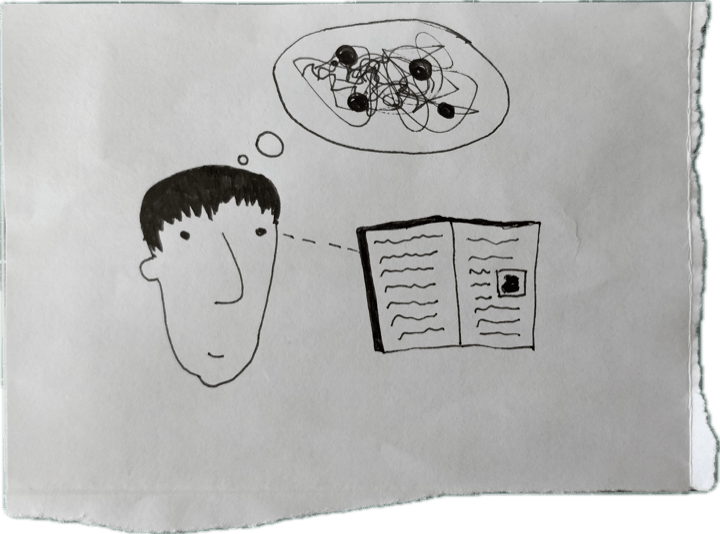
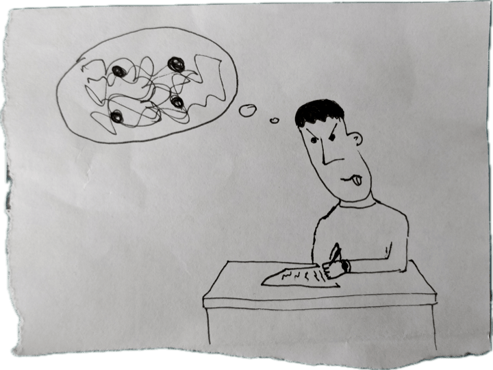
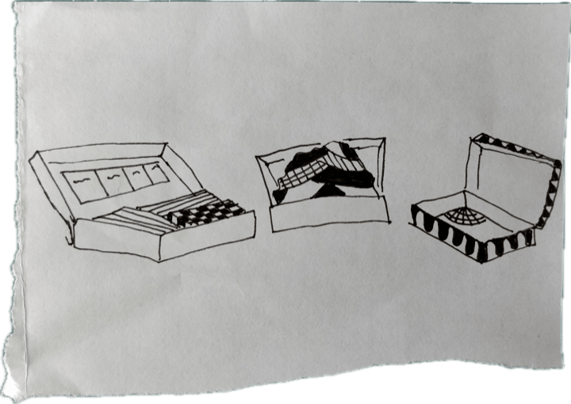
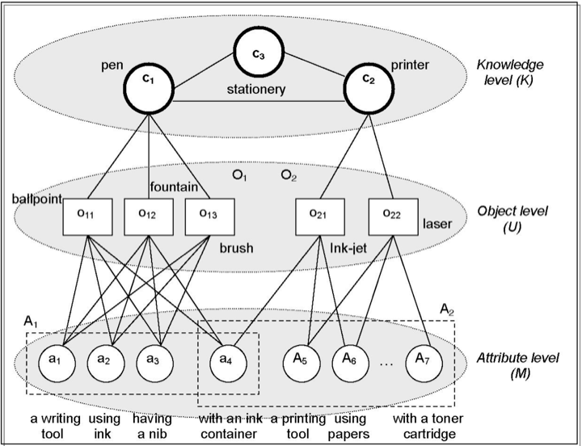
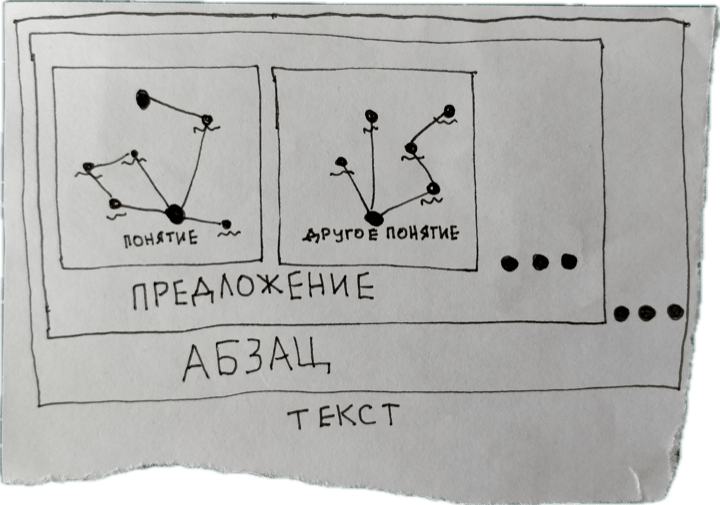

<audio src="assets/valerii-shevchenko_symmetry.mp3" controls></audio>

## Введение
Обычно читать нам проще, чем писать: скользить глазами по тексту — куда легче, чем «сгущать» смыслы в понятные, логично связанные и захватывающие предложения. И нередко возникает ощущение, что «за фасадом» текста — пишете вы его или читаете — скрывается нечто, что придаёт этому тексту форму и смысл. Назовём это идеями.

Читая, вы представляете образы и отвлекаетесь на свои мысли — на что похоже прочитанное, кто ещё об этом писал, «а в том фильме про это тоже говорили». 

<figure>
  
  <figcaption>Чтение и рой мыслей</figcaption>
</figure>

А когда вы пишете, мысли и образы роятся у вас в голове, борясь за внимание. Вы думаете о миллионе вещей одновременно, перескакиваете между источниками, чтобы что-то подсмотреть, и переписываете абзац снова и снова, потому что «мысль не идёт».

<figure>
  
  <figcaption>Чтение и рой мыслей</figcaption>
</figure>

<!--  -->

Текст можно представить, как чемодан с идеями. В каких-то текстах идеи лежат аккуратно, как в тетрисе, в других — свалены в кучу, а некоторые чемоданы — вообще почти пустые. Читая чужой текст, вы хотите «достать» идеи автора как вещи из чемодана, посмотреть на них и, если понравятся, убрать в свой гардероб. А работая над своим текстом, вы, возможно, хотите выбрать нужные идеи в гардеробе и аккуратно сложить в чемодан — только нужные, сочетающиеся и красивые.



Метафора текста как чемодана наводит на мысль, что чтение и письмо симметричны: это операции над одним и тем же «веществом», — идеями — только направленные в разные стороны. 

Теория информации даёт интересную оптику: текст можно представить как *одномерную последовательность* символов, которая во время чтения трансформируется в многомерное «пространство идей» в голове читателя (то есть вашей). Получаете «на вход» строки текста, а «на выход» — роящиеся в голове образы и мысли, частично связанные друг с другом. 

С письмом наоборот: «сжимаете» части многомерного пространства идей, где роятся мысли, в линейный текст — последовательность символов с началом и концом. Причём это пространство сложнее, чем сами предложения. Это похоже на ДНК — «плоскую» последовательность знаков, которая кодирует объёмные характеристики вроде формы черепа, конечностей и органов. И их устройство сложнее, чем устройство самой ДНК. С идеями ещё сложнее, потому что неясно, что это за «пространство идей», где они, возможно, обитают.

Интуитивно понятно лишь то, что чтение и письмо — это «распаковка» и «запаковка» идей — из одномерной формы в многомерную и обратно. А вот где эти идеи обитают, как устроено это место и какова механика его изменения — неясно.

Если чтение и письмо — это двери в «мир идей» с разных сторон, то как выглядит и работает этот «мир идей»? И как сделать чтение и письмо более понятными и прозрачными процессами, представляя их внутреннее устройство?


## Метафора кодирования
Меня не очень волнует онтологический статус идей — что они такое, как существуют и как связаны с реальностью. Этот пласт философии от Платона до Уильяма Джеймса мы оставим в стороне. Скорее, меня интересует *когнитивная механика* идей: как концептуализировать чтение и письмо через *операции с веществом текста*, который скрывается за его «фасадом». 

Мы уже затронули метафору «кодирования» — что идеи и текст соотносятся подобно ДНК и физическим признакам. Когнитивный психолог Деннис Уотерс пишет, что последовательности (sequences) — это краеугольный камень не только жизни как биологического феномена, но и человеческого языка, культуры и технологий [@waters2021]. Всё потому, что последовательности *контролируют* материю и энергию, при этом не меняя их сути. Это само по себе впечатляет.

Одномерные последовательности, например, ДНК, это предложение или компьютерный код создают трёхмерное поведение у других систем: живого существа, групп людей или транзисторов. Последовательности используют «ограничение» (constraint), что создаёт *иерархию контроля*. Это когда последовательность знаков обретает «значение» исключительно с помощью порядка знаков в ней[^cyber]. Например, разные последовательности нуклеотидов в ДНК «значат» (то есть кодируют) разные аминокислоты. 

[^cyber]: Если вы здесь подумали про кибернетику, интуиция вас не подвела: Уотерс пытается абстрагировать кибернетику от управления информацией до понятия «последовательности».

Как это может работать в случае с чтением? Есть одномерная последовательность — текст, который вы сейчас читаете. Он линейный, и у него есть начало и конец. Но «кодирует» ли текст поведение или что-то другое так же, как это делает последовательность нуклеотидов в ДНК? 

Уотерс пишет, что язык изменяет поведение. Одномерный рецепт яблочного пирога и приказ генерала оркеструют трёхмерное поведение: ваше — в приготовлении пирога, а солдат — на плацу. Но Уотерса больше волнует *социальный* аспект языка: вы говорите что-то другим (или они — вам), и поведение изменяется: это связь последовательности знаков с окружающей средой. Чтение же — опыт чаще приватный, молчаливый и статичный, и с виду никакой «кодировки» и взаимодействия со средой не происходит. Последовательность здесь не превращается в поведение или трёхмерную структуру (если только мы не берём во внимание формирование новых нейронных связей, но это не специфичный для чтения ответ мозга). Поэтому если есть читаемый текст «на входе», то что тогда получается на выходе?


## Репрезентация 
Понимание (или восприятие) текста — обширная область когнитивной науки [@butterfuss2020]. И одна из уже устоявшихся идей в ней — чем объёмнее рабочая память человека, тем полнее он может понять прочитанное [@mcvay2012]. От памяти зависит, сколько вы «удержите в голове», а от этого зависит, насколько хорошо вы интегрируете смысл прочитанного предложения в смысл абзаца и всего текста [@narayanan2022].

Вторая важная вещь в чтении помимо объёма рабочей памяти — это *когнитивные репрезентации*. Это ментальные «изображения» или представления, которые вызывают у нас прочитанные слова[^representation]. Восприятие и, тем более, понимание текста опосредованы репрезентацией слов, а значит — невозможны без неё. Репрезентации, в свою очередь, зависят от предыдущего знания — какое «сырьё» для представлений у вас в голове есть, такое в ход и идёт [@butterfuss2020]. Если оно детальное и богатое контекстом, вы можете глубже понять текст. 

[^representation]: Конечно, репрезентации касаются не только чтения, но и многих других когнитивных процессов. См., например, вводные работы — @godfrey-smith2004, @danks2014, @shea2018a.

Что значит «глубже»? Мы не знаем наверняка, но базовая интуиция — что более «глубокое» понимание задействует большее число репрезентаций. Это можно представить в виде сети, где каждая точка — это репрезентация одного понятия. На «глубину» понимания текста влияет два параметра: количество связанных репрезентаций и глубина сети, то есть среднее число «соседних» с основным понятием точек. Чем их больше в момент чтения слова, тем больше источников используется для «конструирования» репрезентации. 

<figure class="border">
  <div id="p5-container" class="p5-container"></div>
  <script src="assets/explainer.js"></script>
  <input type="range" min="0" max="3" value="0" step="1" id="p5-slider" style="width:85%" >
  <figcaption style="margin: 10px 0px 20px;"><strong>Двигайте слайдер:</strong> больше связанных с читаемым словом понятий — чётче понимание</figcaption>
</figure>

**Рабочая память и репрезентации, основанные на предыдущем знании — основные, как мне кажется, преграды к пониманию так называемых «сложных» текстов.** Иногда такими текстами называют философию или близкие к ней дисциплины. Возьмите Канта, Хайдеггера, Селларса или Делёза, и вы увидите, что читать их «без подготовки» реально сложно. Однако философия философии, конечно, рознь. 

Хороших новости две — рабочую память можно развивать, а предыдущее знание (то есть долговременную память) — пополнять и обогащать как проездной. При этом два вида памяти тесно связаны. А именно, если повторять «загруженное» в рабочую память вскоре после прочтения, да ещё и несколько раз с перерывом, гиппокамп его проиндексирует и аккуратно положит в неокортекс — лобную долю, где новая информация задержится уже надолго [@oakley2021]. Основной механизм для этого — так называемая практика извлечения (retrieval practice) и конкретно [интервальное повторение](https://ru.wikipedia.org/wiki/%D0%98%D0%BD%D1%82%D0%B5%D1%80%D0%B2%D0%B0%D0%BB%D1%8C%D0%BD%D1%8B%D0%B5_%D0%BF%D0%BE%D0%B2%D1%82%D0%BE%D1%80%D0%B5%D0%BD%D0%B8%D1%8F).

Мы и сами не заметили, как подобрались к ответу на вопрос про «вход» и «выход». Линейный текст превращается в голове в ансамбль репрезентаций — сгусток смыслов *и эмоций*. Конечно, это запутанная философская проблема — является ли мышление семантическим или нет (то есть оперирует только словами или чем-то ещё, например, невыразимым или неосознаваемым)[^background]. Для простоты скажем, что репрезентация — это «клубок» смыслов и эмоций, которая включает в себя помимо слов ещё и неосознаваемые «мысли».

[^background]: Хороший и доступный философский разбор этой проблемы — в @turner2018, гл. 2.

Проблема «глубокого» понимания текста и тесно связанного с ним письма — в распутывании этого клубка смыслов и эмоций. Нужно сориентироваться в нём, выделить важное и сформулировать эту важность в виде предложения. И да, вам не показалось: такое формулирование — это превращение многомерного «сгустка» мыслей в линейную последовательность, в мысль с подлежащим и сказуемым, началом и концом. 

Формулирование чужих идеи при чтении текста похоже на машинное обучение. Точнее, на процедуру уменьшения размерности данных. Это когда у вас есть большая таблица людей, где у каждого есть имя, возраст, местоположение, хобби и много другое. И вы пытаетесь понять что-то обо всех людях сразу — вычленить паттерн, стоящий за их свойствами, и убираете «лишние» характеристики[^factor]. 

[^factor]: Один из наиболее понятных механизмов уменьшения размерности — метод главных компонент. А вот [неплохое введение в него на русском языке](https://practicum.yandex.ru/blog/metod-glavnyh-komponent/).

Это как упаковывать сложносоставный человеческий опыт в строку текста — много информации о контексте и эмоциях потеряется, но мы всё равно находим способ пересказать прочитанное, увиденное или услышанное. Именно поэтому мы все зачитываемся хорошо написанной художественной литературой.


## Слова и алгебра понятий
Мы упомянули, что понимание слов при чтении связано с двумя вещами:

1. объёмом рабочей памяти
2. глубиной репрезентации этих слов «в голове».

Репрезентируются в данном случае не просто слова, а **понятия**, которые они выражают. Йингшу Уонг [@wang2006] предлагает **алгебру понятий** — математическую структуру, помогающую формально определять отношения и содержания понятий. 

Главная идея — в модели OAR (Objects, Attributes, Relations — объекты, атрибуты, отношения). Каждое понятие отображает значение реального или абстрактного (воображаемого) объекта.

У каждого понятия есть:

- референт (или *экстенсия*) — это объекты реального мира, на которые указывает понятие, например, физический стул 🪑
- атрибуты (или *интенсия*) — это свойства объектов, которые выражает понятие. Например, «стульность» стула — это наличие ножек и поверхности для сидения
- отношения — это, как ни странно, отношения между объектами и атрибутами (объект-объект, объект-атрибут, атрибут-атрибут и т.д.).

<figure>
  
  <figcaption>Чтение и рой мыслей</figcaption>
</figure>
<!--  -->

И хотя подобная модель выглядит слишком «компьютерной», чтобы мозг действительно по ней работал, она даёт представление о том, из чего состоит смысловая часть репрезентаций, когда вы читаете текст.

Что интересно, эта модель согласуется с нашей интуицией: что «глубина» понимания текста связана с количеством и глубиной предыдущих знаний — что за каждым читаемым словом стоит глубокая сеть репрезентаций. 

Каждая точка сети — это понятие, у которого есть референт в мире, а также свойства и отношения с другими понятиями.

В чём же тогда заключается симметрия чтения и письма? В простом смысле — в извлечении идей при чтении и их «запаковке» при письме. В более сложном смысле — в оперировании одним и тем же пространством репрезентаций (или понятий). 

Набор предыдущих знаний, то есть плотность и глубина связанных понятий в сети репрезентаций, может определять, насколько хорошо вы понимаете каждое прочитанное слово. А способность удержать в голове такую сеть для каждого слова, «сложить» их вместе и абстрагировать до уровня предложения и абзаца может составлять то самое многомерное пространство идей.

<figure>
  
  <figcaption>Чтение и рой мыслей</figcaption>
</figure>
<!--  -->

**Именно поэтому, как я полагаю — в силу вычислительной сложности (computational complexity) и малой рабочей памяти — нам сложно формулировать собственные мысли: как при чтении чужого, так и при написании своего текста.**

Каждое слово, а точнее — понятие, «рисует» в голове гроздь связанных с ним других понятий, в каждую из которых можно углубиться. Мы обычно охотно это делаем, и, возможно, поэтому «мысли скачут», и их трудно «собрать в кучу». Если рабочая память может «обработать» много больших сетей понятий — прекрасно формулируешь мысли и, следовательно, пишешь легче. А если рабочая память не может «обработать» много, то формулировать мысли становится заметно сложнее и даже больнее.

В философских терминах, первый смысл симметрии чтения и письма — *онтический*, или сущностный. Он не зависит от наших когнитивных процессов. Это понимание любого текста как сжатой в форму линейной последовательности части некоторого общего многомерного «пространства идей». Это то, о чём я говорил в начале, упоминая Дениса Уотерса: социальный аспект идей. 

Второй смысл симметрии чтения и письма — *эпистемический* и когнитивный, то есть связанный с личным знанием. Это понимание текста как сгустка репрезентаций или пространства понятий, но уже не общего, а для одного человека — вас или автора текста, который вы читаете. 

Третий смысл симметрии чтения и письма — практический. Чтение — это извлечение отдельных идей из текста и их связывание с предыдущим знанием в мышлении. Письмо — это «сборка» текста из отдельных мыслей.


## Промежуточные результаты

1. у каждого из нас «в голове» есть личное пространство идей — эмоций и репрезентаций понятий, которые мы уже знаем
2. между людьми есть общее «пространство идей», не так тесно связанных с личными репрезентациями. Благодаря ему мы используем одни и те же понятия и иногда интерпретируем их по-разному
3. чтение «извлекает» идеи из текста и интерпретирует их согласно существующим репрезентациям понятий — личному пространству идей
4. письмо «сжимает» части личного пространства идей в линейный текст

**Симметрия чтения и письма подсвечивает и помогает понять две вещи:**

1. чтобы писать качественные тексты[^quality], хорошо бы иметь объёмное личное пространство идей и уметь формулировать мысли — ориентироваться в своём пространстве идей и сжимать релевантную информацию оттуда в линейный текст. Это **навык формулирования мыслей**, а также начитанность или эрудиция, которая зависит от объёма рабочей памяти.
2. чтобы «пополнять» своё пространство идей, нужно читать, слушать и/или смотреть, прицельно извлекая идеи из источника. Это всё тот же навык формулирования мыслей, та же начитанность/насмотренность и предыдущее знание (или глубина сети репрезентаций) и рабочая память, объём которой позволяет понимать многоступенчатые аргументы и «больше удерживать в голове».

[^quality]: Что такое «качественный» текст, каждый определяет для себя сам, но базово — это работа, которой вы гордитесь и в которую вложили максимум способностей и отдачи.

Получается, что **чтение и письмо зависят от одного и того же навыка — формулирования мыслей**, а также от объёма рабочей памяти и глубины предыдущего знания. Эти три параметра одинаковы для обеих активностей.

Есть несколько способов работы с этими параметрами. Первый — учиться формулировать мысли и «качать» рабочую память. Это всегда пригодится, но такой путь может подходить не всем. Второй способ — использовать интерфейсы, упрощающие взаимодействие с текстом — пишете вы его или читаете.


## Интерфейсы для чтения и письма
Как [говорит](https://andymatuschak.org/books/) Энди Матусчак, интерфейсы для чтения должны преодолевать ограничение рабочей памяти — чтобы вы лучше понимали и запоминали прочитанное.

Например, [Latticework](https://www.matthewsiu.com/Latticework) — это прототип плагина для приложения [Obsidian](https://obsidian.md), чтобы аннотировать текст и сразу же делать из аннотаций заметки. Он помогает сделать заметку «на полях», которая появится в отдельном документе. Это удобно, например, при обработке транскриптов интервью. И если изменить эту заметку «на полях» в новом документе, она автоматически изменится и в источнике (они связаны, да).


Другой неплохой пример — интерфейс сервиса [Protolyst](https://protolyst.org/), где можно читать, выделять нужное и сразу же создавать «атомы» — отдельные идеи, которые удобно группировать. По каждому источнику — свой список «атомов», а также их можно связывать между источниками. Так, например, удобно искать ключевые результаты (key results) чужих исследований, если вы делаете литературный обзор.

<figure>
  <video width="100%" src="https://protolyst.org/wp-content/uploads/2023/09/1920x1080-Landing-Page-Vids_capture.mp4" controls></video>
  <figcaption>Механика «захвата» идей в сервисе Protolyst</figcaption>
</figure>

Среди интерфейсов для письма можно выделить [Ginkgo Writer](https://gingkowriter.com/), который позволяет в одном месте видеть и организовывать отдельные идеи в черновик (очень быстро). Визуальная иерархия помогает организовывать идеи по двум осям — от «сырых» к готовым по горизонтали, и в логическом порядке текста — по вертикали. Прелесть интерфейса — в охвате большого контекста, которого так часто не хватает при работе с крупной формой. А ещё — в простоте взаимодействия. Просто перетащив идею в другое место, можно быстро собрать черновик.

<figure>
  <video width="100%" src="https://gingkowriter.com/img/drag-image-out-small.webm" controls></video>
  <figcaption>Быстрая перестановка «идей» в Ginkgo Writer</figcaption>
</figure>

Есть ещё много других приложений, но здесь хочу показать связанные с симметрией чтения и письма в моём представлении — «распаковкой» и «запаковкой» текста. Единого интерфейса для этого пока что нет. Но он, возможно, и не нужен (или нужен).


## Вместо заключения
Симметрия чтения и письма приоткрывает кулису в «мир идей«, в котором мы находимся при работе с текстом. Она помогает понять, что идеи разной степени оформленности — это вещество мышления, и что, делая пометки при чтении, вы уже «пишете».

Также симметрия чтения и письма помогает понять, что и «распаковка», и «запаковка» идей зависит от вашей способности формулировать мысли. А она, в свою очередь, зависит от вашего предыдущего знания и объёма рабочей памяти.

Иначе говоря, чтобы писать тексты, нужен резервуар с идеями. Редактор и журналист Уильям Зинсер писал, что сила текста — в количестве идей, которые в него не вошли [@zinsser2006]. Если текст — это чемодан, то ваша задача — аккуратно пополнять свой гардероб, чтобы при необходимости класть в свой чемодан только подходящие и сочетающиеся друг с другом вещи.

***

<div class="border plashka">
**Цитировать этот текст можно вот так:**

> Шевченко Валерий, *Симметрия чтения и письма*. Москва, 2025. URL: https://vsblog.netlify.app/symmetry/

Если используете [Zotero](https://www.zotero.org) и нужен другой стиль цитирования, добавьте этот текст через bib-запись:

```bib
@misc{shevchenko2025,
  author       = {Валерий Шевченко},
  title        = {Симметрия чтения и письма},
  year         = {2025},
  howpublished = {\url{https://vsblog.netlify.app/symmetry/}},
  address      = {Москва}
}
```
</div>

## Источники
