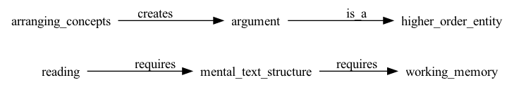
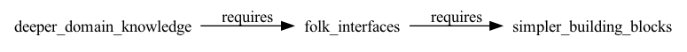

## Introduction

<!-- [? problem: text is a poor interface to ideas] -->
Text is probably one of the greatest human inventions. It helps convey ideas, advance science and culture and inspire invention. However, its major drawback is that it is *a poor interface to ideas*. The reason for it is that text is a *linear sequence* of symbols that can be said to encode a *messy multidimensional space* of concepts and relations on several layers of abstraction. So, there is just not enough bandwidth. And we have become accustomed to how diabolically hard reading and writing might be. But they do not need to be that hard.

<!-- [? что я предлагаю: манипулируемая структура текста] -->
I do not mean that text as a medium should go. Instead, making text's structure *visible and manipulable* — in both reading and writing — might augment and support sense-making by turning any text's ontological structure into an "object-to-think-with". In this essay, I lay out this vision, suggest a possible implementation with ubiquitous tools, situate it within current "computational" authoring and reading software and address possible objections. The idea is simple: mark sentences with `[subject, typed relation, object, domain]`, render those beside the text, and let them dynamically assemble into a structural map of the text which you can change on the fly.


## Text as a low-bandwidth interface to ideas

<!-- [? реконструкция смысла текста ограничена памятью] -->
A text is an interface to structured ideas. While reading, we mentally reconstruct the model, or ontology of concepts and relations in that text. Reading comprehension studies point that the more capacious a person's working memory is, the more easily they can understand what they've read and integrate the meaning of sentences, paragraphs and entire text [@narayanan2022].

<!-- [? написание текста ограничено памятью еще больше] -->
The same is even more true for writing. Writing is generative: planning, translating and reviewing compete for the same limited working memory [@kellogg2001], so the writer holds entire idea-contexts in mind while producing and monitoring text, not just reconstructing them [@mccutchen1996]. The 7±2 [@miller1965] — or 4±1 [@cowan2001] — slot limit is hit not by "storing" and arranging items but by simultaneously maintaining, transforming and outputting them [@olive2011].

<!-- [? когнитивное ограничение обсуловлено онтологическим] -->
Memory capacity needed for reading and writing is a cognitive constraint which text as a medium imposes on us. Yet, this can be explained by text's own deeper ontological constraint. 

<!-- [? это ограничение — что текст кодирует N-мерное пространство] -->
Following the encoding metaphor [@waters2021], a text can be seen as a one-dimensional string of symbols that *encodes* multidimensional space of relations between concepts, ideas and thoughts. Reading "unpacks" ideas and creates such a space in your head. Writing "packs" that mess of ideas and compresses it into a one-dimensional string of symbols. This makes reading and writing *cognitively symmetric* as they operate on the same substrate — *ideas*.

<div style="display: flex;">
<figure>
  
  <figcaption>Чтение и рой мыслей</figcaption>
</figure>
<figure>
  
  <figcaption>Чтение и рой мыслей</figcaption>
</figure>
</div>

<!-- [? N-мерное пространство содержит больше информации чем линейный текст] -->
The encoding/decoding metaphor partially explains text's low bandwidth for conveying ideas. It contains much more information than a string of text[^implicature]. And it demands either inhumane amounts of attention and memory or a less "lossy" conversion between structured ideas and text. 

[^implicature]: The concept of *implicature* in pragmatics and the notions of *speaker meaning* are cases in point. They show that what is said could mean many things and it is up to the listener to interpret and infer a meaning. — #insertSource

What an idea space can consist of and how to make it tractable to augment sense-making in reading and writing? And what if, instead of carrying it in my head, I could *look at it* and change it?


## The structure of ideas

<!-- [? idea space can consist of ideas with propositional structure] -->
A text encodes *ideas*, and ideas have *propositional structure*. Every declarative sentence asserts that *something is related to something else in some way*. Although "idea space" can be many things, a way to make it tractable is to focus on a simple structure expressible as a triple[^cdc]:

```
[subject, relation, object].
```

[^cdc]: In machine learning, a structure like `[concept, relation@domain, concept]` is used in domain-contextualized concept graphs [@wang2025, @wang2026] on which I draw heavily.

We, as readers or writers, not only rebuild that structure for each sentence in our heads but compare and arrange concepts to arrive at higher-order entities like arguments and logical lacunae. And it is precisely this reconstruction that costs working memory. For example, in this parapgraph I have assumed that:

```
[reading, requires, mental_text_structure]
[arranging_concepts, creates, argument]
[argument, is_a, higher_order_entity]
[mental_text_structure, requires, working_memory].
```

It can be represented as a map:



<!-- [? typed relations in propositions enforce clearer thinking + unversality across domains] -->
What makes triples do useful work is constrained yet extensible dictionary of *typed* relations, so that we distinguish "causes" from "depends_on" from "contradicts". Typed relations like logic, cause-effect, temporality, and mereology (part-whole) are useful here for two reasons. First, they enforce clearer thinking and, second, they are *domain-general*, so they can be found in many texts across many domains. 

<!-- [? domains describe discourse regions where propositions make sense] -->
The idea of a *domain* is crucial here. It labels a region of discourse where the triple *makes sense*. Epistemology, economics, cognitive science and pragmatics are possible examples. This allows triples from different fields to be told apart and recombined. Our previous triples become quadruples:

```
[reading, requires, mental_text_structure, cognitive_science]
[arranging_concepts, creates, argument, semantics]
[argument, is_a, higher_order_entity, semantics]
[mental_text_structure, requires, working_memory, cognitive_science].
```

Propositions enforce *ontological* reading of a text — what is happening there at a glance — and domains enforce *contextualized understanding* of these propositions[^domain].

[^domain]: Of course, there is a difficutly defining what constitutes and circumscribes a domain, especially formally, as @wang2025 notes. Yet, as an aid for sense-making, this may not be a problem.

<!-- [? pragmatic wins of idea space as domain-contextual typed propositions] -->
Having an idea space disguised as domain-contextualized propositions with typed relations allows for several pragmatically valuable things. First, you can search for concepts and relations:


Second, you can compute over ontology — find transitive closures and lacunae which could bring cross-domain insights and new ideas. For example, I might never manually find that 



which means that `deeper_domain_knowledge —— requires —» simple_building_blocks`. And it by itself inspires new ideas and angles. Moreover, another closure on our present graph is that `reading` requires `working_memory`. Although this seems obvious, it makes claims explorable: "why does reading require working memory? Because reading requires a mental representation of text's structure". Claims become inspectable.


## Writing: baking idea structure into dynamic media

`[? how typed propositions help in writing]`

We are used to writing prose first and structuring it into a narrative later. I suggest reversing the order: *start with structure and bake it into the medium itself.* 

For example, I write prose and mark its parts with `[? main idea of the part]` which you could see in the paragraph above. This serves two functions. First, it forces me to formulate what I want to say. Second, it helps to view the argument from a birds-eye view and check the logic. 

One level deeper are the propositions which I add as commented out quadruples `[subject, relation, object, domain]`. They dynamically assemble into a structural map of the text that I am working on. Of course, manually extracting propositions from prose is a lot of inhumane work, so I use local LLM as an aid:


You can add yet another level of structure by introducing *types of propositions*: thesis, claim, example, counterargument, etc. Add them as comments to parse later and inspect whether you thesis is supported by claims.

<!-- [? text structure map gives re-representation needed for sense-making — CLAIM] -->
Why is all this valuable for writing? Because the hardest part of writing is *holding the argument in your head* — the working-memory bottleneck above. A structural map partially outsources that load by allowing for *re-representing* concepts and relations which have already gone through your working memory[^rerepresenting]. Instead of keeping the argument in mind, you keep it in view and inspect it.

[^rerepresenting]: Re-representing is considered a necessary for sense-making #insertSource.

The key advantage over outlining-as-writing is that the map is *live* and *co-produced* with the text. It is not a *plan* you abandon. It is the text's *propositional skeleton* rendered alongside the prose, that bidirectionally syncs ontological structure and its expression in words.


## Reading: malleable maps with LLM-powered parsers

The same construction works with reading, as well. As you read a digital text — a chapter, an article, a book — an LLM-powered parser runs over it and extracts the entity-relation structure, producing the same triples an author might have written. The output is a first draft of the text's map. You, the reader, then *edit the parsed relationships*: you confirm what you consider true, flag what you doubt, merge an entity that the parser split, re-type a relation you think is better described as "assumes" than "proves". You assemble your own map of the text while reading it — but you start from a scaffold instead of a blank page.

<figure>
  <video width="100%" src="" controls></video>
  <figcaption>A prototype of a RAG over PDF with a proposition parser</figcaption>
</figure>

This is the reading side of the cognitive symmetry. When you read, you unpack the author's propositions and link them to your prior knowledge. A map makes that unpacking visible and editable. What is more, because triples are portable, you can drag an idea from one text's map into another's — *your* map, growing across everything you read. It is like "mind maps" but general enough to see through entire text corpora.

Why should this enrich, magnify, and augment sense-making rather than flatten it? Because a map of propositions makes the *gaps* visible. A text that looked air-tight reveals that one claim rests on an unstated assumption, that a relation is asserted but never argued. Noticing those gaps is precisely what generates new ideas — new questions, new links, new relations to investigate. The map does not replace thinking, but gives thinking (yet another) working surface.


## Why not just build explorable explanations?

You might object: there is already a rich culture of *explorable explanations* — texts supported with interactive dynamic media. And there is a mature technical stack for them: from widespread coding notebooks to more idiosyncratic tools like [Pollen](https://docs.racket-lang.org/pollen/), [Tangle](https://worrydream.com/Tangle/), [Idyll](https://idyll-lang.org/) and others. If that world exists, why propose yet another format?

Explorable explanations are *difficult to produce*, because each one requires its own *domain structure* implemented as an interactive engine: a physics essay needs a physics engine, an economics essay needs a model of money, a statistics essay needs a random number generator. 


The author must design an interactive substrate particular to one piece of content which is deemed *incommensurable* with other domains. And if one "explorable" does excellent job in providing a space for tinkering, it does not help at scale. As a result, explorable explanations are bespoke, costly and produced by a handful of gifted tinkerers rather than by general population of non-fiction writers.

Instead of building a special domain structure for every text, let's work with the *ontological structure of text* itself, which every text already has. Every essay, every chapter, every paper encodes propositions. The quadruples 
`[subject, typed relation, object, domain]` are not an exotic domain model but a substrate all texts already have. This universality is the point: because the medium is text's own structure rather than a bespoke engine, the same simple tooling works for *any* text you read or write.

That is the sense in which the approach is computable without being high-bar. It takes seriously the idea of the "computational text," but finds its computation not in special-purpose models but in the ordinary logic of propositions.

The best part is that you do not need a new platform to try this. The writing side can be built with the simplest tools on hand — markdown, bash, awk, JavaScript and a couple of your own writing conventions.

For example, you keep your text as a markdown file. A structural annotation is just a convention — a bracketed quadruple after a sentence, or a line of machine-readable metadata. A few lines of `awk` or `node` extract propositions from the markdown and pipe them into a small JavaScript file that renders the growing map beside the text — a list of subject–relation–object cards, color-coded by domain, grouped by section, filterable. Because the map is generated from the source rather than maintained separately, it can never drift out of sync with the text. 

The beauty of typing the annotation by hand is that it *is* the act of formulating the thought. You cannot annotate a sentence you have not understood. The tool forces the very skill that reading and writing both depend on.

For reading, the same extraction script can be pointed at a any other text, with an LLM-parsing in place. A simple plugin for a reading environment like [Zotero](https://www.zotero.org) could take the open PDF, run the parser, show the resulting map in a side panel, and let you edit relations and drag ideas into a private map that persists across texts. This is not hypothetical architecture — it is a thin layer of glue around tools that already exist.


## Conclusion

Ideas have propositional structure, but texts hide it behind a linear facade. Working memory is the bottleneck that makes reconstructing that structure — in reading and in writing — costly. My proposal is to make it visible with a propositions from concepts and relations dynamically assembled into an editable map. A major point is twofold. First, to use a general enough convention transferable across domains and texts like the proposition quadruples with typed relations proposed above. Second, to make to easy enough to be accessible to non-technical writers.

A structural map augments sense-making. It turns the invisible labor of comprehension into a visible, editable "object-to-think-with". It makes gaps visible. It lets ideas travel from one text to another. It does so with the simplest possible machinery — markdown, bash, JavaScript, an LLM parser. And it helps to establish a new layer of transparency and learnability between authors, readers and between humans in general.

***

<div class="border plashka">
**You can cite this text like this:**

> Valerii Shevchenko, *Ontology-augmented text as manipulable idea structure*. Moscow, 2026. URL: https://vsblog.netlify.app/symmetry_eng/

If you use [Zotero](https://www.zotero.org) and need a different citation style, add this text via a bib entry:

```bib
@misc{shevchenko2026,
  author       = {Valerii Shevchenko},
  title        = {Ontology-augmented text as manipulable idea structure},
  year         = {2026},
  howpublished = {\url{https://vsblog.netlify.app/symmetry_eng/}},
  address      = {Moscow}
}
```
</div>

## Sources

<!-- I believe there are no complex ideas—only not adequate enough ways to communicate them. I also believe that body's bandwidth for understanding "complex" ideas is far greater than that of a brain. --> 

<!-- Reading theoretical physics or philosophy often requires preliminary training. Yet, there is a way to circumvent the declarative explanations and understand things more viscerally, procedurally and intuitively[^irony]. Although the forms of this kind of learning and understanding are being developed in the fields of embodied learning [#insertSource] and human-computer interaction, the most basic (and imporatnt) activities of reading and writing rarely are being addressed head-on. -->

<!-- [^irony]: Isn't it ironic that I use terms that themselves require preliminary understanding?… Well, consider it an illustration of my point. -->


<!-- Comprehending multi-step arguments and elaborating and compressing disparate ideas into coherent narratives both require immense cognitive effort, memory and attention. --> 

<!-- In the first section, I argue that *a text is a (poor) interface to ideas* in a non-metaphorical sense—that linear sequence of symbols encodes multidimensional space of concepts and relations which can be represented more clearly *as we read or write*. Then, I present a propositional structure like `[concept_1, relation, concept_2]`as an adequate enough representation of an idea in a non-fiction text. In sections 3 and 4 I describe how dynamic assembling of a concept-relation map as a manipulable idea structure representation might look for writing and reading, respectively. In the end, I situate the proposed approach within current landscape of "computational" authoring and reading software and suggest a minimalist implemetation. -->


<!-- - **Kellogg (1996)** — A model of working memory in writing. Uses Baddeley's framework. -->
<!-- - **McCutchen (1996)** — capacity theory of writing. Explicitly parallels Daneman & Carpenter / Just & Carpenter reading span research. -->
<!-- - **Kellogg (2001)** — "Competition for working memory among writing processes" — planning, translating, reviewing compete for a common general-purpose WM resource. -->
<!-- - **Olive, Kellogg & Piolat** — "Working Memory in Writing" review — writers frequently reach mental overload (Flower & Hayes noted this since 1980). -->
<!-- - **Vanderberg & Swanson (2007)** — writing is *more* related to attentional/executive functions of WM than to short-term storage. -->


<!-- Comprehension in reading and writing is mediated by *cognitive representations*. They, in turn, depend on prior knowledge: whatever "raw material" you have in your head is what gets put to use [@butterfuss2020]. -->


<!-- Saymour Papert envisioned the world where children are epistemologists who think about their own thinking and learn to adapt their thinking style to a task at hand. On this view, learning activity should be *isomorphic to the structure of the domain* to possess what we called a "bandwidth". Bourbaki structuralist mathematics and LOGO programming language are great examples. -->

<!-- "Explorable explanations" movement as a contemporary adaptation of this idea tries to achieve similar goals of making a medium adequate to the domain. It acknowledges that text should be supported with dynamic media representing core principles and ideas of a text. -->

<!-- However, there are problems with "explorable explanations". It is not -->
<!-- even that producing them requires expertise in multiple fields like design, programming and a specific domain to explain or that they are hard to produce. The problem is that each has different ontological model, a "schema" of concepts and relations made possible to explore (and explain). -->

<!-- Each "explorable" is valuable but --> 


<!-- --- -->

<!-- 		## 1. Sense-making работает «внутри головы» -->

<!-- 		**Kirsh, D. (2009). Interaction, External Representation and Sense Making.** *Proceedings of the 31st Annual Conference of the Cognitive Science Society*, 1103–1108. -->

<!-- 		> «The obvious explanation – external representations save internal memory and computation – is only part of the story.» -->

<!-- 		Kirsh утверждает, что sense-making по умолчанию происходит во внутренних репрезентациях, и именно поэтому люди создают *внешние* представления — чтобы компенсировать ограниченность когнитивного аппарата. -->

<!-- 		**Pirolli, P. & Card, S. (2005). The Sensemaking Process and Leverage Points for Analyst Technology as Identified Through Cognitive Task Analysis.** *PARC Technical Report*. -->

<!-- 		> Процесс sense-making разложен на два цикла: *foraging loop* (поиск информации) и *sense-making loop* (построение ментальной модели). Внутренняя схема (mental model / schema) — центральное звено, ограничивающее глубину анализа. -->

<!-- 		--- -->

<!-- ## 2. Sense-making ограничен ограниченной рабочей памятью -->

<!-- 		**Miller, G. A. (1956). The Magical Number Seven, Plus or Minus Two.** *Psychological Review*, 63(2), 81–97. -->

<!-- 		> Классическое доказательство: рабочая память вмещает около 7±2 элементов. Любое осмысление (comprehension) упирается в этот лимит. -->

<!-- 		**Cowan, N. (2001). The Magical Number 4 in Short-Term Memory.** *Behavioral and Brain Sciences*, 24(1), 87–114. -->

<!-- 		> Уточнение: реальная ёмкость — 3–5 «чанков». Это *прямое* ограничение на то, сколько идей можно удержать и соотнести при понимании. -->

<!-- 		**Baddeley, A. D. (2000). The Episodic Buffer: A New Component of Working Memory?** *Trends in Cognitive Sciences*, 4(11), 417–423. -->

<!-- 		> Модель рабочей памяти Baddeley показывает, что удержание и оперирование информацией происходит в *ограниченном* рабочем пространстве — отсюда зависимость comprehension от capacity. -->

<!-- 		**Sweller, J. (1988). Cognitive Load During Problem Solving: Effects on Learning.** *Cognitive Science*, 12(2), 257–285. -->

<!-- 		> Cognitive Load Theory: рабочая память ограничена, и любая когнитивная деятельность (включая осмысление текста и порождение идей) упирается в её capacity. Существует три типа нагрузки — intrinsic, extraneous, germane — и все они конкурируют за ресурс. -->

<!-- 		**Daneman, M. & Carpenter, P. A. (1980). Individual Differences in Working Memory and Reading.** *Journal of Verbal Learning and Verbal Behavior*, 19(4), 450–466. -->

<!-- 		> Эмпирическое подтверждение: capacity рабочей памяти напрямую предсказывает способность к reading comprehension — т.е. к пониманию слов и соотнесению идей. -->

<!-- 		--- -->

<!-- ## 3. Sense-making можно «сделать видимым» -->

<!-- 		**Kirsh, D. (2010). Thinking with External Representations.** In *AI and Society*, Springer. -->

<!-- 		> Описано 7 способов, которыми внешние репрезентации усиливают когнитивную мощь: создают устойчивые референты, позволяют ре-представление, снижают стоимость инференций. Внешние структуры позволяют «думать то, что было немыслимо» без них. -->

<!-- 		**Scaife, M. & Rogers, Y. (1996). External Cognition: How Do Graphical Representations Work?** *International Journal of Human-Computer Studies*, 45, 185–213. -->

<!-- 		> Графические (и любые внешние) представления работают как *когнитивные катализаторы*: они делают неявные когнитивные процессы видимыми и обрабатываемыми. -->

<!-- 		**Russell, D. M., Stefik, M. J., Pirolli, P., & Card, S. K. (1993). The Cost Structure of Sensemaking.** *Proceedings of the INTERACT'93 and CHI'93 Conference on Human Factors in Computing Systems*, 269–276. -->

<!-- 		> Sense-making требует *перепредставления* (re-representation) информации во внешней форме — и именно в этом моменте внутренний процесс становится видимым. -->

<!-- 		--- -->

<!-- ## Краткая сводка -->

<!-- 		| Утверждение | Источник | -->
<!-- 		|---|---| -->
<!-- 		| Sense-making = внутренний процесс | Kirsh (2009), Pirolli & Card (2005) | -->
<!-- 		| Ограничен рабочей памятью | Miller (1956), Cowan (2001), Baddeley (2000), Daneman & Carpenter (1980) | -->
<!-- 		| Ограничен cognitive load | Sweller (1988), Paas & Sweller (2012) | -->
<!-- 		| Можно сделать видимым | Kirsh (2010), Scaife & Rogers (1996), Russell et al. (1993) | -->


<!-- --- -->

